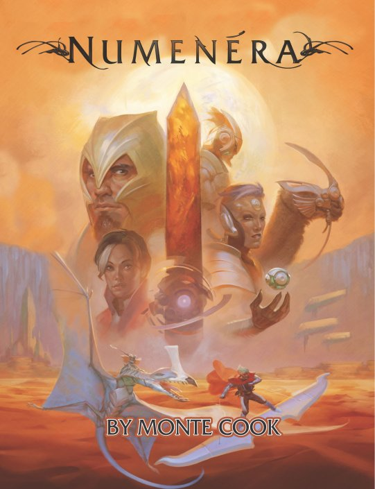
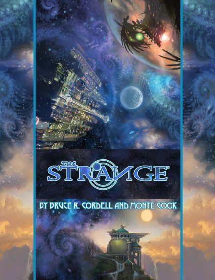
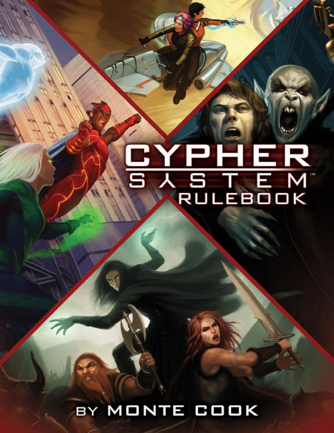

### PeteRPG - Szerepjátékos ismertetők

# Cypher System - Numenera - The Strange

***Írta: Petrus; eredetileg megjelent: 2016. szeptember 20., LFG [1. rész](http://lfg.hu/76278/), [2. rész](http://lfg.hu/76519/), [3. rész](http://lfg.hu/76518/)***

Bár a játékairól lehet vitázni, Monte Cook korosztályunk (csak 6 évvel idősebb nálam) egyik legismertebb játéktervezője, akiknek olyan ismert és milliók által játszott rendszerek és világok fűződnek a nevéhez (egyedül, vagy többekkel együtt), mint a *D&amp;D*, az *Exalted Might*, vagy a *Planescape*. Megítélése és tevékenysége szerepjátékos nézőponttól függően többféle is lehet, de az például vitathatatlan, hogy a *D&amp;D 3.0*-val lett újra "szexi" és igazán "mainstream" a szerepjáték és új fellendülést hozott a lassan ellaposodó, néhány mammut uralta ezredfordulóba. Amúgy nem egy unalmas ember, többször is be-, majd kilépett a *Wizards*-tól, vitte a saját cégét, a *Malhavoc*-ot, aztán 2012 óta már a saját neve, a *Monte Cook Games* (MCG) alatt publikál.

Az MCG létrehozását egy új játékrendszer (*Cypher*) és világ (*Numenera*) fejlesztése követte, ami természetesen Kickstarter kampányt is kapott. A *Numenera* végül 2013-ban jött ki (*Origins* győztes is lett, plusz többszörös *ENnie Awards* gold és silver helyezett), amit rá egy évvel a Bruce R. Cordell-lel írt *The Strange* követte, és végül tavaly megjelent az alaprendszert univerzálissá tevő *Cypher System Rulebook* szabálykönyv is. (A gyerekeknek szóló *No, Thank You Evil!* szerepjátékuk márciusban jelent meg.)

Mivel mindhárom könyv ugyanazt a rendszert használja 99%-ban, és mert még mindig sok a tévhit vele kapcsolatban (nem, egyáltalán nem egy n+1. d20-as rendszer, bár d20 kockát használ), úgy gondoltam, megér egy közös ismertetőt a három együtt. Elsőként magát az alaprendszert mutatnám be, a végén kitérek a *Cypher System* alapkönyv bővítményeire, de a két játékvilágot is alaposan kielemezzük.

Szokás szerint példákat is készítettem, amiket a cikk végén találhatsz rövid magyarázatokkal. A képeket most kihagytam, az MCG-nek van egy publikus képtára, amiben összegyűjtötték a felhasználható illusztrációkat. Apropó, a cikk végén az MCG kissé furcsa licencelési gyakorlatáról is ejtek majd pár szót, mert vannak érdekes (és enyhén szólva megmosolyogtató, vagy inkább bizarr) vonásai.

Előre is elnézést, de ez a cikk *tényleg* hatalmas lett...

## Alaprendszer

Nézzük akkor először általánosságban ezt az ún. Cypher rendszert. Már most az elején fontos megkülönböztetni, hogy ha nagybetűvel írom, akkor az alaprendszer jelenti, ha *Cypher System*-ként (vagy CSR-ként), akkor az univerzálissá bővített önálló szabálykönyvet, ha pedig kisbetűvel, akkor a világok és tulajdonképpen az alaprendszer egyik technikai (és meta-technológiai) eleméről van szó.

Bár Monte szinte világéletében d20 rendszerekkel dolgozott, maga a Cypher mégsem hasonlít egyik korábbira sem, annak ellenére, hogy d20 kockát (és szinte csak azt) használ. Érdekes ötvözete modern, narrativista "indie" rendszereknek és a szabályosan egymásra épülő, egymásból logikusan következő szimulációs építőkockáknak (mint valaki találóan megjegyezte a reddit-en: "*feels like indie design with large-studio production values*"), és a szerepjáték rendszerek azon - jelenleg még - picike szeletéhez tartozik, ahol a mesélőre tényleg csak a mesélést hagyja, ugyanis dobniuk sohasem kell. Erről lesz még szó az alábbiakban.

A szigorúan vett minimális alaprendszerben egy karaktert **három definíció** és **három statisztika** ír le. A definíciók (Leíró, Típus, Fókusz) meghatározott sorrendben és kötőszavakkal követik egymást, amelyek kiadnak egy értelmes, rövid mondatot és jól jellemzik a karaktert általában, anélkül, hogy bármilyen statisztikai értékét is ismernénk ("*én egy (Leíró) (Típus) vagyok, aki (Fókusz)"*). A három stat (*Might*, *Speed*, *Intellect*) a karakter általános fizikai és szellemi jellemzőit írja le, de nem fix értékek, hanem sokkal inkább egyfajta erőforrások (*pool*), amelyekből a karakter bizonyos képességeiért fizet, illetve "sebzéseket" szenved el.

Az alábbiakban előbb ömlesztve írok le sok mindent, aztán egyenként is kitérek rájuk.

 

Kezdjük először a stat-okkal és magával a dobásrendszerrel, mert ez a lelke az egész Cypher-nek.

A **stat-ok** tehát nem fix értékek, nem függenek tőlük módosítók és nem is szolgálnak célszámként, a karakter potenciális erőit, képességeinek határait jellemzik. Meglehetősen dinamikusan változnak egy-egy kaland során, tehát célszerű tokenekkel, vagy valamilyen egyszerűbb eszközzel nyomon követni őket. Ez egyébként hangulatosabb is lehet, ha a konkrét számértékek helyett csak magam elé pillantva annyit látok, hogy "ó, van még elég", vagy "ó, a fenébe, már csak néhány van". A rendszerben tkp. nincsenek is más, ehhez hasonló statisztikai értékek, csak néhány limitáló, fix számérték.

Minden tesztet a játékosok dobnak, tehát ha pl. megtámadnak egy ellenfelet, egy saját stat-tal dobnak, ha pedig őket éri behatás, szintén saját stat-tal védekeznek. Ha olyan képességet használnak, ami erőforrást igényel, azt a megfelelő stat pool-ból vonják le.

A **tesztdobás** alapja az, hogy a Mesélő meghatároz egy nehézséget 1-től 10-ig, a karakterek ezt az értéket befolyásolhatják (csökkentik) a képességeikkel, erőforrásaikkal, eszközeikkel, majd d20-at dobnak a végleges nehézség háromszorosa, mint célszám ellen. Tehát pl. egy 5-ös nehézség célszáma alapból 15 lesz, a d20-szal legalább ekkorát kell dobni. Ha egy nehézség nullára csökkenne, dobni sem kell, automatikusan sikerül. Az általános, standard nehézség a 2-es.

A nehézséget alapvetően három tényező befolyásolhatja, jellemzően csökkentheti: a karakter képzettségei (*skills*), a körülmények és az eszközök (*assets*), illetve az erőfeszítés (*effort*).

A **képzettségek**et (*skills*) elég szabadon definiálja a rendszer. Nincs általános, fix lista, csak egy javaslat halmaz, illetve a definíciók maguk is leírnak ilyen helyzeteket (pl. képzett az észlelésnek azon eseteiben, amikor követik, megfigyelik őt, vagy képzett a hazugságok, csalások, átverések felismerésében). Elméletileg bárki dobhat bármire, hacsak maga a cselekvés annyira speciális ismereteket nem igényel. A képzettségeknek két "szintje" van: képzett (*trained*) és specializált (*specialized*). Ha használható, akkor a képzett egy, a specializált két szinttel csökkenti a nehézséget.

A fenti példa alapján a nehézség 5-ről 4-re csökkenhet, ha a karakternek van a cselekvéshez kapcsolódó képzettsége, amiben képzett, és 3-ra, ha specializált.

Minden olyan dolog, ami nem a karakter képességeitől, adottságaitól függ, hanem külső körülmény, pl. tárgy, vagy bármi, ami előnyt biztosíthat, **eszköz**nek (*asset*) minősül és újabb egy szinttel csökkentheti a nehézséget, legfeljebb kétszer. Ilyen pl. ha segít egy szövetséges karakter, vagy van egy pont a feladathoz illő tárgya.

Végül pedig a karakter a cselekvéshez illő stat erőforrásaiból is áldozhat fel pontokat, mint **erőfeszítés** (*effort*). A kívánt stat általában eldől a cselekvés alapján, pl. eltolni egy beszorult ajtót Might erőfeszítést használhat, egy ismeretlen szövegből kisilabizálni valamit pedig Intellect-et.

Az első effort 3 stat pontba kerül és egy szinttel csökkenti a nehézséget, minden további szintért 2 pontot kell fizetni az erőforrásból. Az erőfeszítések száma kezdetben korlátozott (Effort érték; kezdetben csak egyszer használható tesztenként), de később ez növelhető, ahogy a karakter fejlődik. Egy tesztre az erőfeszítés stat-okat keverni nem lehet, de egy teszten belül többfelé is lehet osztani pontot, ha már legalább 2-es a karakter Effort értéke (például egy támadásnál az első effort (3 pont) megy a tesztre, a második (2 pont) meg a sebzést növelheti).

Minden stat pool rendelkezik viszont egy előnnyel (***Edge***), ami az adott pool-ból költött pontok számát csökkenti az értékével (bizonyos szabályok szerint). Ez kezdetben az adott karakter Típusra jellemző stat-nál 1 értékű, a többi nulla, és szintén fejleszthetők később, ajánlott is.

Megjegyzendő, hogy extrém esetekben a mesélő dönthet úgy, hogy nem a nehézséget növeli a végtelenségig, hanem meghagyja eredetinek, de előír egy kezdeti költséget (*initial cost*), amit meg kell fizetni az erőforrásból ahhoz, hogy egyáltalán megpróbálkozhasson a karakter a teszttel. Ez a költség nem számít bele az effort-ba sem, tehát nem befolyásolja a nehézséget, de az Edge ugyanúgy érvényes rá (az egész összegre, nem külön a költségre és külön az erőfeszítésre). Csak speciális esetekben érdemes használni.

*Mindezeket összegyúrva lássunk egy konkrét példát: hősünknek meg kell javítania egy elromlott számítógépet, hogy csapatuk egy fontos nyomhoz jusson. A mesélő úgy gondolja, a rosszfiúk korábban csak egyszerű törlést és formázást használtak, nem volt idejük biztonságos adattörlésre, a feladat mégis rejt magában egy kihívást (általános ismeretekkel elég nehezen oldható meg, bár nem lehetetlen, de néha még a specialistáknak is beletörik a bicskájuk) és 4-es nehézséget határoz meg. A játékos ezt nem tudja, de mivel az általánoson túl valamennyire képzett (trained) a számítógépekben, úgy érzi, megpróbálkozhat vele. Segítségül talál a felbolygatott iroda romjai között egy boot CD-t (asset) és megpróbál majd visszaemlékezni kissé megkopott rendszergazdai/hacker tudására (effort). A cselekvés egyértelműen Intellect-alapú, tehát ezen erőforrását használhatja. Az Effort-ja mondjuk 1-es értékű, és az Intellect Edge-je is 1-es.*

*A trained skill-jét és az asset-jét beszámítja (ami 1-1-el, 2-re csökkenti a nehézséget), illetve egy erőfeszítést használ még, ami 2 Intellect pontjába kerül (3 lenne, de az Edge ezt csökkenti 1 ponttal). Ez újabb egy nehézség esés, most már csak 1 lett, azaz a célszám 3 (1x3).*

*Dob d20-szal és 3-mat, vagy nagyobbat kell elérnie. Ha a képzettsége specializált lenne, már dobnia sem kell, mert a nehézség nulla lenne.*

 

A rendszerben léteznek ugyan fix **módosítók** is, de ezek ritkák és jellemzően csak valamilyen adottság, vagy eszköz bónuszai, és a d20 dobáshoz kell adni őket. Ha a módosítók összege eléri a +3-mat, automatikusan asset-nek kell számolni. Módosítók nem jönnek külső körülményekből, vagy egyéb, más rendszerekben szokásos helyzetekből (illetve ezek minden esetben a nehézségbe számítódnak be, vagy asset-ként könyvelődnek, ha kell), nem kell fejben zsonglőrködni ezekkel, a mesélő egyszerűen a nehézséggel kalkulál, módosítókat a játékosok inkább csak a tárgyaik, vagy a dobásaik után kapnak, ha egyáltalán.

A dobásoknak viszont lehetnek egyéb mellékhatásaik. Az 1-es dobás nem sikertelenséget jelent, hanem egy ingyen mesélői beavatkozást (l. később), a 17-es és nagyobb értékek pedig egy növekvő bónusz sebzést, vagy gyakran kisebb és nagyobb effekteket (*minor/major effect*) eredményezhetnek. Pl. egy 20-as dobás beszámolható +4 sebzésnek, vagy ha erőforrást használt a teszthez, akkor az elköltött pontokat visszakapja. Egy kisebb effekt lehet pl. hogy a támadó nem csak általánosságban talál, hanem egy bizonyos testrészt talál el, ami számos hatással járhat (pl. fejbe kólintva egy körig nehezítéseket kap, vagy olyan helyen kapott sebet, ahol nincs páncélja). Ilyen effekteket a mesélő és a játékos egyaránt kitalálhat, de nem kell túlzásba vinni, ha pl. egyszerűbb a bónusz sebzéssel számolni, azaz felesleges sok időt tölteni vele.

Vannak még különféle hatások, amit képességek, cselekvések okozhatnak (mint pl. kábulás, földre kerülés), ezek ideiglenesen emelhetik is az elszenvedő tesztjeinek nehézségét.

 

A három definíció a **Leíró** (*Descriptor*), a **Típus** (*Type*), és a **Fókusz** (*Focus*). Maguk a világok definiálják azokat a választási lehetőségeket, amelyekből a definíciók választhatók, a kötőszavakkal együtt pedig így áll össze a karaktert jellemző fő mondat: "*Én egy (Leíró) (Típus) vagyok, aki (Fókusz)"*. Például egy játékos azt mondhatja a *Numenera* karakteréről, hogy *"én egy Szívós Pengés vagyok, aki Két Fegyvert Forgat"* (*"I am a Tough Glaive who Wields Two Weapons At Once"*).

A **Leírók**ból világonként kb. 20-30 van, ezek általános, többnyire nem világfüggő jellemzők (azaz a három könyvben kb. egyformák, csak a korábbi kiadásokban kevesebb van, de teljesen kompatibilisek egymással), mint pl. a Szívós (*Tough*), a Sármos (*Charming*), vagy az Okos (*Intelligent*). Minden Leíró valamilyen bónuszt ad egy statisztikához, ad valamilyen képzettsége(ke)t, és valamilyen adottságo(ka)t, ami a Leíróra jellemző. Megemlítendő, hogy mindhárom könyv ad Leírónként néhány karakter - kezdő kaland kapcsolódási ötletet, hogy miért is keveredett bele.

Pl. az Elátkozott (*Doomed*) karakter +2 pontot kap a Speed-re, képzett a veszélyérzetekkel kapcsolatos tesztekben és a Speed-alapú védekezésben, a Doom képessége miatt viszont minden második mesélői beavatkozást (később, fontos lesz!) el kell fogadnia és XP-t sem kap érte, mert a világ egy kegyetlen, zord hely, ami már megjelölte hősünket és nem térhet ki a sorsa elől. A kalandba bekeveredhetett úgy, hogy próbált kitérni előle, de mégis berántotta, vagy mert miért ne, úgyis bevégzi előbb-utóbb, vagy az egyik karakter megmentette az életét és most visszafizeti a szívességet, vagy pedig azt gyanítja, hogy a számára egyetlen reményt a végzet elkerülésére ez az út adja.

A **Típusok**ból a két játékvilágon 3-3 van, ezek elég hasonlóak egymáshoz, csak más elnevezésekkel, a CSR-ben van még egy plusz negyedik (a leírásoknál kitérek rájuk). A Típus alapvetően olyasmi, mint egy laza kaszt, vagy inkább foglalkozás, általános elnevezéssel, amit az adott játékvilág, vagy CSR-rel játszott éra átnevezhet és a Fókusz bont ki.

Mindhárom (-négy) Típus meghatározott értékű stat erőforrásokkal kezd, amire további fix pontszám költhető szabadon. Ismét: ez nem d20, a nagyobb stat nem ad semmilyen nagyobb bónuszt, módosítót, akármit, a pontértékek csak erőforrások, amelyekkel képességeket lehet aktiválni.

A Típusok leírnak egyfajta alap, kezdő jellemzőket, képességeket és adottságokat, amelyekkel mindenki rendelkezik, valamint ad egy fokozatokra (l. alább) lebontott képesség listát, amiből XP-ért lehet majd vásárolgatni, illetve az első fokozaton kettő ingyen is választható.

Minden Típushoz jár egy 20 elemű, rövid háttér (*background*) lista is, ami kis színesítő elemet ad a karakter előéletéhez és szabadon választható közülük egy, vagy dobni is lehet, de persze teljesen saját is kitalálható, ezek nem adnak semmi mechanikai módosítást.

Végezetül pedig a **Fókusz** (Focus) az, ami az adott világ legjellemzőbb vonásait tartalmazza. Ezek azok, amelyek egyedivé varázsolják a karaktert és nem is ajánlott egy csapatban, egy kalandon belül azonos Fókuszokat behozni (bár két azonos nevű Fókusz is el tud térni egymástól).

Minden Fókusz visszamenőleg módosíthat Típus képességeket, vagy kiterjesztheti azokat, adhat új képességeket, illetve később, a fokozatok növekedésével is új elemeket tesz elérhetővé (automatikusan). Fókuszokból rengeteg (a CSR-ben olyan 70-80, a másik kettőben kevesebb) van mindhárom könyvben, tkp. ezek teszik ki a rendszerleírások jó részét.

Egy Fókusz, vagy Típus képesség mindig engedélyező (*enabler*), vagy cselekvő (*action*), ez jelzi, hogy bármikor, akció nélkül is érvényesek, vagy a használatukhoz akciót is kell költeni. Például bizonyos fegyver- és páncélcsoportok ismerete enabler, míg egy, az ellenfelek agyát megsütő képesség action típusú. Bővebben majd a harcrendszernél.

Nincs semmilyen játéktechnikai akadálya a tetszőleges Típus - Fókusz párosításoknak, igazából a játékos képzeletére van bízva, mit hoz ki belőlük. Persze vannak előnyösebb, egymást erősítő párosítások, de alapvetően nincs olyan, ami "gyenge" lenne. A világtól, megcélzott hangulattól, várható játékstílustól függ, ezt célszerű a csapaton belül egymással egyeztetni.

 

Haladjunk tovább az alaprendszerrel, nincs már sok hátra, de most jönnek az igazi érdekességek.

A **Fokozat** (*tier*) tulajdonképpen a karakter szintje. 1-től 6-ig növekedhet és minden tier-szint újabb képességek előtt nyitja meg a kapukat. A rendszer és a játékstílus bevallottan nem a *"zero-to-hero"* sémákat követi, már az 1. szintű karakterek is meglehetősen kompetensek, később pedig tovább fejlődhetnek. A szintlépés itt a szerzett XP-kből vásárolt fejlesztések után történik. 4 XP-be kerül egy fejlesztés és négyféle meghatározott típusból (szabadon elosztható pool pontok, valamelyik Edge növelése, Effort növelése, és új képzettség, vagy meglévő fejlesztés) tier-enként venni kell egyet-egyet a következő fokozatra lépéshez (vagyis a négy előírtat mindenképp meg kell venni). A négyféle típuson kívül további, szintekre osztott képességeket és adottságokat is lehet vásárolni, ezek egy általános listából választhatók, vagy a Típusoknál leírtakból, de nem számítanak bele a szintlépéshez szükséges feltételekbe.

Jól látható, hogy nem cél a magasabb szintek felé rohanás, bár az is teljesen érvényes (igaz, elég kockázatos) taktika, hogy ha valaki gyorsan felhúzza magát a 6. szintre és utána terjeszkedik oldalra. Ilyen szempontból tehát a fokozatoknak nincs olyan jelentősége, mint más játékokban a szinteknek, és még csak nem is mond, ajánl semmit arról, hogy miféle veszélyességű kihívásokkal kellene szembenéznie.

A **tapasztalati pontok** (XP) sokféle forrásból szerezhetők, de szörnyek leöléséből nem. A Cypher fő jellemvonása, hogy a *"Mit csinálhat a karakterem ebben a játékban?"* kérdésre az *"Új dolgokat fedezhet fel!"* választ adja és helyezi középpontba. A felfedezés nem csak szűken vett valamilyen ismeretlen tárgyat, vagy helyet jelent, hanem átfogóan az eddig ismeretlen dolgokat. A rendszer alapelemei és döntéshozó funkciói mind errefelé noszogatják a karaktereket, hogy cselekedjenek, csináljanak dolgokat, legyenek kreatívak és fedezzék fel az ismeretlent.

Ennek egyik (de nem kizárólagosan) legfőbb módja a **Mesélői beavatkozás** (*GM Intrusion*) - és ez váltja ki az egyik legnagyobb ellenérzést a rendszerrel kapcsolatban, szerintem feleslegesen.

Általánosan, játékosként senki sem szereti, ha a mesélője erőszakosan terelgeti a karakterét, sugallja, hogy mit kellene tennie, merre kellene mennie, vagy kivel kellene beszélnie. Azért ültünk le szerepjátszani, hogy egy elképzelt világon belül, a szabályok adta keretek közt bármit megtehessek, ami - lehetőleg - az adott cél érdekében történik, nem? Erre mit jönnek itt nekem egy olyan mechanikával, ami pontosan azt teszi, hogy a mesélő beavatkozhasson a dolgaimba?

A beavatkozás során ugyanis a mesélő valamilyen váratlan komplikációt dob be a karakter cselekvésébe, még akkor is, ha egyébként már dobnia sem kellene, mert annyira rutinszerű. Egy specializált karakter simán felmászhat erőfeszítés és dobás nélkül olyan falakon, amelyeken mások megizzadnak, de a mesélő beavatkozhat, hogy valami mégis történik. Ez a bevatkozás valami újszerűt, izgalmasat, ijesztőt, vagy ismeretlen dolgot hoz be a játékba, vagy csavar egyet a történet aktuális szálán, ami új, és vélhetően érdekesebb irányba viszi el a mesélést. Ez nem kell, nem is szabad, hogy mindig ugyanazt jelentse: egy beavatkozás egy unalmas harcba nem mindig veri ki a harcos kezéből a fegyverét, hiszen ebben semmi érdekes nincs újból és újból elkövetve, inkább csak frusztráló és idegesítő lenne. Egy alkalommal történhet például az, hogy a fegyver beleakad az ellenfél páncéljába, aki sebesülten elmenekül, magával cipelve azt. Ez pláne érdekes és izgalmas lehet, ha a fegyver a karakter öröksége, amiért a négy égtáj bajvívói fetrengenének a porban...

A beavatkozás azonban nincs ingyen (kivéve 1-es dobásnál). A mesélőnek 2 XP-t kell felajánlania a karakternek. A játékos dönthet úgy, hogy nem kér belőle, de ez esetben a saját XP-iből 1-et el kell költenie (ha nincs szabad XP-je, nem is utasíthatja el). Ha elfogadja az eseményeket, nem veszít, sőt, 1 XP-t megtart, 1-et pedig továbbadhat egy csapattársának. Ez bárki lehet, aki mondott egy viccet, jó taktikai tanácsot adott, vagy csak végrehajtott egy igazi "hűha!" akciót nemrég. Nem is kell konkrétan azon a helyen és időben lennie, mint a karakter, visszamenőleg is jutalmazható érte.

Nem kell aggódni, a beavatkozás nem jön lépten-nyomon. A szabályok is azt tanácsolják, hogy játékalkalmanként egy lehetőleg legyen, de karakterenként (egy alkalom alatt) ne több kettőnél.

A beavatkozásokról elég sok szó esik a könyvben is, sőt, külön kiadvány is létezik, ami részletesebben tárgyalja és sok példát ad különféle helyzetekre. Mivel ez a mechanika nem formalizálható, teljesen a mesélőre van bízva a használata, amivel persze óvatosan kell bánni, különben a játékhangulat bánja, de ugyanakkor jól használható éppen leülő, elcsendesedő játék feldobására is. Van benne felelősség, de okosan használva semmi probléma nincs vele.

**XP**-t lehet még szerezni ismeretlen dolgok felfedezéséért, vagy valamilyen, a mesélő és a játékosok által kitűzött célok eléréséért is. Ez utóbbi azt jelenti, hogy a játékos - ha a történet alapjában véve nem jelöli ki konkrétan - maga is elhatározhat valami hosszabb távú célt, amelynek elérését XP-vel lehet jutalmazni. Ez lehet akár olyan sematikus is, mint pl. a "megbosszulom a bátyámat" (mint hosszú távú küldetés, a történetektől függetlenül), vagy "segítek megkeresni az eltűnt karavánt" (miközben maga a történet másról szól, de a karakter úgy dönt, hogy őt érdekli a dolog és kitérőt akar tenni).

Alkalmanként 2-4 XP szerzése javasolt, ezek elköltése a fent már leírt módokon történhet, de vannak még egyéb, általános módszerek, mint pl. 1 XP-ért egy teszt újradobása. Vásárolhatók közepes és hosszú távú előnyök is, pl. egy hegyi területen az ezen a környéken felnőtt karakter mondhatja, hogy sokat mászott, bár nincs mászás képzettsége, de 2 XP-ért az adott területre megkapja permanensen. Máshol nem lesz használható, továbbra sem lesz képzett mászó, de ha otthon jár, használhatja képzettségként. A hosszú távú előnyök 3 XP-be kerülnek, de olyanok vannak köztük, mint pl. egy fontos NPC-vel való maradandó kapcsolat kialakítása (pl. informátor, vagy dedikált fegyverkovács), otthonteremtés (pl. egy kunyhó az erdőben, egy kis ház a városban, stb.; több karakter össze is dobhatja ezt az XP-t), vagy címek, titulusok szerzése.

 

Lássuk a **harcrendszer**t is, sok meglepetés itt már nem lesz, talán kivéve egy másik meghökkentő és fanyalgásra okot adó mechanikai elemet, amivel szerintem megintcsak nincs semmi baj.

Technikai értelemben véve nincs is külön harcrendszer, nincs a könyvben olyan elhatárolt fejezet, ami ezzel foglalkozna, de az ismertetőknél általánosan bevett szokás, hogy külön kitérünk rá, tehát most sem lesz másképpen.

Először is, nincs grid. Yesss! Sosem szerettem igazán, mint ahogy az ezzel járó taktikai wargaming sem a kedvencem. A Cypher a jól bevált absztakciókat használja, azaz van közeli, rövid és távoli (*immediate, short, long*) távolság. A közeli az néhány méter, általában egy kisebb szobányi terület. A közepes nagyjából 15 méterig tart, a távoli meg azon túl. Minden képesség és fegyver ezeket használja, így nincs méricskélés, lépések számolgatása, semmi.

Mint egy cselekvés része, egy karakter szabadon mozoghat egy közeli távolságnyit, rövid távra már egy egész akciót el kell használnia (CSR-ben van rá szabály, amivel szabaddá tehető), de megpróbálkozhat hosszú távra is elrohanni, csak ez már kissé kockázatos. Nincs "tipegés", nincs "közbeütés", mert minek. Mesélj, ne meta-sakkozz!

Az idő követése is hasonlóan laza alapokon nyugszik, kevésbé fontos percről-percre nyilvántartani mindent. Ha mégis szükséges az apróbb időközök mérése (általában harcban), az alapegység ugyanúgy körben (*turn*) számolódik, ami 5-10 másodpercet jelent, ennél pontosabban felesleges követni.

A **kezdeményezés** (*initiative*) esetleges és nem követel olyan szigorú sorrendet, mint más játékokban. A dobás Speed-alapú, igazából csak az számít, hogy melyik karakter gyorsabb az ellenfeleknél - akik ugyebár nem dobnak, csak a nehézségük háromszorosát használják, mint célszám -, vagy nem. Ez valóságos tesztdobás, tehát akár erőfeszítést is használhat valaki, ha mindenáron gyorsabb akar lenni az ellenfélnél, és simán lehet rá képzettsége is. Más egyéb sorrend nincs és bár a kezdeti dobás körről-körre átöröklődik, azon belül a sorrend már változhat. Ha pl. két karakter is gyorsabb az ellenfélnél, az egyik körben az egyik jön előbb, utána a másik, a következőben meg fordítva. De használhatják az eredeti dobásokat is, vagy az asztal körüli üléssorrendet, bármit. Az NPC-k általában a saját szintjük szerint csökkenő sorrendben jönnek. Új kezdeménydobásra akkor van szükség, ha valami jelentősebb változás történik (pl. az ellenfelek erősítést kapnak, beszakad a harctér egy része, kialszanak a fények, stb.).

A karakterek körönként egy **akció**t hajthatnak végre (néhány magasabb fokozatú képességgel akár többet is). Akció lehet bármi, ami belefér a kör idejébe és behatárolhatóan egyféle cselekvést jelent. Pl. kinyitni az ajtót és megtámadni az őrt két cselekvés, tehát két akció. Kardot rántani és támadni egy akció. Elrakni a fegyvert és felborítani egy szekrényt két akció. És így tovább.

Mint az várható, maga az akciók többsége is ugyanazokat az alap lépéseket használja, mint a fentebb ismertetett alaprendszer, azaz a karakter választ valami képességet (közelharcban ez általában Might-alapú, a varázs/pszí/stb- képességek Intellect-alapúak, az egyéb trükkös képességek és a távharc meg Speed-et használ), ehhez hozzáveszi a képzettségét, asset-jeit, esetleg erőfeszítést is használ, majd dob d20-szal. A célszám már érdekesebb, mint ahogy korábban már említve volt. Mivel a rendszerben nincsenek olyasféle statisztikák, mint védőérték, az ellenfelek (vagy akadályok) egyszerűen egy nehézségi szinttel (1-10) rendelkeznek, ami alapértelmezetten értelmezett minden képességükre, és a karakterek tesztjeit ez ellen kell dobni ugyanúgy, mint minden más tesztet, azaz a célszám ennek a háromszorosa. Itt is ugyanúgy igaz, hogy a játékos egészen nullára leviheti a nehézséget és dobnia sem kell (a mesélői beavatkozást kivéve), automatikusan talál.

Az ellenfelek támadása pontosan ugyanígy zajlik, annyi megfordítással, hogy a játékos dobja a védekezést, a mesélő sosem dob semmit. A nehézség ugyanaz, az ellenfél szintje. Így elég könnyen előfordulhat olyan helyzet is, hogy pl. egy asset (mondjuk egy félmagas fal) támadáskor nehezítést, védekezéskor meg könnyítést ad.

A **fegyverek** tág kategóriákba tartoznak (könnyű, közepes, nehéz) és ennek megfelelő fix sebzésük van. Ha valaki nem képzett az adott fegyvertípus (a típusok lehetnek még olyan részletezők, mint a *bladed*, *bashing*, *ranged*, stb.) forgatásában, a kapcsolatos tesztjei egy szinttel nehezednek. Bizonyos effektek, képességek, erőfeszítés bónuszai adódnak még az alap sebzéshez, levonódik belőlük a viselt páncél és a maradék okoz sebzést. Na, itt jön az, amire sokan fel fogják kapni a fejüket: a sebzés a támadásnak megfelelő erőforrásból, azaz stat pool-ból vonódik le, fizikai esetben jellemzően a Might-ból. Azt lehetne gondolni, hogy a harcos Típusú karakterek duplán vannak szívatva, hiszen a képességeik java részét is Might-ból használják, de a helyzet nem ilyen triviális.

Először is, ha egy **stat**** pool** (akármelyik) elfogy, szó nincs halálról, ájulásról, semmiről. Feltöltésük naponta többször is lehetséges (erről mindjárt), így a pool-ok értéke semmilyen szinten nem szimbolizál életerőt, hp-t, vagy bármi hasonlót. Elegendően magas Edge értékkel továbbra is használhat egy csomó képességet (hiszen az Edge akár nullára is lecsökkenti az erőforrás pont költséget). A stat pool-ok erőforrások. Ha eltalálják a karaktert, a harcképessége, a kitartása, a frissessége csökken. Persze, mesélésileg kisebb sebeket kaphat, amelyek akadályozzák, de ezek koránt sem végzetesek. Nem is mindig konkrét seb az, amit elszenved, hanem pl. lelassulás, vagy koncentrációvesztés.

Másodszor, a rendszer a valódi állapotokat egy **sebzés skálán** (*damage track*) kezeli. Ennek négy szinje van a legjobbtól a legrosszabbig. Néhány képesség és természeti hatás (pl. mérgek) közvetlenül is hathatnak erre a skálára, de ez nem olyan gyakori.

Ahogy a karakter egy csata során kisebb-nagyobb sebeket szenved el és mondjuk elfogy az egyik pool-ja, csupán annyi történik, hogy a skálán lejjebb csúszik, további sebzései pedig a következő, még nem üres pool-ból vonódnak le (sőt, a páncélok, ha alkalmasak, ezek ellen is ugyanúgy hatnak). Minden csúszás szimbolizál valamilyen veszélyt persze, növekednek az erőforrás költségek és a 17, vagy afeletti dobásaik átütő hatásai sem lesznek már olyan jók, pl. elvesztik az effektek lehetőségét. A skála legalsó pontja csak a halál, jellemzően amikor a karakter mindhárom pool-ja kiürült már. Ha egy képesség közvetlenül a skálára hat, ez persze még azelőtt bekövetkezhet, hogy minden pool 0-ra esne.

A pool-ok felfrissítésére a legegyszerűbb módszer a pihenés. Mivel minden **frissülés dobás** (*recovery roll*) d6+fokozat szabadon elosztható pontot generál, ami egyetlen akcióba kerül, ezért ami számít, hogy ezek között mennyi idő telik el pihenéssel, mire újra megpróbálható. A legelső dobás naponta bármikor megtehető és utána csak egy kört kell várni a következőre. A második után 10 percet, a harmadik után egy órát, végül pedig a negyedik után 10 órát kell pihenni, hogy a frissülés újból használható legyen. (Vannak képességek, amelyek ezeket az időket csökkentik.) Vagyis egy napi pihenés 4d6 + 4xfokozat pontot ad vissza. A felfrissülések, a pool-ok 0-ról való felemelése a skálát is emeli a megfelelő szabályok szerint. Sőt, ha minden pool 0 feletti, de a skála nem a legfelső állapoton áll, a frissülés dobás helyett akár ennek egyszeri javítása is választható.

Frissülni lehet pl. gyógyítással is, ez általában naponta egyszer használható.

Az NPC-k, szörnyek esetén ezzel nem kell foglalkozni. Mivel nincsenek erőforrásaik sem, nehézkes is lenne kezelni, ezért egyszerűen csak **egészség** (*health*) pontjaik vannak (ami egyébként a szintjükből következik). Ez pontosan ugyanúgy viselkedik, mint más rendszerekben az életerő/hp/akármi. Ha elfogy, az NPC halott, vagy ártalmatlan, eszméletlen.

A **páncélok** ugyanilyen hármas felosztásban léteznek és a kategória alapján adott értékük (*Armor*) egyszerűen levonódik a sebzésből, bizonyos egyszerű szabályok szerint pedig kombinálhatók is és összeadódnak. Viselésüknek van azonban egy kis hátulütője is: a kategóriájuknak megfelelően növekvő mértékben növelik a Speed-alapú tesztek erőfeszítés költségét, ráadásul, ha nem is képzett a karakter a viselésében, az még nagyobb veszteséget okoz. Megjegyzendő, hogy ez csak a Cypher rendszer legújabb iterációjában, a CSR alapkönyvben van így, a korábbi *Numenera* és a *The Strange* eltérő (és némileg hátrányosabb) szabályokat alkalmaz: a Speed hatások rosszabbak, illetve óránként a kategóriájuktól függő mértékben a Might pool-t is csökkentik. Bár ez a *"páncélozott a hálóingem, baj?"*-típusú játékosokat próbálja büntetni, a kalandozások, utazások idejét tekintve eléggé keményen sújtja a többieket is, így célszerű vagy az időközöket jelentősen növelni, vagy csak a CSR szabályokat használni.

**Terület**re való támadáskor csak egyszer kell dobni és minden ott tartózkodóval összevetni. Van néhány olyan támadás, ami akkor is sebez egy keveset, ha nincs találat. A környezeti hatások pedig ún. *ambient* sebzést okoznak, ami ellen a páncélok sem hatnak, kivéve, ha a hatás ellen fel vannak készítve (pl. hóviharban a láncing semmit sem ér, de egy jó meleg, vastag ruházat igen).

A **védekezés** egy olyan különleges akció, amit értelemszerűen, a fentiek alapján csak a játékos karakterek végezhetnek és különleges abból a szempontból, hogy nem a saját körükben végzik. A védekezés fajtáját a támadás típusa dönti el (pl. fejszecsapás ellen elhajolni Speed, mérget legyűrni Might, a pszí kontrollnak ellenállni Intellect), nehézsége maga a támadó lény, vagy hatás szintje, és teljesen ugyanúgy működik, mint egy szokványos tesztdobás, lehet rá képzettség, vagy befolyásoló képesség is. Dobni nem kötelező, a védekezés feladható taktikai okokból, illetve egy támadás ellen több védekezés is elképzelhető (pl. ha egy lény mérgező karmokkal támad, az első Speed dobás maga a támadás ellen megy, és ha nem sikerül, a méreg ellen már Might dobást kell tenni). Ha a támadás észrevétlen (pl. meglepetésből), általában akkor is lehet dobni, de a különféle módosítókat nem lehet figyelembe venni. Ha a mesélő úgy ítéli meg, még dobni sem enged (pl. közvetlenül a karakter mögé lopakodó képzett bérgyilkos döfése egyszerűen védhetetlen).

A könyvek leírnak még különféle elképzelhető szituációkat és sok példát, így ezekre már nem térnék ki, a nagy átfogó kép már így is látható, a rendszer egyszerűsége érzékelhető.

 

Ami különlegesség még, az az **intuíció** (*insight*) és az **építés** (*crafting*). Előbbi a *Numenerá*ból még hiányzik, de gond nélkül visszaadaptálható.

Az intuíció egy érdekes játékelem, más játékokban néha nagyobb szerepet kap, de a legtöbben elintézik szerepjátékkal, vagy nem is térnek ki rá külön. Az alapvető probléma ugyebár az, hogy a karakter lehet akármilyen világbajnok hacker, vagy mestertolvaj, a játékos nem az. Bizonyos elemekre lehet következtetni, információkat szerezni (pl. milyen típusú tűzfalakat használnak, vagy milyenek a biztonsági berendezések), de van, ami egyszerűen kimarad a játékosi gondolatok közül, pedig fontos lehet. Ekkor jut szóhoz az intuíció: elkölt 3 Intellect pontot és egy akciót, cserébe kap egy olyan információt, amire biztosan támaszkodhat, mert nem fog megváltozni (a karakterek aktív közrehatása nélkül). Ez nem adhat abszolút információt, pl. nem fogja megmondani, ki a gyilkos, de tud róla olyan fontos információt, hogy pl. balkezes, vagy sántít, vagy akár azt is, hogy biztosan ki nem lehet az, mert.

Ezt jellemzően a játékosok kezdeményezik, de a mesélő is elhelyezhet ilyeneket a kalandban. Pl. egy adott terület átfésülése után, ha a karakterek távoznának, a mesélő jelezheti, hogy van még itt valami érdekes. Ha egy karakter fizet érte 2 XP-t, megismerheti azt, mint valami rövid távú előny (l. fentebb az XP költésnél).

Az építés szoros kapcsolatban van általánosan a tárgyakkal, így egy füst alatt azt is letudjuk.

A **tárgyak**, felszerelések ugyanúgy rendelkezhetnek szintekkel (0-10), mint bármi más, de többnyire ez nem számít hétköznapi játék során, csak mint pl. a keménysége, mennyire törékeny, mennyi erőfeszítésbe kerül bezúzni, stb.. Egy magas szintű kard önmagában semmilyen technikai módosítást nem ad a karakter tesztjeire, de nagyon valószínű, hogy azért ilyen kiemelkedő, mert olyan speciális segédanyagokkal és technológiákkal készült, ami bónuszokat adhat. A szint általában utal a ritkaságra, bonyolultságra, ilyesmikre, és egyben nehézsége is az ilyen tárgyak építésének és javításának. Nullás szintű például a parittyakő, vagy a száraz tüzifa. Egy fáklya készítése 1-es, csak fa és némi olajos rongy kell hozzá. Egy lándzsa, vagy nyílvessző elkészítése 2-es, és így tovább.

Egy tárgy elkészítéséhez, vagy javításához jellemzően alapanyagok és idő kell. Alapanyagokból általában annyi és olyan szintű kell, mint a tárgy szintje és alatta minden szintből egy (pl. egy 2-es szintű nyílvesszőhöz kell egy 2-es, egy 1-es, és egy nullás alapanyag). Az idő szintén a tárgy bonyolultságától, azaz szintjétől függően néhány perctől akár sok évig is terjedhet, de ez bizonyos egyszerű szabályok és több kockázat árán csökkenthető. Képzettség szintén számíthat, hiszen ugyanúgy csökkenti a nehézséget, mint bármilyen más tesztnél, sőt, ehelyett azt is választhatja, hogy az alapanyagokon, vagy az időn spórol (ésszerű határokon belül, persze).

Ha már itt vagyunk, említsünk meg egy fontos tárgytípust, mivel gyakorlatilag az egész rendszer és mindkét eddigi játékvilág is ezekre épül: ezek az ún. **cypher**-ek. A cypher általánoságban erősen világfüggő, hogy mit jelent, de jellemzően valami olyan különös és furcsa dolgot, ami nem, vagy ritkán bukkan fel a hétköznapokban. Egy mágikus fantasy világon ezek pl. a varázstekercsek, vagy a gyógyitalok, *Numenerá*n a régi korok tárgyi emlékei, amelyek használatát már mindenki elfeledte, de valami hatás kicsikarható belőlük, a *The Strange* univerzumában meg a különféle rekurziókból és a Strange-ből átszármazó különös és ismeretlen holmik. Egy cypher gyakran hasonlít valamilyen ismerős tárgyra, de ritkán ugyanaz a funkciója. Sokkal több közük van a különleges képességekhez, mint a tárgyi funkciókhoz, és részesei a rendszer és a világok által általánosan sugallt (és fentebb már tárgyalt) felfedezésekre ösztökéléseknek.

A CSR, mint univerzális rendszer nem is definiálja őket ennyire egyértelműen és a világhoz köti a használatukat és működésüket, szerepük sokkal fontosabb a másik két könyvben, mint ahogy hamarosan látni is fogjuk. Vannak ún. *subtle* típusúak is, ezek egyfajta rejtőző képességek, adottságok, amelyek időnként a felszínre törnek valamilyen feltételnek megfelelően.

Nagytestvéreik az ereklyék (*artifact*), amelyek többször is használhatók és nagyobb hatalmuk is van. Működésükről annyit érdemes megemlíteni, hogy mindegyiknek van egy bizonyos kockatípusa és egy (néha több) lemerülési értéke (*depletion*). Az ereklye használatakor dobni kell a kockával és ha sikerül telibe találni az értéket, a tárgy energiája még erre az utolsó alkalomra kitart, aztán lemerül (bizonyos esetekben feltölthetők még egy-egy alkalomra). Léteznek nem lemerülő ereklyék is, ezek nagyon ritkák.

 

Tulajdonképpen ennyi volt magának az alaprendszernek az ismertetése. A fentiek mindhárom könyvre igazak (a már említett apróbb eltérések kivételével), mégsem mondható, hogy a három könyv nagy része csak copy+paste lenne. A CSR, mint univerzális rendszer, nagyobb hangsúlyt fektet pl. a Fókuszokra és az általános, a lehető legtöbb körülményre és helyzetre kitekintő leírásokra, míg a másik kettő jobban fókuszál a világaikra. Mivel a CSR jelent meg utolsóként, elméletileg ez a legfrissebb változat, de a gyakorlatban az eltérések annyira minimálisak, hogy 99%-ban kompatibilisek egymással. Errata (hivatalosan) gyakorlatilag nem is létezik (még), egyik könyvhöz sem.

Jól látható, hogy a rendszer nagyon egyszerű, minden ugyanarra a sémára épül és rendkívül könnyen, gyorsan tanulható. A karakteralkotás tulajdonképpen egy elképzelés megfelelő megfogalmazása és pár statisztikai értékkel való feltöltése (igaz, itt nem tértem ki néhány apróbb lépésre, amelyek mechanikailag nem fontosak). A rendszer "vastagságának" jelentős részét csak statikus leírások teszik ki, főként a képességeké, amelyek nagy részét kezdetben amúgy sem kell ismernie a játékosoknak. A mesélőnek sem kell benyalnia semmit, az NPC-k, szörnyek leírásai mindent tartalmaznak, eleve a velük kapcsolatos szabályok eléggé leegyszerűsítik a használatukat. Minden arrafelé mutat, hogy a mesélő csak a meséléssel törődjön, izgalmas és érdekes helyzeteket találjon ki, és ne a szabályokat bogarássza speciális, eldugott kivételek után kajtatva, vagy a játékosok túlzott "kombózására" figyelve.

A továbbiakban a három könyvből már csak az egyedi részeiket emelem ki, mivel a rendszer ugyanaz. Egyébként mindhárom könyv egyforma, ugyanúgy 416 oldalasak, keményborítósak, jó minőségűek és teljesen egységes külsővel, dizájnnal készültek. Az illusztrációk között kisebb átfedés észrevehető (a CSR örökölt egy-két képet a másik kettőből), de ez nem jellemző. A képek többsége jó minőségű, érdekes, felkelti a figyelmet és beindítja a fantáziát, borzasztó minőségű darabokkal nem találkoztam, bár ez persze ízlés kérdése. A könyvek végén mindegyikben van egy index, valamint egy összefoglaló a fontos szabályokról is.

## Numenera (2013)

Időrendben és a kiadott kiegészítők számában első kiadványunk a *Numenera*. Ez volt a legelső alapkönyv, ami kijött a Cypher rendszerrel és rögtön egy komplett, furcsa és bizarr világot is kínált vele együtt. A kapcsolódó kiegészítők egész tengere áll már rendelkezésre további olvasnivalóként, de ezek egyike sem kötelező. Nagy részük a világot bővíti részletesebb leírásokkal és új kalandokkal, kampányokkal, de akadnak köztük általánosabb, inkább a rendszert kibővítő és magyarázó kiadványok is, amelyek pl. új definíciókat (Leírók, Típusok, Fókuszok) írnak le. Nagy többségük csak pdf-ben kapható, kivéve az olyan alapvető(nek vehető) könyveket, mint pl. a szörnykönyv (*The Ninth World Bestiary*), a világkönyv (*Ninth World Guidebook*), vagy a technomágiás könyv (*Technology Compendium*). Áraik átlagosan drágák, a hasonló könyvekkel vannak egy szinten, de ugyanolyan minőségi darabok, mint a többi.

Fontos tudni, hogy hamarosan (2017-ben) érkezik a *Torment: Tides of Numenera* c. PC-s játék is, ami ezen a világon játszódik és a régi
*Planescape: Torment* játék szellemi örököseként, nagyrészt ugyanazon készítőgárda hozzáértő és gondos munkája eredményeként fog elmesélni egy hasonlóan szövevényes és érdekes, izgalmas történetet. Mivel a PS:T "A" legjobb történetű crpg ever és punktum, ezért a T:ToN-t is nagy érdeklődéssel várom.

Lássuk akkor, miről is szól ez a világ.

 

Jelenlegi ismereteink szerint a Föld első nagy civilizációja az emberé, ami gyakorlatilag néhány tízezer évet ölel még csak át, és a tudományos, vagy inkább a fantasztikus irodalomba tartozik, hogy hová juthatunk még el. Csillagászati mértékkel azért nincs már olyan sok időnk: Napunk 4-5 milliárd év múlva feléli hidrogénkészletét és fúziós energiatermelése sort kerít a nehezebb elemekre, amelyek majd szépen felfújják vörös óriássa, hogy aztán szupernóvaként lobbanjon el, kiírtva minden még megmaradt életet a naprendszerben és környékén. (A leírás nem teljesen pontos, de ez most nem csillagászati kisokos.)

A *Numenera* jelenében ez az esemény nem fog megtörténni, vagy legalábbis majd jóval-jóval később. Ha a mi mostani Földünk az első civilizáció, az Első Világ, ahogy nevezik, akkor a játék jelenében már a **Kilencedik Világ**nál tartunk...

Minden Világ egy-egy jelentős civilizáció felemelkedését - és bukását, eltűnését, vagy eppen átlényegülését, a természet törvényeinek átlépését jelenti. Mi, emberek már rég nem létezünk abban a formában, ahogy most. Homályosak és ellentmondásosak a múlt információi, a Földünk az eltelt, durván egymilliárd év alatt többször is teljesen kihalt és nem egyszer idegen lények népesítették be újra. A Világok felemelkedése és pusztulása rétegenként rakódott rá az előző eónok emlékeire, a kihalt népek technológiai és épitészeti emlékei mind eltűntek, elporladtak már a legutolsó néhány Világot kivéve. Sőt, maga a por és a talaj is az elődök által újra és újra feldolgozott maradványok darabos, mesterséges terméke. Voltak civilizációk, amelyek belenyúltak a Nap működésébe és elhalasztották a naprendszer pusztulását, mások a Földet alakították át, vagy más világokról, bolygókról telepítettek be fajokat, hogy figyeljék életüket. Olyan gén- és nanotechnológiai szinteket értek el, amelyeket a jelen kor lakosai (még) fel sem foghatnak. A mágia és a technológia nem csak elméletileg, gyakorlatilag is megkülönböztethetetlen, inkább csak tudáson, műveltségen, vagy hiedelemvilágon múlik az elnevezése. Sőt, már a mai humán, emberi népek is mind az előző Világok "termékei", semmint bármiféle evolúcióé...

A Kilencedik Világ még éppen csak feleszmélőben van az előző, Nyolcadik bukása és eltűnése után, és nagyon sok mindent nem tudunk még. A világ tele van olyan emlékekkel és maradványokkal, amiket nem értünk, nem tudunk használni, és sokszor veszélyesek. Az új civilizáció apró pislákoló fényei, az ismert vidékek városai és falvai jórészt olyan romokra épültek, amelyeket előző tulajdonosai nyomtalanul hagytak el. A vad vidékeket ismeretlen eredetű fajok uralják, egyesek a csillagokból származnak, másokat úgy alkottak meg és eresztettek szélnek. Városnyi, országnyi méretű területeken látszanak mesterséges beavatkozások nyomai, amelyek funkcióját már nem érti senki. Néhol máig dolgoznak a gépek a mélyben, bár korábbi uraik már mind eltűntek a történelemben. A levegő sem maradt érintetlen, kiszakított földdarabok és mesterséges szigetek lebegnek a semmiben, halott emlékeik várják, hogy valaki felfedezze és kinyissa őket, dacolva a régmúlt idők által hátrahagyott veszélyekkel.

A Kilencedik Világ lakói, felfedezői mind ezen elmúlt civilizációk maradványait ássák elő és próbálják megérteni, felfedezni a működésüket, hogy ne kövessék el még egyszer ugyanazokat a hibákat, amelyek az elődök pusztulásához vezettek és hogy a Világuk sokáig fennmaradjon. *"A múlt túl idegen és távoli, túl ijesztő és érthetetlen ahhoz, hogy a feltámasztásán munkálkodjon bárki is, de a megismerésük szükséges ahhoz, hogy elkerüljük a veszélyeit és egy szebb, biztonságosabb jövőt építsünk"*, vallják. A többség általában tisztában van azzal, hogy az ősi emlékek felmérhetetlen tudást és hatalmat rejtenek, amelyet érdemes a felszínre hozni és felhasználni a jelenünk javítására, de tisztában vannak azzal is, hogy óvatlanul piszkálni az ismeretlen technológiákat komoly veszélyekkel is járhat. Mások állítják, hogy mindez mágia, romlott és pusztulást hoz - vagy éppen hasznos, amit a saját boldogulásukra akarnak kiaknázni.

Mindezen dolgok, ősi emlékek, gépezetek, intelligens, mesterséges elmék, nano-részecskékből álló felhők, idegen űr- és dimenzióutazó fajok hátrahagyott maradványai, és kripták mélyén megbújó adattárak egységesen **numenera** névre hallgatnak. Hogy jobbá, vagy rosszabbá teszik az életet ezen a Világon, már csak a felhasználásuktól és az esetleges, még mindig létező idegen tudatuk felfoghatatlan döntéseitől függ.

Az emberiség gyakorlatilag nyolc letűnt, ultrafejlett civilizáció technológiai óceánjában evez egy kis, menet közben foltozgatott, rozoga csónakon és a kihalászott roncsdarabokból próbál egy nagyobb hajót építeni...

 

A **Föld**nek egy nagy, durván hegyére állított, négyszögletes alakú kontinense ismert, ennek délnyugati részén terül el a **Rendületlenség**nek (*Steadfast*) nevezett terület. Itt több állam, királyság, független terület létezik szoros közelségben és egymásra utaltságban (vagy inkább rivalizálásban, ellenségeskedésben), ami az ismert civilizáció legjelentősebb központja. Rajtuk kívül létezik az **Igazak Rendje** (*Order of Truth*), aminek tagjai, az *Aeon pap*ok a tudás, a régmúlt megismerésére és összegyűjtésére esküdtek fel. Vezetőjük, a **Borostyánpápa** (*Amber Pope*) komoly befolyással és hatalommal rendelkezik, mégsem uralkodik egyik állam felett sem, inkább egyfajta mellérendelt szerepük van (kicsit hasonlóan, mint a mai állami és egyházi felosztás). Az Igazak Rendje tulajdonképpen egy olyan egyházi szerveződésű rend, ami a tudás tiszteletére és felkutatására, összegyűjtésére jött létre.

A Rendületlenséget egy hatalmas, félig mesterséges hegygerinc választja el a keletre fekvő, **Túlföld**nek (*The Beyond*) nevezett vad, kaotikus és ellenőrizetlen területtől, ahol Aeon papok tevékenykednek a civilizáció apró városállamaiban, hogy átfésüljék a vadont a régmúlt emlékei után kutatva. Annyira távol és elszigetelten élnek a rendről, hogy gyakran már nincsenek is kapcsolatban a pápával és szigetszerűen működnek kis kolóniáik a semmiben álló királyságok és lakatlan vidékek közepén.

Egy átlagember úgy használja fel a múlt emlékeit, ahogy tudja, vagy ahogy másoktól látta, sokszor messze nem az eredeti funkciójának megfelelően, de ez őket nem is érdekli nagyon. Mivel ezek a numenerák gyakran tartósabbak, mint bármi más, amit készíteni tudnának, természetes, hogy arra a funkcióra használják, amire nekik a leghasznosabb. A papok persze valamivel többet tudnak, az ő, kísérleti tapasztalatokon és következtetéseken alapuló ismereteik már pontosabbak lehetnek, de a legtöbb tárgy rendeltetéséről még nekik is csak homályos elképzeléseik vannak. Viszont ezek a holmik nem hevernek minden bokorban, valakinek ki kell menni értük a vad vidékekre, dacolva a veszélyekkel és ismeretlen fenyegetésekkel, lemászni az ősi folyosókra és kicselezni a régi védőrendszerek csapdáit, legyőzni a beköltözött, gyakran nem természetes eredetű lényeket - azaz bátran előrelépni és felfedezni, megérteni az ismeretlent.

Igen, ők lesznek a **karakterek**.

 

A Numenera világán játéktechnikai értelemben nincsenek **fajok**. Mindenki humán, függetlenül attól, hogy mesterséges tápkádban született, a testét kibernetikus beültetések javítják fel, az agya helyén biocraftolt mesterséges értelem ül, vagy kék bőrrel és vörös szemekkel jött a világra természetes úton, és nincsenek nagy tépőfogai, vagy hatalmas szarvai. Nincs megkülönböztetés, nincs "píszí", mindenki humán, aki embernek néz ki és intelligens. (Ez annyira igaz, hogy külön kiadvány foglalkozik a Kilencedik Világ szexuális szokásaival, aminek a lényege kb. annyi, hogy ami összeillik, az összeillik...) Az elmúlt Világok manipulációi annyira átalakították a génkészletet és az ember-gép kapcsolatokat, hogy nincs értelme bőrszínről, származási helyről, vagy testméretekről beszélni. Ember, humán vagy, ha annak tartod magad és ugyanabban a kultúrális és szociális közegben, gondolkodásmóddal születtél, mint Rendületlenség és (kisebb mértékben) a Túlföld többi lakója.

Minden, ami ezen a meghatározáson - és a szörnynek minősített fajokon - kívül van, már **abhumán** (akik megtagadták emberi mivoltukat és inkább degenerált szörnyekké váltak; mutánsok, genetikai maradványok, és ezek keresztezései), vagy **látogató** (*visitant*; más bolygókról származó lények). Utóbbiak (illetve közülük néhány) az opcionális szabályok között megtalálhatók játszható formában is. Az abhumánok alapvetően nem játszhatók, de mutációkat lehet szerezni (szintén opcionálisan), erre három (hátrányos, előnyös, csak kozmetikai) jókora, randomizálható leíráslista áll rendelkezésre.

A **Típusok**ból három létezik ezen a világon: a **penge** (*glaive*), a **nano** (*nano*), és a **zsivány** (*jack*). A pengék a fegyverek és páncélok mesterei, a harc hősei, az ateltikus képességek bajnokai. A nanók titokzatos képességei egyeseknek mágia, másoknak pszí, vagy tudományosan magyarázható természeti tény. A zsiványok sok mindenbe beleártják magukat és széles körű ismeretekkel rendelkezhetnek. Alapvető működésük teljesen megegyezik a fent leírtakkal, néhány világ-specifikus kivétellel.

Mindhárom Típushoz sokféle háttér kerül leírásra. Egy glaive lehet pl. biomechanikusan módosított ember, vagy veleszületett képességekkel bíró őstehetség, egy nano ősi, titkos tudásokat tanulhatott meg egy régi adatkriptában, vagy pszionikus képességei vannak, egy jack pedig lehet egy utcán felnőtt zsivány, vagy szerencsés génekkel megáldott családba született zseni, és így tovább. Ezek a hátterek jó kiindulópontot jelentenek a karakternek a világban történő elhelyezésére és képességeinek, fejlődésének magyarázatára, de persze lehet újakat is kitalálni. Szintén vannak még a már említett 20 elemes listák, amelyekről választani, vagy dobni lehet egy kapcsolódási pontot, vagy csak ötletet adhatnak egy saját változat megfogalmazásához.

A **Leírók**ból kevesebb van, kb. 10 az egész, de a kompatibilitás miatt gyakorlatilag bármely más Cypher kiadványból is lehet választani, mivel ezek túlnyomórészt nem világfüggők.

A **Fókuszok** értelemszerűen csak a világra jellemzők, de van egy-két általánosabb, ami átfedésben van a másik két alapkönyvvel. Ez a könyv kb. 30-at tartalmaz, olyan változatos és beszélő nevekkel, mint pl. a *Bears a Halo of Fire*, vagy *Howls at the Moon*. Egyenkénti részletezésükre nem térnék ki, szerintem minden elképzelést lefednek.

A két *Character Options* kiadvány még további opciókat tartalmaz mindhárom definícióhoz.

A **felszerelések**nél azért vannak nagyobb eltérések, itt egy kicsit időzzünk is el.

Mint az alapszabályok leírásában már volt említve, a cypher és artifact tárgyak furcsa és ismeretlen dolgok, amik az adott világban szokatlanok, vagy ritkák. Itt, a *Numenerá*ban természetesen komoly főszerepet kapnak, egy komplett fejezet is foglalkozik velük. A numenerák nagy részhalmazát alkotják, mint egyszer, ill. többször használatos kütyük és korlátozva van, egy karakternél mennyi lehet (általában 2-3). Ennek oka a régi technológiák összeférhetetlensége, ami zavarokat, komoly veszélyeket okoz. Lehet többet is vinni, de mindegyikkel növekszik az esélye, hogy valami random zűr történik (pl. a cypherek egymással kémiai reakcióba lépnek és leolvadnak, savval öntve le szegény karaktert, vagy keletkezik egy apró, töredékmásodperces szingularitás, ami elnyeli a karaktert szőröstül-bőröstül).

A cypher-ek egyszer használatosak és rengetegféle lehet belőlük, a könyv fel is sorol vagy százat, mivel random találhatók sokfelé. További kiegészítőkben még van rengeteg. A könyv kifejezetten ajánlja és javasolja, hogy a karakterek használják el a tárgyaikat, ne tartogassák őket (a korlát is ezt a célt szolgálja), mert szinte mindig lehet újakat találni. Artifact-okból is csaknem ugyanennyi van leírva.

A fenti alapszabályoknak megfelelően akár cypher-eket is lehet építeni, vagy javítani, numenerákat bütykölni és tesztelgetni, persze a megfelelő képzettségek sokat segíthetnek. Új cypher építéséhez XP-t is kell költeni.

Szintén még ide tartoznak a **furaságok** (*oddities*). Ezek olyan ősi tárgyak, amelyeknek nincs játéktechnikai haszna, de a világ lakói általában különös szépségük, nem evilági kidolgozottságuk, vagy más furcsaságuk miatt megőrzik és maguknál tartják, mint emléktárgyak, vagy érdekességek. Jellemzően minden karakternél van egy-két ilyen holmi, amit szintén egy százas listáról lehet kiválasztani, vagy dobni.

A világon, mivel nincs igazán olyan dolog, ami extrém ritka, nincs olyan **pénzegység** sem, ami ritkafémeken alapulna (igen, pl. van elég arany, drágakő és gyémánt), van viszont egy egyfajta váltópénz, kereskedelmi egység, amit *shin*-nek neveznek. A shin készülhet fémből, üvegből, de még műanyagból is, formájuk változatos, lehet rajtuk felülnyomás és értékjelölés, de általában olyasmik, amiket az emberek inkább a hasznosságuk, szépségük, kidolgozottságuk miatt tartanak értékesnek. Lehetnek akár pl. egy régi gépezet kiszerelt nyomógombjai is akár, bár a numenerákból készült shin-ek nagyon ritkák. Elfogadottságuk helyről-helyre változik, van, ahol csak saját jelzéssel ellátottakat értékelnek, máshol bármit, ami annak tűnik.

Az elmúlt nyolc Világ technológiai fejlettsége olyan **anyagok**at is létrehozott, amelyek egy része utánozható és felhasználható a Numenera jelenében is, de vannak igazi különlegességek is. Ismert például a mai műanyag megfelelője is *synth* néven, de van pl. organikus kő (olyan kőféle, amit növeszteni kell), az azúracél (ami nem is a Földről származik és jóval tartósabb), vagy az öntőhab, ami mindenféle alakba formálható és megszilárdulásakor olyasmi, mint a mai polisztirol ("nikecell"). Általában ezek a különleges anyagok nem kerülnek többe, mint hasonló előállítású társaik, értéküket inkább a tartósságuk, vagy hasznosságuk növeli. Pl. egy fémpajzs árát kevéssé emeli, ha pl. azúracélból készült, mint az, ha acélüvegből (mivel át lehet látni rajta, de olyan kemény, mint az acél).

Bár az alapszabályoknál is említhettem volna, most kitérek a **megterheltség** (*encumbrance*) szabályokra is. Nincs túlbonyolítva, nincsenek súlyegységek, vagy kiterjedés mértékek, egyszerűen a mesélő döntése, mikortól cipel már túl sokat egy karakter és vagy a Might-teszteket nehezíti, vagy valamekkora Speed/Might levonásokat is alkalmazhat. Ez mindhárom könyvre igaz.

A fegyver, páncél, és egyéb **eszköz lista** minden szokásos középkorias eszközt tartalmaz, plusz jó pár, a világra egyedit is. Ilyen pl. a fémspray (amivel tárgyak kisebb lyukait, sérüléseit lehet "begyógyítani"), vagy az agyhangyák (egy kis üvegnyi hangya, amelyek egy oldalnyi írást képesek megjegyezni, majd újból tintát és üres papírt adva nekik lemásolják és elpusztulnak).

 

A könyv nagyobb hányadát alkotja a **világleírás** és a kapcsolódó elemek. A bevezetőben már szót ejtettem róla, milyen is ez a Kilencedik Világ és hogy az átlagemberek, meg a tudósok mit tudnak róla általánosságban, de egy külön fejezet erről részletesebben is szól.

Pár érdekesség még, a teljesség igénye nélkül:

- Volt egy Világ, amely képes volt kompletten átformálni a bolygónkat, de még a Holdat is. A Föld egyáltalán nem hasonlít a mai formájára, a felszínt gyakorlatilag egyetlen hatalmas szuperkontinens jelenti, amit egy szigetekkel tarkított mega-óceán övez. A Hold valamivel távolabbra került és kisebb lett, emiatt a Föld forgása is lelassult, 28 óra egy nap, és bár az év hossza nem változott (a Föld keringési pályája nem módosult), csak 313 napból áll.

- Szintén említettem már: egymilliárd év múlva Nap fénye már erősebb kellene legyen, olyannyira, hogy a földi élet lehetetlenné válna. De valakik belepiszkáltak csillagunkba és ez nem történt meg. Sőt, átalakították a többi bolygó keringését is, a Merkúr meg szőrén-szálán eltűnt. Ez persze nem közismert, hiszen senki sem tud róla, hogy egyáltalán létezett. Van egy kiegészítő kiadvány, az *Into the Night*, ami elég jól leírja, mi történt a bolygókkal és mi van ott most (meg egy csomó más dolgot is a Naprendszeren túlról is). A Mars és a Vénusz (persze már nem ezeken a neveken ismertek) például kolonizálva lett, előbbi füves pusztaság, utóbbi egy sűrű felhőkkel borított, szeles sziklatömb, ahol a levegőben városok lebegnek. A kiadvánnyal gyakorlatilag űrutazásos, enyhén *Rogue Trader*-es játékot is lehet játszani, hiszen a műholdak, űrállomások és egyéb mesterséges, vagy átalakított, kolonizált helyek egy része működik és lakott.

- Az általános "technofantasy középkorias" szint a mi történelmünk szerinti 1000 környékére van belőve, legalább is ahhoz hasonló, hozzátéve persze, hogy milliárd évvel később járunk. Az általános életmód hasonló, és ugyanúgy vannak kasztosodások is a nemesek, kereskedők, parasztok és rabszolgák között. Utóbbi elég általánosnak számít a nemesek körében. Az ismert, feljegyzett történelem kb. 900 évvel ezelőtt kezdődik, az első Borostyánpápa színre lépése és a rend megalakulása 400 éve történt.

- Rendületlenség legnagyobb városa a tengerparton fekvő, a Wyr folyó torkolatában álló *Qi* a maga félmillió lakosával. A város fele a levegőben van, amit gázokkal töltött ballonok, csavarodó, spirális oszlopok és tornyok, és egyéb fémplatformok tartanak a magasban. *Durkhal* város a városban, Qi központi magja, ahol könyvtárak, raktárak, laboratóriumok, lakóházak, és egyéb adminisztációs épületek állnak egymás hegyén-hátán, és a közepén áll a Borostyánpápa palotája. (Ha valaki az eberroni "fővárosra", Sharn-ra gondol most, jó úton jár, hasonlítanak egymásra, bár Keith Bakernek nincs köze a könyvhöz, meg úgy egyáltalán az MCG-hez.) A közbiztonságot a *zhev*-ek, ezek a 100 éve kitalált és megalkotott lebegő automaták biztosítják, már amennyire tudják, mivel újakat már senki sem tud gyártani.

- A terület kilenc államot, királyságot foglal magában, nagyjából elfogadott határok mentén, de az igazi biztonságot csak a lakott helyek jelentik. A vidéki utazás veszélyes, főleg éjszaka. Mind a kilenc állam, a városok többsége, és egyéb érdekes helyek is leírásra kerülnek részletesen, még NPC-k és kalandötletek is vannak. Persze a fő "világkönyv" a már említett külön kiadvány, a *Ninth World Guidebook* a maga újabb 250 oldalával.

- Nincs általános hitvilág, rendkívül elaprózódott és lokális minden vallás, gyakorlatilag településenként más és más. Többségében a természet erőinek tisztelete dívik. Még az Igazak Rendje sem világvallás, csak egy elkötelezettségi állapot.

- A világon használt nyelvek természetesen semmi rokonságban nem állnak a mai, földi nyelvcsaládokkal. Annyira mások és idegenek, hogy kifejezhetetlenek, de persze a Kilencedik Világ számára a valós kommunikációt jelentik. Általánosan két nagy nyelv ismert, mint egyfajta közös nyelv: az **Igaz** (*Truth*), amit az Aeon papság fejlesztett ki és egyszerűen tanulható, logikusan felépített mesterséges nyelv (Rendületlenségen belül kb. 80%-an értik és beszélik, attól távolodva már egyre kevesebben), valamint a **shin-beszéd** (*shin-talk*), ami egy leegyszerűsített, durva kommunikációs forma elsősorban kereskedelmi és kapcsolatos tevékenységekre. Ezeken kívül még legalább ötszázféle különféle nyelv és nyelvjárás ismert szerte a világon. Az írástudás kb. 50%-os a lakott helyeken, máshol persze jóval ritkább.

- Az ismert vidékek időjárása sem általánosan természetes, a háttérben itt-ott dolgoznak még láthatatlan nanotechnológiai gépek. Ennek előnye és hátránya, hogy ugyan vannak évszakok, általában szárazak, sok a sivatagos terület is, a viharok pedig néha különösen szilajok és veszedelmesek. Van, hogy olajszerű eső pusztítja el a termést, vagy hogy mágneses viharok törnek ki, amelyek megcsavarják az anyagokat és megőrjítik az elmét. Az egyik ilyen legveszélyesebb a **vasszél** (*iron wind*), ami milliárdnyi nanorészecskéből áll és amerre elhaladnak, minden élőlényt apró atomokra szabdalnak, hogy aztán újra összeállítsanak belőlük valami bizarr és többnyire életképtelen formát. Az élettelen dolgok sincsenek biztonságban, fákból lesznek kövek, vagy tavakból felismerhetetlen, pulzáló szubsztanciák, stb..

- A Túlföldön is van élet, sőt, államok, királyságok is elterülnek itt, de annyira elszórtak, kicsik és ritkák, hogy fennmaradásuk állandó küzdelmet jelent és sokukról már csak a pusztulása után kapnak hírt a nyugati vidékeken. Kereskedelem azért van, főleg az egymáshoz közeli helyek között. Az alapkönyvben is helyet kapott egy elég terjedelmes fejezet a területről.

- Rendületlenség és a Túlföld között terül el a **Feketebérc** (*Black Riage*), ez az északtól délig húzódó, barátságtalan, komor hegysáv. Legmagasabb pontja több, mint 7 km-es és úgy hírlik, mesterséges hegy bújik meg alatta, amit a Sötét Mesternek nevezett mesterséges intelligencia ural és különös jelenségek szoktak lezajlani a környéken. A hegyvidéken csak három átjáró van, amelyek jó átkelési lehetőséget biztosítanak a karavánoknak, de nem veszélytelenek, különösen télen. A hegyvidék számos egyéb különös és félelmetes helynek ad otthont.

- A Túlföldön túli területeknek már nincs is neve, de hírek, legendák és néha utazók beszámolnak ottani helyekről, lényekről. Az egyik ilyen például Kala Órája (*Clock of Kala*), ami egy megmászhatatlanul magas, felülről nézve tökéletes gyűrűt formázó, óriási kiterjedésű hegy/fal, amin csak egy nyugat felé néző nyílás van. És nem kis méretekről beszélünk itt sem...

- Van egy kiadvány *Into the Outside* címmel, amely a világ mögött rejtőző dimenziókat, párhuzamos síkokat és ilyesféle dolgokat taglalja. Ugyanígy az *Into the Deep* a szuper-óceánok mélységeinek titkairól rántja le a leplet.

 

A szervezetek leírása természetesen az **Igazak Rendjé**vel kezdődik, róluk már említést tettem korábban. Olyan, vallási keretek közt szerveződő, de nem vallásos rendről van szó, ami a numenerák kutatására, vizsgálatára, a tudomány kutatására és megismerésére helyezi a hangsúlyt. Az Aeon papok nem vallási vezetők, hanem egyfajta bölcs emberek, akikhez tanácsokért lehet fordulni, de ritkán van magas hivatásuk, inkább csak a helyi vezetők tanácsnokai. Ennek ellenére vannak olyan híveik, vagyis inkább támogatóik (*adherents*), akik szemében a rend a múltat tiszteli és a technológiai csodákat megépítő ősöket imádja. A támogatók száma az utóbbi évszázadban elég szépen növekszik, mivel a rend - de főként a pápák - felismerte, hogy az emberek kezdenek megbízni bennük, támogatják őket, sőt, még engedelmeskednek is nekik, így a hibás, tudatlanságból eredő szemlélet eloszlatása, kijavítása már nem dívik, szép csendben hagyják fejlődni a dolgokat. Sőt a nagyobb városokban már egyfajta ál-vallásos szertartásokat is tartanak, hogy erősítsék ezt, a tudás megismerését elkezdték ritualisztikus függöny mögé rejteni és az eltűnt civilizációkat dicsőítik az intelligenciájukért.

A befolyásuk ennek megfelelően lassan, de biztosan növekszik a kilenc királyság felett, a Borostyánpápa nemrég még egy keresztes hadjárat indítására is rávette őket az északra élő *gaian*-ok ellen, akik azt vallják, hogy természetfeletti szellemek lakják a dolgokat. A pápa persze eretneknek bélyegezte meg őket és szent háborút hírdetett ellenük, ami egyelőre nem dúl valami szilajul, inkább csak langyosan csordogál.

Ha létezik is ellenfelük, az biztosan a **Konvergencia** (*Convergence*). Bár elveik hasonlóak abban, hogy a múlt ereklyéit meg kell ismerni, annak felhasználási módjáról már gyökeresen eltérő módon vélekednek. A Konvergencia ugyanis csakis a saját hasznát nézi, a saját hatalma növelésére használja a tudást. És itt nem csak a Kilencedik Világ feletti uralomra, hanem az egész Univerzum titkainak megfejtésére és uralására kell gondolni. Mivel nem szívbajosak a titkok felfedezésében, átfogóan többet látnak a numenerák működéséből és tudják, hogy több potenciál rejlik bennük, mint azt az Aeon papok tudni vélik. A puszta, már-már rituálékká merevedett technológiai lépések nem elégségesek, ők a mindenség mögötti erők természetére kíváncsiak, hogy aztán az uralmuk alá hajtsák őket és tetszőleges formába öntsék azokat, ahogy kívánják.

Tényleges létszámuk alig száz, jóval kevesebb a Rendnél, szervezettségük sem olyan szilárd, de mind tudósok, gépészek, sőt, kiugrott Aeon papok is vannak köztük, mind kiemelkedően intelligensek és rendkívül elhivatottak a végső hatalom megszerzéséért. Tagjaikat magisztereknek hívják és többségük titokban él valahol távol a nagyvárosoktól.

Az **Angule Lovagjai** (*Angulan Knights*) a világ "chaotic stupid paladin" figurái. Nem ismernek el maguk felett sem hatalmat, sem igazságszolgáltatást, az Alapszabálynak (*Charter*) nevezett saját törvényeik szerint élnek és elsődleges feladatuknak tekintik, hogy helyrehozzák az elromlott dolgokat, ítéletet hozzanak a bűnösök felett - és azt végre is hajtsák. Ja, és gyűlölik és írtják a mutánsokat, mert nem emberek. Alapítójuk egy Angule nevű nő volt sok száz évvel ezelőtt és nézeteik, hírük elég hamar elterjedt szerte Rendületlenségen. Sőt, nem olyan rég egyezséget is kötöttek a xi-sárkányok (amik ilyen nagy, fehér bőrű, szárnyaskígyó-szerű lények) vezetőjével, így mostanában már sárkányháton röpködve is lehet találkozni velük.

Központi vezetőségük nem igazán van (nem meglepő), a jelentkező tagoknak a kiválasztás és beavatás után tizenhárom rangfokozaton kell átverekedniük magukat, hogy elérhessék a nagylovag (*Grand Knight*) címet. Ennek száma nem korlátozott, nincs egyetlen nagylovag, aki mindenkinek parancsol.

Kicsit szokatlan, de a Rend támogatja őket, néha Aeon papok is segítik őket, bár formális szövetség nincs köztük, a lovagok még a pápának sem engedelmeskednek.

A **Zűrös Álmok** (*Jagged Dream*) egy kis létszámú, de szerte mindenütt megtalálható titkos szekta. Rejtőzésük érthető, mivel kis sejtjeik vezetői, az álomkeresők (*dreamseekers*) az evolúciót és a természetes kiválasztódást reprezentáló láng által nekik küldött álom-üzenetekből olyan értelmezéseket hámoznak ki, amelyek állandóan konfliktusok kirobbantására ösztökéli őket. A szekta számára a béke a halállal egyenértékű, mert nincs benne fejlődés, nincs benne előrehaladás. Ráadásul kis helyi összecsapások nem érdeklik őket, csak a nagy méretű, elhúzódó háborúk kirobbantásában érdekeltek, mert azok végzik a legnagyobb pusztítást. Beszivárognak a különféle kormányzatokba és hadseregekbe és addig-addig sugdolóznak a megfelelő fülekbe, míg sikerül rávenniük egy vezetőt, hogy végre lépjen. Természetesen nagyon érdeklik őket a haditechnikai fejlesztések is, részt is vesznek ezekben, ahogy csak tudnak. Vannak köztük olyanok is, akik nem a széthúzás, hanem az összefogás mesterei és nagy embercsoportokat szerveznek össze - hogy aztán persze háborúba vezessék őket.

A **Vörös Flotta** (*Redfleets*) megintcsak egy különös társaság. A tengereket járják, mindenkitől függetlenül, és a természet, azon belül is a tenger csodáira éheznek. Nagy dicsőség például, ha egy addig ismeretlen új fajt fedeznek fel. Az ember alkotta dolgokat, különösen a numenerákat megvetik, nem érdeklik őket, kivéve az alámerülőket (*submergine*). Egyik alapítójuk építette az elsőt és egyfajta teljesen áttetsző tengeralattjáróként akár 8 kilométeres mélységig is leereszkedhetnek vele, hogy csodálják az élővilágot. Fő központjuk *Kaparin* város a tengerparton, ahol egy *RFM*-nek nevezett tengeri múzeum / dicsőségcsarnok / könyvtár áll. Itt mesélik el kalandjaikat és csodálatos találkozásaikat a többi hajósnak.

A **Sarraceniánusok** (*Sarracenians*; nem keverendő a szaracénokkal, ez egy ma is létező növénycsalád neve) utálják az embereket, mert unalmas dolgokat fecsegnek állandóan. Bezzeg a növények! Főleg a ragadozó, húsevő példányokat kedvelik, mármint tanulmányozni, nem megenni. Gyakran találkozni velük nagyvárosok kertjeiben, parkjaiban, zöldházaiban, ahogy a növényeket gondozzák.

Minden szervezethez lehet csatlakozni és ennek külön-külön kisebb játéktecnhikai előnyei is vannak.

 

Az alapkönyv tartalmaz egy kisebb **bestiárium**ot is, de persze a *Ninth World Bestiary* jóval vaskosabb. Fantasztikus és bizarr lényekhez adhat ötletet első körben, az biztos, de egyébként nem nehéz új lényeket kitalálni és felhasználni. Mivel minden lény a szintjével egyenlő nehézségű és majd' minden képességük is ugyanilyen szinten aktiválódik, a szint önmagában máris elég jól belövi a lény erejét, nehézségét. Lehetnek képességeik, amik jobbak, vagy gyengébbek, de ezekből nincs sok (pl. egy 4-es szintű lénynek a védekezése 5-ös, vagy az észlelése 3-mas, stb.).

Minden lényhez van alapos leírás, a felhasználási lehetőségük, élőhelyük, viselkedésük, sőt, vannak köztük olyanok is, amelyek szelidíthetők, pl. hátasnak, vagy házikedvencnek, testőrnek. Szinte mindhez vannak képek is, általában elég jók, dinamikusak. Azt kell mondjam, nem nagyon találtam olyan lényt, amit ne lehetne felhasználni, vagy unalmas másolata lenne valami korábbi, standardfantasy szörnynek.

Megemlítsem? Oké, csak, hogy lássuk, miféle hülyeségekből lehet "píszí" baromkodásokat futtatni oldalakon át az rpg.net-en: *nibovian wife*. Az alapkönyv első KS verziójában már szerepelt és nagy hű, meg hú lett belőle, teljesen feleslegesen. Egy olyan "szörnyről" van szó, ami teljesen emberi (bár valójában biológiai szerkezet, *construct*), humán, sőt, kifejezetten keresik is az ember férfiak társaságát. Ha terhesek lesznek tőlük, akkor a "gyermek" egy transzdimenzionális átjárót nyit a méhben és azon keresztül születik meg, mint valami másféle szörnyeteg. Amikor a lény megszületik, a wife rendesen felneveli, majd a felcseperedett szörnyecske első dolga lesz, hogy megkeresse és megölje az "apukát". Ennyi az egész, ebből lett 57 oldalas őrjöngés perma-ban-okkal, mindennel. A kiváltó ok egyesek szerint az volt, hogy a '70-es, '80-as évekbeli szerepjátékos női karakterek szexualizálása, degradálása újból visszatért, fúj, nem is érdekel már a játék. Ritka szórakoztató, érdemes rákeresni, ha valakit érdekel és van rá ideje.

(Majdnem biztosra veszem, hogy csak ezért került bele a bővített *Bestiary*-ba a *nibovian child* és a *nibovian companion* is...)

A szörnyeken kívül egy csomó NPC-t kapunk, egyrészt általánosakat (pl. pap, bandita), másrészt nevesítetteket. Utóbbiak mindegyikéről van valami érdekesség, hogy hol lehet elővenni őket, mivel foglalkoznak, merre járnak általában.

 

És nagyjából ennyi is, amit meg lehet említeni, a többi az a szabályrendszer és a mesélői, világ-kezelési tanácsok. Utóbbiak nagyon hasznosak, érdemes elolvasni minden leendő mesélőnek, mert nem könnyű elsőre egy ennyire furcsa és idegen világon mesélni. A máshol szokásos példajáték is ide került.

Külön van egy hosszú fejezet arról is, hogy hogyan lehet felhasználni, átalakítani a Kilencedik Világot más mesélői stílusra a hangsúlyok tologatásával (pl. a poszt-apok témát kiemelve, vagy a horror elemeket). Jó pár hasznos és fontos leírás található itt a technológiai aspektusokról is, valamint általában a városokról és falvakról, és rengeteg-rengeteg potenciális felfedeznivaló és kalandötlet kerül felsorolásra, megemlítésre.

A könyv tartalmaz négy, komplett, kidolgozott kalandot is, térképekkel, ábrákkal, mindennel. kifejezetten kezdéshez ajánlottak. A legelsőhöz még egy eseménydiagram is tartozik, hogy követhetők legyenek a lépések és segítsék a kezdő mesélőket. Egyiket sem volt alkalmam még kipróbálni, de futó átolvasásra rendben vannak (habár általában nem szoktam szeretni a "gyári" modulokat, inkább csak felhasználom őket, de ezeket más fórumokon is dícsérték, hogy jók, érdekesek).

Oldalakat lehetne még megtölteni a világ leírásával, de már így is bőven sokat írtam róla. Kell hozzá befogadókészség, nem mindenkinek jönnek be az ennyire extrém módon elrugaszkodott világok, de mivel én mindig is csíptem az ilyen dolgokat, nekem természetesen nagyon tetszik. A világhoz két év alatt már rengeteg új kiegészítő kijött, főként leírások, bővítmények, néhány modul és teljes kampány is, szóval a támogatás eddig bőségesen elégségesnek tűnik.

## The Strange (2014)

A sorban következő kiadvány már nem főleg Monte Cook műve, hanem azé a Bruce R. Cordell-é, aki szintén rengeteg *D&amp;D* kiadványról ismert, pl. az *Origins*-díjas *Return to the Tomb of Horror*-ról, vagy *ENnie*-díjas *Mindscapes*-ről és *Manual of the Planes*-ről, de társszerzőként volt dolga a 4. kiadású *Forgotten Realms Campaign Guide*-dal és a *Gamma World*-del is. Írt regényeket és novellákat is többféle világra és Monte nagy haverja, 2013-ban követte is őt az MCG-hez, hogy a Cypher-t felhasználva megírhassa a saját szerepjáték világát.

A *The Strange*, mint az a címéből is sejthető, nem egy hétköznapi hely. Alapvetően egy modern, mai Föld-alapú világról van szó, de erősen keveredik benne a sci-fi és a fantasy is, mivel a Földünk a kiindulópontja, origója számtalan különös és furcsa, rekurziónak nevezett dimenziónak. Egy új sci-fi regénye ötletéből született és érett komplett világgá, és sokak számára talán nem lesz annyira furcsa és idegen, mint az előbb tárgyalt *Numenera*.

(Csak vicceltem, persze hogy az lesz.)

 

Induljunk el itt is kicsit távolabbról.

Mára már a popkultúrába és a bulvármédiába is beszivárogtak a "sötét anyag" és a "sötét energia" kifejezések. Csillagászatban így nevezik azt az egyenlőre csak következtetésekkel mérhető anyag- és energiamennyiséget, ami "hiányzik" az univerzumunkból, de valahol meg kellene, hogy legyen, különben nem stimmelnek a világegyetem tágulásáról szóló, több oldalról is bizonyított, vagy annak vélt elméletek. Tudni véljük azt is, hogy ez az anyag egyfajta hálóként feszül a galaxisok között, sok helyen csomósodva, máshol sokkal ritkábban.

Ez a világ alapul veszi azt, hogy bizony léteznek, sőt, egy sokmilliárd évvel ezelőtt élt szupercivilizáció építette ki, mint egyfajta galaktikus információs szupersztrádát (nem, nem a vogonok). Hogy kik voltak ők és mire szánták, nem tudni, de az biztos, hogy valami elromlott és a rendszer kaotikus és kiszámíthatatlan lett. Ez az egész maga a **Strange**, vagy más néven a *Chaosphere*.

Egy végtelen, párhuzamos univerzum, amelynek alapvetően nincs ismert kapcsolata a mi anyagi világunkkal, de mégis tudjuk, hogy vannak, élnek (?) bennük dolgok. A legveszélyesebbeket **bolygófaló**knak (*planetovore*) nevezik és biztosan tudjuk azt is, hogy legalább egyszer már megpróbálták megenni a Földet. Mivel normál esetben képtelenek kapcsolatot teremteni az olyan helyekkel, ahol fizikai törvények léteznek, ehhez valamilyen speciális átjárókra, hidakra van szükségük. Ez történt akkor is, amikor a földiek először felfedezték (véletlenül) a szféra létezését és rövid időre hozzákapcsolódtak.

Tudjuk azt is, hogy a szférában léteznek olyan stabil régiók, ahol kialakultak valamilyen apró, zárt univerzumok. Ezeket **rekurzió**knak (*recursion*) hívják és mindegyik valamilyen törvényszerűség szerint működik (és ez megakadályozza bolygófalókat is, hogy elemésszék), valamint egyfajta védőfalat is alkotnak a Föld körül. A Földhöz "legközelebbiek" egyben a legfejlettebbek is, ezekről később még írok részletesen. A Föld és a mi univerzumunk a standard fizikai szabályok szerint létezik, de ezekben a rekurziókban működhet a mágia, a pszí, vagy akár a vadtudományok (*mad science*) is. Ardeyn például egy olyan hely, ami egy fantasy világra emlékeztet sárkányokkal, félistenekkel és működő mágiával. Ruk egy sötét és komor hely, ahol az elszabadult, kaotikus biotech tudomány szabályai uralkodnak. De ezeken kívül is több tucatnyi ismert és több ezernyi egyéb létezik, sőt, a karakterek később saját, privát rekurzió építésébe is belefoghatnak.

A rekurziók egy része az ún. **fikciós átszivárgás** (*fictional leakage*) eredménye. Gyakorlatilag ez azt jelenti, hogy a Földön minél népszerűbb valamilyen fikciós mű (film, könyv, képregény, stb.), annál nagyobb az esélye, hogy létezik a Strange-ben is, mint önálló rekurzió. De akár a saját fantáziálásaidból is keletkezhet egy...

A Föld és a rekurziók között lehetséges utazni több módon is (erről szintén később), de alapvető akadálya az egésznek, ha valakiben nincs meg ez a képesség. Az utazást átfordításnak, **transzláció**nak (*translation*) nevezik, mivel pontosabban lefedi azt, hogy mi történik. Valójában az adott személy (vagy tárgy) nem eltűnik az egyik helyről és megjelenik a másikon, hanem a kiinduló univerzumból fordul át a másik univerzum szabályai szerint egy új entitássá. Ez technikailag azt jelenti, hogy pl. egy földi ember Ardeynbe lépve minden esetben *qephilim*mé, egyfajta félisteni hatalmú lénnyé változik. Eközben megváltozhat egy csomó fizikai tulajdonsága, felszerelése, ruházata, sőt, akár még a neme is. A helyi törvények szabályozzák, hogy az adott univerzumban mi elfogadott, ezért nem létezik földi ember Ardeyn-en, mivel az egy másik fizikájú univerzum része. Ugyanígy fordítva is igaz, egy ardeyn-i lény a Földre érkezve minden esetben emberi alakot fog ölteni, de hogy azon belül mit, az az elképzeléseire van bízva.

 

A játékos karakterek a **rekurzor**ok (*recursors*), olyan emberek (ritkán más univerzumból származó lények), akiknek különleges képessége a szikra (*spark*) és a gyorsítás (*quickened*) egyidejű megléte, ugyanis ez a kettő biztosítja, hogy képesek az univerzumok között átfordulni.

A **szikra** a magasabb fokú tudatosság, amikor az emberi tudat tisztában van az őt körülvevő univerzum létezésével és törvényeivel. Ez szó szerint valójában nem-tudatosságot, egyfajta gondolkodás alatti meglévő érzékenységet jelent, amiről a legtöbb embernek nincs is tudomása. Nem jelenti azt, hogy mindenki mindent tud a Strange-ről és a rekurziókról, sőt, a mai, modern Földön kifejezetten kevesen vannak ilyenek. Általánosan elfogadott, hogy a Föld az egyetlen hely, ahol minden intelligens lény rendelkezik a szikrával (egyes embertársaimat ismerve én mondjuk ezt vitatnám, de mindegy). Ez nem mindig igaz a rekurziókban, sőt, jellemzően soha, még a hozzánk "legközelebb" lévő Ardeyn esetén sem több 80%-nál, bár Ruk közelít a 100-hoz. A maradék (gyakran csak árnyéknak (*shadow*) hívják őket) sem üres héj, csak kicsit olyanok, mint a crpg-kben a helykitöltő "tömeg" NPC-k: ott vannak az utcákon, üzletekben, járkálnak, beszélgetnek, van életük, de ők tökéletesen meg vannak győződve arról, hogy ahol léteznek, az az egyetlen valóság, képtelenek felfogni a Strange és más rekurziók létezését.

A **gyorsítás** a másik fontos képesség és egyfajta különleges kapcsolatot jelképez a Strange-dzsel. Ez teszi lehetővé, hogy a karakter külső segédeszközök (pl. egy átjáró) nélkül, pusztán az akaratával utazhasson a dimenziók között. Elég ritkák és döntő többségében csak a Földön, illetve a Partvidéknek (*Shoal*) nevezett környező, rokon rekurziókban fordulnak elő. Egy feltételezés szerint, ha léteznek még a Földhöz hasonló elsődleges (*prime*) világok is, akkor sem bírnak gyorsított képességű lakókkal, mivel semmilyen kapcsolatunk nincs velük, így a Föld az egyetlen, ami az egész univerzumtól szeparáltan létezik és ezért lenne csemege a bolygófalók számára.

Ugyanakkor ez a képesség is az, ami különleges erőket, ún. revíziókat, mozdulatokat és csavarokat (*revision, move, twist*; l. alább) ad nekik a Strange-ből.

A játékban minden játékos karakter rendelkezik szikrával és gyorsítással.

 

Az **alaprendszer** ugyanaz, mint a többi esetében, így több szót nem is vesztegetnék rá. Mivel ez is világkönyv, jóval több szót fordít a helyi jellegzetességekre, mint a bővített szabályleírásra, de ahogy ezt már láttuk, a kompatibilitás miatt ez nem lehet probléma. Különösen jól használható ezzel a könyvvel együtt a CSR alapkönyv, ami rengeteg világsemleges, illetve rekurziókra húzható opciót kínál, ami a kvázi végtelen rekurziószámot és lehetőségeket nézve majdhogynem kimeríthetetlen lehet.

Ha már itt tartunk, megemlítem, hogy kánon szerint a *Numenera* nem része a Strange univerzumnak, teljesen különálló világ, de opcionálisan létezik egyfajta rekurzió változata a *When Worlds Collide* c. kiegészítőben, amivel összeköthető a két helyszín.

 

Lássuk akkor a **karakterek**re vonatkozó egyedi lehetőségeket.

Mivel ez egy modern, mai földi világ, számos ismerős, kézzelfogható lehetőség kínálkozik a PC-k számára, hogy a Strange-dzsel való kapcsolatukat kitalálják, leírják, ehhez a könyv is ad jó pár tipikus leírást (pl. tudatlanság, ezotérikus tapasztalatok, tudományos kísérlet, furcsa baleset, meg ilyesmik).

A Típusoknak itt is három fajtája van: a **vector**-ok, a **paradox**-ok és a **spinner**-ek. A numenerától eltérően ezek talán nem annyira egyértelműek a neveik alapján, szóval röviden:

- A vektorok azok, akik inkább a cselekvő személyek, mint pl. az atléták, sportolók, katonák, rendőrök, vadászok, tűzoltók, felfedezők. Képességeiket mozdulatoknak (*move*) hívják és kb. ugyanazok, mint *Numenerá*ban a *glaive* képességei.

- A paradoxok az őrült tudósok, a varázslók, stb., gyakorlatilag a valóság szabályainak megváltoztatói. Képességeik a revíziók (*revision*), amelyek egyesek számára mágiának, vagy furcsa dolgoknak tűnhetnek, pedig valójában nem azok, csak a Strange energiáinak megfelelő használata. *Numenerá*ban a *nano* Típus felel meg nekik.

- Végül pedig a spinnerek azok a személyiségek, akik csak fonják-fonják a meséket, hazugságokat, és kicsavarják az igazságot is, ha kell. Az ő képességeik a csavarok (*twist*), amivel meghamisíthatják a valóságot - akár még saját magukról is. *Numenera*-beli megfelelőjük a *jack*.

Leírókból nagyjából annyi van, mint a *Numenerá*ban, de a CSR-ből természetesen gyakorlatilag minden használható.

A **Fókuszok** kérdése már kissé eltér a többitől, mondhatni furcsább. Mint láthattuk már korábban, egy karakter Fókusza egyfajta egyediséget ad, olyan különleges elkötelezettséget, ami ritkán fordul elő máshol. Ezen a világon viszont gyakran fordul elő, hogy a karakterek különféle törvényekkel bíró univerzumok között mozognak, így mondjuk egy mágikus hangulatú Fókusz egy másik rekurzióban, vagy a Földön már kvázi törvénytelen lenne. Ezért van az, hogy amikor egy rekurzor először belép egy rekurzióba, egy ottani, csak arra a helyre jellemző Fókuszt választ és a földi Fókuszát ideiglenesen elveszti. Nem kell mondanom, mennyi mindennel jár ez pozitív (sok minden kipróbálható, nem kell leragadni egy kezdeti kiválasztáson) és negatív oldalon (a cserélgetések után más képesség-készletek fognak rendelkezésre állni). Ezért a könyv nem egy nagy listát ad, hanem az ismertebb rekurziókra (Föld, Ardeyn, Ruk) lebontottat, mindegyiknél 8-10-et felsorolva és részletesen leírva. Mint később látni fogjuk, a CSR-ben leírt rengeteg Fókusz általános világok szerint van csoportosítva, így kis agymunkával jól adaptálhatók erre a világra is.

Van jó pár Fókusz, ami ún. vonszolható (*draggable*), ezek jellemzően univerzális jellegűek, nem az adott dimenzióra specifikusak, ezért transzláció során átvihetők és megtartják képességeiket. Nem kötelező, választható ez is.

A **felszerelések**nél általánosan igaz itt is minden, mint fentebb. A tárgyak árait az univerzumra jellemző árakban adják meg (a Földön dollár, Ardeyn-en korona, Ruk-on bit), de ezek persze csak viszonylagosak egy dimenzióutazós játékban. Transzláció során az átlagos felszerelési tárgyak elvesznek, az új helyen az adott univerzum kontextusára jellemző tárgyakat kap a karakter, így különösebben aggódni sem kell miattuk. Ez visszafelé is ugyanígy igaz!

Mint Cypher játék, a cypherek és ereklyéi természetesen itt is a rendszer részei, amit megbolondítanak kissé a rekurziók, amelyek a transzláció során az adott univerzumban leginkább megfelelőre alakítják át őket, vagy egyszerűen elkezdenek degradálódni, megsemmisülni az ellentétes univerzum törvényei miatt (kivéve bizonyos eseteket, erről l. alább).

 

Maradjunk még egy kicsit a transzlációnál, mert ez fontos eleme a világnak és a másik két alapkönyvben nem található meg.

A **transzláció** során ugyebár egy univerzumbeli entitás átalakul egy másik univerzumbeli entitássá. Élőlények esetén ez fajt, külsőt, nemet változtathat, tárgyak esetén funkciót is akár. Egy földi pisztoly Ardeyn-en nem lesz pisztoly, mert ott ilyen tárgy nem létezik, de lehet valami helyi dobófegyver, vagy nyílpuska. A transzláció fogalmát ezért nem lehet leegyszerűsíteni szimpla teleportációra. Szigorúan technikai értelemben véve az új dimenzióban egy új test új felszerelésekkel keletkezik, amibe átmozog, átlép a karakter tudata. Ugyanaz a karakter marad, megőrződnek az emlékei, értékei, képességei (kivéve persze a Fókusszal járókat, l. fentebb), minden. Sőt, ha később visszatér, mindig ugyanazt az entitást kapja vissza, a helyi ismerősei (vagy ellenségei) meg csodálkozhatnak, hogy hová tűnt már megint az elmúlt két hétben.

Az átlényegülés alapvetően egy négy órás meditációs folyamat, amelynek során a rekurzió mentális képe egyre kivehetőbb, egyre részletesebb lesz, majd a végén az azt elkezdő karakter dob egy megfelelő tesztet. Ha ez sikeres, a résztvevő csapat átkerül a rekurzióba és ott kénytelen még némi akklimatizációs rosszullétet elviselni, de ez is enyhíthető. Ezt a négy órát és az akklimatizációt a karakterek különféle, általában a Típusokra jellemző technikákkal lerövidíthetik akár percekre is.

A transz elindításához szükséges valamilyen tárgy a megcélzott rekurzióból, vagy valamilyen olyan művészi tárgy, ami megragadja annak jellegzetességeit, vagy három különböző és igen részletes ismeret a rekurzióról, ami pontosan felidézhető, vagy egy univerzális rekurziókulcs. (Ugye nem kell említenem, hogy Cordell is dolgozott a *Planescape*-en?...) Ezek közül általában egyikre sincs szükség, ha a karakter már járt az adott rekurzióban, sőt, pontosan ott fog újból megjelenni, ahonnan kilépett belőle. A kulcs annyiban különleges, hogy konkrétan az adott rekurzió egy adott helyéhez kötődik és elhasználásával pontosan ugyanoda lehet visszajutni. Néhány igazán ritka kulcs többször is használható, így nagyon keresettek, sőt, akár a karakterek is gyárthatnak ilyeneket.

A transzlációs dobást a kezdeményező teszi a rekurzió bizonyos feltételek szerint módosított szintje, mint nehezítés ellen. Ennek mesterei a paradoxok, ők különleges előnyöket élveznek ilyenkor, tehát a legjobb, ha ők kezdik (*initiating*) el a transzlációt. A többi karakternek sem kell bután várnia, a spinnerek például siettethetik (*hastening*) a meditációt, a vektorok pedig enyhíthetik (*easing*) az utóhatásokat. Bárki megpróbálkozhat ezekkel a lépésekkel (de egy karakter csak eggyel), csak az adott Típusoknak a legelőnyösebb, mert hasznos módosításokat adnak. A kimaradó további karakterek pedig akár a transzban segíthetnek, javítva a végső dobás esélyét.

Az elrontott teszt csak az esetek ötödében tényleges rontás, a további esetekben a transzláció végülis lezajlik, de számos kisebb-nagyobb probléma történhet, ami azt is eredményezheti, hogy akár egy teljesen más rekurzióban kötnek ki, mint ahonnan indultak.

A transzláció jellemzően az adott rekurzió alapértelmezett helyére visz, de lehetséges más, már ismert helyet is "becélozni". Vannak persze olyan védett helyek, ahová nem, vagy szinte lehetetlen átlényegülni. A legtöbb rekurzióban már ismerik ezeket a módszereket, így pl. nem lehet közvetlenül belépni a királyi kincstárba, vagy a gyönyörűséges hercegnő hálószobájába. Ezek a védelmek még arra is képesek, hogy a próbálkozókat jól védett börtönökbe, vagy halálos csapdákba térítsék el. Ennek a fordítottja is létezik, azaz pl. egy igazán biztonságos börtönből kifelé sem lehet transzlációt végrehajtani.

A kiinduló állapot, vagyis jellemzően a földi jelenléte a karakternek a transzláció idejére szépen felszívódik, megszűnik, technikailag felfüggesztődik (*abeyance*). Ha visszatér a rekurzióból, ugyanoda kerül és ugyanabba az állapotba, ahonnan elindult, kivéve, ha társaival együtt utazik és a túloldali átlényegülést kezdeményező karakter más helyszínt választ.

A transzláció végeredménye, azaz az új alak megjelenése észlelhető is, különösen azok számára, akik rendelkeznek szikrával és/vagy figyelik a szokásos érkezési helyeket. Feltűnő lehet az elhúzódó, több perces akklimatizáció is. Ez a karakterekre is ugyanúgy igaz.

A cypherek különlegesek abból a szempontból, hogy mivel a Strange részei inkább, a transzláció nem tűnteti el őket, inkább csak átalakítja olyanná, ami az új helyre jellemzőbb, megfelelőbb. Egy ardeyn-i mágikus zenedoboz a Földön lehet pl. egy színes vuvuzela (emlékezhetünk rá a dél-afrikai focivébéről), a funkciója és különleges képessége megmarad.

Nem lehetséges közvetlenül a Strange-be átlényegülni, de van jónéhány rekurzió, amelyből elérhető a Partvidék, ami már lényegében a Strange része.

 

A **rekurzió**k a Strange-ben létező mini-univerzumok, amelyeknek saját belső törvényei és szabályai vannak. A könyv külön kitér ezekre, itt most nem részletezném őket, egyébként sem bonyolultak. Annyit fontos tudni róluk, hogy van szintjük (ami elsősorban a zártságukat, elérhetőségüket jelképezi), vannak törvényeik (l. a bevezetőben), játszható fajaik és Fókuszaik (amelyek a transzláció során elérhetők), méretük, lehetnek kapcsolataik a Földdel és más rekurziókkal (és a Strange-dzsel), jellemző képzettségeik, és egyéb egyedi jellegzetességeik. Ahogy említettem, van lehetőség saját, mármint karakter szintű, játékban létező és felhasználható rekurziók készítésére is, ennek a szabályait mindenki megtalálja a könyvben. A lényeg, hogy először találni kell egy valóságmagot (extrém ritkák, csak a Strange-ben találhatók meg), aztán egy nexus helyet, ahol a magot fel lehet készíteni a leendő rekurzió jellemzőivel (*investiture*), "elvetni" (*planting*) a megfelelő helyen és lényegében kész is, a rekurzió elkezd növekedni, fejlődni a megszabott törvények keretei közt. Mindez persze többlépéses és akár több évtizedes folyamat, amit el is lehet rontani, de kiváló kalandok kerekedhetnek belőlük.

Fontosabb viszont megemlíteni, hogy bizonyos feltételekkel nem csak a gyorsítással rendelkező karakterek utazhatnak a rekurziók között. Léteznek ugyanis ideiglenes, vagy megmaradó **átjárók**, kapuk, hidak, amelyek kicsit más törvények alá esnek.

- A **transzlációs kapuk** ritkák, maradandóak, és a Föld és egy másik rekurzió között léteznek, és mindkét irányban működnek. A kapun áthaladó lények és tárgyak nagyjából a fenti transzlációs szabályok szerint lényegülnek át, kis turpisságokkal. Például nem lehet tárgyakat átdobni, áterőltetni rajtuk ezt rosszul viselik. Akadálytalanul átmehetnek viszont a szikrával, de gyorsítással nem rendelkező élőlények, esetükben a transzláció szabályosan lezajlik. A szikrával nem rendelkező árnyékok számára a kapu gyakorlatilag áthatolhatatlan falként viselkedik. A kapu nagy előnye még, hogy az áthaladás rajta azonnali és szinte alig okoz akklimatizációs sokkot.

- Ezeknek a kapuknak az egyik különleges változata az ún. **alkalmatlan** (*inapposite*), vagy **anyagi** (*matter*) **átjáró**. Azért különlegesek, mert az áthaladó dolgok nem esnek át transzláción (bizonyos feltételekkel). Ez többnyire azzal is jár, hogy a túloldalon az eltérő szabályokkal rendelkező univerzum elkezdi lebontani őket - kivéve persze, ha illenek a saját törvényei közé. Ezért pl. az egyszerűbb alapanyagok, kövek, kristályok, üvegholmik, de még a víz is, nagyszerűen mozgathatók a Föld és a legtöbb rekurzió között. Azok a tárgyak, amelyek csak a kiinduló univerzumuk törvényei közt működnek, a túloldalon elkezdenek szétesni, lebomlani, majd porrá omlanak néhány nap alatt (egy magasabb szintű tárgy akár egy-két hónapig is kibírhatja). Ugyanígy élőlények is mozoghatnak ezen a kapun, de a transzláció törvényei miatt a lények is hasonlóan komplex tárgyaknak minősülnek, vagyis elkezdenek legyengülni és szétesni. Nem is használják semmi ilyesmire ezeket, de anyagmozgatásra kifejezetten hasznosak például az illegális rekurzióbányászok számára...

- A **portál**ok olyan áttetsző, gömbszerű tárgyak, amelyekbe belenézve látszanak a cél rekurzió érkezési helyének homályos körvonalai. A földhöz vágva és széttörve ezeket transzlációs, vagy anyagi kapu nyílik egy rövid időre.

- Végül pedig a **fraktál vortex**ek olyan természeti jelenségek, amelyek két rekurziót, a Földet, vagy akár a Strange-et is összeköthetik egymással. Általában villámló, lebegő gömbszerű, alaktalan formák, amelyek a szintjüktől függő erősséggel és hatótávval kezdik beszippantani a környezetükben lévő dolgokat, az élőlényeket is beleértve. A célhely környékén csak azt látni, hogy periodikusan kiköpködi magából ezeket a dolgokat, visszafelé itt nem történik semmi. Működésük is kiszámíthatatlan, a kétféle kapu közül valamelyik módon működnek, amit kívülről lehetetlen megállapítani rajtuk.

 

Az ismert rekurziók közül a három nagy (Föld, Ardeyn, Ruk) részletesen, több kisebb pedig csak összefoglalóan került leírásra.

A **Föld**et kihagynám, mindenki ismeri (kivéve, ha éppen egy másféle rekurzióról származó illető olvassa ezt...), ami fontosabb, hogy milyen kapcsolata van a karakterekkel.

A PC-k nem csak úgy lebegnek a világleírás mindenségében, hogy majd csak kezdenek valamit magukkal ebben a sokrétű univerzumban, hanem fontos szereplői is a történéseknek. Mivel a gyorsítottakból nagyon kevés van, többen is szeretnék a soraik közt tudni őket.

Az alap, de nem kötelező felvetés szerint minden **játékos karakter** az *Estate* ügynöke. Az **Estate** a hétköznapi emberek számára egy olyan világméretű filantrópikus szervezet, amely számos tudományos kutatást pénzel és díjakat oszt ki. Valójában az a céljuk, hogy megvédjék a Földet és annak minden lakóját a Strange-ből leselkedő fenyegetésektől. Mindez teljes titoktartás és zártság mellett zajlik, a nagyközönség ebből semmit sem lát, nem tapasztal. Évente 30-40 embert tüntetnek ki az ún. *Morrison Fellowship* díjjal a "*mutatott jelentőségteli tehetségért és a jövőbeli kreatív munka ígéretéért"* hét évre félmillió dollárral, de ezeknek csak egy része valódi tudós, vagy kutató, a többi valójában az Estate megbízottja, ügynöke, akiknek így biztosítanak forrásokat a különös esetek kivizsgálásához a Földön és a rekurziókban egyaránt. És ez csak a felszín, az ügynökség sokkal többet fizet a különféle kapuk fenntartásáért, amiken nyersanyagokat hoznak át Ardeyn-ből és Ruk-ból, hogy aztán olyan felvásárlóknak adják el, akik nem kérdezősködnek, honnan származnak azok a fura ércek és ékkövek...

Az Estate olyan embereket keres, akik képzettek, tehetségesek, nem ijednek meg az árnyékuktól és a Strange megismerését jelentő sokktól. Különösképpen érdeklik őket a gyorsítottak, érthető okokból. A jelöltek hátterét titokban alaposan kivizsgálják, de a piszkos foltok, csontvázak a szekrényben kevéssé számítanak zavarónak, amíg nem veszélyeztetik a titkos műveleteket. A beszervezés csak ezután következik, általában a Morrison díj meglebegtetésével, majd a beszélgetés szépen átmegy a Strange taglalásába és a karakter különleges képességeinek feltárásába. Belépni nem kötelező, de az együttműködés kifizetődő.

Az ügynökök általános feladatai közé tartoznak a *September Projekt* (l. alább) figyelése és céljainak, aktivitásainak kiszimatolása, a túl mohó és magukra a figyelmet felhívó illegális rekurzióbányászok lekapcsolása, új potenciális ügynökök felderítése, és az eredeti célkitűzés, a *Quantum Projekt* támogatása. Ez utóbbi arra az eseményre, illetve utószervezetére utal, amikor egy új, kísérleti kvantumcsip "átütötte" a Strange-et és Carter Morrison, egy tudós, átkerült Ardeyn-re (erről még lesz szó mindjárt).

Az Estate főhadiszállása Seattle mellett található, de szerte a világon vannak érdekeltségeik.

A további, említésre méltó szervezetek, csak röviden:

- A **Quiet Cabal** hasonló célokért küzd, mint az Estate, annyi különbséggel, hogy ők a háttérben, az árnyékokban tevékenykednek. Különlegességük még, hogy egyszerre léteznek a Földön és a Ruk rekurzióban is, sőt, eredetileg is az utóbbiról származnak. Földi kirendeltségeik álcázva vannak, gyakran útszéli motelek, vagy a semmi közepén álló tanyák.

- A **Circle of Liberty** egy lazán szerveződő csoportosulás, amit egy titokzatos forrás táplál dollármilliókkal. Fedőszervezetek, kutatási projektek, segélyközpontok kusza hálója mögé rejtőznek, de vannak publikus személyeik, akik egyfajta tudós-prédikátor szerepben tetszelegnek. Céljaik elég zavarosak és homályosak, olyan dolgokkal is foglalkoznak (pl. nagy energiájú részecskesugarat irányítani a Strange-be), amik nem igazán tetszenek az Estate-nek.

- A **Butterfly Objectors** tagjai főként volt Estate ügynökök, akik eltűntek a cég szeme elől és kvázi kiléptek annak operatív tevékenységéből. Létezésük egyfajta hitszónoki kivetülése annak a feltételezésnek - illetve szerintük a felismerésnek - hogy minden transzláció valójában megöli az előző személyt, lebontja azt és egy újat alkot helyette az új helyen. Tagjai ezért önként feladták a transzlációt és igyekeznek másokat is meggyőzni erről.

- A már említett **September Project** a felszínen egy Palo Alto-i high-tech cégnek tűnik, ami szintén a kvantumszámítógépekkel foglalkozik, de minden erőfeszítésük ellenére (és az Estate beépített ügynökeinek hála) eddig nem sokat tudtak felmutatni - egészen az utóbbi időkig, amikor egyre-másra kezdtek felbukkanni Estate ügynökök a környéken, furcsa körülmények között elhalálozva... A háttérben felsejlik az Ardeyn-i Betrayer, de a vezetőségben Ruk-beli alakok is találhatók. Valódi céljaik talán nem sokban különböznek a bolygófalókétól...

- A **rekurzióbányászok** olyan alakok, akik vagy felfedeztek valahogy egy rekurziót maguknak, vagy újat alkottak, és most annak kincseit igyekeznek a Földre hozni, hogy elpasszolják. Főként cypherek és nyersanyagok érdeklik őket. Nem mindegyik törődik a rekurziók épségével és stabilitásával, ezért az Estate rajtuk tartja a szemét.

- A **Pörgők** (*Spiralers*) egy olyan, *spiral dust*-nak nevezett drog rabjai, ami a Földre hozott és itt ismeretlen eljárással porrá őrölt cypherekből készül. Az Estate nagyon szeretné megtudni, hol is van a forrása és mi ez az eljárás, de eddig még nem jutottak nyomra. A por elég hamar függőséget okoz, fogyasztói mind egyre többször és hosszabban vágynak a drog okozta valósághű hallucinációk újbóli átélésére. A valóságban ezek nem tévképzetek, hanem nagyon is valóságosak, a droghasználók áttekintenek más rekurziókba. A kemény függők vége többnyire az, hogy elméjük mindörökre foglya lesz egy rekurziónak, míg a testük itt a Földön el nem sorvad.

- Természetesen a kormányok örökké gyanakvó gumitalpújai sem maradhatnak ki a buliból, őket az **OSR** (*Office of Strategic Recursion*) képviseli a könyvben. Amerikai györekei mellett minden más fontosabb világhatalomhoz is vannak kapcsolatai. Jó titkosügynöki hagyományokhoz híven ők is vécékefének és tisztítási számláknak álcázott forrásokon keresztül kapják titkos pénzeiket és mindig fekete öltönyben, napszemüvegben járnak, valamint nagyon kedvelik a cypher-ek használatát (igen, *Men in Black* áthallás). Az OSR tisztában van a rekurziók létezésével, monitorozza a többi szervezetet (főleg az Estate-et) és kellően konspiratívak, hogy valódi céljaik ellenére is együttműködjenek velük néha. Valójában sokkal egyszerűbb dolgok érdeklik őket: minden, ami a Strange-dzsel kapcsolatos és felhasználható a földi fegyverkezési versenyben. Ennek érdekében még olyan saját projekteket is futtatnak, mint pl. a *Truetopia* (amely egy zárt rekurzió és ágyútölteléknek képeznek katonákat egy esetleges háborúra), vagy a *Beyond the Grave* (amiben feltámasztott csontvázakat akarnak Ardeyn-ről a Földre hozni, hogy félelmetes kinézetükkel rettegést ébresszenek az ellenségben, mellesleg kitűnő katonák, nem fáradnak, nem kérnek enni és néhány nap alatt nyomtalanul - és letagadhatóan - elbomlanak).

- Végül pedig vannak még a **Csillagmagok** (*Starseeds*), akik egyfajta rekurzióhippik. Hiszik, hogy nem földiek, hanem valahonnan a csillagokból származnak, csak emberi testbe vannak kényszerítve. Főleg az interneten szerveződnek fórumokba, ahol a megvilágosodásról és a béke terjesztéséről cserélnek eszmét. Mind hiszik, hogy valami fontos küldetéssel érkeztek a Földre - csak már nem emlékeznek rá, mi az... A többi szervezet természetesen nem foglalkozik velük, de az OSR-t érdekli néhány személy, akik szerintük már a "felébredés" küszöbén állnak.

 

A következő nagyobb gombóc **Ardeyn** leírása.

Fontos rekurzió, kvázi közel van a Földhöz is és ez volt a legelső, amit felfedeztek. A történetről tényleg csak dióhéjban beszélnék, mert tartalmaz spoileres elemeket.

Először is, Ardeyn nem fikciós, hanem valós (bár ez kissé oximoron kijelentés így, mindjárt kitérek rá, miért). A washingtoni egyetem egy kutatócsoportja fedezte fel, amikor egy új kvantumcsippel kísérleteztek. Vezetőjük, Carter Morrison felismerte a veszélyt a Strange-dzsel történt kapcsolatban, de észrevett bizonyos törvényszerűségeket is, amellyel megmenthette a Földet a bolygófalóktól: az éppen általa készített, Ardeyn nevű MMO kódbázisát letöltötte a kapcsolaton át és megszületett Ardeyn, a rekurzió, Morrison és néhány társa pedig átlényegültek ebbe az új világba. A rekurzió történelme mondhatni rekurzívan visszafelé épült fel az új lakók emlékeiben több száz évre, ahogy az eredeti játék háttere diktálta, pedig még csak pár perce léteztek. Az áttranszláló tudósok istenségek lettek az új, enyhén sumér áthallásos fantasy világon. A köztük kirobbant ellentétekről nem írnék, mert az egész szerepjáték világra is kihatással van így, vagy úgy, és túl sokat árulnék el vele. A lényeg: Ardeyn egy Lotan nevű ősi isten bebörtönzött testén terül el és a Hét Inkarnáció (*War, Death, Lore, Silence, Commerce, Law, Desire*) felügyelte, hogy ne ébredjen fel a különféle kultisták tevékenységeinek következtében, de a tudósok megjelenése után az Inkarnációk rendje felbomlott, néhányukat megölték, vagy eltűntek, a Teremtőt (*Maker*) is megölték és a Háború (akit már Árulónak (*Betrayer*) is neveznek) birtokolja a legnagyobb hatalmat. Feltett célja, hogy a többi Inkarnáció hatalmát is magába olvassza.

A világot továbbra is igazgatja a Hét Törvény és annak megtestesülései, őrei, a ***qephilim***-ek. Amikor egy földi rekurzor áttranszlál Ardeyn világára, maga is qephilimmé válik, ritkán a hét csoport valamelyik tagjává. Van egy nyolcadik csoport is, az Elveszettek (*Lost*), akik hitüket, emberi mivoltukat elvesztett qephilimek, akiket már csak a düh és az ehség hajt. A játékos karakterek általában a *Free Battalion* csoportba tartoznak, nem valamelyik Inkarnáció alá (mivel ezek már mind eltűntek így, vagy úgy) és a rekurzióban lévő legerősebb királyság, *Hazurrium* erőit segítik.

Maga a világ kb. másfélezer kilométer hosszú és harmadannyi széles, hegyekkel-völgyekkel tarkított mágikus fantasy helyszín, ahol a kaotikus helyzet miatt számos veszéllyel kell megküzdeni. A Strange sötétsége öleli körbe, de zártsága és törvényei miatt nem tudnak hozzáférni a külső lények, bár néha találnak réseket, hogy beszivárogjanak és felfordulást okozzanak.

A további részletezéstől eltekintenék, rengeteg minden található meg róla az alapkönyvben (más, külön kiadvány még nem létezik hozzá). Érdekes, izgalmas, jó helyszín, akár huzamosabb idejű "klasszikus" kalandozáshoz is. Opcionálisan egyébként van lehetőség helybeli ember karakterrel is indulni és részt venni a rekurzorok életében.

(Az említett oximoron egyébként csak annyi, hogy maga a *The Strange* szerepjáték ötlete Cordell egy készülő sci-fi regényéből született, amelyben egy *Carter Morrison* nevű tudós egy kvantumcsip hibája miatt felfedezi Ardeyn világát...)

 

A harmadik nagy leíráshalmaz **Ruk** rekurzióról szól.

Ardeyn-hez hasonlóan ez is földközeli és ismert hely. Méretileg jóval kisebb, talán negyedakkora, és mágia helyett az elszabadult, vad tudomány (*mad science*) uralja. Elég modern hely, egy jókora, falakkal körülvett és szétszabdalt, zegzugos, sötét és füstös metropolisz csücsül a közepén, ahol különféle frakciók (cégek, vallási csoportok, kormányzatok) küzdenek a hatalomért és befolyásért. Kicsit olyasmi, mint egy összepréselt és sokkal depressziósabb, nihilistább, de erősen biotech-beütésű Seattle, vagy Night City.

Lakói szintén emberek, akik valami nem ismert, elfelejtett katasztrófa elől menekültek ide a régmúltban egy másik, már elpusztult rekurzióból (valójában ennek egy fikciós kivetüléséből született). Történelmük igen távolra nyúlik, öregebbek, mint maga az emberiség, ennélfogva általánosan elég sokat tudnak a Strange-ről és működéséről (sőt, a Földről is, többször is jártak nálunk az ősidőkben és a jelenben is), bár sok mindent már el is felejtettek. Egyik fő célkitűzésük például ennek, a *True Code*-nak nevezett, fajuk emlékeit és tudását rögzítő információhalmaz lyukainak és ellentmondásainak befoltozgatása, bár ebben sincs egyetértés, ahogy azt az *All Song* nevű szervezet és technológia felemelkedése is mutatja. Az *All Song* maga egy olyan információs hálózat, ami minden mesterséges biotech szövetet összekapcsol a rekurzióban, és adatok tárolására, vagy kommunikációra is használható. Jelenleg kevés lakó csatlakozik permanensen ehhez, de a többség rendszeresen használja egy köldökzsinór-szerű eszközön át... Egyesek ezt a True Code-tól való elfajzásnak, eretnekségnek tartják, ami újabb konfliktusokat szül.

Ruk különleges még abból a szempontból is, hogy valójában egy mesterségesen kreált szerkezet, ami képes volt mozogni a Strange csatornáiban, át- és átírva annak működési törvényeit és szabályait, mígnem egyszer a Föld közelébe érve bizonyos okokból kvázi "megfeneklett" a Partvidéken. Máig úgy gondolják többen is, hogy a Föld ideális lakóhely lenne fajuk számára, hogy végre nyugalmat leljenek, mások viszont amellett érvelnek, hogy elő kellene segíteni a Föld pusztulását, hogy a Partvidék eltűnésével tovább utazhassanak egy még jobb helyet keresve.

A rekurzió (módosítatlan) lakói általában teljesen emberszerűek, gyakorlatilag nem lehet megkülönböztetni őket egy földitől. Nincsenek sokan, többségük a központi városban él, de van néhány elszórt kistelepülés is. Csaknem felük igen magas szinten műveli a génmanipulációt, mesterei a biotechnikai ismereteknek és gyakorlati alkalmazásuknak. Még az itteni fémek, műanyagok is mind valójában szerves eredetűek, általános építőelemük az *organimer*, ami egy félig-meddig élő fém. Élelmüket hatalmas, tenyésztett biomasszákból nyerik, a többségük nem is vesződik az étkezéssel, egyszerűen beinjektálja magának a tápanyagokat.

A tehetséges gyermekeket, szülessenek akár természetes úton, akár tápkádakban, hamar kiválogatják a frakciók, hogy értékes tudósokat, dolgozókat képezzenek belőlük. Többségük valamilyen elterjedtebb földi nyelvet is elég jól beszél.

Központi irányítás nincs, a különféle célok és elkötelezettségek felé törekvő frakciók tumultusa alakít ki valamiféle rendet és működést egy tanácson keresztül.

A rekurzió leírása még további oldalakon át húzódik, de ezeket már szintén kihagyom, szerintem ennyiből is látszik, hogy valamiféle, a Földdel szoros kapcsolatban álló, erősen biopunk környezetre kell gondolni. Hosszú távú kalandozásra talán kevéssé alkalmas (bár egyfajta árnyvadászos kampány működhet), de Ruk lakói sok másfelé is megtalálhatók, főleg a Földön, így befolyásuk, érintettségük gyakran felbukkanhat más történetekben is.

 

A **Strange** egyszerre energia és anyag, végtelen és behatárolt, észlelhetetlen és érzékelhető, egyszóval valami, ami Odakint van és nem igazán tudjuk felfogni, hogy micsoda. Külön nagy fejezet róla és a(z ismert) szabályairól, szinte mindenre kitérve vele kapcsolatban (pl. még a Fermi paradoxonra is van játékbeli magyarázat), de ennek részletezését átugrom. Fontosabb az, hogy egyáltalán nem üres, és nem is statikus.

A Strange "belülről" nézve folyamatosan változásban van, formák emelkednek ki belőle és tűnnek el, fraktálok csavarodnak egymásba, és a színei is nagy foltokban cserélődnek. Nincs "talaj", nincs "ég", nincsenek függő pontok (néhány ún. nexust és egyéb helyet kivéve), de lehetséges utazni benne az elme erejével. A távolságok is esetlegesek és állandóan változnak, de az idő általában valós módon telik. Hosszabb időre azonban nem érdemes bent maradni, a végtelenül felfoghatatlan dimenzió kihatással van az elmére és a testre, és lassú, elidegenedésnek (*alienation*) nevezett átalakulás kezdődik, a test és az elme is kicsavarodik, megváltozik.

Számos faj és intelligencia lakja a Strange-et, amelyek kívül léteznek a rekurziókon. Jelentős többségük egyszerűen felfoghatatlan és érthetetlen a számunkra, motivációik, céljaik kaotikusak, de legfőbb tulajdonságuk, hogy nem szeretnek sem minket, sem a rekurziókat, és nem kedvelik azt sem, ha betolakodunk a birodalmukba értékes kincsek (pl. valóságmagvak és cypherek) után kutatva. Mind közül legveszedelmesebbek a bolygófalók, amelyek konkrétan a Föld elpusztítására törekednek valamiért.

A könyv további rekurziókat is leír, amelyekből lehet csemegézni és ötleteket venni. A teljesség igénye nélkül csak egy felsorolást tennék a nagyobbakról, kinek milyen cím indítja be vajon a fantáziáját: *Atom Nocturne* (pszionika + shounen anime), *Catalyst* (mutáns wasteland + mágia), *Crow Hollow* (humanoid hollók + dimenziópiac + maffia), *Graveyard of the Machine God* (kibernetikus maradványok roncsfelhője + pszí), *Thunder Plains* (amerikai őslakosok a Fehér Ember érkezése előtt + indián sámánok), *Gloaming* (urban fantasy + WoD). Ezeken felül még számos kisebb is ismertetésre kerül, legalább 2-3 bekezdésnyit, ezek nagy része fikciós szivárgás, azaz az ismertebb műalkotások itt is megvannak (mint pl. *Óz*, a Burroughs-féle *Mars*, vagy Lovecraft *Innsmouth*-ja, de van *Star* **** is).

A *Worlds Numberless and Strange* c. kiegészítő még további soktucatnyi rekurziót ír le részleteiben.

 

Az alapkönyvben lévő szörnylista a legjellemzőbb, a rekurziókban és a Strange-ben előforduló lényeket és NPC-ket írja le, de létezik már itt is külön *Bestiary* kiadvány.

A könyv utolsó nagyobb halmaza a szokásos mesélői segédlet a tanácsokkal és útmutatókkal. Hasonlóan jól megírt, érdekes, igényes anyag, mint a *Numenerá*ban volt (és nem annak direkt másolata). A végére még egy, kezdőknek szánt szokásos kaland is belefért néhány további ötlet társaságában.

 

Összefoglalóan nem is tudnék már másról írni itt sem anélkül, hogy bele ne bonyolódnék a túlzott részletességbe. A *Numenerá*hoz hasonlóan igényes, jól megírt anyag, olyan alapkönyv ez is, ami gyakorlatilag mindent tartalmaz, ami kell, sőt, még bőven többet is, a kiegészítők (amelyekből még nincs sok) egyáltalán nem létfontosságúak. Mint modern-alapú játék, sokféle kalandra alkalmas, a titkos szervezetek, a Strange lényei és a rekurziók mind remek alapokat adhatnak sok-sok alkalmon átívelő kampányoknak, de valamennyi munkával akár még *Sliders*-szerű mesékre is jó lehet.

## Cypher System Rulebook (CSR; 2015)

Sorban utolsó kiadványunk az előző kettő könyv szabályrendszerének univerzálissá alakított, rendkívül moduláris és testreszabható változata. Tulajdonképpen ezzel el is mondtam mindent róla, mert az alaprendszerben eltérés nincs, amiben a CSR bővebb az az, hogy sokféle játéktípusra van egyszerre felkészítve, úgyhogy csak az érdekesebb dolgokra térek ki.

Először is, a CSR-ben négy **Típus** van, nem három. Elnevezéseik elég általánosak ahhoz, hogy bármilyen környezetre adaptálva akár tetszőlegesen is átnevezhetők legyenek. A négy Típus a ***Warrior***, az ***Adept***, az ***Explorer***, és a ***Speaker***. Felépítésük, működésük teljesen ugyanaz, mint a fentebb már tárgyalt esetekben.

Újdonság az ún ***flavor***-ok jelenléte. Ezek olyan színesítő elemek és konkrét játéktechnikák, amelyek csoportonként vannak összefogva és az adott világhoz illesztve a karakterek rendelkezésére állnak, felvehető és választható Típus kiegészítő elemekként. Ilyen pl. a *Stealth*, a *Magic*, vagy a *Technology*. Mindegyik tier-enként új képességeket tesz elérhetővé, amelyek szintén XP-ből vehetők. Ide tartoznak a meglévő Leírók, Típusok és Fókuszok boncolgatását, elemjeire szedését és újraépítését taglaló opcionális szabályok is, amelyek megmutatják, hogyan lehet testre szabni a könyvekben szereplő definitív elemeket.

A **Leírók** és **Fókuszok** listája ebben a könyvben a legnagyobb és legterebélyesebb, érthető módon, hiszen az univerzális megfelelhetőség jegyében igyekeztek mindent lefedni, ami előfordulhat. A mesélő tetszés szerint engedélyezhet és tilthat a kampányában belőlük bármit, vagy újakat is tervezhet az útmutatások alapján. Többségük, kellő megfontolás és átolvasás után, a fenti két világba is átemelhető gond nélkül.

A **felszerelések** terén, mivel univerzális rendszerről van szó, meg sem próbálkoztak valamilyen általános mértékegység bevezetésével, inkább alkottak négy árkategóriát az olcsó - nagyon drága felosztás mentén, ahol az egyes fokozatok között nagyjából tízszeres értékugrások vannak. Nincs általános lista sem, hanem az egyes játékstílusoknál van külön összeírva egy rövidke felsorolásban, hogy a jellegzetes felszerelések milyen kategóriájúnak számítanak. Cypherek és ereklyék ugyanúgy vannak általánosan.

**Szabályok** terén gyakorlatilag a CSR tekinthető a Cypher legteljesebben megírt és a világok specializált kivételei nélküli rendszerének. Természetesen visszafelé is kompatibilis a két világgal, de pluszban tartalmaz olyan, többnyire opcionális elemeket is, mint pl. a taktikai, bábukon alapuló "grid" játék, vagy a valamivel részletesebb járműharc, illetve a 6. fokozat feletti játék folytatása.

A könyv öt stílust ír le részletesebben, 10-15 oldalban, mindegyikhez röviden összefoglalva az általános ismertetőjegyeket, a Típusok javasolt átnevezéseit, tippeket, és jellemző felszereléseket, képességeket, Fókuszokat. Ez az öt stílus a fantasy, a modern, a sci-fi, a horror, és a szuperhősök általános leírását tartalmazza.

Van egy nagyobb szörny- és NPC **bestiárium** is, itt mindenféle jellemző lény megtalálható a fenti stílusokból. Egy-két lény a fenti két világból itt is megvan, de a többség inkább olyan, ami még nem szerepelt máshol.

A könyvet záró mesélői rész karcsúbb, mint a másik kettőnél, de persze itt hiányoznak a világspecifikus leírások és javaslatok, illetve már bekerültek a stílusok leírásába is.

## Csapdák

Végül, még az összefoglaló előtt térjünk ki azért azokra a dolgokra is, amelyek talán hiányosságnak, hibának, hátránynak, de inkább csak csapdának vehetők a rendszerrel és a világokkal kapcsolatban. Némelyikre már utaltam a fentiekben, de így egyben talán jobban áttekinthető.

Először is, a játékban tulajdonképpen nincs olyan harcrendszer, mint az átlagos szerepjátékokban. Nincs "étlap", nincs valamiféle manőver-lista, a legalapvetőbbeket (támadás, mozgás, egyéb) kivéve nincsenek harci cselekmények. Ez könnyen oda vezethet, hogy a cselekmények egyszerű, száraz "csak 1-est ne dobj" leírásokká silányulnak. A Cypher egy "mesélős" rendszer, nagyon sok függ attól, hogy a játékosok és a mesélő milyen saját dolgokat találnak ki színesítésként. Manőverek azért nincsenek, mert ezeket a szereplőknek kell kitalálniuk és elmesélniük és a mesélő ennek megfelelően tud súlyozni előnyökkel és hátrányokkal. Általános játékosi tanács a környezet felmérése és megfelelő kihasználása is. A "két karakter egymás mellett áll és felváltva ütnek" itt nem működik.

Alapvetően igaz az is, hogy a Cypher nem harcközpontú (annak ellenére, hogy elég sok szörny van leírva), a karakterek könnyen ráfázhatnak, ha felkészülés nélkül rontanak rá valamire, annak ellenére, hogy már kezdetben is az átlagemberek felett állnak. Bár a világ veszélyes, a rendszer nem a harc köré lett felépítve, ennélfogva a trófeagyűjtögetők is csalódhatnak. Könnyen előfordulhat (és a hivatalos modulok is igazolják ezt), hogy a karakterek valami elsőre legyőzhetetlen problémával (és nem kizárólag szörnnyel!) találkoznak. Semmi gond, minden találkozás egy új tapasztalat és nem szégyen elfutni, információt és erőforrásokat gyűjteni, majd visszatérni később. XP nem a legyőzésért, hanem a gyenge pontok, a sebezhetőségek, a veszélyes képességek felderítéséért járhat.

A fentiekhez kapcsolódóan sok esetben fordulhat elő, hogy egy szabály túl általános, sokat bíz a mesélő ítéletére. A leírt szabályok pont azért minimálisak, hogy az adott helyzetben variálhatók, átalakíthatók legyenek. Akik ragaszkodnak a RAW ("rules as written"; azaz ami le van írva, csak az számít) rendszerekhez, azokat frusztrálni fogja, hogy a mesélő néha látszólag nem konzekvensen hajlítgat a szabályokon, pedig valójában nagyon is az adott keretek között marad.

A szabályok és a leírások általánosan nagyon definitívek (kisbetű - nagybetű megkülönböztetések sok helyen), lehetnek mégis olyan részek, amelyek vitára adhatnak okot. A játék célja az érdekes dolgok felfedezése és az újszerű dolgok megmutatása, ez csorbát szenvedhet, ha értelmezési kérdések merülnek fel. A legegyszerűbb ilyenkor továbblépni a dolgon ott helyben valami egyszerű megoldással és később, játékon kívül visszatérni rá. Ha az értelmezés később változik, semmi gond, mindkét játékvilág háttere elég rugalmasságot ad ahhoz, hogy a szabályok időnként megváltozzanak. A lényeg a szórakozás, nem a besértődés, vagy a parttalan vita. Kreativitás és fantázia is szükséges a jó élményhez. A karaktered nem átlagember, mutasd is ezt meg!

Nincsenek oldalakon át tartó felszerelés leírások sem (kivéve a cypherek esetén). Igazából csak a *Numenera* bővebb e tekintetben, az ottani egyedi holmik miatt is, de például a CSR meglepően egyszerűnek és sivárnak tűnhet ebből a szempontból. A *The Strange*-ben a transzláció során a tárgyak nem is vihetők át, szóval minek annyira aprólékosan foglalkozni vele? A karaktert nem a tárgyai definiálják (egyértelműen hiányzik a "karácsonyfa"-effekt veszélye a rendszerből), a cypher-ek feladata meg az, hogy gyorsan kipörögjenek és érkezzenek az újak.

Szintén csapda lehet az önálló d20 használata, ami lehet jó is, meg rossz is (ugyanúgy, mint a *D&amp;D*-nél). Jó, mert minden eredmény egyforma valószínűséggel jöhet elő, egyenletes eredményhalmazt produkálva, ugyanakkor rossz is pont emiatt. Ezt azért ellensúlyozzák az erőfeszítések és a Edge-ek, valamint a kisebb módosítók és az automatikus sikerek, de ha dobni kell, az 1-estől nem sok minden véd meg. Bár ez általában nem jelent azonnali kudarcot (mint a *D&amp;D*-ben), okozhat frusztrációt. Egy haranggörbét használó dobásmódszer (pl. 2D10) talán megfelelőbb lett volna, bár ezzel meg a 17 és afeletti eredmények esélye csökkenne jelentősen.

 

Végezetül csak annyit tennék még hozzá a fentiekhez, hogy a rendszer egyértelműen a "mondd el, mit akarsz csinálni és majd kitalálom, hogyan lehet ezt a mechanikára lefordítani" jegyében készült, ezért van leegyszerűsítve, a mesélő (részben) ezért nem dob egyszer sem. Alapvetően minden arra megy ki, hogy: feladat leírás, nehézség súlyozás, környezet, karakter képességek és erőfeszítés. Az első néhány játékalkalom során a tapasztalatok szerint érdemes is elárulni a konkrét nehézség értékeket, hogy a csapat megszokja a rendszer narratív jellegének működését.

## Összefoglaló

Utólag is elnézést a hosszúságért, de úgy érzem, a három kiadványt csak egyszerre volt érdemes letudni, mint részenként.

Összességében a világok nagyon tetszenek és a rendszert is jónak tartom, olyannyira, hogy az általam maximálisan preferált *Savage Worlds* mellé is befért még, mint új kedvenc, és az első kettő könyvet már meg is vettem (a CSR hiányzik, még nincs bent a nagy terjesztők hálózatában). A *Numenera* és a *The Strange* támogatása igen jelentős, főleg előbbihez jött már ki rengeteg dolog (bár szerintem van köztük azért hülyeség is, mint pl. az XP kártyák), de folyamatosan jönnek az új kiegészítők is. A CSR-hez hamarosan érkezik a legújabb Kickstarter kampány eredménye is, ami három új világot fog ismertetni igen részletesen, külön könyvenként 190 oldalon: *Gods of Fall* (epikus fantasy, ahol a karakterek saját birodalmakat hasíthatnak ki maguknak az istenek halálával káoszba fulladt világban; ez már megjelent, nagyon jó kiadvány lett), *Predation* (prehisztorikus dinoszauruszos-túlélős világ kis biotech beütéssel), *Unmasked* (modern, szuperhősös pszichohorror a viselőik lelkét, személyiségét lassan elfogyasztó hősi maszkról). Márciusban jött a *No, Thank You Evil!* is, ami a Cypher egy leegyszerűsített változatát használja egy, a gyerekeknek szóló játékvilághoz, ehhez még nem volt szerencsém, de a visszajelzések elég pozitívak.

A rendszer maga egyértelműen a "crunchiness" lista alsó harmadában található. Sajnos még gyakorlati tapasztalataim még nincsenek róla, de aki szeretné kipróbálni, jelentkezzen nálam és összehozzuk.

 

Ígértem pár mondatot az **MCG licenc**elési politikájáról is. Nos, általánosságban támogatják a fan-based dolgokat, természetesen a szokásos copyright és trademark jogok fenntartásával és megjelölésével. Egy igazán furcsa és meghökkentő dolog van: nem készíthetsz letölthető kiadványt, csak weboldalasat, amit közvetlenül olvasni lehet. Ha pl. letölthető pdf-et, vagy valamilyen megosztható oldalról olvasható és letölthető (pl. *GDrive*) kiadványt akarsz (karakterlap és ilyesmik kivételével), licencelned kell tőlük a használatot, darabonként 100 dollárért - még akkor is, ha egyébként a termékedet ingyen adod. Ez minden bizonnyal Monte lükesége megint, korábban is volt időszak, amikor kizárólag a *DriveThruRPG*-n engedte megjelenni a pdf-jeit.

Én azt mondom, amíg magyarul és ingyen csinálod, a kutya sem fogja észrevenni, amíg nem akarsz pénzt kérni érte, szóval hajrá.

Megemlítendő még azért, hogy tesznek is valamit a rendszer terjesztéséért: most nyáron indult a jól ismert DriveThruRPG-vel szövetkezve a *Cypher System Creator* program, amelynek keretében szélesebb hozzáférést adnak az eszközeikhez, hogy saját kiegészítőket gyárthass (a meghatározott feltételekkel), cserébe csak egy kis százalékot vesznek le az értékesített példányok árából.

 

Hasznos linkek:

- [Monte Cook Games](http://www.montecookgames.com/), [Numenera](http://www.numenera.com/), [Numenera Community és Cyphercaster fanzine](http://theninthworld.com/), [The Strange](http://thestrangerpg.com/), [CSR](http://cypher-system.com/), [Cypher System Creator program](http://www.drivethrurpg.com/browse/pub/4952/Monte-Cook-Games/subcategory/9452_25549/Cypher-System-Creator-Program)

- [No, Thank You Evil!](http://www.nothankyouevil.com/)

- [MCG képtár](https://www.cubby.com/pl/Fan+Site+Support/_397061fc536f4daf82f591fdba077c33)

- Reddit: [/r/Numenera](https://www.reddit.com/r/numenera/new/), [/r/TheStrange](https://www.reddit.com/r/TheStrange/new/), [/r/CypherSystem](https://www.reddit.com/r/cyphersystem/new/)

---

## Példák

Nem gyártottam minden világra külön, hanem a Numenera alapján a háromféle Típushoz egyet-egyet. Technikailag kb. csak néhány választott képességben (és persze Leíróban és Fókuszban) lenne eltérés, ha a többire is csináltam volna még hármat és négyet, a lényeg így is átjön, remélem.

### Jogun Char

**Strong Glaive who Fuses Flesh and Steel** (http://www.deviantart.com/art/No-name-594374793)

**Tier** 1; **XP** 0

**Background:** biomechanikus módosítás; megmentettem egy család életét, amikor leégett a házuk, emiatt úgy érzik, az adósaim, a szomszédságuk pedig hősként tekint rám; egy tudományos kísérletet hajtottak végre rajtam, ami mutációt okozott

**Initial Link:** egy másik karakter meggyőzött, hogy az én érdekem is lenne csatlakozni a csapathoz

**Connection:** ez a karakter ismeri a valós természetemet, hogy a páncél és a hús alatt biomechanikus gépek rejtőznek

**Might** 21; **Speed** 16; **Intellect** 7

**Effort** 1; **Edge** 1/1/0

**Cyphers** (max. 2): pressure detonator, inferno wall projector

**Abilities:** practiced in armor, practiced with all weapons, special healing, enhanced body

**Fighting Moves:** bash (1 M), thrust (1 M)

**Skills:** climbing, jumping, breaking inanimate objects

**Gear:** clothing, dagger (light weapon), bow (medium weapon), greatsword (heavy weapon), brigandine (medium armor, +2 Armor), explorer's pack, oddity (two-headed cat fetus in a glass jar), a bag of light tools &amp; various parts for repairing myself, 5 shins

 

A fenti karakter egy igazi tank, szinte sebezhetetlen (3 Armor, enhanced body), de ha mégis sérülés éri, kicsit gondban lehet, mert a fém-hús fúzió miatt a hagyományos gyógyítási kísérletek nem, vagy gyengébben működnek rajta (special healing). Mint glaive, két kezdő, aktiválandó képességet ismer (bash, thrust), amelyek elsősorban a nehéz karddal hasznosak, és ingyen használhatja azokat (mindkettő 1-1 Might pontba kerülne, de a Might Edge-je is 1-es).

A 7-es Intellect egyáltalán nem jelenti azt, hogy buta lenne (pusztán játékosi döntés, hogy milyennek akarná kijátszani, bár látszik, hogy nem túl képzett), egyszerűen a szellemileg fárasztó dolgokkal szemben sérülékeny, hamar kifullad, és valószínűleg nem is túl türelmes vitapartner, valamint sokkal érzékenyebb a nano/mágikus hatásokra (és ezek ellen többnyire a páncélzata sem hat).

A random kidobott hátterek alapján elképzelhető egy olyan előtörténet, amelyben fiatalemberként a falujában segített a szomszédjait kimenekíteni egy égő házból, de közben ő maga is súlyosan megsérült. Egy kísérleti géppel próbálták helyrehozni, mechanikus pótlásokkal éppé tenni, de a gép nem működött tökéletesen és a beültetések helyett szinte fúzionálta a húst és a fémeket. Azóta a teljes testét eltakaró ruhát és sodronyinget visel, a torzulásokat nehogy abnormális mutációnak nézzék rajta (pl. Angule Lovagjai).

### Olvor Kenta

**Intelligent Nano who Rides the Lightning** (http://fmacmanus.deviantart.com/art/Virion-the-Saviour-520867672)

**Tier** 1; **XP** 0

**Background:** tiltott tudás; glaive-nek tanultam, de hamar nyilvánvalóvá vált, hogy képességeim másféle irányba szólítanak, ezt régi társaim nem érthetik, de tisztelik a döntésemet; találkoztam egy vasviharral és megváltozva kerültem ki belőle

**Initial Link:** egy barátom kért meg, hogy vegyek részt egy expedícióján, szívességből

**Connection:** a régi barát, akit magammal tudok vinni a villám-ugrásokra

**Might** 8; **Speed** 11; **Intellect** 17

**Effort** 1; **Edge** 0/0/1

**Cyphers** (max. 3): lightning wall projector, explosive poison, attractor

**Abilities:** practiced with light weapons, numenera training, +1 Armor, electricial esoteries

**Esoteries:** scan (2 I), ward, shock (1 I), charge (1+ I)

**Skills:** understand and identify numenera, identifying, remembering or memorizing things I experience directly

**Gear:** clothing, short sword (light weapon), quarterstaff (medium weapon), a book about numenera, oddity (green glass sphere that floats next to me and whistles when I'm angry), bag of batteries and power cells, 2 shins

 

Ez a karakter egy olyan nano, aki nem is annak készült, de amikor túlélt egy vasvihart, megváltozott teste miatt már nem volt értelme tovább folytatnia régi képzését és a régmúlt idők tudása felé fordult. A változás következtében gyakran szikrák pattognak körülötte és ezotériái ("varázslatai") mind tartalmazzák az elektromosság jegyeit (electricial esoteries). Páncélt nem visel, de egy láthatatlan,ha eltalálják szikrákat köpő erőtér övezi testét (ward). Komoly ismeretekkel rendelkezik a numenerákról, tudása vetekszik az Aeon papokéval, többségét minden bizonnyal meg is haladja, még a régi gépekbe is képes új életet csiholni (charge, batteries, power cells). Emlékezőtehetsége is figyelemreméltó.

### Sei'Nhara

**Clever Jack who Entertains** (http://qrumzsjem.deviantart.com/art/FEI-594981078)

**Tier** 1; **XP** 0

**Background:** szerencsésnek született; egy olyan bűntény miatt köröznek, amit nem én követtem el; egy implant segítségével kapcsolódtam egy titkos adattárhoz, ahonnan a képességeim és tudásom származik

**Initial Link:** távolról figyeltem valami érdekes dolgot, aztán már benne is voltam a kalandban

**Connection:** az egyik karakter a legrosszabb kritikusom, és nem működnek a képességeim sem rajta

**Might** 10; **Speed** 13; **Intellect** 15

**Effort** 1; **Edge** 0/1/0

**Cyphers** (max. 2): force cube projector, emotional poison

**Abilities:** practiced with light and medium weapons, flex skill, levity

**Tricks:** hedge magic (1 I), pierce (1 S)

**Skills:** sneaking, interactions involving lies and trickery, defense to resist mental effects, trained in all tasks involving, identifying or assessing danger, lies, quality, importance, function, or power, trained in all social interactions (except coercion, intimidation)

**Inability:** studying or retaining knowledge

**Gear:** clothing, rapier (light weapon), punching dagger (light weapon), leather jerkin (light armor, 1 Armor), pack of light tools, oddity (3 feet long silken string that coils around whatever it touches), musical instrument, 18 shins

 

A harmadik példakarakter szerencsés csillagzat alatt született, talán származása, talán szépsége okán, ami aztán átfordult az ellenkezőjére és menekülnie kellett. Senki sem tudja róla, hogy egy ősi numenerát, egy adattárat talált, amihez sikerült kapcsolódnia és szociális képességeit egy valami rég letűnt Világ pszichotrénerének hologramjától szerezte, szinte már mesterré vált minden téren. Meséivel, vicceivel, ártatlan flörtölésével mindenkit el tud bájolni, még a pihenés is frissítőbb tud lenni társainak (levity; +1-et ad az erőforrás frissítés dobásra) - kivéve egyvalakit, aki állandóan kritizálja őt és ellene hatástalan is minden bájolgás.

Régóta, talán születésétől fogva képes kis mágikus trükkökre is (hedge magic), de rapírját is értőn forgatja (practiced, pierce), viszont nehezen megy neki a száraz anyagok bemagolása, vagy felidézése (inability). Viszont ha odafigyel valamire, akár több napon át is képes egy valamilyen képzettlenségét szakértelemmé formálni (flex skill).

---

## Frissítés

(180904) Időközben megjelent és véget is ért egy új Kickstarter, amely a *Numenera 2*-nek nevezett, hivatalosan *Discovery &amp; Destiny* című átdolgozást finanszírozta meg. Maga az alaprendszer maradt ugyanaz, de a leírások jobban fókuszálnak a felfedezésre, külön, bővebb rendszert kapott az építés és lakóhely menedzsment, illetve néhány szabályt is átdolgoztak (pl. megjelent a *player intrusion*). A korábbi könyvek nem szükségesek hozzá.
