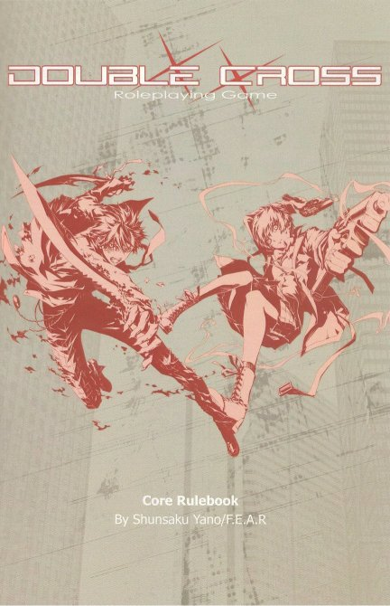
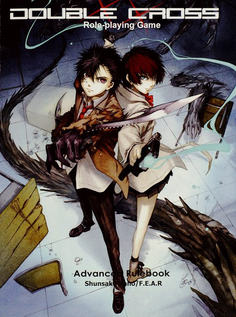

### PeteRPG - Szerepjátékos ismertetők

# Double Cross RPG

***Írta: Petrus; eredetileg megjelent: 2014. június 2., [LFG](http://lfg.hu/65682/ismerteto/double-cross-rpg-ismerteto/)***

 *Today is a repeat of yesterday.*

*Tomorrow will be a repeat of today.*

*This mundane cycle known as life has made the world seem stagnant.*

*Who could have suspected that the world has been so horribly twisted?"*

 

Fél éve is megvan már, hogy bemutattam két különleges japán szerepjátékot, a [Tenra Bansho Zero](tbz.md)-t és a [Golden Sky Stories](gss.md)-t, és most egy újabb, szintén a felkelő nap országából származó játékot vettem elő. A Double Cross messze nem olyan elszállt *hyper-asian*, mint a TBZ és határozottan nem olyan *kawaii*, mint a GSS, célcsoportja inkább azon urban fantasy / *shounen* akció-sorozatok kedvelői, akik nem vetik meg a misztikumot sem. Akár "szuperhősök pisztolyokkal &amp; vírusfertőzött mutánsok" is lehetne a címe és ha ez már valakit elriaszt, ne is olvasson tovább.

A játék ugyanúgy a *Far East Amusement Research* (F.E.A.R.) gondozásában készült, mint a már említett TBZ. Fő tervezője Jano Sunszaku (*Shunsaku Yano*), akinek a nevére rákeresve mást nem is találtam, csak további négy kiegészítőt. A szerepjáték első kiadása 2001-ben jelent meg, és még két további revízión ment keresztül, mielőtt tavaly elkészült volna a harmadik kiadásból a hivatalos angol fordítás is (plusz az *Advanced Rulebook* is kijött vele együtt; erről majd a leírás végén ejtek pár szót). Az angol nyelvre átültetést az amerikai [Ver. Blue Amusement](http://www.ver-blue-amusement.com) végezte, ez az első munkájuk a témában, de még továbbiakat is terveznek.

A könyv közel 520 oldalas, puha kötéses, a borítót kivéve teljesen fekete-fehér. Az oldalszám csalóka: mint szinte minden angolra fordított jRPG, ez is meglehetősen szellős, nagy betűmérettel íródott, a teljes szövegmennyiség a "nyugati" RPG-kben szokásos formátummal kb. negyedennyi oldalra elférne, de ez a fordítások átka, túl nagy meló lenne a teljes újraszerkesztés. Ami mondjuk egyébként is ráfért volna... Sok az ismétlődés, az elsőre pár mondatban letudott leírás, ami hivatkozik későbbi szabályokra, emiatt legalább két átolvasás kell, mire az ember nagyjából eltájékozódik a könyvben. A szellősség is nagyon zavaró, nagyon sok oldalt kell oda-vissza lapozgatni egy témán belül. Az ismertető írása során igyekeztem ezeket összefogni és egyben tárgyalni, vagyis az itteni témák sorrendje nem feltétlenül ugyanaz, mint ami a könyvben van.

Az illusztrációk egy része "mangás", képregény-formájú és stílusú, de nem túl kidolgozottak, általában véve közepes szintűeknek mondanám őket. Nincs is sok belőlük, más RPG-khez képest gyakorlatilag jelentéktelen számú. Nem tudom, eredetiben is ilyen volt-e, mindenesetre nem tudtam kiszedni egyet sem a cikkhez, ami eddig még sosem fordult elő velem...

Az alapkönyv ára 23 dollár, ami elsőre nem is olyan vészes (a kiegészítővel együtt csomagban 45 dollár), csakhogy a szállítási költség kis hazánkba önmagában +26 dolcsi, mivel csak FedEx Priority szolgáltatást használnak (de meg is jön 2-3 nap alatt). Valószínűleg idővel elérhető lesz más beszerzőknél is, bár kétlem, hogy széles körben el tudna terjedni, szóval ezért - és a fentiek miatt is - érdemes többször átgondolni, mielőtt belevág az ember a megvásárlásába (vagy más, alternatív módokat keresni).

 

A *Double Cross* alapvetően a mi világunkban és időnkben, Japánban játszódik, de léteznek másféle, alternatív világok is hozzá (ezek még nem jelentek meg angolul). A rövidített alaptörténet szerint egy rejtőző, titokzatos vírus, a Renegát (*Renegade*) csapott le az emberiségre és többeket is megfertőzött, átalakított. Ez a vírus nem csak külsőségekben, torzulásokban nyílvánul meg, hanem különleges képességekben is, ezek a képességek viszont kisebb-nagyobb mértékben felemésztik a fertőzöttek lelkét és elméjét. Akik teljesen átadják magukat a hatalomnak, azok elveszítik emberi mivoltukat és többnyire őrjöngő pusztításban törnek ki. Van viszont egy csoport, akik az emberek és a fertőzöttek között állnak és a világot védelmezik: ők a *Double Crosser*-ek, ők a játékos karakterek.

(Nehéz lefordítani az enyhe szójátékot. A *Double Cross* önmagában átverést, a bizalom elárulását, váratlan hátbadöfést jelent, ugyanakkor orvosi értelemben valamilyen fertőzés, vagy allergiás reakció meglétét, erejét ("kétkeresztes") is jelöli. A hősök az emberiség és a fertőzöttek számára is egyaránt árulóknak számítanak, mivel már hordozzák a vírust, de nem adják át magukat neki. Ezért a továbbiakban inkább a "DX-ek" megjelöléssel hivatkozok rájuk, a könyv is így rövidíti.)

A világ nem zuhant még anarchiába, minden teljesen hétköznapian működik és viselkedik, mert a vírus jelenlétét titokban tartják. A fertőzéseket az ügynökök igyekeznek mielőbb kiszúrni és eliminálni, hogy a közvélemény semmit se tudjon a történésekről. Ha valaki megfertőződik, akkor ún. Túlhajtott (*Overed*) lesz belőle és különféle szuperképességeket szerez. De amint használni kezdi ezeket, ott a veszélye annak, hogy elveszíti az emberiességét és végül a vírus átveszi felette az uralmat. Általában véve senki sem tud arról, hogy létezik a vírus és léteznek a Túlhajtottak, de ez rögtön megváltozik, amint valaki elkapja a fertőzést. A játékos karakterek, a DX-ek maguk is mind fertőzöttek, de uralják a kitörni készülő erőket és igyekeznek ezeket a világ védelmében és az álca fenntartásának érdekében használni.

 

A szabálykönyv több ikonikus karaktert is bemutat képregényszerű oldalakon keresztül, így tudjuk meg például a legelső oldalakon, hogy a "főszereplő" középiskolás fiú váratlan átalakulása után tagja lesz a DX-eknek és hogy miféle céljai vannak, amiket meg akar védelmezni (azaz a tipikus anime/manga kezdet).

Ezután nagyon rövid összefoglalót olvashatunk a szerepjáték lényegéről, és **a világ** állapotáról. A világ, ahogy már említve volt, a mi világunk, a maga depresszív, háborúzó, növekvő bűnözéssel fertőzött valójában (a 2000-es évek Japánja a '90-es években összeomló gazdasági buborékot erőteljes pénzpumpálással, közműépítésekkel és elszabadult hitelezéssel próbálta átvészelni, ami többször is masszív deflációt eredményezett és a GDP szinte beleállt a földbe; a játék 2001-ben jelent meg, a pesszimista hangulat erőteljesen érezhető az egész könyvön). A hétköznapi emberek napról-napra robotolnak, hogy elérjenek valamiféle bizonytalan célt és boldogságot, és mind remélik, hogy a holnap is ugyanolyan lesz, mint a ma. De a játékos karakterek tudják, hogy ez csak egy erőltetett álca, a világ valójában vékony jégen táncol és bármikor alázuhanhat. A Renegát vírus - ami kb. 20 éve bukkant fel - bárhol felütheti a fejét, hogy megfertőzzön hétköznapi embereket, különféle Erőket (*Powers*) okozva bennük. Az Erők tulajdonképpen maguk a szuperképességek: beleíródnak a DNS-be, kitörölhetetlenül és mindörökre megváltoztatják a hordozójukat. Alapvetően tizenkétféle különböző Szindrómába (*Syndrome*) vannak csoportosítva a pirokinézistől kezdve a szupergyorsaságon át a természetfeletti regenerációig. Ezekre később még bővebben is kitérünk.

Mindenki, akit a Renegát megfertőz, Túlhajtottnak számít. Egy Túlhajtott minél többször használja a képességeit, annál nagyobb az esélye, hogy a vírus az elméjét is megfertőzi, és ha ez megtörténik, az adott személyből irányíthatatlan szörnyeteg, ún. *Gjaum* válik. A játékos karakterek ezen a keskeny kötélen egyensúlyozva próbálják megőrizni az ép elméjüket és megvédeni a világot - de ezt többnyire csak úgy tehetik meg, ha használják a képességeiket.

A karakterek legfőbb szövetségesei (vélhetően) az UGN (*Universal Guardian Network*) tagjai lesznek. Az UGN egy olyan világméretű szervezet, amely a Túlhajtottak és az emberek együttélését próbálja fenntartani és mindenáron igyekeznek elfedni a vírus jelenlétét - amíg el nem jön majd a megfelelő idő erre. Legfőbb ellenfelük az FH (*False Hearts*), amely egy terrorista csoport. Tagjai mind Túlhajtottak, akik fel akarják fedni a vírus jelenlétét és működését, és olyan társadalmat akarnak kialakítani, ahol a Túlhajtottak uralják az embereket. Szervezettségük messze nem olyan kiterjedt, mint az UGN esetén, ennélfogva magányos ügynökeik felderítése sokkal nehezebb.

 

Mint a jRPG-k általában, a Double Cross is pontosan definiálja a mesélő jogait. Alapvetően három van: a szabályokban ő dönt és csak ő változtathatja meg azokat; ha egy játékos a mesélő tudomása nélkül cselekszik, vagy dob, a mesélő újradobathatja az egészet, illetve saját maga ignorálhat dobásokat és automatikusan eldöntheti az általa irányított karakterek cselekvéseinek eredményeit; valamint, ha szabályhiba történik, nincs "reset", azaz a kiinduló helyzet visszaállítását mindenáron kerülni kell.

A rendszerről röviden szólva: csak D10-eket használ, többet is egyszerre és ezekből általában a legnagyobb érték számít, de néha van D100 dobás is. Táblázatokhoz, karakteralkotásnál néha szükség van D66-ra is (két darab D6, ahol az egyik kocka a "tízes", a másik az "egyes" helyiértékeket jelöli). A fő tulajdonságokból (*Stat*) négy van: Test (*Body*), Érzékelés (*Sense*), Elme (*Mind*) és Társaság (*Social*). A képzettségek (*Skills*) ezek alá tagozódnak be. Ezekről mindjárt részletesebben is szólok, először azonban térjünk ki a játék néhány érdekesebb vonására.

Idáig eljutva az olvasásban a gyakorlottabb játékosok/mesélők többsége máris elgondolkozhat azon, hogy vajon a karakterekre két oldalról nehezedő nyomást szimbolizálja-e valahogy a rendszer, vagy pusztán csak a leíró módra hagyatkozik? Nos, mivel jRPG-ről van szó, természetesen minden fontos jellemzőnek vannak statisztikái és terminológiái, így, mivel a fertőződés és a világ védelme a játék hangsúlyos eleme, vannak rájuk meghatározások is:

- A Betolakodási Szint (*Encroachment Rate*) a Renegát vírus aktivitását jelzi az adott személyben, azaz hogy mennyire fertőzte már meg őt. Egy történet közben dinamikusan változhat, ahogy a különféle Erőket használják a karakterek, még 100 fölé is mehet, de ha a történet végén nem sikerül lecsökkenteni ez alá, a karakter elveszett, Gjaum lett belőle. Történet közben a 100 feletti érték általában nem probléma, és a legtöbb kombó plusz energiákat is kap tőle.

- Az Impulzus (*Impulse*) az a váratlan fizikai, vagy lelki csapás, amit a Renegát vírus próbál kihasználni és extrém fokozatba kapcsol, hogy uralja a testet. Ha egy Túlhajtott nem képes legyűrni ezt az Impulzust, a vírus átveszi felette az uralmat és Gjaum válik belőle. Habár többségük irányíthatatlan mutáns lesz, vannak esetek, amikor fent tudják tartani magukon az emberi álcát, sőt, még valamiféle épelméjű viselkedést is tudnak imitálni.

- A Tenyészet (*Breed*) azt mutatja, hogy egy Túlhajtottnak hány Szindrómája van. A legtöbben Tisztavérűek (*Pure-Breed*) és csak egy Szindrómával rendelkeznek, a ritka Félvérek (*Cross-Breed*) kettővel, az ultra-ritka Harmadvérek (*Tri-Breed*) pedig hárommal. A Tisztavérűek általában néhány erősebb Erővel rendelkeznek és többféle helyről is válogathatnak, a Félvérek és Harmadvérek jellemzően több, de gyengébb Erőt kapnak és nem választhatnak mindegyikből.

- A *"Lois"*-ok a furcsa nevük ellenére máris rögtön egyértelműekké válnak, ha azt mondom, hogy itt nem valamiféle "Loi"-król, hanem bizony a "Lois Lane"-típusú szereplőkről van szó. Lois Lane ugyebár Superman titkos (ill. később nem is annyira titkos) szerelme, aki sokszor keveredik bajba a Superman-nel való kapcsolata és ismertsége miatt, és a főhősnek gyakran kell megmentenie életveszélyes szituációkból. A Double Cross-ban a Loisok olyan motivációk, döntően karakterek, emberek (pl. szerelmek, családtagok, társak, és gyakran csapattagok), akiknek a biztonsága és védelme, a velük való kapcsolata fontos a játékos karakter számára. Játék közben is lehet szerezni újakat, vagy elveszteni régieket, általában egy-egy történet kezdetén és végén három-három Lois van a karakterlapra felírva, de ezek nem biztos, hogy ugyanazok lesznek. A Loisoknak fontos szerepe van a történetek közben és két történet között is a Betolakodás Szint változásaira, főként visszacsökkenésére, erre külön szabályok vannak. Kevéssé hangsúlyos a könyv elején, de később többször is említésre kerül, hogy a játékos karakterek számára a Loisok adják az "erőt" a folytatáshoz és hogy uralják a testükben kóborló vírust.

- A "Lois"-ok ellentétei a *"Titus"*-ok. (Piros pont annak, aki segítség nélkül elsőre meg tudja fejteni, milyen híres, de a közműveltségben jóval kevésbé ismert dráma egyik főszereplőjéről kölcsönözték a nevüket. :) ). A Titusok, ha már Superman szóba került, a játékos karakterek "Lex Luthor"-ai. Nem szimplán valamilyen ikonikus ellenfelek, hanem azok a korábbi Loisok, akikkel a karakterek valamilyen drámai esemény folytán összetűzésbe kerültek és ellenségekké váltak. A Titusoktól bizonyos szabályok szerint meg lehet szabadulni és ilyenkor a karakterek rövid ideig tartó, de erőteljes "boost"-okat kaphatnak.

 

Ennyi bevezető után térjünk át a **karakteralkotás**ra.

Háromféle módszer van a játékos karakterek létrehozására:

- A gyors módszerrel a könyvben lévő számos példakarakter egyikét lehet egy az egyben felhasználni, csak átnevezve és kissé személyre szabva.

- Az irányított metódus egyfajta "workflow", ahol meghatározott lépéseken kell átmenni és a döntési pontokon irányt váltani. A végén minden tekintetben kiegyensúlyozott karaktert kapunk. Gyakorlatilag táblázatokon kell sorban dobálni (vagy választani), elosztogatni pár szabad pontot és kiszámolgatni még, amit kell. Az életutaktól kezdve a foglalkozásokon a Loisokig szinte mindenféle dologra lehet dobálni. Kicsit olyan, mint a CP2020 Lifepath generátora.

- És persze van az, amikor nulláról indulva, meghatározott mennyiségű tapasztalati pontból (XP) lehet összeépíteni tetszőlegesen a karaktert. Ez csak gyakorlott játékosoknak ajánlott.

Az érdekesség kedvéért végigmentem egy irányított folyamaton, az eredményét (*Black Reptile*) az ismertető végén találhatod. Ha tudom, későbbi ismertetőkben is használni fogom ezt a módszert, úgy vélem, jobb bepillantást enged a rendszer berkeibe (de a kommentekben jelezzétek, ha nem így gondoljátok).

Fontos kiemelni, hogy a rendszer támogatja a nem emberi karakterek alkotását is, ezeket Renegát Lényeknek (*Renegade Beings*) nevezi. Nem csak élőlények (idegenek, ördögök, stb.), hanem tárgyak, vagy pl. szoftverek is lehetnek ilyen lények. Ezekben is a Renegát vírus okozza az öntudatra ébredést és az irányított módszerhez hasonlóan lehet megalkotni őket (és a kiegészítő könyvben további, részletesebb szabályaik is vannak). Ezen a szabályrendszeren alapulnak a már korábban említett különféle alternatív Double Cross világok is.

Bizonyos esetekben lehetőség van a karakterek korlátozott átépítésére (*Rebuild*) is. Ez főleg akkor kerülhet képbe, ha a mesélő új szabályokat vezet be, vagy megváltoztat bizonyos dolgokat a világban (pl. egy alternatív világot kezd bevezetni).

 

Az irányított metódusban a karakterek alapvetően a választott Szindrómáiknak megfelelő kezdő értékekkel és jellemzőkkel bírnak, de természetesen lehetőség van bizonyos szintű alakítgatásokra is. Minden karakter 1-3 Szindrómával indul és ettől függenek a statisztikáik és az Erőik. Választani kell Munkát (*Work*) és Fedősztorit (*Cover*) is, ezek főként a statisztikákból vezethetők le. A Munka egyszerűen az, hogy a karakter mit csinál, mit dolgozik, amiből megél valahogy. A választott Munka kihatással van a képzettségekre is. A Fedősztori a társadalom felé mutatott, eljátszott álca és függ a Munkától, de sajátot is ki lehet találni.

Mivel fontos szerepet játszanak, nézzük meg először a tizenkét Szindrómát, vagyis a különféle Erők csoportjait:

- *Angel Halo*: A fény manipulálásának művészete. Ide tartoznak az illúziók, de a lézer-szerű támadások is.

- *Balor*: A gravitáció irányítása az ún. Gonosz Szemen (*Evil Eye*) keresztül. Nem csak a tér, hanem az idő is befolyásolható vele.

- *Black Dog*: Az elektromosság gerjesztése, irányítása és vezérlése, de pl. nem csak villámokat lehet vele lődözni, hanem kiberverekre is használható.

- *Bram Stoker*: A nevéből sejthető, hogy a vér irányítása, akár az alkalmazóé, akár másoké, de a gyógyítás is ide tartozik. Egy bizonyos Erő felvételével egy hűséges szolgát, egyfajta ghoult lehet alkotni és felszerelni különleges képességekkel.

- *Chimera*: Ezzel a Szindrómával a testet lehet átalakítani, pl. nagyobb erőre, vagy sebességre szert tenni általa.

- *Exile*: Szintén a testet manipulálja, de nem képes többet adni, mint ami van, viszont pl. a belső szerveket lehet vele átmozgatni, vagy körmökkel (nem elírás...) lövöldözni.

- *Hanuman*: Az idegrendszerre hat és emberfeletti reflexeket, ügyességet ad, de pl. hangfegyverként is használható.

- *Morpheus*: A Teremtésből megmaradt anyagot tudja átalakítani, vagy új tárgyakat létrehozni belőle. Egy bizonyos Erővel akár meghatározott járműveket (pl. motor, vagy óriás robot...) is tud készíteni, amiket csak ő vezethet.

- *Neumann*: A szellemi képességeket erősíti, gyors gondolkodást, jobb emlékezőképességet biztosít.

- *Orcus*: Ez a Szindróma egy új teret, behatárolt dimenziót tud létrehozni, ami felett a megalkotójának szinte korlátlan uralma van.

- *Salamandra*: A hőváltoztatás képessége az extrém hidegtől a legnagyobb forróságig.

- *Solaris*: A különféle kémiai anyagokon, pl. mérgeken és drogokon keresztüli irányítás képessége.

Az egyes Szindrómák alá mintegy 20-25 igen változatos Erő tartozik, a leírásaik egyfajta kártyaformában sorakoznak a későbbi oldalakon. Ezeken kívül vannak még ún. egyszerű (*Simple*) Erők is minden Szindrómában. Ezek jellemzően csak harci helyzeteken kívül alkalmazhatók, de esetenként komoly kihatással lehetnek a történetekre.

Az Erők egy része kombinálható is egymással, illetve vannak olyanok is, amelyek csak kombóban használhatók (mint pl. a példakarakter *Energy Meister* képessége).

A négy Stat (a *Body*, a *Mind*, a *Sense* és a *Social*) nullánál nagyobb, pozitív értékeket vehet fel, általában 2-4 körüliek. A választott Szindróma (ill. Szinrómák) mondja meg, hogy a négy Stat mekkora értékkel indul.

Ezek alá mindössze három-három képzettség tagozódik be, de ezek közül négynek vannak specializációi is. Harci képzettségből csak három van (*Melee*, *Ranged*, *Dodge*), ezek nem specializáltak. Különlegesség talán egyedül az RC, a *Renegade Control*, ami a vírus feletti kontrollt jelképezi és főként az Impulzusok leküzdésére és bizonyos Erők aktiválására szolgál. A képzettségek is pozitív számok és 0-tól növekednek felfelé, reprezentálva az ismeretek szintjét. Elsősorban a választott Work-tól függ a kezdeti értékük.

A különféle felszerelési tárgyak jó jRPG-s szokás szerint nem pénzbe kerülnek, hanem meg lehet őket igényelni (*Procure* teszt), vagy ún. *Stock* pontokból lehet megvásárolni. A kezdeti Stock pontok száma általában 4-6 körüli, de játékalkalmak elején is lehet még szerezni. A példakarakter 4-et kapott, a tárgyait abból vette meg (pl. a bicaj 1 pontba került, a ruházat, vagy a mobiltelefon semmibe) és nem maradt semmi. A fennmaradó Stock pontok a *Savings* pontok közé kerülnek és játék közben a Procure és (bizonyos esetekben) Info-alapú Investigation tesztekhez lehet felhasználni őket, mint módosítók. A Procure teszttel igényelt tárgyak csak kölcsönben vannak a karakternél, a játékalkalom végén elkerülnek tőle, hacsak nem tudja Stock pontokból megtartani. Vannak tárgyak, amelyekre nem lehet Procure tesztet dobni, ezeket ki kell érdemelni (vagy máshogy lehet csak megszerezni).

Játék közben a tárgyak többnyire a karakter birtokában (*Possession*) vannak, de a használatukhoz "aktiválni" kell őket, azaz fel kell venni, kézbe fogni, stb., ettől kezdve lesz belőlük eszköz (*Equipment*). A karakterek legfeljebb két fegyvert és két, külön típusú vértezetet viselhetnek egyidőben, mint eszköz. Lőszert nem kell számolni, mindig feltételezett, hogy van annyi a karakternél, amennyi kell.

A tárgylistához tartoznak még a Black Dog Szindrómájú, a *Hard-Wired* Erőt birtokló karakterek különféle kiberverei (pl. alkarpenge, vagy bőr alatti páncél), illetve a Bram Stoker karakterek szolgájának (*Servant*) különleges tárgyai (pl. karmok, íj).
 

A **rendszer** egyszerűen működik: a mesélő mond a feladathoz egy nehézséget (az átlagos nehézség 6-9 körüli), meghatározza, hogy milyen Skill-t, vagy Stat-ot kell használni és a játékos dob. Ha Skill-t kell dobnia, akkor az ahhoz tartozó tulajdonsággal dob. A dobás annyi darab D10, mint a Stat értéke és ezek közül a legnagyobb értéket kell venni, a többi nem számít. Bármely kocka ha 10-es (*Criticals*), az összeadódóan, egyenként továbbdobható és itt is a legnagyobb érték számít. (Megjegyzendő, hogy néhány Erő képes egy rövid időre lefelé módosítani a 10-es kritikus értéket. Ilyen esetben például a 8, vagy nagyobb érték is automatikusan 10-et ér és továbbdobható.) Hozzáadja még a Skill értékét (ha van) és az esetleges módosítókat, és ha a végeredmény egyenlő, vagy nagyobb, mint a nehézség, a teszt sikerült. Ha a dobásoknál minden kocka 1-es, kritikus balsiker (*Fumble*) van. Fontos, hogy bizonyos módosítók kihathatnak a kockák számára is, és ha ez nullára, vagy alá csökkenne, a teszt automatikusan sikertelen. Szintén fontos, hogy a Betolakodási Szint minél nagyobb, annál több bónusz kockát ad, 100 felett még az Erők szintjét is megemeli ideiglenesen...

Az összemért tesztek ugyanígy működnek: aki nagyobbat dobott, nyert. Annyi eltérés van csak, hogy ilyenkor két cselekvő fél van, akiket a rendszer megkülönböztet cselekvő (*Action*) és reagáló (*Reaction*) karakterekként. Egyenlőségnél a reagálónak (azaz többnyire a védekező félnek) van előnye, ő nyer.

A játékalkalmak több szekcióra és azokon belül különféle fázisokra bomlanak, de ezek ismertetésétől most megkímélek mindenkit. Nem olyan bonyolult, mint a TBZ esetében volt, de azért elég összetett a "nyugati" szerepjátékokhoz képest. Amit fontos megemlíteni, azok a Jelenetek (*Scene*), mivel ezek a játék időmérésének általános alapegységei.

Egy Jelenet többnyire egy helyszín és egy esemény(sor), ami ritkán törik meg. Minden Jelenet elején növekszik a karakterek Betolakodási Szintje és minden alkalommal egy vezető (*lead*) karakter is kijelölésre kerül, akinek a többi jelenlégő karakter a társa (*companion*). A vezető szerepe jelenetenként változhat és előfordulhat, hogy csak egyedül vesz részt benne. Az adott Jelenetbe később is beléphet karakter. Vannak olyan speciális Jelenetek, amelyekben valamilyen NPC a vezető és gyakran előfordul, hogy a játékos karakterek nem is bukkannak fel benne. Ezek a több nézőpontú filmekből jól ismert bejátszások, más szereplőkkel történő események.

A történetekért, szerepjátékért, segítőkész hozzáállásért, stb. (szörnyek leöléséért nem), tapasztalati pontokat (XP) lehet szerezni, amit vissza lehet forgatni a karakter fejlesztésébe. Ezek kihathatnak a számított értékekre (pl. Max HP) is és ilyenkor újra kell számolni ezeket. Ami nagyon fontos: az XP-ket a játékosok és a mesélő kapják, nem a karakterek! Miért? Ha egy játékos karaktere elvész (meghal, Gjaum válik belőle, stb.), más rendszerekben általában problémát okoz, hogy milyen szintű karakterrel jöhet vissza és hogy ez miként hat ki a csapatra. Itt a játékosi XP-k biztosítják, hogy kb. ugyanolyan erejű karakterrel tudjon visszatérni a játékba és ne fogja vissza a többieket. A mesélői XP-k pedig - többek között - beválthatók játékra, azaz bármikor a kampány során cserélhet egy másik játékossal, hogy egy ideig most ő legyen a mesélő. :)

 

A **harc** alapideje a kör (*round*), ami általában 1 perc hosszú, de a mesélő megszabhat mást is. A harcok nem számítanak külön Jelenetnek, így azok a szabályok sem vonatkoznak rájuk (szerencsére...).

A harci kör négy ún. Folyamatra (*Process*) tagozódik, de ezek igazából ismerősek más rendszerekből is, csak itt terminológia szerint is el vannak határolva egymástól. A *Setup* során még nem kezdődik a harc, csak az előkészületek történnek, pl. különféle állapotok kerülnek beállításra, illetve vannak bizonyos Erők, amelyek csak ebben a Folyamatban használhatók. Az *Initiative* a kezdeményezés, ami a karakterek ugyanilyen, számított alapértéke alapján dől el: a nagyobb kezd és a kisebbek felé halad, és ez minden körben így marad. Egyenlőségnél a játékos karakterek megelőzik az NPC-ket, karakterek között meg egyszerűen döntés kérdése, nem kell külön tesztet dobni rá. Van lehetőség kivárásra (*Waiting*), ezzel automatikusan a sor végére kerül a karakter.

A *Main* Folyamat, amikor egy karakter végrehajtja a cselekvéseit. Ennek során egy kisebb (*Minor*) és egy nagyobb (*Major*) akciót végezhet, de csak ebben a sorrendben. Előbbi pl. a mozgás (*Move*), a felszerelés cseréje, a tárgyhasználat, kisebb Erők használata, és ilyesmik, utóbbi pedig a futás (*Dash*), a támadás, a nagyobb Erők használata és minden hasonló összetettebb, komplexebb akció. Ha egy Major akció más karakter ellen irányul, neki joga van Reakciót (*Reaction*) végrehajtani, ha van rá lehetősége. Reakciót bármikor lehet tenni, a számuk nincs korlátozva. Vannak még az automatikus cselekvések (*Auto Action*), amelyek sem kisebb, sem nagyobb akciót nem igényelnek. Ebbe a karakterek közötti beszélgetések, valamint bizonyos Erők tartoznak.

Ha a körben minden karakter cselekedett, következik a *Cleanup*, ami jellemzően a függő folyamatokat adminisztrálja, mint pl. a mérgek hatásai, az Erők folyamata, vagy befejeződése, meg ilyenek.

A harc közbeni mozgási lehetőségek általában olyanok, mint más rendszerekben. Kicsit egyedi vonás talán csak a *Blockade* lehetőség, amikor akadályokon / NPC-ken erőszakkal is át lehet jutni. Attack of Opportunity-szerű szabály nincs, de közelharcba belefutva automatikusan megakad a karakter mozgása és külön akció a kibontakozás, meg az elfutás is (utóbbi a Jelenetből is kifut). A távolságok amúgy méterben értendők és nincs grid.

Harcban a támadó a megfelelő képzettségére dob, vagy Erőt használ, a védekező fél pedig a támadástól függően kitérhet (*Dodge*), vagy védekezést (*Guard*) választ, esetleg valamilyen Erőt használ Reakcióból, ha megteheti. A kitérés egyszerű összemért teszt, ha a védő nyer, semmi sérülés nem éri. Ha védekezik, a támadás betalál, de a sebzést lecsökkenti még a *Guard* statisztika és a páncélok értéke (meg néhány Erő is). A sebzés a támadóértéktől függ, minél nagyobb, annál több D10-zel lehet dobni. Ez nem tesztdobás, azaz minden kockaérték összeadódik és nincs kritikus sem. Erre még rájön a fegyver, vagy Erő esetleges támadóereje (*Attack Power*), levonódik a páncélzat, meg még pár opcionális védőértékék és a megmaradt érték jön le a HP-ból (ami más rendszerekhez hasonlóan nem csak életerő, hanem kitartás, mentális erő is egyben). A HP nem mehet nulla alá, nulla értéken a karakter inaktív (*Incapacitated*) lesz, kiesik a harcból, semmit sem tehet a továbbiakban, de még nem halt meg. Ehhez egy külön nagyobb akciót is végre kell még hajtani az ellenfélnek (és legalább 1 pont sebet még kell okozni), de akkor a halál már végleges.

Minden Túlhajtott ismeri a *Resurrect* Erőt, amivel gyógyulni lehet egy kicsit, de még az inaktív karakterek is talpra állíthatók (de egy történet alatt csak egyszer), azaz a rendszer nem kedveli túlságosan a gyakori karakterhalálokat. Az NPC Erők között van egy *Revive*, ami ugyanezt tudja, de még a halottakat is képes feléleszteni.

Harc közben a karakterek bekaphatnak különféle státuszokat (*Bad Status*) is, ezek hasonlóak a más rendszerekből ismert stunned, stb. állapotokhoz, de csak hatféle van belőlük és elég jól lefedik a szokásos lehetőségeket.

A képzettségeknél feltűnhetett, hogy nincs a rendszerben semmiféle lopakodás statisztika. Ez azért van így, mert maga a lehetőség is elég furán működik: ha egy karakter bejelenti, hogy rejtve akar maradni, akkor - ha nincs közelharcban - egyszerűen elkölt egy nagyobb akciót és máris *Stealth* állapotba kerül. Ilyenkor nem lehet közvetlenül megcélozni (de pl. a területre ható effektek őt is elérik), és ő sem tud blokkolni senkit. Az állapot megszűnik, ha sikeres sebző támadást okoz (amúgy ennek semmi extra előnye nincs azon kívül, hogy a megtámadott célpont elvileg nem használja a védekezését, bár ezt konkrétan nem láttam leírva, csak következik az eddigiekből, vagy egyszerűen csak elsiklottam felette), vagy az ellenfelek sikeresen felderítették a helyét (ami egy összemért *Perception*).

 

Az **Erők** használatának egyik legfontosabb szabálya, hogy ha egy Erő valamiért összeütközésben van egy másik szabállyal, akkor az Erő győz erre az időre. Fura, hogy ilyen dolgot külön meg kell említeni, ezek szerint előfordulhatnak ilyen esetek...

A használat amúgy egyszerű: az Erőnél leírt képzettségre, vagy tulajdonságra kell dobni, a nehézség meg adott és általában összemért teszt a célponttal. Minden Erő használat növeli a karakter Betolakodási Szintjét is a megadott mennyiséggel.

Egy Erőt egy akció alatt csak egyszer lehet használni, de nincs korlátja annak, hogy kombóban mennyit használ egyszerre. A kombóknak vannak némi megkötéseik, nem lehet mindent mindennel összerakni, illetve a különféle értékek közös működésére is vannak szabályok. Általában véve jobb előre kiszámolni ezeket, mint az asztalnál, a könyvet lapozgatva és fejvakarva lamentálni, hogy most vajon milyen effekt fog létrejönni, mert elég sok kis apró limitáló szabály van itt. A példakarakternél el is tekintettem ettől, mivel ezeket a szabályokat is megszakítja egy másik, kevéssé odaillő alrendszer és már nem volt kedvem oda-vissza lapozgatni.

Néhány speciális Erő (*Red Servant*, *Fusion*) használatára külön szabályok vonatkoznak, ezeket most átugrom.

 

A **világ**ról egy egész fejezetet is kapunk még, amelyben kiderül egy-két dolog a vírusról, a származásáról és a működéséről, a különféle Tenyészetekről és a Gjaumokról, a Renegát Lényekről, meg az egésznek a háttértörténetéről, de ezeket most nem fogom elspoilerezni. Mondjuk úgy, hogy az eredettörténet kicsit... :ásít:...

Ugyanitt van leírás az UGN alapításáról és működéséről, ismertebb tagjairól. Az UGN kicsit olyan, mint az X-Men alapítvány: regisztrálja és befogadja a Túlhajtottakat, különféle kutatásokat folytat, oktatást végez a tagjainak, és persze kiemelten foglalkozik minden, a vírussal kapcsolatos incidenssel. Természetesen ők sem egységesek, vannak köztük, akik más utakon járnak és az utóbbi időben az UGN-en a felbomlás jelei látszanak (a sztoriból következik, hogy nem véletlenül).

Fő ellenfelük (és a világé is) a False Hearts, róluk is kapunk egy hosszabb leírást. Rajtuk kívül is vannak még más szervezetek szép számmal, a könyv is felsorol vagy egy tucatnyit, rövid leírással együtt.

Van egy nagy halom nevesített NPC is, képekkel meg rövid ismertetővel, de stat-ok nincsenek hozzájuk. A "karakteremnek" kidobott rivális Kurosaki például a *Strangers* nevű katonai szervezet parancsnoka, aki maga is Túlhajtott, de ugyanakkor utálja is őket. Nem kicsit brutális és kegyetlen, és az UGN-en belüli problémák miatt egyre több támogatást kap a japán védelmi erőktől. Black Reptile riválisként tekint rá és szégyent érez vele kapcsolatban, feltehetőleg egyszer már összeakaszkodtak és kikapott tőle.

 

A könyv vége felé van még egy játékosi szekció... Teljesen érthetetlen, mit keres itt, ezt is szerkesztettség hibáihoz írom. Amúgy csak arról szól, hogy mi a különbség a játékos és a mesélő között, mik a játékosok lehetőségei, hogyan viselkedjen játék közben, meg ilyenek. Szükség van erre egy, az ezredforduló után megjelent játékban? Nem hiszem.

Vannak még oldalak a karakteralkotás elméleti részeiről, mint pl. a karakterötlet és annak statisztikákba öntése, de nem tudom, mit keres itt, szerintem ez is a könyv elejére való.

Aztán külön fejezetet kap még egyszer a mesélő is, ami jellemzően az általános dolgokról szól, mint a történetvezetés, a főellenfelek használata, a történetek és a kampányok kezelése, a szabályok kezelése és improvizálás, a tapasztalati pontok osztása, stb.. Ebben a fejezetben van egy csomó névtelen NPC is, mint pl. a rendőrök, utcai civilek, de többféle Gjaum és FH, meg hasonló alakról is van rövid statisztikai blokk. Itt kerülnek leírásra az ellenfelek által használt Erők is, amiket a játékosok nem szerezhetnek meg (WTF?). Pedig egy csomó jó és hangulatos van köztük, de nem...

Kiemelést kaptak a Helyszínek (*Stage*) is, mint az események fő helyszíne. Ez általában egy nagyváros, vagy csak egy iskola, de akár az egész bolygót is magába foglalhatja. Kicsit sok oldalt pazarol rá, érzésem szerint, de legalább leír egy példa helyszínt, az N várost (*City N*), ami egy képzeletbeli tokiói külváros. Van egy nagyon vázlatos térkép is, de senki ne számítson akárcsak egy alapkönyves Night City részletességre sem.

A könyv tartalmaz még három, eléggé kidolgozott kalandot is, ezek főként kezdőknek készültek és elég részletesek ahhoz, hogy a mesélőket is segítsék (pl. tele vannak felolvasható részekkel, komplett dialógusokkal, meg különféle handout-okkal). A kalandok nagyjából összefüggenek, de önállóan is mesélhetők.

- A *Crumbling Days*-ben a csapat egyik tagja az iskolabuszon részese lesz egy False Hearts akciónak, ami egy osztálytársában felébreszti a vírust és ő zavarodottságábabn elrabol egy lányt, a csapat feladata pedig a terrorista legyőzése és a lány kiszabadítása lesz. 

- Az *Armageddon's Youth*-ban egy szökött, UGN-nevelésű, emberektől eddig elzártan élő gyermek és társai egy saját csapatot alapítanak és lenyúlnak pár rakétát a JSDF-től, amit ki akarnak lőni a "szívtelen" és gyűlölt városra.

- A *Truth or Fiction* egy Pygmallion-történet, ahol egy UGN prof a halott lányát akarja újrateremteni, de "csak" egy Renegát Lényt sikerül alkotnia, ami nagyon hasonlít rá. Csakhogy egy FH ügynök megöli a prof-ot és elrabolja a lényt, amit a csapatnak kell visszaszereznie és biztonságba juttatnia.

Van még egy függelék a végén, ami a szokásos indexet és üres karakterlapokat tartalmazza. Megjegyzendő, hogy az index részben használhatatlan, mert néha olyan oldalakra mutat, ahol a rövidített szabályok vannak, onnan meg általában több lapozásnyi keresés, mire sikerül megtalálni a tényleges leíráshoz vezető oldalszámot. Egyszerűen nem is értem a logikát mögötte...

 

 Ígértem, hogy szólok még pár szót a másik kiadványról, az **Advanced Rulebook**-ról is, itt az ideje.

Jóval keskenyebb, alig több, mint 170 oldal, viszont meglepő módon drágább, mint az alapkönyv, de valószínűleg csak azért, mert ebben már van több (kb. 10) színes oldal is.

A kiadvány első, nagyobb harmada a Lois és Titus szabályokat bővíti ki új leírásokkal és alternatív táblázatokkal.

A középső harmad a világról szól. Láttam néhány, az alapkönyvből újrahasznosított dolgot, de csomó újdonság és részletesebb leírás is van, meg az idő is haladt kicsit előre és új események történtek. Az UGN leírása jóval részletesebb és immár minden nevesített NPC kapott kisebb statisztikai blokkot is. Az FH dettó ugyanígy, valamint az egyéb szervezetek és a Renegát Lények leírása is bővebb.

A City N részletesebb térképet kapott több helyszínnel és vannak már saját, nevesített NPC-i is.

A mesélői szekcióban van egy új Lois típus, az *Exhausted*, ami a Gjaumok sajátja, és hasonlóan működik, mint a Lois, de általában primitívebb érzelmekre, vágyakra épül. A mesélők kapnak még további nem nevesített NPC-ket is.

Végül van még két új kaland is, ami az új szabályokra épül:

- A *Memorial Blossom*-ban egy öreg, városszerte híres cseresznyefa újra virágba borul, csakhogy már megfertőződött a vírussal és egy FH ügynök még rá is tesz erre egy lapáttal, hogy a fából Gjaumot "készítsen", amelynek pollenje végigfertőzhetné az egész várost.

- A *Dual Calamity* egy nano-fejlesztés, amit egy renegát UGN tudós készített és képes megváltoztatni az emberek viselkedését. Eredetileg harci felhasználásra keszült, de a súlyos személyiségváltozások miatt az UGN leállította a projektet. Erre a vezető kutató megpattant és átment az FH-hoz, ahol ezüstszín esővé alakította, ami bárkit képes megfertőzni.

És ennyi.

(Időközben kijött a második kiegészítő is angolul, a **Public Enemy**, amely a False Hearts játékos karakterekre fókuszál.)

 

Mit is mondhatnék **végszó**ként?

A leírásban itt-ott már kitértem a kisebb hibákra, amelyek feltűntek, de a legnagyobb a szerkesztés... "furcsasága", ami elsőre nem is nagyon tűnik fel, de állandóan útban van, amikor szükség lenne rá. Addig oké, hogy a fordításban igyekeztek a hűségre szorítkozni, ettől még megpróbálhatták volna gatyába rázni az egész kiadványt. Bár lehet, hogy erre lehetőségük sem volt, mindenesetre az 500+ oldalnak legalább felét feleslegesnek érzem. Egy rendesen tömörített, összeírt, a sallangokat lenyesegető szerkesztés csodákat bírt volna művelni. De ha már ilyen szellős a kiadvány, talán lett volna lehetőség illusztrátorokat is felvenni, hogy feldobják a kinézetet, mert így inkább hasonlít egy gépjárműszervíz-kézikönyvre, vagy összefűzött prezentációra, mint igazi szerepjáték kiadványra.

Meglepő módon ugyanakkor az Advanced Rulebook kiköpött "nyugati" kiadvány, kéthasábos kinézettel, kisebb betűtípussal, jó tagolással és észrevehető kiemelésekkel; teljesen jól átlátható és olvasható. Azt nem sikerült kiderítenem, hogy az angol kiadás lett-e megszerkesztve, vagy már az eredeti is ilyen volt-e, mindenesetre a két könyv kinézete ég és föld. Ha lenne az alapkönyvből is ilyen, vagy még inkább a kettő egybe szerkesztve...

Amúgy maga a rendszer szerintem közepesen bonyolult. Az alapszabályok viszonylag egyszerűek és jól kezelhetők, a bizonytalankodás inkább a Szindrómáknál és az Erőknél kezdődik. A módosítóknál nem mindig volt egyértelmű, hogy ez most a kockák számát befolyásolja, vagy csak a dobott értéket, ez köszönhető annak is, hogy sokszor csak oldalakkal később vannak leírva ilyen lényeges információk.

A világ maga nem tartogat sok meglepetést, aki olvasott már modern mangákat, látott hasonló animéket, az rögtön képben lesz. Mondjuk érdekes módon a könyvek sehol sem tartalmaznak javasolt megnézivalókat, ami azért fura. Ha nekem kellene mondanom hasonló animéket, akkor az újabbak közül a *Black Bullet*, a *Gokukoku no Brynhildr*, meg a *Kyoukai no Kanata* jutna elsőre eszembe, illetve a *Kiseijuu*, ami a legjobban hasonlít erre a világra.

Összességében nem rossz ez a Double Cross, látni benne a potenciált, de azt maga alá temeti az alapkönyv - szerintem - rossz felépítése. Megvásárlását csak alapos megfontolás után tudom javasolni. Nem tudni, lesz-e belőle valaha is átszerkesztett, rendbe rakott változat, mindenesetre kár lenne érte, ha emiatt tűnne el a süllyesztőben.

---

**Name:** Akiyama Hiroshi (a.k.a. *Black Reptile*)

**Breed:** Pure, **Syndrome:** Salamandra

**Cover:** High-School Student, **Work:** High-School Student

**Body:** 6 - Melee: 2, Dodge: 1, Ride (Two-Wheel): 1, Ride (-): 0

**Sense:** 1 - Ranged: 2, Perception: 1, Art (-): 0, Art (-): 0

**Mind:** 3 - RC: 2, Will: 1, Knowledge (-): 0, Knowledge (-): 0

**Social:** 2 - Negotiation: 0, Procure: 0, Info (UGN): 0, Info (Rumor): 1

**Max HP:** 30, **Stock Pts:** 0, **Savings Pts:** 0, **Initiative:** 5, **Move:** 10, **Dash:** 20

**Powers:**

- ***Concentrate: Salamandra***, LV: 2, Max. LV: 5, Timing: Major, Skill: Syndrome, DIF: -, Target: -, RNG: -, Encroach: 2, Restrict: -

- ***Resurrect***, LV: 1, Max. LV: 5, Timing: Auto:, Skill: -, DIF: Auto, Target: Self, RNG: Close, Encroach: Refer, Restrict: -

- ***Warding***, LV: 1, Max. LV: 1, Timing: Auto, Skill: -, DIF: Auto, Target: Scene, RNG: View, Encroach: 0, Restrict: -

- ***Flaming Bullets***, LV: 2, Max. LV: 12, Timing: Major, Skill: RC, DIF: Opposed, Target: -, RNG: View, Encroach: 1, Restrict: -

- ***Energy Meister***, LV: 1, Max. LV: 7, Timing: Major, Skill: Syndrome, DIF: Opposed, Target: -, RNG: -, Encroach: 3, Restrict: -

- ***Ice Bindings***, LV: 1, Max. LV: 5, Timing: Major, Skill: RC, DIF: Opposed, Target: -, RNG: View, Encroach: 3, Restrict: -

- ***Heat Haze***, LV: 2, Max. LV: 5, Timing: Reaction, Skill: Dodge, DIF: Opposed, Target: Self, RNG: Close, Encroach: 3, Restrict: -

**Weapons:**

- *Fists*, Skill: Melee, Acc.: +0, Atk Power: -5, Guard: 0, Rng: Close

**Armors:**

- *Reinforced Clothing*, Dodge: -, Initiative: -, Armor: 1

**Misc Items:** Bicycle (Atk: 2, Init: -1, Armor: -, Dash: 46), Official's Favor (+3 to any Info check, once per Scenario), Casual Wear, Cellphone, Uniform (School), Memento (+1 Will)

 

**Origin:** Estranged Relatives, **Experience:** Bloodshed, **Encounter:** Rival

**Base Encroachment Rate:** 30 (Awakening: Orders (15), Impulse: Distaste (15))

**Lois:**

- *Name:* Akiyama Takai, *Relation:* Relative, *Emotion:* Suspicion

- *Name:* Hada Akane, *Relation:* The Deceased, *Emotion:* Aspiration

- *Name:* Takemichi Kurosaki, *Relation:* Rival, *Emotion:* Shame

 

A háttere szerint valami probléma van a családtagjai és közte, azt lehet mondani, kifejezetten gyűlölik őt (Estranged Relatives), ennek ellenére fontos a kapcsolata velük. Innen jön az első Lois is, az apja. A második valamilyen kifejezetten véres eseményből (Bloodshed) származik, ahol elhunyt valaki, akire felnézett (egy felsőbb évfolyamos lány, mondjuk?). A harmadik pedig egy fontos találkozás (Encounter) volt, amelynek során kapcsolatba került a világ mögött megbúvó eseményekkel. A vírus furcsamód parancsra (Orders) aktiválódott benne (lehet, hogy a Strangers kezei között?), és amikor először észrevette saját magán is, majdnem megfulladt az undortól (Distaste).

Mire képesek a karakter Erői? Az első három az ún. Common, hétköznapi Erő, amit minden Túlhajtott karakter megkap, a másik négy a Salamandra Szindrómából lett választva:

- Concentrate: Csak kombóban használható bármilyen Salamandra Erővel és a Criticals (10) értékét viszi le bizonyos szintig.

- Resurrect: Egy kevés HP-t gyógyít a karakteren, inaktív állapotban is használható, de nincs hatása, ha a Betolakodási szint már 100, vagy nagyobb.

- Warding: Speciális Erő, ami az egész Jelenetre kihat, kiüti a nem Túlhajtott NPC-ket, de a Túlhajtottak figyelmét felkelti. Egyfajta, az animékben szokásos dimenzió-zár, ami kizárja a "halandókat" a Túlhajtottak harcából, hogy ne vegyenek észre semmit.

- Flaming Bullets: Egyszerű távolsági támadás (lángoló, izzó lövedékek), ami szintfüggő Attack Power-rel rendelkezik és látótávolságig hat, egy célpontra.

- Energy Meister: Önmagában nem használható, de bármilyen, támadó jellegű Erővel kombózva, ha a célpont Guard-ot választ védekezésre, az Erő áttöri azt és extra sebzést okoz.

- Ice Bindings: Távolsági támadás, ami jeges csápokat növeszt a célpontra és korlátozza a cselekvéseit úgy, hogy kockákat vesz el tőle a kör végéig.

- Heat Haze: Reakcióként használható, a karakter körül a levegő remegni kezd, mintha nagy hőséget sugározna, és emiatt nehezebb eltalálni, azaz bónusz kockákat kap a Dodge tesztjére.
