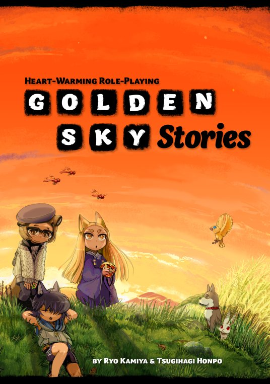
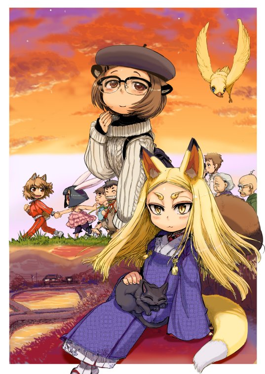
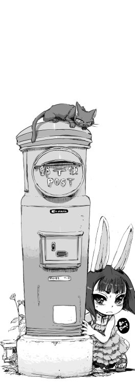
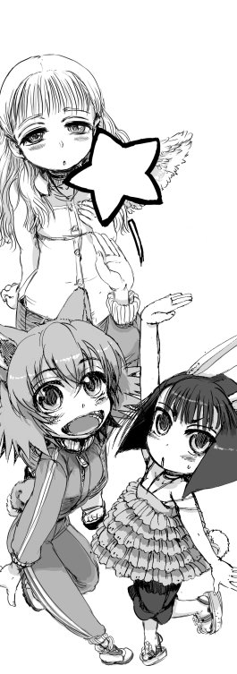

### PeteRPG - Szerepjátékos ismertetők

# Golden Sky Stories RPG

***Írta: Petrus; eredetileg megjelent: 2013. november 26., [LFG](http://lfg.hu/63026/)***

 *"Egy bizonyos városban...*

*Csak egyetlen vasúti vágány halad rajta keresztül. Egy két kocsiból álló szerelvény jön minden órában és ennyi. Az állomással szemben boltok sorakoznak, ahol soha nem látni senkit sem. A városka legtöbb útja olyan keskeny, hogy még autóval sem járható. Ezek többsége le sincs aszfaltozva, inkább csak nyulak és macskák járnak rajtuk, mint emberek.*

*Erre és arra nézve széles mezőket láthatsz. Több rizsföld van, mint ház. Ha távolabbra tekintesz, csak hegyek és fák vonulatait láthatod. Keskeny folyócskák erednek a hegyek közül és formálnak apró tavakat, hogy végül egyetlen nagyobb folyamban egyesüljenek. A víz meg csak folyik.*

*Vannak templomok és szentélyek is, mind csendes és üres. Szél susog a bambuszligetek körül. Végtelennek tűnő füves mezők, virágágyások, lótuszok és lóhere. Apró tavacskák lótuszvirágokkal, járókövek virágzó amarilliszokkal, és kőfalak, a repedésekből kihajtó hajnalkákkal. A távoli hegyek még akkor is megőrzik fehér hósapkáikat, ha beköszönt a tavasz a városban.*

*Az ég végtelennek tűnik. Éjjel nincsen utcai világítás. Ebben a városban a hold és a csillagok páratlan fényben fürösztik a házakat.*

*Csak néhány közlekedési lámpa van. A legmagasabb épület a háromszintes iskola.*

*A város tele van hangokkal, ugráló halak, játszó gyermekek, a postás motorbiciklijének, és a nyomda gépeinek hangjaival. Aztán ott vannak a kutyák, macskák, madarak, és rovarok hangjai. És persze a víz csobogása, a szél fújása, és az eső kopogása.*

*Itt több minden élőbb, mint az emberek.*

*Itt minden más élő számosabb, mint az emberek.*

*Egy ilyesfajta városban fogsz új történeteket mesélni..."*

Igen, így van: *ez* a Golden Sky Stories (továbbiakban GSS) szerepjáték világa.

 

Eredetije még 2006-ban íródott Kamija Rjó és Tszugihagi Honpó tollából. Egy Ewen Cluney nevezetű amerikai fiatalember és társai kezdtek a fordításához, de nem érkeztek tapasztalatlanul erre a területre: nekik köszönhetjük a fantasztikusan zseniális és elborult *Maid* című, szintén eredeti japán szerepjáték angolra ültetését is (majd valamikor erről is muszáj lesz írnom, mert a rövidsége ellenére igazi kihagyhatatlan őrület). Kamija *szenszei*nek nem ez volt az első szerepjátéka, hiszen például pont a *Maid*-et is neki köszönhetjük.

Míg a *Maid* a tipikus japán geg-poénokra építő "slapstick" komédia inasokkal és szobalányokkal, a *Tenra Bansho Zero* pedig egy felturbózott, ultra-hardcore *shounen* hősjáték, a GSS teljes egészében a japán vidéki életre és folklórra fókuszál. Főszereplőként a játékos karakterek olyan állatszellemeket (fordításban *"henge"*) alakítanak, amelyek félig emberi alakot is képesek ölteni és a kisvárosok, farmok lakóival együtt élik a maguk kis nyugodt életét, harmóniában, békében, és igyekeznek egymás problémáit megoldani. A játékban nincsenek ellenfeleid, nincsenek gonosz hódítók, gyakorlatilag semmilyen harci képességed nincs és a mágiád rendkívül pirinyó. A mágiád igazából sokszor nem is varázslat, csak lehetőség, olyan esemény, amivel megváltoztathatsz egy embert – és ezzel megmentheted, helyesebb, boldogabb élet felé irányíthatod őt. Nem vagy se fiatal, se idős, de nem is vagy ember, viszont állatszellemként a te feladatod is, hogy terelgesd az emberek életét és fenntartsd a város harmóniáját. Egy későbbi fejezet külön visszatér erre a kérdésre.

Az emberek erősebbek, mint te. Házakat építenek, gépeket alkotnak és vannak szavaik az érzelmeik kifejezésére és az olyan lényekről szőtt mesék megalkotására, mint te is vagy. Ennek ellenére az emberek gyengék is, néha a szavaik, néha a szívükben lakó komplikált dolgok miatt. És bár az emberekben megvan a potenciál, hogy összeszedjék az erejüket, ha meglátják a lehetőséget, önmaguk nem képesek megteremteni ezeket a lehetőségeket. Neked, az állatszellemnek kell ezeket létrehoznod. De persze nem kell minden ponton ott lenned mellettük, csak az igazán fontos eseményeknél, amikor válaszút elé érkeznek és hezitálnak, képtelenek a továbblépésre. Ezek az események a fontosak a számodra is.

 

Mint a fentiekből is látható, a GSS semmiképpen sem nevezhető hétköznapinak. A főszereplői, az állatszellemek, nem valaki *ellen*, hanem *valakiért* tesznek erőfeszítéseket és gyakran kell mások segítségét is kérniük ahhoz, hogy végül egy jó történet kerekedjen ki az egészből. Ha a történet jó, mindenki nyer, ha unalmas, mindenki veszít. A szellemek nem harcosok, sem varázslók és nem kincseket, elfeledett romokat kutatnak át, még csak a pénz, vagy a világ megmentése sem érdekli őket. Egyszerűen csak embereket mentenek meg, nem pénz, vagy élelem által, hanem a szívükön keresztül.

Első pillantásra nem is világos, mi a fenét kellene itt csinálni. Esetleg még másodikra sem... A GSS-el való játékhoz kicsit át kell állítani a gondolkozásunkat és el kell felejteni a "klasszikus" szerepjátékok szokványos sémáit. Egy állatszellemnek csak annyi kicsike hatalma van, hogy közönséges embereknek tudjon a megfelelő pillanatban segítséget nyújtani, nem több. Ehhez viszont aktivitásra van szükség, egy természeténél fogva passzív játékos képtelen lenne bármit is kezdeni a GSS világával, ez a játék nem nekik való. Emellett tagadhatatlanul van valami gyermeki bája is, amit érzéketlen szívvel nem lehet megérinteni, felfogni, megérteni, bár egy próbát mindenképpen megér a dolog, hogy sikerül-e felébreszteni magunkban valamit a gyermekkor érzelmi gazdagságából és az apró csodák világából.

Tudom, nagy szavak ezek, de nem kívánok a ló másik oldalára sem esni: a GSS *nem* akar az úgynevezett "igazzy", "méj" és "komoj" szerepjáték címére sem törni, bár tagadhatatlanul sokkal több komolyságot, szerepjátékot és ugyanakkor játékosságot kíván egyszerre, amit más, általánosságban ismert világok és rendszerek nem igazán propagálnak.

Maradjunk annyiban, hogy a GSS igen érdekes színfoltja a szerepjátékos palettának, amiről jó, ha tud az ember, de nem biztos, hogy feltétlenül úgy érzi, ezt mindenképpen ki kell próbálnia.

Tehát ott tartottunk, hogy minden játékos karaktere egy **állatszellem**, egy *hedge*, ami bár rendelkezik antropomorf, emberszerű jellegzetességekkel (lásd a mindenfelé elszórt képeket, amelyeket minden jóérzésű embernek *muszáj* hangosan gügyögve és nyáladzva megtekintenie...; ha már itt tartunk, ezeket a képeket egy *Ike* (ál)nevű professzionális manga illusztrátornak köszönhetjük, az egész könyv ilyen gyönyörűségekkel van tele), de mégiscsak állat. Lehet veréb, nyúl, macska, egér, hörcsög, vagy bármi más, kicsinyke mágiája az, ami kiemeli a közönséges állatok közül. De mivel mégiscsak állat, nincs semmiféle, az emberek közt használatos megkülönböztető "azonosítója", azaz nincs személyi száma, bankártyája, lakáskulcsa, telefonja, semmi, még akkor sem, ha ideiglenesen emberi alakot ölt. Állatként él és szerzi élelmét, alakítja lakhelyét, nincs ebben semmi különös.

Persze gyakran előfordul, hogy az emberek között mozog, élelmet csencsel tőlük, vagy előadja tipikus állati gyengeségeit, ennek ellenére az emberek többsége nem tud arról, hogy léteznek szellemek (csak a mesékben). Az öregek persze tudják, ők láttak már egyet s mást. De diszkréten úgy tesznek, mintha nem vennék észre a véletlenül kint maradt állatfüleidet, vagy a hátranyúló farkadat. Persze vannak olyanok is, akiket ez sokként érhet, tehát ügyelned kell a megjelenésedre. A könyv is azt tanácsolja, hogy állatként nem kell a *NatGeo*, vagy az *Animal Planet* szerint viselkedni, de próbálj úgy viselkedni, mint az adott állat.

Mint szellem, egyébként is lesznek különleges képességeid, például macskaként kitűnően úszhatsz is akár. De az egyik legfontosabb jellemződ, hogy állati és emberi formában is megérted az emberi és állati beszédet, sőt, képes vagy beszélni is. Mindannyian tudnánk felidézni olyan háziállatokat a környezetünkből, vagy a múltunkból, hogy szinte megszólaltak, annyira értelmesek voltak. Nos, ők *tényleg* tudtak volna beszélni, csak nem akartak megijeszteni minket...

A szellemek általában okosak, már az állati intelligenciához mérten, de sosem töprengenek a képességeiken. Számukra teljesen elfogadott tény, hogy minden állat tudna emberi alakot ölteni és beszélni, csak... nem akarnak. Nincs rá idejük. Vagy jobban tetszik nekik úgy, ahogy vannak. Az állatszellemek nem sok időt pazarolnak az olyasfajta gondolatokra, hogy *"mi az idő múlása?"*, vagy a *"hogyan tudunk beszélni?"* Számukra mindez természetes, hiszen ebben születtek és ebben élnek. Fontos, hogy ázsiai szemmel nézve a szellemek nem misztikus lények, amelyek állatokra hasonlítanak, hanem állatok, amik/akik olyan különleges képességeket mutatnak, amelyeket normál körülmények között elrejtenek előlünk. A japán (és tágabb értelemben az ázsiai) mitológiában a beszélő, embereket segítő, ugyanakkor ravasz állatok eléggé hétköznapiak a mi, európai, hasonló, de jellemzően szörny-képre formázott, rémisztő lényeinkhez képest.

Az **emberek** jóval többen vannak, mint a szellemek. A GSS tipikus, vidéki alaphelyszíne is a japán népsűrűségre épít, azaz még a lankás dombvidéken, a hegyek tövében is tízezernyi ember él (de lesz majd egy európai, ír/angol folklórra és területre fókuszáló kiegészítő is, amit Cluney-ék írnak Kamija segítségéve), ugyanakkor nincs ember, aki mindenkit ismerne (egy-két nagyon öreg, például a közigazgatásban dolgozott illető kivételével), és a terület is annyira nyílt, tág, hogy alig van gyalogos forgalom, nemhogy tömeg. A szellemek többnyire háborítatlanul járkálhatnak a házak között anélkül, hogy észrevennék őket. Az idősebbek, azok, akik a területen nőttek fel, tudják, vagy éppen csak sejtik, hogy léteznek a segítő szellemek, de nem árulják el őket. Mások, akik egy szellemet emberi alakban látnak, egyszerűen csak egy gyereket látnak a város egy másik részéből.

Az embereken, állatokon és szellemeken kívül van még egy csoport, ami a városban és környékén él, ezek a **helyi istenség**ek (*local gods*). Ők valójában eléggé hasonlóak a szellemekhez, de fontos különbség, hogy egy bizonyos helyhez kötődnek és nem hagyják el annak környékét. Emberi alakot is ritkán öltenek, inkább csak rejtőznek a területükön belül. Van istene az erdőnek, a helyi tavacskának, a folyónak, és nem teljesen állatszerűek, hanem inkább a hely jellegzetességét veszik fel, azaz rovarok, halak, kígyók, pókok, meg ilyesmik. A helyi istenségeket egyformán tisztelik az emberek és a szellemek is, de többségük annyira csökönyös és magának való, hogy igen ritkán hallják meg a fohászokat és kívánságokat. Csak azokkal a dolgokkal törődnek, amelyek a területükön belül élnek, mással nem nagyon foglalkoznak.

 

Miután így áttekintettük, miféle lények is élnek ezen a vidéken, térjünk rá a **játéktechnika**i részekre is.

A könyv négy nagy fejezetre oszlik, amely a négy évszakról lett elnevezve (keleti hatás, ahol az évszakokkal nem csak az időjárást, de hangulatokat és viselkedést is szimbolizálnak). Az első, **Tavasz** fejezet szól általánosságban a játékról és a világról.

A mesélőt itt Narrátornak nevezik és funkciója hasonló, mint a többi szerepjátékban: ismeri és kezeli a szabályokat, leírja a környéket és azokat a lényeket, akikkel a játékos karakterek találkoznak, valamint a háttérben szervezi az eseményeket, amelyek a történet kereteit adják. A nekik szóló részletesebb szabályok, de főként a mesélési tanácsok a harmadik, Ősz fejezetben kaptak helyet.

A játékos karakterek, vagyis az állatszellemek, az alapkönyvből hatféle állat közül választhatnak, de az érkező kiegészítőkben további állatok is leírásra kerülnek. Minden szellem leírása nagyon hangulatos, kétoldalas illusztrációkkal, a gondolkodásmódra és viselkedésre utaló példa-idézetekkel kezdődik, de természetesen a karaktereket nem ezek lemásolásával kell megalkotni. A hat állat sorban:

- A ***róka*** a titokzatoskodó, ravasz állat, amely kicsit távolabb, a rétek, erdők sűrűjében él, emiatt sokkal közelebb áll a helyi istenségekhez, mint más szellemek. Minden, ami misztikus és furcsa, az ő specialitása, ugyanakkor elég rosszul kezeli a triviális dolgokat. Róka alakban is gyönyörűen néz ki a bundájával, de emberi alakban is a legszebbek közé tartozik, bár a ruházata általában kissé avitt, régies. (Megjegyzés: a távol-keleti mitológiában jellemző elem az emberi alakban férfiakat elcsábító rókalány, bár a GSS-ben természetesen nem ez a terület kerül előtérbe...). A rókák vadászok, gyorsak, és értenek a rejtőzéshez, ugyanakkor jellemzően magányos lények. Fészkük az erdők mélyén megbúvó rókalyuk, ami egy kisebb labirintus, sok rejtett vészkijárattal.

- A ***mosómedve*** kicsit lassú, körülményeskedő és naív, viszont ő az igazi mestere az átváltozásnak. Nem csak emberi alakot ölthet, hanem bármi mást is, legyen az élő, vagy élettelen (tárgyakat is beleértve). Emellett akár a faleveleket is pénzzé tudja változtatni, de ezt egy igazi mosómedve sohasem teszi. Legalábbis nem használja semmi rosszra. Alapvetően jó természetűek, akik nem szeretik megijeszteni az embereket. Jóval kevésbé territoriálisak, mint a rókák, nagy családokban élnek a saját lyukaikban, amelyek gyakran öreg házak alatt kapnak helyet. Mosómedve alakban szőrösek, puhák és... picit kövérek, de ezt szégyellik, emberként viszont igyekeznek kicsit idősebbnek mutatkozni, mint a koruk (pl. szemüveget viselnek). Jól másznak fára, ugyanakkor rövid lábaikkal nem túl sebesek.

- A ***macska*** mindig igyekszik felnőttebbnek mutatkozni és nem szereti, ha gyerekként bánnak vele. Nagyon független és magának való, ugyanakkor gyakran mutatkozik az emberek társaságában. De csak ameddig *ő* akarja. Vannak köztük teljesen függetlenek is, akik csak időről-időre kukkantanak be a városokba. Az ízlése még ugyanarról a dologról is gyakran változik, ahogy éppen kedve tartja. Elég egyedi speciális képességük a dorombolás. :) Mint az sejthető, a macskák atletikusak és ügyesek, és nem szeretik a róluk szóló sötét meséket (lásd boszorkányok).

- A ***kutya*** az ember legjobb barátja, szívesen keresik egymás társaságát, gyakran tekintik az embereket a gazdáiknak. Még ha nincs is gazdájuk, az emberek közelében szeretnek lenni, emiatt a többi szellem gyakran tart tőlük. Kicsit butuskák és játékosak, néha elfelejtenek dolgokat és a végtelenségig tudják kergetni a saját farkukat, de nagyon barátságosak. Emellett imádnak sétálni és összepisilni dolgokat...

- A ***nyúl*** utál egyedül lenni és mindenkivel azonnal össze akar barátkozni és állandóan játszana. Nyúlként gyakran fehér bundájú, vörös szemű, mint a háziállatok esetében, emberként pedig szeretik a fodros, könnyű ruhákat. Erős lábaik miatt szélvészgyorsak és nagyokat ugranak, és szeretik a ropogós zöldségeket – valamint a süteményeket.

- Végül pedig a ***madár*** a legegyszerűbb és ugyanakkor a legváltozatosabb mind közül. Tipikus madáragyúak, akik nem sok mindenre emlékeznek már az előző öt percből, de imádnak a magasban szárnyalni. Nagyon jól ismerik az eget és a szeleket, és szeretnek énekelni. Feledékenységük miatt szinte csak a pillanatnak élnek, de amúgy jószívűek. Emberi alakban is gyakran vannak szárnyaik a hátukon, emiatt keverik őket az angyalokkal.

A tavaszi fejezetet lezáró példajáték, pontosabban a példa-történet, novella formájában, Rikoról, a mosómedvéről és Kuromuról, a macskáról szól, akik találkoznak egy helyi kisfiúval, Naotóval. Naotót egy magasabb, idősebbnek tűnő lány, Yuka keresi, de valamiért a fiú nem akar előbújni a rejtekéről. A macska végül meglátja Naoko szívében, hogy nem harag, hanem inkább szégyenérzet miatt bújkál: iskolából hazafelé menet kézenfogva sétáltak és beszélgettek, de néhány osztálytársuk meglátta őket és gúnyolódni kezdtek rajtuk. Elszégyellték magukat és elengedték egymás kezét, de tovább mentek hazafelé. Közben egy öreg bácsi is látta őket és megjegyezte, hogy úgy néznek ki, mint egy idősebb nővér és a fiatalabb öccse. Naoto ekkor elszaladt és elbújt Yuka elől, amit a lány sértőnek érzett. A félreértéseket végül a két állat, időnként emberi formába alakulva, elsimítja, de a szellemek csak a lehetőséget teremtik meg, nem dönthetnek az emberek helyett. Például Kuromu macskaként hozzádörgölődzik Naoto lábához, amivel elolvasztja a kétségeit és így összeszedi magát annyira, hogy bocsánatot kérjen, Riko pedig a barátságosságával oldja fel Yuka zavarát és esetlenségét. A két gyerek nem igazán érti, mi van ezekkel a furcsa állatokkal és ismeretlen gyerekekkel, akik itt-ott tűnnek el és jelennek meg, de elfogadják a dolgot és túllépnek rajta, és másnap együtt mennek vissza a kis ligetbe, hogy rizses sütit, halkonzervet, és egy üveg forró teát vigyenek nekik ajándékul.

Én mondtam, hogy nem könnyű átállni az ilyesfajta gondolkozásra...

A második, a **Nyár** fejezet szól a "hagyományos" karakteralkotásról és a játékszabályok egy részéről, továbbra is játékos, egyszerű formában elmesélve.

Új karakter alkotását célszerű nem az állati formával, hanem egy elképzeléssel, elgondolással kezdeni, amit a narrátorral sem árt egyeztetni. Eközben formálódnak a szellem jellemvonásai, emberekhez fűződő viszonya és ezt a képet megragadva, észben tartva kell továbbhaladni.

Az állati forma a fenti hat lehetőség közül választható (plusz a kiegészítők). A formához hat alap tehetség (*basic power*) tartozik, ezekről majd később.

A ***gyengeségek*** (*weakness*) az adott állati formához tartozó jellegzetes negatív jellemvonások, amelyek közül legalább egyet választani kell a (szintén) hatból. Minden gyengeség egy további, meghatározott tehetséget ad a szellem repertoárjához. Lehet többet is választani, de legfeljebb csak hármat. A gyengeséget általában valamilyen feltétel váltja ki, de lehetőség van az ideiglenes elnyomására.

Az ***alaptulajdonságok***ból négy van, értékük 1 és 4 között változhat, ahol a 2 az átlagos, és kezdetben 8 pontot lehet elosztani köztük. Ahogy az várható is, ez a négy tulajdonság a legkevésbé sem hétköznapi...

- A ***Henge*** (Szellem) mutatja a szellem különleges képességeinek erejét, de ez szolgál más helyi istenségek és szellemek ismeretére, valamint a barátok közti státusz jelzésére.

- Az ***Animal*** (Állat) jellemző a szellem állati formájának fizikai ereje, kitartása, ügyessége, érzékei, stb..

- Az ***Adult*** (Felnőtt) az emberi dolgokkal kapcsolatos jellemző, ezzel lehet érzelmeket elrejteni, vagy másokból kiolvasni, gépeket kezelni, és ilyesmik. A felnőtt emberek legjellemzőbb tulajdonsága. Ez az egy jellemző lehet nulla is, de csak szellem esetén.

- A ***Child*** (Gyermek) ezzel szemben az érzelmek kimutatására, közvetítésére jó, de olyasmire is használható, hogy például megszerezz valamit, amit akarsz (játékboltban bömbölő, toporzékoló kisgyerek, megvan?...), vagy rávegyél másokat, hogy megvédjenek (mert védtelen kisgyereknek tűnsz).

A következő lépés az ***emberi alak*** kidolgozása. A legtöbb szellem csak egyféle alakot tud ölteni, tehát szükséges pontosan tudni, hány évesnek tűnik, mit visel, milyen kiegészítők vannak nála és általában véve hogy néz ki, ha egy ember rápillant. A neme változatlan marad, de életkorát tetszés szerint eldöntheti, pl. egy öreg kutya mutatkozhat fiatal fiúként. Általában 8 és 18 év között célszerű választani, ezen kívül eső értékeknél a narrátor engedélye is kell. Emellett, ha valamelyik gyengesége nem ír mást, a ruházatát is megválaszthatja, jellemzően olyanra, ami nem lóg ki a környezetéből (de emberi alakban persze bármilyen más ruhát is felölthet utána).

A karakteralkotás gyakorlatilag ennyi. Még a nevekről és névjavaslatokról van egy rövidke írás, de természetesen nem kötelező japán neveket választani (bár a hangulatot nyilván megadja).

A ***tehetségek*** olyan különleges, misztikus erők, amelyekhez Csodát kell felhasználni. Nem fogom felsorolni az összeset, csak egy-egy példát mutatok, mifélék:

- A róka egyik alap tehetsége például a látnok (*Oracle*). Ha egy alvó mellé fekszik, a róka ezzel a képességgel meg tudja változtatni az illető álmait úgy, mintha a sajátja lenne. Bizonyos körülmények között még arra is rávehető, hogy ne tegyen meg valamit, amit akarna, vagy hogy pont tegye meg azt, amit nem akar. A rókák egyik jellemző hátránya a sült tofu (*Fried tofu*; a tofu egyfajta sűrű szójatejből préselt, gyakran fűszerezett, édeskés ízű, fehér színű vajkockára emlékeztető étel, amit rengetegféle más ételhez is felhasználnak). Ha megpillantják és megérzik az illatát, önkéntelenül is átváltoznak. Ezért a gyengeségért cserébe a hazudós (*Liar*) tehetséget kapják, amivel szinte bármit el tudnak hitetni bárkivel.

- A mosómedvék kapcsán már említettem, hogy leveleket tudnak pénzzé változtatni (*Money* tehetség). Ezt csak alkonyatkor, vagy éjjel tudják megtenni, de napkeltekor a pénz visszaváltozik levéllé. Egyik lehetséges hátrányuk a hiszékenység (*Gullible*), ami azt jelenti, hogy bármit elhisznek és azt sem veszik észre, ha valaki éppen átveri őket. Cserébe az óvatlanság (*Carelessness*) tehetségét kaphatják és ha elég ügyetlennek mutatkoznak, képesek megnyugtatni, felvidítani az embereket.

- A macskák egyik, már említett képessége a szívbe tekintés (*Peek into Hearts*). Bár nem képes felfedni az abszolút igazságot, meg tudja mutatni, mi jár valakinek a gondolatai között valójában, annak ellenére, hogy mit mond. Emellett a macskákra általában is igaz, hogy lusták (*Lazy*). Ezzel a gyengeséggel különösképpen érzékeny a hidegre és a melegre, és ilyen körülmények között elég lassan, lustán képesek csak mozogni. Cserébe megkapják a zavartalan alvás (*Sleeping Soundly*) tehetségét, amivel még akkor is kaphatnak Álom pontokat (később), ha részt vesznek az adott jelenetben, de végigalusszák az egészet...

- A kutyák egyik jellegzetes képessége a simogatás (*Petting*). Ha egy jelenetben megsimogatják, Érzelem pontokat (szintén később) kaphat. Ráadásul ezt a tehetséget nem is lehet aktiválni csak úgy, mindenképpen kell hozzá valaki, aki megsimogatja a kutya karaktert. Szintén jellemző hátrányuk az őszinteség (*Honest*), amivel egyszerűen soha nem hazudhatnak, cserébe pedig megkapják a bocsánat (*Sorry*) képességet, amivel – ha a megfelelő szavakat és viselkedést használják – szinte bármilyen rosszalkodásért, vagy hibáért megbocsátanak nekik.

- A nyulak egyik képessége a "segíts rajtam" (*Help Me*). A nyulak, mint írtam korábban, nagyon barátkozók. Ezzel a képességgel, ha véletlenül belefutnak valakibe, valami különös ok folytán az ismerősükké tehetik ("véletlenül" ismerik egymást) és az illető részt fog venni az adott jelenetben, bár a viselkedését már nem tudják befolyásolni. Ugyanakkor a nyulakra gyakran jellemző az is, hogy sírósak (*Crybaby*). Nem szeretik a meglepetéseket, és ha mégis ilyen helyzetbe kerülnek, könnyekben törnek ki – kifejezetten hangosan. Cserébe megkapják az esendőség (*Please*) tehetségét, amivel nagy, tágra nyílt, könnyes szemekkel rávehetnek valakit, hogy meghallgassák őt.

- Végül pedig a madarak egyik képessége (a nyilvánvaló repülésen kívül) a pletykálkodás (*Rumors*). A madarak nagyon gyorsan képesek elterjeszteni minden pletykát szerte a vidéken, bár mint képesség, nem terjeszthetnek olyasmit, ami valakinek az ártalmára van, vagy ami túlságosan is eltér a valóságtól. Különleges hátrányuk lehet a szemgolyó (*Eyeball*), ami egy újabb japán sajátosság: ezek a szemgolyókra emlékeztető, eltérő színű, koncentrikus minták ugyanolyan célt szolgálnak, mint nálunk a madárijesztők. Ha a karakter ilyen mintát lát, automatikusan meglepődik és nem is közelítheti meg a saját akaratából. Cserébe a raj (*Flock*) tehetséget kapják, amivel nagy számú kis madarat tudnak összegyűjteni egy helyen, akik a segítségére lehetnek.

Fontos szerephez jutnak a ***kapcsolatok*** (*Connections*). Kezdetben a karakter-szellemek nem csak úgy hipp-hopp megjelennek a városban, hanem már ott vannak egy ideje és ismerik is egymást, akár még barátok is lehetnek. Ez egyrészt megtörténik a játék elején szokásos bemutatkozással és a fontosabb külső, belső ismertetőjegyek leírásával, valamint a karakterlap megfelelő részein is jelölve van. Nem kötelező, hogy két karakter ugyanolyan szintű kapcsolatban legyen, de a narrátor felülbírálhatja a játékost, ha valami súlyos ellentmondást lát. A kapcsolatok rögzítése szintén szintekre tagozódik, amelynek maximális erőssége (*Strength*) függ a játékosok számától is. A különösen erős kapcsolatok extra jutalmakat is kaphatnak. Külön sorként jelenik meg maga a város (vagy inkább, jobb kifejezéssel élve a közösség, a *Community*), amellyel kezdetben mindenkinek egységes szintű kapcsolata van és később is csak ritkán változik. Minden kapcsolatnak van egy leíró (*Content*) része is, ami egy jellemző szót takar, mint pl. a kedvelem (*like*), vagy a családi (*family*). A játék során a kapcsolatok dinamikusan változhatnak, gyakran szükség lehet a karakterlap aktualizálására.

A ***történet*** (*Story*) több, egymáshoz fűzött helyszín (*Scene*) sorozatából áll. Egy történet általában arról szól, hogy valaki bajba kerül, a karakterek találkoznak vele és megismerik a problémát, majd megpróbálnak megoldást találni rá. Nem feltétlenül vesz részt minden szellem karakter minden helyszínen, de általában igen. Szokás szerint a narrátor kezeli a helyszíneket és az eseményeket, viszont a játékosoknak van lehetősége elmondani, milyen helyszínt szeretne meglátogatni a karakterével legközelebb (de ez nem kötelező a narrátorra nézve).

Ha egy karakter bekerül egy helyszínre, többféle dolgot is cselekedhet:

- Kaphat Csodát (*Wonder*) és Érzelmeket (*Feeling*), ezek számossága a résztvevőkhöz és a helyszínhez fűződő kapcsolataik erősségétől függ (előbbi a karakter mások iránti kapcsolataitól, utóbbi a karakter iránti kapcsolatoktól). A csoda pontokat a korábban ismertetett tehetségek aktiválására lehet felhasználni, az érzelmeket pedig a cselekvések végrehajtásának megkönnyítésére (l. alább). Mindkettő felhasználható a gyengeség ideiglenes csökkentésére, elnyomására is. Az el nem használt pontok megmaradnak a helyszínek váltása után is, egészen a történet végéig.

- Folytathat beszélgetést, vagy cselekedhet valamit. Elvárás, hogy a karakternek megfelelően kell cselekedni és viselkedni, úgy, hogy mindenki elégedett legyen. A düh és az agresszió nem működik, kedvesen és szimpatikusan kell hozzáállni a problémákhoz. Ez nem jelenti azt, hogy például egy karakter ne lehetne önző, vagy mufurc, ettől még segítségére lehet másoknak.

- Álmok átadása: Na, ez egy fura dolog lesz megint. Minden játékos (azok is, akiknek a karaktere éppen nem vesz részt a helyszínen), átadhat álmokat (*Dreams*) más karaktereknek, vagy egyéb szereplőknek – beleértve a narrátort is! Ha egy szellem, vagy egy résztvevő cselekvései, vagy szavai tetszenek neked, álmot adhat neki, amellyel erősíthetik a közöttük lévő kapcsolatokat. Vannak még bizonyos megkötések, hogy mennyit lehet kapni és adni, de alapvetően két fő eset van az adakozásra: ha úgy véled, valakinek a szavai, vagy tettei aranyosak voltak; vagy segítettek valakin. Ez mindenkinek a saját döntése, nem kell követni a többieket, és mindenkinek a saját szívére kell hallgatnia, nem a racionalitásra, hogy pl. X-nek, vagy Y-nak hány Álom pontja van már.

- A cselekvések végrehajtása kapcsán a legfontosabb, hogy a rendszer "diceless", azaz semmiféle kockát, kártyát, vagy mást nem használ az események modellezésére. Alapfelvetés, hogy elegendő idő és erőfeszítés alatt a hétköznapi dolgok végrehajtása nem kérdéses. Persze szükség van valamilyen rendszerre a váratlan, vagy komolyabb problémát jelentő feladatok végrehajtásához és itt lépnek be a képbe az Érzelem pontok. Ha valamilyen tesztet kell "dobni", akkor a narrátor megmondja, melyik alaptulajdonságot kell használni (a négyből) és milyen nehézségű a feladat (egy számérték). Ha a tulajdonság nagyobb, vagy egyenlő a nehézségnél, a teszt sikeres. Ugyanez igaz összemért tesztnél is: az nyer, akinek nagyobb a tulajdonsága. Ha egy karakter mégis meg akar próbálkozni valami komolyabb erőfeszítéssel, Érzelem pontokat kell elköltenie, annyit, amennyi hiányzik neki a teszt sikerességéhez (vagyis a tulajdonsága és a nehézség különbségét). Összemért tesztnél mindkét fél addig növelheti az értékét, ameddig csak akarja (és amíg vannak pontjai) és az nyer, aki tovább bírja. Fontos még, hogy Érzelem pontokkal nem csak növelni, hanem csökkenteni is lehet a saját tulajdonságok valamelyikét (ha pl. valaki szándékosan veszíteni akar; több tehetség is épül ilyesmire). Szintén jelentős megemlíteni, hogy a modern technikai kütyük nem a szellemek hatáskörébe tartoznak. Elboldogulnak velük, ha szükséges, de minden esetben tesztet kell végrehajtaniuk (pl. minden ember tud modiltelefont kezelni, mert számukra ez mindennapos dolog, a szellemeknek viszont még csak saját mobiljuk sincs, nincs is rá szükségük).

- Egy szellem emberi alakot is ölthet, de ehhez is szüksége van Csoda, vagy Érzelem pontokra. Az alak nem vihető át helyszínek között, tehát egy új helyszín kezdetén ugyanúgy el kell költeni a pontokat. A szükséges pontok mennyiség függ az időponttól és az átváltozás teljességétől is (pl. a teljesen hű emberi alak sokkal többe kerül, illetve alkonyatkor a legkönnyebb átváltozni). Az állati formába visszaváltozás viszont mindig ingyenes.

- Végezetül pedig egy helyszínen akár új kapcsolatokat is ki lehet alakítani. Ehhez a szellem kiválasztja azt a tulajdonságát, amivel jó benyomást akar tenni az illetőre és elkölti a szükséges számú Érzelem pontot (gyakorlatilag ez is egy teszt). Fontos, hogy nem lehet "ráerőszakolni" valakire kapcsolatot, azaz ha az illető nem akarja ezt kölcsönösen megtenni, akkor semmi sem történik (vagy valami vicces helyzet születik a próbálkozásból).

Vannak bizonyos lehetőségek, amelyeket nem helyszíneken, hanem az azok közötti átmenet idején lehet megtenni. Ilyen a kapcsolat erősségének növelése (ami Álom pontokba kerül), vagy egy kapcsolat leírásának megváltoztatása.

A ***történet vége***, az utolsó helyszín is fontos szerepet kap. A történet legvégén minden megmaradt Csoda, Érzelem és Álom pont törlődik, de a karakter ún. Emlék (*Memories*) pontokat szerez helyettük, amelyek megmaradnak a történetek során is. Az Emlék pontokat "dzsókerként" lehet használni Csoda, vagy Érzelem helyett, de az elköltött pontok már nem térnek vissza. A másik fontos momentum, hogy a karakter meglévő kapcsolatai bizonyos szabályok szerint átalakulnak szálakká (*Threads*). Szál lehet, ami a karaktertől indul ki és az is, ami a karakteren ér véget. A szálaknak nincs erőssége, csak leírója, mint a kapcsolatoknál, valamint történetről-történetre is fennmaradnak. Alapesetben nem befolyásolják a történetet, de ha felbukkan valaki, akivel volt szál kialakítva, akkor az újból kapcsolattá alakulhat, ami erősebb is lehet, mint korábban, majd a történet végén visszatér szál állapotba, ha a játékos is úgy akarja. Egyedüli kivétel a közösségi, városi kapcsolat, ami nem alakul át szállá, nem járul hozzá az Emlék pontokhoz sem, de a szintje stabilan megmarad két történet között is.

Korábban volt már szó a ***meglepetés***ről, itt még csak annyit, hogy bizonyos esetekben káros is lehet, hiszen az átlagemberek túlzottan racionálisak és megrémítik őket a váratlan dolgok. Még a legjobb eset, ha sikoltozva elrohannak egy beszélő állat láttán, de akár eszméletüket is veszthetik és összeeshetnek, ami újabb problémákat okozhat.

Volt szó arról is, hogy a játékban nincsenek ***harci képességek***, a cél nem mások legyőzése. Ha netán mégis szükséges valamilyen fizikai konfliktus lerendezése, az Animal, vagy az Adult tulajdonság használható, helyzettől függően, összemért tesztként, ahol a vesztes szimplán elmenekül, vagy kiütés miatt a földre esik. A konfliktusok ezen megoldása nem támogatott és a rendszer bünteti is a kapcsolatok romlásával.

A ***mindennapi mágia***, amiről a GSS szól, azokat a helyzeteket jelentik, amelyek hétköznapiak, mindennaposak, de egy pici mágia feldobja és szívmelengetővé, érdekessé, apró csodákká varázsolja őket. És ez okozza a legnagyobb nehézséget: olyan történetet kialakítani, amit nem lehet erőszakkal megoldani, olyan karaktereket játszani, akiknek nem célja a "veszélyes" elemek, alakok "likvidálása". Hétköznapi szerepjátékban elég közhelyes kezdő helyzet, amikor a kocsmában ülő csapathoz odalép egy csuklyás megbízó és röviden vázolja a feladatot, amire a csapat fel is kerekedik és jellemzően valamilyen szörnymészárlós – kincskeresős kaland kerekedik az egészből. A GSS történetei viszont általában azzal indulnak, hogy valaki bajba kerül, vagy problémái vannak és az állatszellemeknek kell segíteniük rajta. A GSS apró dolgokról szól, nem monumentális eseményekről. Egy tipikus történet néhány óra hosszú, egyazon helyszín környékén játszódik néhány karakterrel és egyéb szereplővel, és a problémaforrás, a "kaland" valójában más esetben egészen csekélynek számítana. Nem cél, hogy leölj, vagy elüldözz bárkit is, sőt, éppen ellenkezőleg: az állatszellemek egyik fő célja, hogy új barátokat szerezzenek és békésen éljenek a területen. Nincsenek nagy konfliktusok és semmi szükség arra, hogy a szellemek bármiért is harcoljanak. Még csak nem is hősök. Kis dolgok, barátságosság, közös emlékek... ezek a fontosak.

 

Az **Ősz** fejezet a narrátoroknak szól, hogy hogyan lesz valakiből narrátor, milyen céljai vannak és hogyan is működik a szerepjátszásnak ez a része. Gyakorlatilag a máshol is létező mesélői fejezetről van szó.

A narrátor az, aki megalkotja a várost és a környékét, előkészíti és elmeséli a történetet, bíráskodik szabálykérdésekben és eljátssza a többi karakter szerepét.

A várost nem kell utcanév-házszám szinten kidolgozni, bőven lehet nagy vonalakkal lefesteni a fontosabb jellemzőit és a környék leírását, a történetek során úgyis óhatatlanul egyre több és több apró részlet fog hozzáadódni a képhez mindenki által. Csak arra kell ügyelnie, hogy a kép maga ne változzon történetről-történetre, az ugyanis elég zavaró, ha furcsamód máshogy néznek ki dolgok, mint korábban. Az a város jó, ahol otthon érzik magukat a játékosok és a karakterek egyaránt.

A történet alapvetően abból származik, hogy valakinek valamilyen problémája van. A "probléma" itt persze nem gonosz dolgokat, vagy gyilkolást jelent, hanem például... valakinek eltűnt az uzsonnásdoboza. Kinek és mikor? Ki vihette el és miért? Hol történt mindez? A történet ezekre a kérdésekre adott válaszokkal kerekedik és formálódik úgy, hogy a karakter szellemek is helyet kapnak benne.

A narrátor hasonlóan kap Csoda és Érzelem pontokat, mint a karakterek, de ő csak helyszínenként használhatja fel ezeket, nem viheti át a következő helyszínre.

Hogy hogyan is kell ezt elképzelni, erre egy részletes ***példajáték*** szolgál, ami a Tavasz fejezetben leírt történetet meséli el a játékosok és a narrátor szemszögéből, egészen a karakteralkotástól kezdve. Nagyon hasznos és kimerítően alapos, sok-sok oldalon át futó rész ez, amit minden potenciális narrátornak nagyon ajánlott elolvasnia a hangulat és a mesélési stílus megragadásához, valamint a szabályok megfelelő alkalmazásához.

Ezután két, igen alaposan kidolgozott történet ("kalandmodul") is leírásra kerül, minden helyszínnel és karakterrel együtt:

- Az *"At the Fox's Shrine"*-ban egy rókaszellem éldegél egy kis szentélyben, de hamarosan újabb szellemek jelennek meg a környéken. A róka eleinte lenézi őket, de ahogy egyre jobban megismerik egymást, rájön, hogy mi hiányzott az eddigi magányából.

- A *"Crying in the Night"*-ban egy fiú valamit az iskolájában felejt, de mire visszamegy érte, már esteledik. Találkozik egy állatszellemmel, akivel bemennek az iskolába, de az a furcsa, hogy már a kapuból hallják, hogy valaki bent sírdogál... (nem, nem horror sztori :) )

A záró extra kis alfejezet-féleség a ***vidék***ről (*countryside*) szól és eredetileg nem a GSS-ben szerepel (hanem a *Witch Quest* című, a GSS-hez kicsit hasonló hangvételű szerepjáték egyik kiegészítőjében), de a nyugati szerepjátékosok számára a könnyebb érthetőség és a hangulat kedvéért bekerült ide is. Hasznos és tartalmas olvasmány.

 

A könyv utolsó fejezete a **Tél**, ami tulajdonképpen már csak egy vaskos függelék. Alapvetően csomó minta-állat, -ember és -szellem / istenség van itt leírva (aprócska sztori-ötletekkel), valamint egy egész város, *Hitotsuna* ("egynevű") *Town* alapos ismertetője is. A korábban írt történetek, sztorik is ebben a kitalált városban játszódnak, így jól el lehet helyezni őket a teljes képen belül. Még egy vicces mini-térkép is van hozzá.

A fejezetet a fordító és a szerkesztő zárószavai, valamint a szokásos Kickstarter támogatói lista (közte az enyémmel is :) ) és egy karakterlap zárja. Ha már itt tartunk, fussuk át még azt is, mi várható még a KS támogatói számára:

- Talán többek számára is ismerős lehet az *Open Versatile Anime RPG* (*OVA*) neve. Mindazok, akik támogatták az *OVA Revised* Kickstarter kampányt és a GSS-t is (jelen! :) ), kapni fognak egyfajta crossover bónusz tartalmakat mindkét kiadványhoz.

- Új állatszellem fajok: egér, farkas, hal, póni, boszorka (*witch*). Ebből egyfajta előnézetet már kaptunk.

- Két új játszható történet, plusz egy különálló történetfüzér.

- Színes szabály-kártyák.

- *Mononoke Koyake*, a GSS első kiegészítője, angolra fordítva.

- Színes GSS kalendárium 2014-re. Ezt is megkaptuk már.

- Új, egyedi, a fordítók és tesztelők által írt helyszínek és új, helyi állatszellemek (amelyek a japán kiadáshoz sem léteznek): *Faerie Skies* (angliai vidék), *Fantasy Friends* (általános fantasy), *Friendship Times* (poszt-apok világ, ahol az emberek nyalókából, fémlemezekből és ilyesféle dolgokból állnak...), *Aegis of Equine* (mágikus pónik :) ). Ezek közül a *Faerie Skies* készül majd el legelőször (szavazható volt a sorrend; egy draft verziót már ebből is kaptunk).

- *Henge Candies*: Útmutató az állatszellemek édességfogyasztási szokásaihoz... :P

- *Household Gods*: Koreai állatszellemek és környezet.

- *Engine Sky*: Crossover az *Engine Heart* szerepjátékkal.

- A nagyobb összegeket adományozók falfestményt, keményborítós kiadványt, extra *Maid* szabálykönyvet, meg ilyesmiket is kaptak.

Mindezek persze annak voltak köszönhetők, hogy a kezdeti kért összeget sokszorosan sikerült túlteljesíteni az egy hónapos kampány során.

 

Mit lehet a fentiekhez hozzáfűzni? A *Tenra Bansho Zero* leírás után egy ennyire gyökeresen más szerepjátékkal megismerkedni elég mellbevágó élmény lehet, de azt hiszem, mindenképpen megér egy átnézést. Nem mondom, hogy meleg szívvel (hehe...) ajánlom mindenkinek, tekintve hogy ilyen szerepjátékot szerintem nagyon-nagyon kevesen ismerhetnek kis hazánkban, pláne nem hiszem, hogy tucatnyinál többen lennének azok, akik egyáltalán kipróbálták, nemhogy hosszabb távon is játszanak vele. A GSS annyira más és fura az általunk megszokottakhoz képest, hogy csak befogadó csapat számára lehet értelme próbálkozni a bevezetésével egy-egy egylövetű történet idejére – de ők bizonyára jól fognak majd szórakozni.

Már csak annyi maradt a végére, hogy vajon hol lehetne beszerezni? Egyelőre sehol, bolti értékesítésben még nem kapható, csak mi, a Kickstarter kampányban részt vevők kaptuk meg (nekem is a PDF-ek vannak meg). Technikailag a fájlok nincsenek védve, nincs rajtuk DRM, se vízjel, tehát valószínűleg már a nem éppen legális csatornákon is meg lehet találni, de maguk a szerzők is írják az impresszumban, hogy ez úgyis elkerülhetetlen lesz, tehát csak azt kérték, hogy játsszunk jókat és amennyiben lehet, vegyünk meg egy-egy példányt azért.

Értékelni ezt sem tudom igazán, pont ugyanazért, mint a TBZ-t: túlságosan is rétegjáték, általános bevezetésre és elterjesztésre bizonyosan alkalmatlan. Pedig a külalak mindenképpen csillagos ötös, az illusztrációk szinte lelépnek a lapokról és életre kelnek, mesélik a történetüket. A szövegezés egyszerű, jól érthető, a szabályok nagyon egyszerűek és mellőzik a véletlen szerepét is, akár fiatalabbaknak is simán meg lehet tanítani. A hangulata nagyon jó az egésznek, egészen nyugis és harmonikus, márcsak ezért is nehéz lenne megszokni.

Akinek felkeltettem az érdeklődését, mindenképpen nézzen bele, ha netán pedig valaki Budapesten szervezne próbajátékot (vagy igen-igen elvetemülten magyar kiegészítőt írna), szóljon nekem is! :)

### Frissítések

(180416) A fent felsorolt kiadványok már megjelentek és a GSS is kapható boltokban, online áruházakban.
