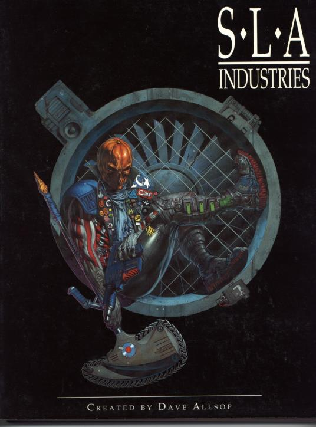

### PeteRPG - Szerepjátékos ismertetők

# SLA Industries

***Írta: Petrus; eredetileg megjelent: 2001. július, Chaos Ultra #28***

 Vannak játékok, amelyek szép, színes, rózsaszín álmokat szövögetnek a mesékről, a jóságról és az igazságosságról. Vannak, amelyek a múltba, a jelenbe, vagy a jövőbe viszik el játékosaikat, egy kitalált - vagy valós alapokon nyugvó - helyszínre és technikai fejlettségre. Vannak, amelyek lehetővé teszik, hogy mindenféle szörnyekkel játsszunk egy lepusztult, apokaliptikus világban, vagy egy alternatív Föld-valóságban. Elindultunk a heroikus tündérmesék magas hegycsúcsaitól és a Sötétség Világának komor szakadékaihoz értünk. A SLA vajon hová illik? Az aljára. Nagyon az aljára...

 

A helyszín: a világűr.

Idő: 900. év az alapítás óta (SD: Standard Date).

A helyzet: Jóformán egyetlen szuperhatalom uralja az ismert világegyetemet, ez a SLA Industries (ne betűzve ejtsd: *szléj*, mint a slay angol szót). Központi bolygójuk, a Mort, 600 éve nem látott napfényt, ugyanis folyamatosan esik az eső. Egyébként az egész bolygón egyetlen nagy város terpeszkedik (meg néhány kisebb), amely régebbi városok kagylóhéjként rétegződő romjaira épült, ahol billiónyi ember és egyéb fajzat nyüzsög és mindent az SLA és a karhatalmi, titkosrendőrségi, médiabirodalma irányít. Az emberek - szinte mind - az SLA alkalmazottai, jól keresnek, mindent az anyacégüknél vesznek és szinte mindent meg is kaphatnak, amire szükségük van. Ha feljebb lépnek a rangsorban, a felsőbb rétegek épületeibe költözhetnek, ahol az eső is tisztább, ahol néha-néha még talán az eget is látni egy rövid másodpercre.

 

A Fanfár egy régebbi számában a Szigeti - Csigás kettős elkövetett már egy igen bő és igen jó ismertetőt magáról a világról és a történelméről (Szigeti Sándor weboldalán is fent volt, én ott láttam először; illetve megjelent az [LFG](http://lfg.hu/7938/ismerteto/sla-industries-szerepjatek-ismerteto-1996/)-n is), így nem szeretném, ha úgy tűnne, tőlük másolok (minden tiszteletem az övék, nekem 9000 Ft-om bánta azt a jó kis felcsigázó leírást, ui. ennyibe került az alapkönyv... ;-), ezért csak rövid összefoglalót adnék majd és inkább az ott kevésbé forszírozott rendszerrel, meg természetesen az alapkönyv felépítésével foglalkoznék inkább.

 

A könyv kívülről nem kelt valami hűha benyomást: semmi harsány logó, semmi élénk színű festmény. Egyszerű puhafedeles kiadvány (elég vaskos, 300+ oldal), fekete alapon fehér SLA Industries felirattal és egy sötétbarna tónusú képpel középen (ami valószínűleg egy Hellowe'en Jack-mániás gyilkost ábrázol). Hátul rövid ismertető, meg egy fehér felirat: "The roleplaying game of futuristic urban horror." Ez a második kiadás (az 1.1-es verzió, hogy hivatalosak legyünk), amit 2000-ben adtak ki, azaz hét évvel az első megjelenés után (matematikus elmék ebből kiszámolhatják, hogy ez 1993-ban lehetett). Akkor még a Nightfall Games volt a főkiadó, most a Hogshead (a Nightfall logó azért maradt), de ez mindössze egyetlen sorként van feltüntetve az impresszumban, azaz nem kívántak nagyon belepiszkálni a külsőségekbe. Érdekesség, hogy anno a teljes könyv egy Atari Falcon 030-as gépen íródott és első példányait egy közönséges otthoni tintasugaras nyomtatón adták ki.

Megjegyzendő még, hogy a kötés sajna, elég gyenge munka, a legnagyobb óvatosság mellett is óhatatlanul betöredezik a könyv gerince, és a sűrűbben forgatott oldalak elég könnyen kinyílnak. Lap még nem hullott ki belőle, de a romlást látva, ez sem elképzelhetetlen.

 

*- Halló, Vizsgálati Osztály. Miben segíthetek?*

*- Izé, helló. Most kaptam egy BPN-t, amin a 'Vizsgálati Osztály' szerepelt és kíváncsi voltam...*

*- Kérem, mi a sorozatszám?*

*- Ööö..., EH532 és valami macskakaparás... Ah, egy "B".*

*- Igen. Megkaphatnám a nevét és a Biztonsági Szintjét?*

*- John Milktree, SCL 8C.*

*- A hangazonosítás elfogadva, Mr. Milktree. Szeretnénk, ha ön és a csapata kivizsgálná egy bizonyos személy eltűnését.*

*- Kiét?*

*- Bejönne az osztályra a részletekért?"*

 

## Történelem és alapok

Tehát röviden a "World of Progress" **történelmének összefoglalója**:

Valaha rég a világűr minden nemzete, a Viszálybolygók népei, egymás ellen harcoltak, váltakozó sikerekkel. Az ismeretlenség teljes homályából jött **Mr. Slayer**, a testőrsége, a **Kilneck**, és **Senti**, a boszorkány. Fegyvereket árultak, nagyon jó és pusztító képességű eszközöket, minden félnek válogatás nélkül. Mr. Slayer megalapította a SLA Industriest, a Kilneck tagjai pedig ott harcoltak, ahol megfizették őket. Senti a **Deathwake**-kel, a Halálébresztés tudományával bírt, amellyel bárkit halhatatlanná tudott tenni, miközben a később csatlakozott **Dark Lament** - élén **Cadavar**-al - a biogenetikai kutatásokkal próbált életet teremteni - sikertelenül. A tökéletes lény megteremtéséhez Senti a Kilneck vezérét, **Intruder**-t akarta felhasználni, és ennek érdekében új projektet indítottak Karma néven. A Dark Lament felajánlotta, hogy pénzeli őket, de csak akkor, ha Intruder helyett Cadavart használják mintának. Senti ebbe nem ment bele és Mr. Slayer is őt támogatta, mire Cadavar ellopta Senti terveit és elmenekült, viszont csalódnia kellett, mert az adatok között nem volt ott a Deathwake tudománya. Intruder - aki valaha kitanította Sentit - tudta, mi fog következni, feloszlatta a Kilnecket és a tagjait a világűr határain túlra küldte, de ő nem menekült el. Időközben felfedezték a kezdetleges ebon fajt, melynek tagjai képesnek tűntek az Ebb használatára. Intruder titokban tartotta a létezésüket és saját maga tanítgatta őket, hogy se Senti, se Slayer ne ronthassák el őket. Közben elkészült az első biogenetikai katona, **Angel**, Intruder tökéletes fizikai mása, de lelkének ellentéte: hidegvérű, kegyetlen és engedelmes gyilkológép. Senti nem volt teljesen elégedett, újabb kísérletet rendelt el, amelynek az eredménye **Malice** lett, az első Stormer. Később az összes Stormer az ő mintájára készült.

Közben Mr. Slayer folytatta a kiárusítást, Stormereket is adott el, csak azt már nem kötötte a vevők orrára, hogy azok a példányok "preparáltak": amikor a világon mindenütt egyszerre romlott el az összes SLA fegyver, a Stormerek könnyedén szétverték addigi uraik seregeit, és ezzel megtörtént Slayer nagy terve, a **Big Picture** első lépése: szinte az egész világ a SLA Industries kezébe került.

A többit csak dióhéjban: Slayer Mort-ra költözött, az ebonok már az ő irányítása alá kerültek, és ekkor jelentek meg az első *necanthrope*-ok, olyan ebonok, amelyek átmentek a Fehéren (ismeretlen eredetű fehér izzás) és élve visszatértek onnan. Õk az ebon fejlődés utolsó lépcsőfokai, a sötét lények, a két lábon járó kegyetlenség megtestesítői. Megalakult a Dark Lament, az ebon biogenetikai kutatóintézet, amelynek élén a legelső necanthrope áll. Míg ők ebon eszközöket kísérlezetnek ki, addig a Karma a mindennapi biotechnológiában nyomul.

Röviden ennyi. A könyv persze jóval részletesebben foglalkozik a témával, én ugyancsak rövidítettem a dolgot, egy csomó eseményt ki is hagytam, de akit érdekel, majd elolvassa. Érdemes...

 

Most pedig menjünk bele egy kicsit részletesebben **a szabályok** alapjaiba:

A szerepjátékban a játékosok **operatív**okat, ügynököket alakítanak. Egy morti számára csak két lehetőség van: beáll munkásnak az SLA-hoz, vagy elmegy operatívnak. Míg az előbbi fix keresetet és szinte életre szóló állást jelent (a gyártelepeken mindig van hely), addig az utóbbi esetleges és sok esetben életveszélyes - viszont sokkal jobban is fizet. A Morton állandóan mindenféle zűrök vannak, a hivatásos rendfenntartók, a **Shiver Egység**ek (Shiver Unit), nem bírnak ezekkel, és az SLA számára sokkal egyszerűbb - olcsóbb - meghirdetni a munkákat, mint házon belül jókora apparátust fenntartani. A feladatokat kis lapocskákon osztogatják (ezek a BPN-ek, a **Blueprint News**-ok), amely tartalmazza a megbízó ügyosztály nevét, a feladat színkódját, rövid leírását, a médialehetőségeket (azaz a publikus Third Eye, vagy a titkos Station Analysis fog közvetíteni; erről később), a fizetést, illetve, hogy ez per fő, vagy per csapat értendő. A színkód dönti el, hogy miféle jellegű munkáról van szó, illetve a hozzáférést is szabályozza, elvégre pl. egy igen-igen ritka ezüst kódú BPN-t általában maga Mr. Slayer ad ki, és biztosan nem fog egy nyavalyás SCL 10-es operatív ilyenhez jutni, a jade BPN-ek meg kifejezetten ebonoknak szólnak.

Milyen munkák is vannak? Felderítés, nyomozás, likvidálás, ellenséges ügynökökre vadászás, eltulajdonított értékek visszaszerzése, utcai rendfenntartás, stb., egyszóval bármi, ami elképzelhető egy bolygóméretű, nyüzsgő város utcáin - és alatta.

Az alacsony szintű operatívok, akiknek nem egy szponzor, vagy média ad megbízást, kénytelenek minden hajnalban a **Slayer's Crab**-nak csúfolt Hall-okban sorban állni, kivárni a többórás regisztrációs procedúrát, aztán, mikor beengedik őket az ötszáz férőhelyes terembe, végig kell ülniük az egészet, mert lehet, hogy pont akkor kapnának munkát, amikor kimennek elszívni egy cigit, vagy inni valamit.

 

Az SCL rövidítés a **Security Clearance Level**-t takarja, a játékban tkp. ezek jelentik a szinteket. A karakterek 10-es SCL-el indulnak, a legmagasabb elérhető az 1-es, de egy szinten belül vannak még betűvel megkülönböztetett lépések is "A"-tól "F"-ig (pl. sorban: SCL 10, 10A, 9, 9A, 9B, 8, 8A, ...). Ha a csapat megkap egy BPN-t, fel kell keressék a megadott ügyosztályt a további információkért. Ha keresztülvergődtek a bürokrácián és megkapják a szükséges adatokat, teljesíthetik a munkát. Ha készen vannak, mindenféle papírokat kell kitölteniük, legtöbbször bizonyítékot is kell mellékelniük, és ha mindent rendben találnak, megkapják a fizetségüket. Ez két módon történhet: fizetési kártyán, vagy pénzügyi chipen. A kártya tkp. olyan, mint egy hitelkártya. Amint az operatív megköti az első szerződését az SLA-vel, nyitnak neki egy számlaszámot, és a pénz oda csorog, a kártyával meg tetszőleges helyen fizethet. A chip már beépített egység, rácsatlakozik a limbikus rendszerre és továbbítja az érzékszervi adatokat is. A tévések megőrülnek az ilyesmikért, a fizetés is magasabb, viszont a chipben megpiszkálhatatlan, leárnyékolhatatlan jeladó is van (meg óra, beépített térkép, stb.)...

A fizetési egység a *credit*, ennek váltója az UNI (1 credit = 10 UNI). A hétköznapi emberek az UNI-t használják. Egy jó munkás átlagos heti keresete 200 UNI, ebből kb. 40-et kell költenie az élelemre és energiára, a többi a ruházkodás, az esernyő, a tömegközlekedési bérlet, a szórakozás és hasonlók. Igen, Mort a fogyasztói társadalom csúcspéldája.

Még az SCL és a pénz témához tartozik, hogy 9-es szinttől kezdve felbukkanhatnak az első szponzorok, amelyek egy személyt, vagy egy csapatot pénzelnek havi fix összegekért vagy százalékbónuszért. Cserébe a szponzor logóját kell jól látható helyen magukon viselniük, hogy bevetésen a tévések is közvetíteni tudják azokat. Ja, nem mondtam még? A BPN-en szereplő médialehetőség azt jelenti, hogy az adott média fogja közvetíteni az eseményt... :-)

Az SCL-t feladatok végrehajtásával lehet növelni, minden BPN színkódhoz tartozik egy módosító (mondjuk a kékhez 0.1). Ha kész a munka, megkapja ezt a növelést. Ha átlép egy egész értéket, feljebb lép a ranglistán.

Két nagy médiaóriás van: a **Third Eye News** és a **Station Analysis**. Természetesen mindkettő az SLA Industries része, és ők maguk is ezernyi alcégre oszlanak. A média nagyon fontos az SLA világában. A média a minden. Híreket közöl, tele van show-kkal és vetélkedőkkel, élő egyenesben közvetítik az operatívok ténykedéseit és... minden úgy történik és jelenik meg, ahogy Mr. Slayer akarja. A nép imádja a tévéjét, imádja a műsorokat, feltétel nélkül elhisz mindent - hiszen nincs más választása. A nagyobb gondot az SLA ellenfelei, főleg a DarkNights és a Tresher Corp. által működtetett ideiglenes kalózadók jelentik, amelyek Mort külvárosaiban működnek ideig-óráig, aztán vagy odébbállnak, vagy egy SLA operatív csapat füstöli ki őket.

A Third Eye News a nyilvános műsorokat fogja össze, a Station Analysis a privát csatornákat.

A fegyverhasználat általában engedélyezett az operatívok számára, de a polgári lakosság gyilkolászása már nem - hacsak éppen ott nincs egy tévéscsapat sem, és ki tudják magyarázni magukat. A lőszer viszont drága, mert Mr. Slayer magas adókat vet ki rá. Nem szereti, ha csak úgy pazarolnak. A nézőknek nem vérengző állatok, hanem pontosan célzó hősök kellenek.

Az igazán nagy szám mégiscsak egy sorozatgyilkos és egy operatív küzdelme. Mondjuk feltűnik egy copycat (másolós gyilkos, aki igyekszik a nagy példaképek nyomdokain haladni és megismételni azokat), akire BPN-t adnak ki, a tévések azonnal ráharapnak a témára és az operatívok minden mozgását kamerákkal követik a kezdeti nyomozástól a fináléig. Mint egy mai, hollywoodi filmben, csakhogy ez a SLA világában maga a valóság.

 

*- Ms. Hinton? Joa Bakera vagyok a Harmadik Szem Hírszolgálattól. Nagyon örülnék, ha mondana pár szót a nézőinknek az Árnyékdivízióban végzett munkájáról.*

*- Természetesen nem... de talán adhatok egy bepillantást a jövőbe.*

*- Igen, ha lehetne.*

*- De nem fog tudni semmit, ha mozog. Jeff? Célozd be a fejét...*

 

Az SLA Industries mint cég, meghatározott fastruktúra szerint épül fel, a szabálykönyvben van egy másfél oldalas ábra a kapcsolatokkal és a vezetők nevével együtt. Szép egy darab, tipikus megakorporáció. Pár érdekesség:

* A **Stygmartyr** Mr. Slayer személyes operatívcsoportja. Ide csak 2F, vagy magasabb SCL-lel lehet bekerülni, szóval ez igen-igen elit hely. Õk Mr. Slayer kezei.
* A **Cloak Division** az egyik legfélelmetesebb ügyosztály. Tagjai mind titkosak, mind beépített emberek valahol, és szinte korlátlan lehetőségekkel bírnak, ha a Nagy Képet veszélyeztető cselekménnyel találkoznak. Õk a **Dark Finder**-ek, az egység megbontását veszélyeztető elemek legfőbb kutatói, biogenetikailag manipulált szuperlények.
* Az **Internal Affairs** valójában a belső titkosrendőrség. Mindent és mindenkit figyelnek, mindent látnak és hallanak. Akit kipécéznek maguknak, észre sem fogja venni, hogy alapos megfigyelés alatt áll. Ha pedig a rendszer ellenségének bizonyul...

## A világ

A könyv nem túl hosszan tárgyalja a fő helyszín, Mort érdekességeit, de igazából erre nincs is szükség. Aki nem tud egy marha nagy, több tucat szintes városban a csapatának megfelelő pontot kitűzni és megtervezni a főbb jellemzőket, az ne is kezdjen el ezzel a játékkal játszani. Egyébként a játékhoz van kifejezetten Mort forráskönyv is már.

A város szíve a **Mort Central**, egy ötezer négyzetmérföldes terület a felszínen. Itt él Mr. Slayer, és itt minden az ő tulajdona. Az összes lakóház, a piramis, a kaszinók, a tévéadók, a metroplexek, minden. Nagyon-nagyon-nagyon magas rangúnak kell lenni ahhoz, hogy valakinek itt megengedje egy lakás vásárlását. Egyébként SLA alkalmazottak számára a nap 24 órájában nyitva állnak a különféle szórakoztató- és bevásárlóközpontok, ahol szó szerint minden igényt képesek kielégíteni. Ezen a területen még az eső is tisztább valamivel, elvégre a szennyező ipari telepek messze vannak. A közbiztonság maximális.

**Uptown** a következő gyűrű, a kissé kifakult csoda birodalma, ahol a legtöbb operatív él és a hivatalok jó része áll. Az itteni közbiztonság kimagasló.

**Suburbia**: Szinte kizárólag munkás- és iparnegyedek állnak itt, a túlzsúfolt, monoton munkát végző milliók életterei. A Shiver rendfenntartók legfőbb vadászterülete ez. A közbiztonság közepes.

Ezt a három városrészt övezi az **SLA Perimeter**, egy harminc méter magas és hat méter vastag páncélozott falgyűrű, amelyen Shiver-ek járőröznek éjjel-nappal, amely elválasztja a viszonylagos rend és a mondott káosz két birodalmát egymástól. A falakon túl terül el Downtown, azon túl pedig... pedig a sivár pusztaság, romok romok hátán és kannibálok, carrienek, manchine-ok...

**Upper Downtown** viszonylag nyugodtabb hely, általában itt élnek azok az operatívok, akik leszorultak a lakáskiosztási listákról, illetve a helyi kormányzati szervek népes családjaikkal. **Lower Downtown** pedig főleg a bandaháborúiról, a magas bűnözési rátáról és a sorozatgyilkosokról híres - ez utóbbiak néha feltűnnek a biztosnak mondott falakon túl is - valamint a rivális cégek ügynökeiről. A DarkNights és a Tresher innen indítja kalózadóit, szabotőreit, és általában itt csapnak össze a levadászásukra küldött SLA operatívokkal. A **kannibál szektor**okból a *carrien*-ek, ezek a teljesen ismeretlen eredetű húsevő humanoid szörnyek ruccannak át vadászni. A vezérük állítólag egy *manchine* - ők terminátor-szerű kiborgok, de félresikerült a kísérlet és többségüket leselejtezték, a maradék meg itt bújkál, rozsdásodó tagokkal, egyre fogyó energiával -, egy félig ember, félig gép szörnyeteg.

Downtown legjellemzőbb vonása, hogy ha tudod, hol vagy, maradj is ott, mert biztosan el fogsz tévedni. Egymásra épült városrészek, zsákutcák, hidak és alagutak beláthatatlan és állandóan változó szövevénye ez a hely. Az itt élők általában minimális munkanélküli segélyen tengődnek és egész nap a tévét bámulják, mivel más dolguk nincs.

 

*- Miszter Ebon, uram? Kaphatnék egy autogramot?*

*- Természetesen kölyök, hogy hívnak?*

*- Billy Veritas, uram.*

*- Szép név, kölyök. Nagyon derék. Tessék, Billy.*

*- Mi van odaírva?*

*- Azt írtam: 'Billy Veritas, jobban találd meg az igazságot, mint a nevedet', ide pedig azt, hogy 'Silkwing', ami az én nevem. Látod? Ez van az SCL jelvényemen. Akarsz az SLA-nak dolgozni, Billy?*

*- Persze. Olyan pisztolyt akarok, mint az öné. Ez egy BLA 046 M Blitzer, teljes visszarúgás-csillapítással, CAF lézerfénnyel és egyedi digitális optikai rendszerrel, nem?*

## A rendszer

A rendszer igen egyszerű, mondhatni puritán, de azért használható. Nyolc alapképesség van (Erő, Ügyesség, Diagnózis, Koncentráció, Hidegvér, Flux illetve Fizikum és Tudás; ez utóbbi kettő számított képesség), a képzettségek ezekhez csatlakoznak, de nem adódnak össze. Egy képesség szintje csak az adott képzettség maximumát határozza meg. A képességek embereknél 5-10 értékűek, más fajok esetén ez kicsit eltér. A karaktergenerálás pontelosztásos, 300 pontot lehet szétosztani meghatározott szabályok alapján: a képességeknek általában fix növelési szorzójuk van, a képzettségek vásárlása pedig igen hasonló pl. az Ars Magica képzettségrendszeréhez (sőt, ugyanolyan).

A képességtesztek egyszerűek: ha 2d10 + képesség + módosítók >= 11, akkor siker van. A képzettségek ugyanígy működnek. A rendszer a képzettségeket támogatja, képességteszteket ritkán használ. Passzív és aktív tesztek vannak, míg az előbbiek esetén nem szükséges dobni, ha a mesélő szerint elegendő szintű az adott képzettség és nincs semmilyen zavaró körülmény, míg az utóbbiak a normál tesztek, amelyek általában akciók közben történnek. Ha valaki képzettlen, -3-mal dob képzettségtesztet (azaz, mintha nullás szintű lenne a képzettsége, és ebből még lejön három).

Karakteralkotáskor vannak felvehető előnyök és hátrányok is (megjegyzendő, hogy pl. a máshol olyannyira kedvelt kétkezesség itt előny, és kemény 10 pontot kóstál), illetve a végén kötelezően ki kell választani egy képzési formát, amely az operatív feladatainak jellegére utal (pl. Strike Squad, vagy Recon Squad). Ezek bónuszokat adnak bizonyos képzettségekhez. Felfoghatjuk specializációnak is, habár az az egy pontnyi növelés nem sok, viszont sok BPN kiköti, hogy milyen képzésű csapatot kívánnak.

Összességében véve a 300 pont bőségesen elég egy sokoldalúan képzett kisebb félisten megalkotásához, főleg, ha nem emberi fajt választunk.
Márpedig a nem hétköznapi ember fajon túl még hat játszható faj van, íme:

* **Frother:** Habár ők is (még...) emberek, de egy új generáció, a Downtown és Suburbia alsóbb rétegeiben felcseperedő kábszerfüggő kölyökbandák koravén tagjai.
* **Ebon:** Különleges faj, ők képesek a flux használatára (egyfajta mágia, de sokkal hatékonyabb). A hajuk fehér, vagy sárga, a szemük egyszínű. Egyébként emberinek néznek ki.
* **Brain Waster:** Õk az ebonok gonoszabb, kegyetlenebb alfaja.
* **Shaktar:** Predator-szerű lények saját erkölcsi kódexszel, háborúimádattal.
* **Stormer:** Fentebb már voltak említve. Kb. 2,5 méteres, alienfejű dögök természetes regenerációval, hihetetlen erővel és egyéb fizikai képességekkel.
* **Wraith Raider:** Lopakodó, fürge, macskaszerű ragadozók, a rejtőzés mesterei.

Minden faj leírása egy oldal, külső és belső jellemzőkkel, illetve a többi fajhoz viszonyított nézőpontjuk ismertetésével megspékelve.

 

*-A vizeletem lehet kék színű?*

*- Ez csak a chip mellékhatása. Az energiaforrás oldódik...*

*- És ilyen színű fog maradni?*

*- Nem, ez csak ideiglenes.*

*- Kár. Olyan szép színe van...*

 

A **harc** leírása sokféle helyzetre kitér. Egy kör 3 másodperc, ez öt fázisra tagolódik. Minden körben van öt fázis és a cselekvők Ügyessége dönti el, hogy melyekben cselekedhetnek (minél nagyobb, annál többször; pl. 13-mas, vagy nagyobb Ügyességgel már mind az öt fázis a rendelkezésükre áll). Kezdeményező dobás nincs, a sorrendet a cselekvések típusai, illetve egyezőségnél valamely (a szabályokban meghatározott) képesség dönti el.

Az életerő rendszer egyszintű, hit-location-ös (vagy a támadó határozza meg a célpontot, vagy a torzóra vonatkozik), és elég halálos. Nem tudom, melyik volt előbb, az *Earthdawn*, vagy ez (mint fentebb említve volt, 1993-ról van szó), de itt szintén vannak sebzések (wounds). Minden bekapott hit találat után kap egy *wound*-ot is. Minden wound negatív módosító a cselekvésekre, valamint az első wound után öt körönként egy Hp-t is veszít a karakter a vérzéstől (minden további wound egy körrel csökkenti ezt az időt, azaz 2 woundnál már négy körönként, 3 woundnál három körönként kap vérzési sebződést). A Stormerek természetes renegerációval bírnak, ami előbb a woundokat, utána a Hp-ket gyógyítja be, az ebonok meg már alacsony Healing szinten is elég jól tudják gyógyítani magukat. A többieknek marad a hagyományos orvosi ellátás (ami általában igen jó). A felépülési idő igen hosszú...

A fegyverarzenál elég széles, a tűzfegyvereknél a *Cyberpunk 2020* mintájára nem a fegyver, hanem a használt töltény mérete és típusa határozza meg a sebzést. Ez egyébként mindig fix érték, hozzáadódik a támadásdobás 20 feletti része, illetve levonódik a célpont vért védelme (PV) és a lőszer átütőereje (PEN) közötti különbség, ha ez utóbbi nagyobb, mint nulla. Közelharcban még az Erő harmada is hozzácsapódik. Van opcionális szabály a páncélrongálódásra (egyszerű, ha a lövedék betalál, akkor megadott mennyiségű páncélt leszed az adott helyről), és a visszarúgásra is (ha a fegyver visszarúgása nagyobb, mint a használó ereje, akkor a különbséggel egyező mértékű sebzést okoz, akár fizikait is).

Vannak még szabályok a sorozatlövésekre is, ezek meglepően egyszerűek és használhatók (pl. nem nagyon kell számolni, hány lőszert használsz el a sorozatra, mert ez csak a támadódobásodtól és a megfelelő képzettségeidtől függ), illetve a fegyverek tűzgyorsaságára is, de ezek gyorsan megjegyezhetők.

Egyébként a fejezet végre felé van leírva egy távolsági harc példa, azon keresztül egyszerűen meg lehet érteni a szabályokat.

 

A **tapasztalati pontok** rendszere is egyszerű: minden kaland (nem játékülés, kaland, azaz BPN!) végén a mesélő oszt egy párat, általában 2-3 pontot, de előfordulhat, hogy egyet sem. Ez nem azt jelenti, hogy bünteti a karaktert, csak az adott BPN már rutinmunkának számított, nincs érte tapasztalat. A kapott pontokat vissza lehet forgatni a képességekbe és a képzettségekbe, meghatározott váltószámmal.

Az **Ebb** egyfajta képesség a Flux, a nyers energia formálására. Az ebonok hosszú oldalakon át nyújtózó, igen részletes és alapos leírásokat kapnak a tizenháromféle ebb képzettség egyenként húsz-húsz szintjének lehetőségeire. Érdekes mellékeffekt pl., hogy ha egy ebon egy ilyen képzettségben akár első szinten is képzett, kap egy szabad képességet, mint pl. a Blast csoportban azt, hogy tetszés szerint tud poharakat és hasonló, apró üvegtárgyakat az akaratával széttörni és hasonlók. A képességek használata általában csak flux pontokba kerül (kb. olyan, mint máshol a mágia-, vagy a pszípont), éles helyzetben még egy Koncentráció tesztre is szükség van. Bizonyos csoportok ellen van mentő, de ez mindössze két kis csoport a tizenháromból. Ráadásul jó esetben körönként akár három képességet is aktiválni tud az ebon, de kettőt szinte biztosan.

Itt megemlítik a varázsjeleket (glyph) is, amelyeket régebben használtak az ebonok. Ezek kártyákra írt különleges jelek, amelyek felidézésével (pl. előveszi a kártyát), az ebon pluszokat kaphat bizonyos képességeire. A kártyákat már nem használják, mert találtak jobbat (ez a *deathsuit*, az ebon dögbőr), de igen értékes holmik. Kár, hogy egyetlen példa sincs a könyvben, az egyedüli hatásismertető meg csak egy *The Pit* nevű bárra vonatkozik, amely tele van írva ilyen jelekkel és emiatt ott nem működnek az ebon képességek (a szabad képességek sem).

Az ebb fejezet végén minden képességhez találunk egy speciális eszközt, amely általában a dögbőrhöz csatlakozik és pluszokat ad az adott képességre, vagy szélesíti annak bizonyos lehetőségeit. Ezek általában nyomkövető, érzékelő eszközök, és csak az ebonok tudják használni őket.

 

A könyv végére maradt egy igen részletesen leírt fegyver-, felszerelés és járműlista (minden cucchoz legalább 8-10 sornyi leírás van a statisztikákon túl), amely soknak tűnik, de összesítve egy lapon bőven elfér az egész (így meg talán picinyt kevés). Van még egy alapos összefoglaló a riválisokról és az általuk használt eszközökről, aztán a könyvet egy adag fénymásolható karakterlap, BPN minta (van egy oldalnyi kitöltött is, gondolom ezek a szokásos "mintakalandok") és egyéb üres formanyomtatványok zárják le.

 

*- Hagyd abba a sikoltozást, meg akarlak gyógyítani.*

*- Szétlőttek... az ujjaim... a kezeim...*

*- Mit használtak? Úgy néz ki, mint a vibropenge.*

*- Azt hiszem vibrodiszkek voltak... ááá!*

*- Hopp, tényleg, az egyik beágyazódott a lábadba.*

*- Óh, Istenem...*

*- Hé, az egészségügyi pakkom legjobb cuccait fecsérlem rád, nehogy meghalj itt nekem.*

*- Szétvágtak... nem érzem a bal lábam.*

*- Mert már nincs bal lábad. Az egyik diszk tisztán levágta. A vérzés elállt...*

*- Rendbe tudod hozni a karomat?... Mit jelent az, hogy 'tisztán levágta'? Hol a lábam... hol az istenverte lábam... ááááá!*

*- Fejezd be a sikítást! Elárulod a helyzetünket a...*

*- Áááááááááááá!*

 

*- ...Itt Peter Formychar, Downtown, négy DarkNight bezsákolva. Küldjetek pár 70 mm-es vibrodiszket a Shiver tisztogatókkal, az enyéim elfogytak.*

*Peter Formychar, Ember felderítő, Downtown 900 SD. DarkNight beszélgetés felvétele Peter Formychar által. Minden jog fenntartva a Harmadik Szem Hírszolgálat számára, videó-feliratozás elérhető.*

## Pro és kontra

Amit nagyon hiányoltam, az a könyvben mindenhol említett hétköznapi biotechnológia, ami mindenki számára hozzáférhető (a Dark Lament-es ebon cuccok nem ide tartoznak, azokból van egy pár részletesen is ismertetve). Viszont egy félhasábnyi rövid összefoglalón kívül semmit sem találni, és még az sem tartalmaz árakat. Vajon mennyi lehet pl. egy olyan szőnyeg, ami visszanöveszti a foltjait, vagy egy fa szék, ami hasonló dolgokra képes és - a szöveg szerint - mindenhol kapható? Ha ezek mindennapos tárgyak, talán lehetett volna egy rövid árlista is hozzájuk, ha már pl. a taxi viteldíjak és a földalatti jegyek árai benne vannak. Meg a ruhákat, a divatot is hiányoltam kicsit, csak a képek alapján lehet némi fogalmunk Mort öltözködéséről, ami hát... hm, meglehetősen excentrikusnak tűnik.

Apropó képek. A teljes könyv fekete-fehér (csak a borító színes), és tömve van kisebb-nagyobb illusztrációkkal. Csak ezek között megint ritka a hétköznapi kép, a többsége necanthrope-okat, vagy stormereket ábrázol...

Ami különösen tetszett, az a mellékelt formanyomtatványok sokasága. SLA operatív szerződés, kivégzési engedély, BPN végrehajtási jelentés, pszichológiai felülvizsgálati határozat (az operatívoknak félévente kötelező elmenniük) és hasonló hasznos holmikkal van tele a könyv, ami tényleg nagyon jó hangulatot adhat a történetekhez (a használatuk elvileg kötelező, mert egy operatív élete felerészt papírmunka is...).

A másik nagyon jó eleme a könyvnek, hogy egyrészt könnyen olvasható, másrészt szinte oldalanként két-három kis "életkép" található benne. Ezek legtöbbször párbeszédes jellegű dolgok, főleg valamelyik tévéadásból részletek és igazán hangulatosak. Párat lefordítottam és beszúrogattam ide-oda (copyright by NightFall Games).

## Összefoglalva

Ebből a játékból szó szerint árad a hangulat és az eredetiség, amellyel - gondolom - egész könyvpolcokat lehetne még megtölteni, de csak ennyire volt hely. Kiadtak még három kiegészítőt (*Karma Sourcebook*, *Mort Sourcebook*, illetve egy kalandmodul), illetve van egy levelezési listájuk is, és azt hiszem, ebből is látható - mármint a minimális aktivitásból -, hogy eléggé rétegjátékról van szó. Kevesen hallottak róla, még kevesebben ismerik, kis hazánkban meg úgyszólván halott a téma (nem hiszem, hogy lenne ötvennél több alapkönyv és még talán túlzó is voltam; ha nem, cáfoljatok meg, örömmel venném!).

A kimaradt dolgok végül is nem vészesek, némi fantáziával áthidalhatók, amit leír a könyv az tökéletesen elég a kezdő és középhaladó szintű játékokhoz. Aki meg komolyabban foglalkozik vele, az úgyis beszerzi a hiányzó kiadványokat (szerintem a Karma könyv valószínűleg a legmagasabb prioritású). Még egy közepes mesélőnek sem lesz nehéz megteremteni a médiahangulatot, hiszen idiótábbnál idiótább sorozatok, vetélkedők, show-k, (rém)híradók nálunk is mennek szép számmal, elég csak két-három nap termését összeválogatni és a szerencsétlen játékosokra zúdítani. :-)

Egyszóval: ajánlom mindenkinek, akik látnak fantáziát az ipari szintre emelt öldöklésben, van érzékük a mai világ által teremtett (ál)valós kép felnagyításához és / vagy kifordításához, és nem kívánják közönséges mészárszékké változtatni a játékot. Elvégre az ilyen operatívok előbb-utóbb (de inkább előbb) média-inkompetenssé válnak és hamarosan egy BPN-en tűnik fel a nevük...

 

*- Meg fogok halni.*

*- Nem, te nem, fiam.*

*- Meg fogok halni.*

*- Ide hallgass, átmegyünk ezen az ajtón 20 másodperc múlva és te velünk fogsz jönni.*

*- De csak Testpáncélom van, uram.*

*- Nézd, fejezd be a szarakodást és kifelé az APC-ből.*

*- Meg fogok halni!*

*- Kifelé!*

*- Ááááá!*

*- Most pedig maradj a Shock mögött és lőj mindenre, amin nem SLA feliratot látsz!*

*- Meg fogok...*

*...*

*- Ó, istenem, ó istenem.*

*- Látod, fiam. Én mondtam neked, hogy nem fogsz meghalni.*

*- Ó, istenem...*

*- Ne izgulj, vissza tudják varrni őket.*

*- Ó, istenem, meg akarok halni...*

*Egy szakaszparancsnok és egy lövész közötti beszélgetés a Starfire Hill csata közben, Dante, 763 SD.*

### Frissítések

(190930) Az alapkönyv és a kiegészítők már nem kaphatók bolti forgalomban. A készülő 2. kiadás [Kickstarter kampányáról](https://www.kickstarter.com/projects/nightfall/sla-industries-2nd-edition), az előzetesen kiadott *Quickstart* szabályokról Cthulhu írt egy [alapos összefoglalót](http://lfg.hu/93865/) az LFG-re.
