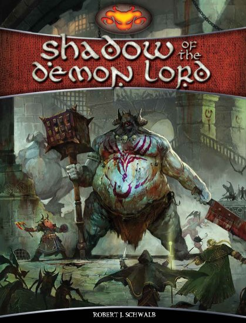

### PeteRPG - Szerepjátékos ismertetők

# Shadow of the Demon Lord RPG

***Írta: Petrus; eredetileg megjelent: 2016. július 13., [LFG](http://lfg.hu/76188/)***

Poszt-apokaliptikus világokból akad már elég a szerepjátékos palettán, fantasy-ből pláne Amazonaszt lehetne rekeszteni, sőt, poszt-apok fantasy is van már szép számmal, mégis viszonylag kevés játék foglalkozik a világégést megelőző rövid időszakkal. Talán, mert nehéz összehozni az elkerülhetetlenül bekövetkező pusztulást és a szerepjátékok általános heroizáló karakterképét. *"Miért harcoljak egy olyan világért, ami menthetetlenül el fog pusztulni?"*, kérdezheti sok játékos, és a karaktereik is ennek megfelelően unott alakok lesznek, akik megpróbálják a lehető leghatékonyabban kihasználni a hátralévő időt, ami gyakran általános harácsolásba és a játékrendszernek az átlagemberek felett nyújtotta hatalmával visszaélve akaratlanul is egyfajta antiheroikus, kínosan vicces hedonizmusába torkollik. Mégis, időnként akad egy-két olyan játék, ami képes megfelelően kezelni ezt a problémát és bár nem bánik kesztyűs kézzel a karakterekkel, van egyfajta hangulata, ami megfogja a játékosok jelentős részét és az elkerülhetetlen végzettel is szembeállítják karaktereiket. Ezt általában úgy érik el, hogy a szokványos klisékhez bátran hozzányúlnak és nem félnek nyersebb, erőszakosabb vonásokkal felruházni azokat, miközben a világban nem csak a puszta nihil, hanem a remény pislákoló csillaga és a hősiesség értelme is fennmarad valamelyest. Egyik legjobb példa erre a máig népszerű és több kiadást megélt *Warhammer Fantasy* (és a *40K* is valamilyen formában), illetve az alább tárgyalandó *Shadow of the Demon Lord* (továbbiakban SotDL) is - és ahogy látni fogjuk, a két játék közötti hasonlóság nem véletlen.

*Robert J. Schwalb* neve ismerősen csenghet az idősebb szerepjátékos generáció fülében. Elég sok D&amp;D-s és Warhammeres munkán látni a nevét a kiemelt írók között, de a Green Ronin-nál eltöltött idejéről is több kiadvány árulkodik. Például ő írta az *A Song of Fire and Ice* szerepjátékot és a *Black Company* kiegészítőt, valamint pár évvel később a WotC-nél aktív részese volt a 4. és 5. kiadású D&amp;D alapkönyveknek (ennek nyomai a SotDL kialakításán is látszanak), és jóideig vezetett a *Dragon*-ban egy önálló rovatot. Később bedolgozott Monte Cook mellé a *Numenera* világ bővítésébe, végül ő is szintén egy szerényen a saját neve alatt futó kiadót alapított. Első játéka 2015 elején futott a Kickstarteren igen szép eredménnyel és a Démonúr árnyékában megbújó kis világa azóta is szépen gyarapodik az új kiegészítésekkel. Munkáiról általában tudni kell, hogy kedveli a sötét és nyers, ugyanakkor kissé morbid humorral megtűzdelt helyzeteket, és nagy rajongója a *Warhammer Fantasy*-nek, amelynek hatása a SotDL-on is erősen tetten érhető. Több könyve is saját jogán, vagy megosztva ENnies nyertes, vagy helyezett volt.

Lássuk hát, mit is kell tudni általánosságban erről a szerepjátékról, a világról, és utána belemegyünk a részletekbe is. Szokás szerint mutatok majd példákat és pár karakter is található a leírás végén, kezdők és magas szintűek egyaránt.

 

Előbb azonban vegyük a kezünkbe a könyvet.

**Külsőleg** keményborítós, 270 oldal körüli, szép darab, különösen a címlap kellően bizalomgerjesztő. És ne felejtsem el megemlíteni a pentagrammás oldalszám grafikákat sem... A lapjai szokásosan fényezettek, a ragasztás stabil, nem tűnik úgy, hogy hamar szétesne. Az oldalak általánosan szépek, egyszerű tervezésűek, nincsenek túlzsúfolva, az olvasásuk kényelmes, a betűtípus is normális, olvasható. Az általános világosszürkés-füstös háttér nem zavar be, de néhol a szövegdobozok sárgásabb, égett-foltos pergamen-hatású hátterének sötét foltjai belelógnak a betűkbe. Nem olvashatatlanok, csak egy-két helyen zavaró. Az illusztrációk elég jók, hangulatosak, a nevek alapján feltörekvő, de tehetséges művészek munkái, mint ahogy az KS projekteknél szokásos.

A szövegezés általánosan definitív-jellegű, érthető, nincs túlcicomázva, a szabályokat több helyen példák is bemutatják.

A játékhoz csak d20-ra és néhány (3-4 elég) d6-ra van szükség, más speciális követelménye nincs. Külön vásárolhatók már pl. tradíciókra lebontott varázslat kártyák és egyéb kiegészítők, de ezekre semmi szükség nincs.

 

A Démonúr sokféle néven ismert. A legtöbben átkozzák, de akadnak olyan elvetemültek is (nem is kevesen), akik az eljövetelére várnak, hogy jó hívőként részesüljenek a kegyelmében. Mindenesetre az biztos, hogy közeledik, hiszen a valóság szövetei szakadoznak, pusztításra vágyó lények és követőik árasztják el a világot, és általánosan mindenki érzi, hogy kezd a feje tetejére állni minden.

Az emberiség leghatalmasabb birodalma csak nemrég omlott össze a kitenyésztett ork rabszolgák lázadása nyomán, csodás palotáiban most egy barbár, félvad király és követői laknak, a grófok, bárók, hercegek egy része meg behódolt neki és titokban egymás ellen intrikálnak. Az elfek és más tündenépek a Tündérkirálynő szőtte dimenzióba húzódtak vissza és gondot fordítanak arra, hogy senkinek se jusson eszébe követni őket: nem csak az erdőket védik és megölik a bemerészkedőket, hanem a határvidékekeket is járják és tesznek róla, hogy a bölcsők, gyermekágyak felett elmondott, róluk szóló mesék ne bájos, vidám történetek legyenek. A keleti parti városállamok a birodalom igájától megszabadulva különféle tevékenységekre specializálódtak és élénk kereskedelmet folytatnak a kalózok jelenléte ellenére is, de szinte mind fejjel rohannak a dekadens dőzsölés őrületébe. A városszéli nyomortanyákon és a bűzhödt csatornákban a királynő megátkozta tündérek, a goblinok nyüzsögnek, és megtűrtségüket csak azzal érdemelték ki, hogy elvégzik a legalantasabb, legmocskosabb munkákat is. Nyugaton a síkságokat a nomád kentaurok uralják, akik féltékenyen őrzik territóriumaikat. Délen egy tragikus sorsú királynő uralkodik élőholt szolgái felett. Északon, a hegyek közötti sivár vidékekre visszahúzódott, a legyőzött és területeiket elvesztett őslakosok várnak a bosszú megfelelő pillanatára.

A démonúr árnyéka rávetül a halandók világára és nyugtalanságot, szenvedést, és halált terjeszt szerteszét a kontinensen. Jósok és prédikátorok kiáltják a világba rettegve a látomásaikat. A rend bástyái repedeznek és a káosz tör utat mindenfelé.

De nincs minden még veszve, pislákol a remény lángja. A legkülönbözőbb helyekről érkező férfiak és nők bukkannak fel a szükség órájában, hogy megmentsék a világukat, vagy legalább elhalasszák annak megsemmisülését. Ők lesznek a játékos karakterek.

 

Amint látható, a játék elég borongós és komor hangulatú, nagyban hasonlít a Warhammer világ ismertetőjegyeire, de semmiképpen sem tűnik egyenes másolatnak, vannak eltérések is jócskán, bár a "grimdark fantasy" tipikus jegyeit ugyanúgy hozza (kevés clockpunk színezékkel).

A világ és a rendszer a "zero-to-hero" módszert követi, azaz a kezdő karakterek nagyon gyengék és esendők, csak fokozatosan ismerik fel a bennük rejtőző képességeket és tapasztalatukra támaszkodva az egyre veszélyesebb ellenfelek ellen fordulhatnak. Ez bár hasonlíthat a D&amp;D (vagy bizonyos OSR rendszerek) skálázódására, mégis másféle módon kell elképzelni (alább kitérek rá), és a WFRP karrier-rendszere is ismerősen visszaköszön. A játék - egyszerű és gyors rendszere ellenére - morális kérdéseket is feszeget és belekóstol az őrület és a beszennyeződés, a korrupció témájába is. A D&amp;D és WFRP örökség azért sok helyen áttűnik a szabályok közt, ezekre majd felhívom a figyelmet, így könnyebb lesz mihez hasonlítani. A rendszer egyébként nagymértékben különválasztható a könyvhöz tartozó világleírástól és általános dark horror fantasy-ként is teljesen használható (különösen Old World-ön).

A kezdő karakterek tényleg kezdők, alig különböznek egymástól és egyetlen csata is komoly veszteségekkel, akár halállal is járhat a számukra, ezért a **karakteralkotás** nem kifejezetten pepecselős és igen nagy benne a random faktor, ami azt is jelenti, hogy a kész, kidobott karakterrel azért van még munka, hogy beilleszthető legyen a történetbe. Opcionális választás, vagy esetleg pontosztós módszer az alapkönyvben nincs, a mesélővel lehet egyeztetni, ha valami nem tetszik.

Először mindenki származást (*ancestry*) választ, ezek tulajdonképpen a világon létező, játszható fajok, néhány egzotikus darabbal megspékelve. Az alapkönyvben összesen hat van belőlük, de a kiegészítők ezt megtoldották még néhánnyal:

- Az emberek a legszámosabbak és mindenfelé megtalálhatók a világon, bármilyen elképzelésre alkalmasak. Előnyük elsősorban a többféle választható foglalkozásban merül ki.

- A cseregyerekek (*changeling*) másoktól lopnak identitást, hogy elrejtsék rémisztő kinézetüket. Kitűnő zsiványok és mágiahasználók lehetnek belőlük. A világbeli háttér szerint a tündék sárból, levelekből és ágakból fabrikálnak csecsemőforma alakot, amelyre illúziót mondanak, hogy pár hétig ne tűnjön fel a csere. Ezek többsége a mágia elmúltával szétomlik, de van néhány, ami képes kifejlődni, belőlük lesznek ezek a karakterek.

- Az óraművek (*clockwork*) régmúlt idők technológiája alapján készülnek még ma is. Lelkük az Alvilágból, a feledésre ítélt lelkek közül származik, ami néha identitási problémákat okoz, valamint a testükön, számukra nem elérhető helyen lévő kulcs kezelése is problémás (és morbid módon vicces) helyzeteket eredményezhet. Számos alakban és feladatra készülhetnek, akár még varázsolni is korlátozás nélkül megtanulhatnak.

- A törpéket ősi istenek átkozták meg, hogy a földet túrják a benne rejtőző kincsek után kutatva, tipikusan jó harcosok, vagy papok lehetnek belőlük.

- A goblinokat a tündelények birodalmából űzték el és testük is ekkor csúfult el, így most az emberi települések szélén a mocsokban és csatornákban laknak. Talán ősi származásuk miatt nem meglepő, hogy jó varázslók lehetnek belőlük, de zsiványoknak sem utolsók.

- Végül pedig vannak az orkok, akiket a birodalom tenyésztett ki a rabszolga hadseregébe, mert kellően brutálisak és vadak voltak. Meghódították velük a kontinenst, és pont ez lett a vesztük is, amikor fellázadtak saját gazdáik ellen. Kitűnő harcosok és zsiványok lehetnek.

A további kiegészítőkben megtalálhatók még a tündék (akik a kliséktől eltérően itt általában elég rasszisták és megkeseredettek, a külvilág is jobban fél tőlük), a félszerzetek (akik nem szőrös lábúak és haspókok, hanem jellemzően farmerek), a különféle alakváltók (ők eltérnek a cseregyerekektől, vérfarkasokra, ilyesmikre kell gondolni), a kentaurok (pusztai nomád népek), a gnómok (föld-elementál leszármazottak), de még a ghoulok is. És biztos kimaradt még néhány.

Minden származás meghatároz valamilyen általános leírást és alap képességeket, illetve megadja a négy alaptulajdonság (*attribute*) kezdőértékét. Fontos megjegyezni, hogy ezek kezdetben fix értékek, módosításukra csak nagyon kis (1-2 pontnyi) mértékben van lehetőség. A D&amp;D-hez hasonlóan minden stat-ból származik egy módosító is, ez egyszerűen stat-10 értékű (tehát nincs felezés sehol). Stat-okat csak bizonyos szintlépéskor lehet növelni, erről majd később.

A rendszer négy **alaptulajdonság**ot használ: *Strength*, *Agility*, *Intellect* és *Will*. Ezek elnevezései szerintem elég egyértelműek, az általuk lefedett terület követi a szokásos sémák többségét. Van még pár számított és fix kezdőértékű karakterisztika, ezekről majd a rendszer ismertetésénél szólok.

Minden karakter kap még néhány képességet (*trait*), ami a származásából jön, plusz általában két foglalkozást, és egy-két nyelvismeretet, illetve dobnia kell a származásától függő táblázatokon. Ezek igen részletesek, csak a származásra jellemzők, és hangulatos háttereket, furcsaságokat, személyiségjegyeket eredményezhetnek. A listák egy része úgy van szerkesztve, hogy 3d6-tal kelljen dobni d20 helyett, erősítve az átlagos jellemzők előfordulásának valószínűségét, ne legyen olyan nagy szórás az egy származásba tartozók között.

A kezdő karakterek számára dobni kell még jellemzően két foglalkozást (*profession*) is. Ezek egy fő tábláról és azon belül hat másik altábláról kerülhetnek ki igen széles kört felölelve. Minden foglalkozás egy-két szavas és kellően rövid, lényegretörő, hogy sok minden beleférjen értelmezéstől függően. Szintjeik nincsenek, ezek tkp. úgy tekinthetők, mint a játékban nem létező képzettségek egy-egy összefoglaló csoportja. Ha valaki ért egy bizonyos foglalkozáshoz, az könnyítésekkel járhat a kapcsolatos tesztjeire. A leírások, a megszerzésük eredete már a játékosra van bízva, hogyan illik a háttértörténetbe. A kapott foglalkozások bizonyos szabályok szerint kicserélhetők új nyelvismeretekre, vagy a meglévők írás/olvasás változatára is.

A játékban van pénz, a szokásos arany - ezüst - réz felosztásban, 10-es váltásokkal, de az aranypénzek ritkák, csak az igazán gazdagoknál találhatók meg (kezdő karakternek sincs), a szegényebbek még ezüstérméket is ritkán látnak. A kezdeti anyagi lehetőségeket és felszerelést szintén egy táblázatos dobás dönti el, ami szintén 3d6, hogy jobban közelítsen a nagy átlaghoz. A gazdag karakterek drága ruhát, szolgát, testőrt, felszerszámozott lovakat is kaphatnak, a legszegényebbek pár garassal, rongyos ruházattal és egy bunkósbottal, vagy parittyával kell beérjék. A rendszerben halványan megjelenik az életstílus (*lifestyle*) is, de nem olyan hangsúlyos, mint mondjuk Shadowrunban.

Végül még egy különös tárgyat, emléket (*interesting thing*) kell kidobni, amit a karakter valami szentimentális okból magánál tart. Az utóbbi években terjedt el ez a szerepjátékokban, itt is van egy ilyen. Azért érdekes, jópofa dolgokat is lehet kapni innen, amelyek elég hasznosak is lehetnek, nem csak díszek, különösebb játéktechnikai hatás nélkül.

A szerepjátékot a más, korábbi játékokból is ismerős általános morális és pszichológiai kérdések megválaszolása próbálja előtérbe emelni. Itt is van egy táblázat, ahol különféle pozitív és negatív személyiségjegyeket lehet dobni, de ennek használata kivételesen nem kötelező, csak ötletadóként szolgál. A példakarakterek esetén az ajánlott számszor dobtam és azokat írtam fel (3 pozitív, 1 negatív).

A kezdő karakterek számára más technikai teendő nincs is. Nincsenek megszabott osztályok, foglalkozások, vagy ilyesmik, a 0. szinten gyakorlatilag még alig látszanak mechanikai különbségek a karakterek között, még varázsolni sem tudnak. Az első kaland célja, hogy a játékosok megismerkedjenek a szabályokkal és a világgal, valamint hogy kialakuljon közöttük és a karaktereik között is valamiféle csoport-dinamika. Ezen a szinten a halandóság még igen nagy (ahogy olvastam fórumokon, a legelső kaland, a *Slavers' Lash* a legtöbb csapatban elfogyasztott 1-2 karaktert) és bár később a karakterek igen széleskörű ismeretekre tehetnek szert és változatos specializációkban merülhetnek el, a halandóság mindvégig ott fog lebegni a fejük felett. Egy új karakter megalkotása emiatt gyors és nagyban random, és a magasabb szintekre léptetés is gyorsan megy.

Ha már itt tartunk, térjünk is ki a **szintrendszer** sajátosságaira. Bár én általában nem szeretem az ilyesfajta megoldásokat, a SotDL szintjei azért nem másolatai az elődöknek és a szint is csak egy egyfajta mérőszámként, ismerős kifejezésként szolgál. A játékban ugyanis nincs XP, semmi fejlesztési pont, vagy bármi hasonló. A csapat akkor lép szintet, amikor a mesélő jónak látja, ez általában fontos mérföldkövek, komoly teljesítmények, megoldott ügyek után történik. Elméletileg nincs karakterszint sem, csak csapat szint, ami egyszerre hat minden karakterre. Egyedül annyi fix, hogy a legelső kaland teljesítése után a szint nő egyet és mindenki újoncból kezdő lesz.

Bizonyos szinteknek elnevezéseik is vannak, ezek jelölik az átlagos karakter felkészültséget és tapasztalatot, illetve ezek a jelölései a kiadott kalandok javasolt csapat-szintjének is. A 0. szint az újonc (*starter*), az 1. szint a kezdő (*novice*), a 3. a szakértő (*expert*) és a 7. szint a mester (*master*). A 10. a legfelső szint jelenleg. A 11-20. szintű játékról a később megjelenő *Legends* kiegészítő fog majd szólni.

A novice, az expert és a master lehetővé teszi, hogy a karakterek válasszanak egyet-egyet a megfelelő utakból (*path*). A novice szinten ebből csak négy van, a klasszikus négy osztály (*magician*, *priest*, *rogue*, *warrior*), az expert szinten ehhez hozzájön még 16, végül a master szinten újabb 64 (!). Igen, akik ismerik a WFRP-t, már kapisgálják: ezek az utak hasonlóak a karrierekhez, annyi fontos különbséggel, hogy nem kell XP-t rájuk költeni és megvásárolni a képességeiket. Bizonyos képességek azonnal érvényre jutnak, mások választhatók, megint mások pedig bizonyos szintek elérésekor válnak aktívvá. Sőt, az utaknak előfeltételeik sincsenek, simán lehet, hogy egy harcos (*warrior*) az expert-re érve belekóstol a mágiába (pl. *artificer*-t választ), de a master szinten inkább a zsiványkodás tetszik meg neki és *infiltrator* lesz belőle.

Ebben a rendszerben viszonylag nehéz előre megtervezni a lépéseket és szintekre lebontani az optimális stratégiát, mivel a lehetőségek száma a kalandoktól is függően folyamatosan változik és igazából nincs rossz választás, nincs "elrontott" karakter. A magasabb szintű játék messze nem válik olyan bonyolulttá, mint mondjuk a D&amp;D, nem kezd exponenciálisan növekedni a potenciális és használható módosítók és karakter képességek száma, mégis minden karakter más és más lesz.

Bizonyos szabályokkal az előző szintről is lehet választani, ha nem tetszik az expert, vagy a master kínálat. Nincs veszteség, minden path a 10 szintre egyenlően elosztva három-három új opciót fog biztosítani (pl. a 8. szinten jár az utolsó novice path képesség). Még a származás is ad egyet később.

Látható az is, hogy ez alapján a magas szintről kiesett karakter pótlása is gyorsan megy, főleg, ha már tudja a játékos, hogy milyen utakat fog választani.

Ezek az út választások azért nem csak légből kapottak és a képességekért mennek, a könyv igyekszik hozzákötni őket a történethez és az elkövetkező eseményekhez. A novice szinten például a csapat eldönti, hogy mi forrasztotta össze őket (pl. közös ellenség, vagy azonos szülőhely), az expert szint a karakterek egyéniségére fókuszál a &quot;miért választom ezt az utat?&quot; kérdés megválaszolásával, a master szint pedig általában kijelöl egy küldetést, egy végcélt a karakternek. Ezek mind visszahatással vannak a történetre és a mesélőnek illene is figyelembe venni a játékosok kéréseit, igényeit, hiszen a választásaik tükrözik azt, mit szeretnének a karakterrel véghezvinni.

 

Térjünk át most már a **játékrendszer** alapjaira is.

A rendszerben minden tesztdobás d20-szal történik, amihez hozzájön a megfelelő alap stat módosítója, valamint könnyítésektől és nehezítésektől függően néhány d6 (plusz, mínusz előjellel), és esetleg egyéb módosítók. Ha a végeredmény eléri, vagy meghaladja a célszámot, a teszt sikeres, ezen túl a manapság divatos módon további bontás sikerfaktorokra nincs.

A célszám általában egy karakterisztika, vagy tulajdonság (jellemzően az ellenfélé), vagy általános tesztnél simán 10.

A könnyítések (*boon*) és nehezítések (*bane*) különféle képességekből, foglalkozásokból, környezeti jellemzőkből jönnek és párban kiütik egymást. Ami marad, annyi d6-ot kell dobni és ezek közül a legnagyobb értékűt hozzáadni, vagy elvenni a végeredményből.

A fix számos módosítók (*bonus*, *penalty*) ritkák, nincsenek ilyenekkel teletűzdelt szituációs módosítós táblázatok.

A szerepjátékra, ügyes ötletekre, látványos cselekedetekre szerencse (*fortune*) kapható. Ez nem számszerű érték, vagy van, vagy nincs. Amíg van, egyszer beváltható valamilyen extrára, pl. elrontott tesztdobás sikeressé tételére.

A **karakterisztikák** (*characteristics*) között a négy legfontosabb a négy alaptulajdonsággal áll párban: a *Health* párja a *Strength*, a *Defense* az *Agility*-hez tartozik, a *Perception* az *Intellect* párja, az *Insanity* pedig a *Will*-é. Az, hogy &quot;párban&quot; áll, azt jelenti, hogy a kezdőértékük az alap stat-tól függ (általában ugyanannyi, de származástól, szinttől is függ), összemért próbáknál pedig jellemzően az ellenfél megfelelő karakterisztikája, mint célszám ellen kell dobni a saját stat módosítójával.

Az életerő (*Health*) a WFRP *Wound*-jaihoz hasonlóan működik: nincs belőle sok és az is hamar elfogyhat egy-egy erőteljesebb találat után. (Pontosabban egy *Damage* érték növekszik, a *Health* pedig ennek a határértéke.) A *Health*-et más effektek is befolyásolhatják, pl. mérgek, vagy betegségek, amelyek sebezhetőbbé teszik a karaktert.

A védekezés (*Defense*) a karakter természetes képessége arra, hogy megvédje magát. A páncélok alapvetően nem növelik, hanem másféle fix értékre állítják be (hasonlóan bizonyos D&amp;D verziókhoz). Legmagasabb értéke bármilyen esetben is csak 25 lehet.

Az észlelés (*Perception*) a környezeti dolgok észrevétele és általában a karakter ellen folytatott rejtőzés dobások célszáma. Hasonlóan használandó, mint a tulajdonságok, van módosítója is.

Az őrület (*Insanity*) pedig a karakterrel megtapasztalt rémisztő, vérfagyasztó dolgok mérőszáma. Kezdetben nulla (néhány háttérrel lehet több is) és a *Will* mutatja, meddig bírja a karakter ép elmével, mielőtt megőrülne. Ilyenkor valami random dolog történik a karakterrel (szép effektek vannak itt, emlékeztet a *Dark Heresy* hasonló dolgaira) és ha még él, miután ez elmúlik, valamennyi random értékkel csökken a pontok száma. Amúgy az effektek nem mindegyike hátrányos, a legmagasabb értékűek kifejezetten előnyösek, pluszokat adnak.

A kapcsolódó kisebb szabályokra most nem térnék ki, a könyv szépen sorra veszi ezeket.

Fontos megemlíteni még azonban a szennyeződés (*Corruption*) karakterisztikát. Hasonló ez is, mint a Dark Heresy ugyanilyen nevű mechanikája. A démonúr árnyéka mindenkire rávetül és csak kevesen képesek megőrizni a lelkük tisztaságát. A tolvajok, gyilkosok, a tiltott és sötét praktikák követői mind beszennyezik magukat és bizony a karakterek között is előfordulhat majd, hogy akarattal, vagy véletlenül, de elkövetnek valami bűnt. A Corruption pontok meg szépen gyűlnek és eleinte különféle random hatásokat okoznak (pl. nem látszik a képe a tükörben, vagy lerohad az orra), később pedig akár a lelkét is mindörökre bebörtönözhetik a Pokolban (*Hell*).

A lelkek egyébként viszonylag fontos szerepet töltenek be a világon. Egy halott lelke az Alvilágba (*Underworld*) kerül (aki szennyezett, azé a Pokolba), de bizonyos körülmények és megfelelő hatalom birtokában visszahívhatók. Lehetséges egy karakter feltámasztása, azaz a lelkének visszahívása a testébe (ez azonban őrülettel is jár), máskor viszont pont nem cél egy olyan lélek visszahívása, amely még tudatánál van. Az Alvilágban a lelkek lassan elvesztik az emlékeiket és az öntudatukat, így kitűnően használhatók pl. az óraművekbe börtönzéshez és egyéb, jellemzően sötét és gonosz praktikákhoz.

A **harcrendszer** a fentieknek megfelelően egyszerű, lényegében már kitértem rá. Grid nincs (bár használható, a távolságokat lehet mérni), a távolságokat általánosan négy leíró (*short*, *medium*, *long*, *extreme*) jellemzi, plusz az elérés (*reach*) és a látótáv (*sight*).

A harci körök szokásos 10 másodpercesek, kezdeményezés nincs. A sorrendet elsősorban az dönti el, hogy valaki gyorsan, de valami rövidet akar cselekedni (*fast turn*), vagy inkább megfontoltabban (*slow turn*). Előbbi esetben végre lehet hajtani egy akciót, vagy egy mozgást, utóbbiban mindkettőt. Akik gyorsak, előbb jönnek, közöttük tetszőleges módszerrel eldönthető a sorrend, a könyv ad pár tippet (asztal körül, mindig más kezd, "popcorn", stb.), majd utánuk következnek a lassabbak, hasonló módon.

A cselekvések a szokásos és ismert elnevezéseket használják (főként a WFRP2-re hasonlítanak). Ezek nem kötelezően választandó akció-típusok, csak a legjellemzőbbek, és így ismerősek lehetnek más rendszerekből érkezők számára is. Lehet ún. feltételes (*triggered*) akciókat is választani.

A támadás, a harc viszont szerves része a világnak, így a rendszer is jobban foglalkozik vele. Pl. egy átlagos közelharci támadásra ötféle opció választható (alapesetben ez nem kötelező), mint a *driving*, *guarded*, *lunging*, *shifting*, és *unbalancing*, távolságira meg a *called*, a *distant*, és a *staggering*. Ezek különféle nehezítéseket adnak a dobásra, de hasznos mellékhatásaik is vannak az ellenfélre nézve. Vannak olyan extra manőverek is, mint a lefegyverzés, a csel, a megzavarás, vagy a fellökés is, ezek gyak. az alap stat-okból és az ellenfél karakterisztikáiból levezethető opciók (nem, pl. a bírkózás is csak két bekezdés).

A további apróságokra nem térnék ki, nem valami komplikált monstrum ez a rendszer, hogy kis gyakorlattal ne lehessen kitalálni, mi miből következik. Mivel szorosan vett képzettségek nincsenek, fontosak a foglalkozások és az utak, mivel ezekkel lehet tovább specializálni, részletezni a karaktert, és ezek az ismeretek vannak kihatással a tesztekre is.

 

A **felszerelések** kapcsán pár dologra fentebb már kitértem, itt most csak néhány egyéb jellemzőről írnék.

Alapvetően a rendszer feltételezi, hogy a karakterek időnként javítgatják a felszerelésüket, megvarrják az elszakadt ruhákat, kijavíttatják a páncélokat, fegyvereket, ezért általánosan az ún. itemizáció nincs jelen a rendszerben. Nem cél a minél jobb felszerelések harácsolása és felhalmozása.

Említettem már az életstílusokat is, a rendszerben ez is létezik valamilyen szinten. A kezdeti kidobott gazdagsági szint tulajonképpen ennek a kezdő életstílusnak is a szintje. Amíg az első kaland tart, ez van érvényben, majd a kaland végén újat kell venni. Nincs hónapokra lebontott követés, mint pl. Shadowrunban, a feltételek itt kalandról-kalandra változnak. Nem kötelező mindig ugyanazt az életstílust választani, de kötelező venni valamit. Egyedül a legszegényebb állapot van ingyen, de ennek is meg van az ára, ami elvesztett tárgyakban, vagy kapott betegségekben jelentkezik.

A páncélok többsége (a legkönnyebbek kivételével) fix Defense értékeket ad és a viselésüknek vannak kisebb-nagyobb hátrányai, a páncél típusától függően. A fegyverek általánosan ismerősek lehetnek más fantasy játékokból. Hasonlóan lehetnek bizonyos egyéb jellemzőik, de nagyon speciális anyagok nincsenek, az ezüstözés az egyetlen, ami számíthat (bizonyos lények érzékenyek rá).

Az egyéb tárgyak, eszközök szintén ismerősek lehetnek, ezekre nem térek ki külön. Van lehetőség szolgákat is bérelni különféle hozzáértési szinttel, akiknek heti bére van.

A varázsitalokat nem csak hagyományos, üvegcse formában, hanem injekciókban is lehet kapni, ami persze drágább (bár alapból sem valami olcsók), de előnyük, hogy azonnal hatnak, nem csak a megivás után, a kör végén. A varázstekercsek itt a varázsigék (*incantation*). Készíteni csak képzett mágiahasználó tud ilyet, de használni elvileg bárki (aki nem képzett és a Power értéke is alacsony, annak persze nehezebb, de nem reménytelen).

 

Ha már itt tartunk, térjünk is át a **mágiarendszer**re.

A mágia alapesetben láthatatlan, kaotikus, kiszámíthatatlan, de ritkán van hatással a fizikai valóságra. Csak azok, akik képzettek az erők irányításában, tudják megidézni és használni az erejét. Magának a mágiának is többféle forrása lehet, pl. ugyanolyannak számít egy istenbe vetett hit, vagy rigorózus tanulással elsajátított képesség, mint egy ősi ereklye biztosította hatalom. Egyébként ezen a világon az istenek, ha léteznek, teljesen indifferensek a halandókkal szemben, a mágiát a beléjük vetett hit mozdítja meg, nem valamiféle felsőbb hatalom ajándékozza. Még az olyan természetfeletti, de létező hatalmak is, mint a Tündekirálynő, vagy a Démonúr, sem önmagukban adják a mágiát, hanem a követőik hite. Technikailag tehát minden mágiaforma ugyanazon alapokon nyugszik.

A varázslatok 10 szintre oszlanak, nagyon hasonlóan a D&amp;D-hez, ugyanakkor az már WFRP-szerű (és kicsit MERP-szerű) örökség, ahogy csoportosulnak. Nem D&amp;D-szerű iskolák vannak, hanem ún. tradíciók (*tradition*), amelyek egyfajta emelkedő erőszintű listákat adnak. Az alapkönyvben 30 van belőlük és egyenlően oszlanak el használati szempontból az Intellect és a Will között. Amikor valaki egy adott tradícióba tartozó mágiát használna, a megfelelő tulajdonsággal kell dobnia tesztet.

Nem minden mágiahasználó ért az össze tradícióhoz automatikusan, ezeket előbb fel kell fedezni (*discover*). Ennek számos módja lehet, de általában a klasszikus sémák szerint történik, azaz valami felfedezett ősi könyv elolvasása után, vagy egy mesternél való tanulással történhet. Egy tradíció felfedezésével a karakter megtanul egy 0. szintű varázslatot belőle, és később már nem kell újra felfedeznie a további varázslatok eléréséhez.

A tradíciók egy kis része ún. sötét tradíció (*dark magic*). Ezek jellemzően tiltottak, használatuk, de gyakran már csak a megtanulásuk is automatikusan Corruption-t okoz. A sötét erőknek persze megvan a maguk hatalma is, ami csábító lehet a gyengébbek számára. (A karakterek számára sem tiltott az elsajátításuk, ha tisztában vannak a következményekkel.)

A varázslás menete érdekes keveréke a D&amp;D-s wizard és sorcerer mágiatípusoknak. Általában szavakat kell kimondani és egy, korábban a karakterhez kötött kelléket (*implement*) prezentálni (mágusbot, gömb, szent szimbólum, stb.), majd elhasználni egy akciót és dobni egy megfelelő tesztet. Az ismert varázslatokat nem lehet összevissza castolni, de nem is kell memorizálni azokat. A karakter Power értéke mutatja meg egy táblázaton, hogy az egyes szintre tartozó varázslatokat külön-külön hányszor tudja elsütni, mielőtt kimerülne (az alacsonyabb szintűeket többször). Ez ismert varázslatonként érvényes, nem varázslat szintenként, azaz minden, korábban megtanult varázslatnak külön-külön saját X darab elvarázslása (*castings*) van. Ennek nincs köze a napokhoz, időszakokhoz, gyakorlatilag bármikor rendelkezésre állnak. Az ellőtt casting-okat elegendő pihenés után, percenkénti meditációval lehet "visszatölteni" az egyes varázslatokra.

Maguk a varázslatok jellemzően két fő típusba (*attack*, *utility*) tartoznak és számos egyéb jellemzőjük lehet még, ezek inkább a D&amp;D-ből lehetnek ismerősek. Néhány varázslatnak extra effektje is van, ha a teszt 20, vagy magasabb értékű lett. Az alapkönyvben minden tradícióhoz 11-11 spell tartozik a 0-5. szintekről (mivel az alapkönyvvel nem nagyon lehet 5-ös Power-nél nagyobbat összehozni, az pedig az 5. szintű varázslatokra elég). A leírások rövidek, jellemzően csak pár mondatosak, a fejléc információk sok mindent tartalmaznak már.

 

Magával a rendszerrel így végeztünk is, nagyjából a könyv első felét teszi ki mindez. Láthatóan nem egy bonyolult valamiről van szó és igazából elég jól használható általános rendszerként is. Tervezetten lesz is belőle valami OGL-szerű, ingyenes változat.

 

A **világ** az egy *Urth* nevű bolygó, annak is nyolc kisebb-nagyobb kontinense közül az egyik nagyobb. A bolygónak egy holdja van, a Tarterus, ami egyes vélemények szerint Urth lakott, sötét testvére, csak a rajta gomolygó, villámfényes felhők eltakarják a felszínét.

A világot négy nagy óceán osztja fel nyolc részre és a játék ennek egyik kiemelt, nagyobb kontinensén zajlik, amelynek *Rúl* a neve. A leírások nagy része szándékosan elnagyolt és hiányos, hogy a mesélőnek elegendő szabadságot adjon a hely felhasználására.

Az időszámítás hasonlít a földihez, nagyban egyszerüsítve: egy nap 24 óra, 336 nap egy év, egy év 12 hónap és egy hónapban 4 hétnapos hét van. A hónapok, hetek és a napok egyszerűen számokkal vannak jelezve (pl. a négy-kettő második nap az a negyedik hónap második hetének második napja; angol eredetiben ez jobban hangzik).

Általánosan közismert, hogy az istenek, ha léteznek, távoli lények és keveset törődnek a halandók dolgaival, mármint közvetlenül nem, de megbízott szolgáik felbukkanhatnak a világon. Ismert az is, hogy a fizikai valóságon túl léteznek még más világok (mint az Alvilág, a Pokol, vagy Alfheim, a tündék birodalma), de a legtöbb halandó nem juthat el ezekbe. Teljesen elfogadott az is, hogy a mágia létezik és áthatja az egész világot. Korábban már utaltam rá, de ebben a részben megerősítést nyer, hogy a lelkek körforgása, a lélekvándorlás is létező dolog. Ha valaki meghal, a lelke az Alvilágba kerül és addig marad ott, míg minden emléke ki nem törlődik, aztán újból felemelkedik, hogy egy új testben kapjon helyet. Aki beszennyeződött, az a Pokolba kerül, ahol eltorzult tündék, az ördögök és más pokolbeli teremtmények kínozzák meg és habzsolják újra és újra sötét emlékeit, míg meg nem tisztul. Ennek ideje akár az örökkévalóságig is tarthat.

A tudományok terén ismert a puskapor, a gőzgép és az óraművek technológiája. Léteznek már pisztolyok és puskák is. Általánosan egyfajta kezdő steampunk világot kell elképzelni, ahol ugyan még nincsenek vasutak, vagy nagy gőzgépek, de az óraművek széles körben használva vannak mindenféle munkára és a Kilenc Város felett már megjelentek az első léghajók és zeppelinek is.

A lakott területeken kívüli vidékek elég veszélyesek, különféle szörnyek veszélyeztetik a civilizált népeket, és ha egy helyről ki is írtják őket, idővel mindig visszaszivárognak és újból felbukkannak, hogy káoszt és pusztulást okozzanak.

A világ korábban leghatalmasabb birodalma nemrég összeomlott és a teljes megsemmisülés szélén táncol. Az Alabástrom Trónon most egy ork király ül, aki saját kezével fojtotta meg a korona előző tulajdonosát (legalább is ilyen hírek terjednek). A Birodalom rabszolgái mind felszabadultak, korábbi uraik legnagyobb rémületére, és a császári fővárosból kiinduló, futótűzként terjedő hírek máshol is elégedetlenségeket, lázadásokat szülnek. A központi hatalom megszűnése csak kedvez a vad szörnyek és káoszbestiák (igen, itt is vannak) szabad ámokfutásának, de még a Démonúr követői, a sötét szekták is felbátorodtak és több helyen nyíltan hírdetik tevékenységüket. A vidéki, védtelenebb tanyákról és falvakról elmenekülők a városfalak mögött keresnek menedéket, ami túlzsúfoltsághoz és a törvények lazulásához vezet (néhány városban már nincs is központi hatalom, bandák vették át az uralmat). Néhol a kastélyaikba, váraikba zárkóztak a hatalmasságok és az ajtóiknál dörömbölő tömegek süket fülekre találnak náluk.

A Démonúr valahol ott rejtőzik az Ürességben (*Void*), árnyéka rávetül a világra és káoszt terjeszt, amerre csak megérinti az élőket. Mindenki tudja, hogy közeledik és a világ elpusztítására készül, hogy elfogyassza a lelkeket. A valóság szövedékei repedeznek nyomása alatt és kultistái démonokat és más, odakint lapuló, túlvilági szörnyeket szabadítanak a világra, tovább fokozva a rombolást. Egyesek szerint a stabil Birodalomnak az elbukása is csak sietteti az elkerülhetetlent és biztos jele a Démonúr közeledésének.

**Rúl** kontinense északról, a jeges sarkvidékról nyújtózik messze délre, ahol szigetcsoportokká bomlik szét. Még csak pontos helyrajza sem ismert, a rajta fekvő vidékekről csak homályos, utazók és menekültek elbeszéléseiből ismert elnagyolt hírek szólnak. A könyvben lévő térkép is inkább hasonlít egy kifeszített bőrdarabra festékkel felmázolt, koszfoltos rajzra, mint a más szerepjátékokból megismert precízen pontos és aprólékos térképekre.

A kontinensen előforduló helyekről átfogó leírások állnak rendelkezésre, amelyek ezeken belül kiemelnek még egy-két jellegzetes vonást, helyszínt, vagy személyt, ezek részleteitől megkímélnék mindenkit. A játékhoz nincs külön világkönyv sem (még; lehet, nem is lesz), elősegítendő és bátorítandó a mesélők szabad garázdálkodását a területen. Részletesebb leírás inkább csak a kiemeltebb helyszínről, az északon húzódó Északhatárról (*Northern Reach*) van, de ezt is kihagynám.

Ehelyett inkább a **történelem**ről írnék pár sort, mert nagyban kihatással van az egész világ működésére és a mesélői, játékosi fantáziát is jobban beindíthatja (bár annyira egyedinek azért nem mondanám, sok ismerős, innen-onnan átemelt részletet lehet felfedezni benne, ami egyébként nem baj, csak ismerősebb, "ottthonosabb" lesz tőle a világ).

Valaha az egész kontinens (legalábbis jó része) a tündenépek (*faerie*) világa volt, akik harmóniában éltek a környezetükkel. A Nyár Földje (*Lands of Summer*) ege alatt halhatatlan istenségek járták az erdőket és úgy formálták kedvükre a világ képét, ahogy az nekik tetszett. Az emberiség ekkor még primitív nép volt, senki ügyet sem vetett rájuk, a Démonúr pedig nem is látszott még az Üresség határvidékein.

Északon hatalmas erdőségek húzódtak ekkoriban, melynek közepén állt a Nyár Királynője (*Queen of Summer*) palotája. A királynő innen uralkodott a tündérek felett, de kevéssé avatkozott bele a dolgaikba.

Minden békés és nyugodt volt addig, amíg a nyugati hegységekben meg nem jelentek a trollok, a tündérek teljes ellentétjei. Sötét mágiájukkal uralmuk alá hajtották az óriásokat és közönséges állatokat torzítottak gonosz szörnyekké. Miután seregeik megerősödtek, megtámadták a Nyár Földjét, hogy halált és pusztulást hozzanak rájuk. A harcok évtizedekig tartottak döntő győzelem nélkül, míg egyszercsak a tünde Robin herceg meg nem ölte a trollok királyát, bár ő maga is elpusztult a harcban. A királynő, akinek egyetlen igaz szerelme volt a herceg, dühödt gyászában megátkozta a trollokat, hogy soha többé ne láthassák a nap fényét és váljanak kővé, ha mégis megpróbálnak a felszínre jönni. A trollok elmenekültek és elrejtőztek a hegyek között, de a Nyár is véget ért, bekövetkezett az Ősz időszaka és vele együtt az emberek felemelkedése.

Évszázadok teltek el a háborúk után mikor felbukkantak a Nyár Földjén. Eleinte csak vadászok, gyűjtögetők érkeztek, aztán kisebb településeik nőttek ki a földből. A korai emberek egyfajta istenségként tekintettek a tündérekre és a később kialakult Öreghit (*Old Faith*) előzményei is itt, ezekben a találkozásokban gyökereznek. Az első emberek féltek még messzebb merészkedni a sűrű erdőkbe, maradtak a partvidékek közelében, ahol először értek földet, de egyébként békében élt a két nép egymás mellett.

További évszázadok elteltével újabb emberhullámok érkeztek keletről, de ezek már fosztogatni és hódítani érkeztek. Elpusztították az itt talált emberi településeket, láncra vetették népeit és saját földet hasítottak ki maguknak, amely egyre jobban benyomult a tündérek vidékeire.

A királynő, hogy elkerülje az újabb konfliktust, mágiából és álmokból szőtt egy új világot, hogy elmenekítse oda népét. Lassan kiürültek erdeik és elhagyták ezt a földet, hogy békében és nyugodtan élhessenek egy másikban. Nem mindenki gondolta azt azonban, hogy ez így helyes. A királynő saját fia szegült ellen anyjának és másokat is felbuzdított a betolakodók elleni harcra. Őt ezután Árulónak (*Betrayer*) hívták, követőit meg Sötét Népnek (*Dark Ones*), mivel megtörték a tiltásokat és a sötét tradíciók felé fordultak. A háború tüzei újból fellángoltak, de egyik fél sem ért el igazi győzelmet. A betolakodók meghátráltak ugyan, de dél felé fordultak és lefektették a későbbi Birodalom ősi alapjait. A sötét tündérek pedig súlyos veszteségeik után visszahúzódtak az erdők mélyére, de gyűlöletük ugyanúgy megmaradt, lélekben maguk is olyasféle lényekké váltak, mint a trollok.

Sötét idők köszöntöttek be a vidékre. Szörnyek kóboroltak az elhagyatott környékeken, de az emberek is lassan visszaszivárogtak, hogy újabb és újabb területeken vessék meg a lábukat. Vérrel és vassal űzték el a szörnyeket, hogy aztán egymás ellen forduljanak a hatalomért vívott harcokban. Mind be kellett hódoljanak végül a ma már Sivárságnak (*Desolation*) hívott északi határterületről előözönlő, sötét mágiával és szolgálatra kötött démonokkal, elpusztíthatatlan élőholtakkal felvértezett *góg* faj előtt. Elsöpörték, rabszolgáikká tették az emberek torzsalkodó kis királyságait és Ashrakal, Boszorkánykirály (*Witch-King*) uralma alatt egyesültek, csaknem az egész kontinenst maguk alá hajtva.

Ashrakal uralmát végül egy másik, szintén a keleti óceánokról érkező emberi nép törte meg, amely az elnyomottakkal, az emberekkel, törpékkel és elfekkel szövetkezett a győzelemért. A gógok elbuktak, elmenekültek őshazájukba és megalakult a Birodalom, ami az elkövetkező évszázadokban (egészen pontosan 887 évig) egyre kiterjesztette hatalmát szerte a kontinensen. Messze délen aztán beleütköztek a jötünökbe, meghalt egy császári örökös, az uralkodó pedig a teljes hadseregét bevetette ellenük, szétzúzva erődjeiket és lemészárolva őket. A túlélőket elhurcolták a fővárosba, ahol a birodalmi mágusok kísérleteztek rajtuk, később belőlük születtek az orkok.

Szóval dióhéjban ennyi a háttér. Az egyes területek és államalakulatok leírásai tovább részleteznek bizonyos pontokat, de alapvetően a helyzet az, hogy egy évvel az orkok lázadása és a császár halála után járunk, a Birodalom felbomlóban, provinciái leszakadtak és próbálnak önállósodni, miközben a keletkező káoszból mindenki próbál előnyt kovácsolni.

Fontos még szót ejteni a **hitvilág**ról. Az Öreghit (*Old Faith*) egyfajta materializált természetszellemek imádatán alapul és gyökerei a régmúltban, a tündékkel való együttélés idejéről származnak, olyan istenségekkel, mint a Halálapó (*Father Death*), vagy a Nyár Királynője. Van viszont egy másik vallás is, ami az elmúlt hatszáz évben szélsebesen elterjedt szerte a Birodalomban, kiszorítva az Öreghit követését. Egy filozófus, vallástudós papnő fektette le az alapjait a Négy Igazság (*Four Truth*) képében és egyfajta új, egyetlen istenképet, az Új Isten (*New God*) imádatát vezetett be. Van némi áthallása a kereszténységgel, de nem puszta másolat. Ezeken kívül persze vannak még más, egyéb hiedelmek és sötét kultuszok is., mint pl. a boszorkányság, ami itt jóval elfogadottabb és békésebb, mint a földi középkorban volt.

 

A világról szóló részek ennyiből állnak, a könyv további részei a szokásos **mesélői fejezet** és a szörnykönyv.

Előbbi elég alaposan körüljárja a mesélés témáját, külön kiemelve a SotDL rendszerére vonatkozó egyedi vonásokat, és bár különösebb újdonságokat nem mutat be, kitér pl. a horror megfelelő mesélésére is. A kalandtervezés elméleti részei és lépései is elég alaposan körül vannak járva a könyv által sugallt nézőpontból. Ezek a részek egyébként kifejezetten jók és alaposak, olyan dolgokat is tárgyalnak, mint a különféle mesetípusok (*gauntlet*, *well*, *web*). A világtól függetlenül is hasznosak lehetnek. Érdekesség a D&amp;D-s *encounter level*-hez hasonló nehézség (*difficulty*), ami a szörnyekből, csapdákból, akadályokból tevődik össze és bizonyos szintű karaktereknek bizonyos szintű nehézség ajánlott.

A fontosabb és kevésbé fontos nem játékos karakterek megalkotására gyors és alapos szabályok, javaslatok, táblázatok vannak még itt, de kis rutinnal persze ezekre már semmi szükség nincs.

Magának a Démonúrnak a kezelése egyébként opcionálisan a mesélőre van bízva. Sokféle katasztrófa lehetőség közül lehet dobni, vagy választani, ami a világra jellemző közelgő apokalipszist formálja, így akár a "gyáritól" teljesen eltérő hosszú, világformáló kampányokra is lehet készülni. Megjegyzem, ezek a részek akár saját világ alapjainak alkotásához is használhatók valamilyen szinten, pl. az egész világ viszonylag könnyen átalakítható valamiféle Old Ones / Cthulhu-fantasy kampánnyá is.

Ebben a fejezetben találhatók a varázstárgyak (*enchanted objects*) is. A D&amp;D-től eltérően, a WFRP-hez hasonlóan ezek inkább ritkák, ősi civilizációk emlékei és nem mindig jószándékúak. Kereskedelmük gyakorlatilag nincs. Van itt egy pár oldalnyi táblázathalom is, amiből elég szép és változatos, ritkán ismétlődő darabokat lehet kidobálni. Mindezeknél is ritkábbak és hatalmasabbak a relikviák (*relics*), amelyek mind egyedi darabok és szinte elpusztíthatatlanok, felbukkanásuk mindig sok problémát okoz.

A **bestiárium** felépítése nagyban emlékeztet a D&amp;D 4E blokkjaira, gyors, egyszerűen áttekinthető és átlátható statisztikai értékekkel és leírásokkal a végén. A különféle lények és szörnyek oldalakon át sorakoznak, megtalálhatók itt jóformán az összes ismert fantasy bestiárium ikonikus darabjai több, a világra jellemző újdonsággal együtt, de még tipikus NPC-knek is jutott hely. A lényekre húzható szerepek (*role*) és minták (*template*) sem hiányoznak.

A könyvet szokásos index és karakterlap zárja. Utóbbi ritka egyszerű, ennél üresebbet csak a jóval egyszerűbb rendszereknél láttam eddig, de mégis mindent tartalmaz, ami kell.

 

A kiegészítőkön nem mennék egyenként végig, elég sok van már belőlük, mind megtalálható a szokott helyeken. Ami fontosabb lehet közülük, az a *Companion* (az alapkönyvből kimaradt faun és félszerzet faj, új path-ok, plusz varázslatok és felszerelések, egyebek), a *Tales* (kampányként felfűzhető, 12 részes mesesorozat, ami északon játszódik), a *Forbidden Rules* (sok alternatív szabály, játék 10. szint után, stb.), és talán a *Victims* (ami a játékosoknak szükséges infókat foglalja össze). Többségük csak pdf-ben megvásárolható, de alapkönyv pl. már van az Amazon-on is (nekem is onnan van). Az errata eddig mindössze egy oldal, inkább csak apróságokat, elírásokat javít.

**Összességében** mindenkinek ajánlom, akinek bejön a Warhammer Fantasy, abból is inkább a régi, elsős kiadásos hangulat, de nincs kibékülve annak d100 rendszerével (vagy általában az aládobásos rendszerekkel). Azoknak is, akik hozzám hasonlóan megcsömörlöttek a D&amp;D *power creep*-től, de ettől még nem égetik el rituálisan d20 kockáikat és szívesen kipróbálnának valami egyszerűsített, D&amp;D-szerűen heroikus/hentelős, izgalmas, kevésbé pepecselős rendszert (ami nem OSR). Talán OSR-mániások is belenézhetnek, de nekik szerintem túl komplikált lesz és hiányolni fogják belőle az elegendő *oldszkúl trú*-ságot. Hátrányaként talán egyedül azt tudnám felróni, hogy a háttérhez, a történelemhez kapcsolódó információkat úgy kell összegereblyézni a területek és fajok leírásából, illetve hogy a pdf-jeikben nem lehet a layer-eket ki/be kapcsolni és az alapkönyv gyengébb gépet, vagy tabletet bizony meg tud fektetni lapozás közben.

Megjegyzendő, hogy a Kickstarter kampányban feloldott kiegészítők között lesz majd "space opera" variáns is, azaz várható valamiféle 40K/MutChron-jellegű mutációja is, aminek én kifejezetten örülnék. :)

 

Linkek:

- Hivatalos oldal: http://schwalbentertainment.com/shadow-of-the-demon-lord/

- G+ csoport (megszűnt): https://plus.google.com/u/0/communities/115188020895299223511

- Reddit: https://www.reddit.com/r/shadowofthedemonlord/ (ez időnként felélénkül, de a /r/rpg alatt is elő szokott kerülni)

- FB: https://www.facebook.com/schwalbentertainment/

## Példakarakterek

A **példakarakterek**et, ahol lehet, random dobtam, az alapszabályok szerint. A magasabb szintű karaktereknek az ajánlott szintenkénti 2d6 ezüstöt adtam és így válogattam be új tárgyakat, plusz dobtam az új érdekes tárgyakat, az életkorukat pedig szintenként 1-el növeltem. A path-okból igyekeztem mindenfélét kiválasztani.

### MLV

**clockwork, level 0 (starter)**

**ST:** 9; **AG:** 8; **IN:** 11; **WI:** 9

**Defense:** 13; **Perception:** 11; **Size:** 1/2; **Speed:** 8; **Health:** 9 (HR: 2)

**Power:** 0; **Damage:** 0; **Insanity:** 5; **Corruption:** 0

**Languages:** közös nyelv

**Traits:** óramű immunitások, kulcs, géptest, sérülés javítás

**Professions:** utcai prédikátor, politikus, betörő

**Background:** a lelkét úgy tépték ki az Alvilágból, hogy az még nem feledte el az emlékeit

**Personality:** keresi a létezése értelmét egy olyan világban, ahol nincs helye; **Age:** 10; **Purpose:** megmagyarázhatatlan; **Personality:** megbízható, vidám, bátor; fukar

**Form:** kis méretű humanoid (kb. 120 cm, 38 kg); **Appearance:** emberi arcra utaló kis jellegzetességek

**Wealth:** eléldegél; **Equipment:** tőr, bot, alap ruházat, hátizsák, egy heti élelem, vizeskulacs, tűzszerszám, 3 fáklya, pénzeszacskó (1 rézpénz); **Interesting Thing:** egy doboz, amiben négy ecset van

MLV egy különös szerzet, egy fél ember magas óramű, amit ismeretlen céllal építettek. Fém arcán valamiféle emberi vonásokra utaló jegyek is vannak. Lelke zavarodott és nehezen találja a helyét, mivel még azelőtt visszahívták az Alvilágból, hogy elfeledte volna minden emlékét. Ez kihat a szellemi épségére is (magas kezdő Insanity). Látható, hogy egészen változatos szakmákban dolgozott már eddig.

### Puck

**goblin, level 1 (novice), rogue**

**ST:** 8; **AG:** 13; **IN:** 10; **WI:** 10

**Defense:** 14; **Perception:** 11; **Size:** 1/2; **Speed:** 10; **Health:** 11 (HR: 2)

**Power:** 0; **Damage:** 0; **Insanity:** 1; **Corruption:** 0

**Languages:** elf (írás/olvasás is), közös

**Traits:** goblin immunitások, vas sebezhetőség, árnylátás, osonás, fürge felépülés, trükkös

**Professions:** hívő, koldus, révész

**Background:** két napig abban a hiszemben élt, hogy ő egy félelmetes kutya

**Personality:** próbál életben maradni; **Age:** 16; **Habit:** mindig ügyel a bélműködésére és az ujjaival tapogatja ki a gyomrát; **Personality:** kedves, együttérző, idealista; rosszhiszemű

**Religion:** Öreghit (Holdszűz; *Maiden of the Moon*)

**Build:** kövérkés; **Appearance:** abnormálisan hosszú és hegyes áll

**Wealth:** eléldegél; **Equipment:** tőr, bot, fúvócső, könnyű bőrvért, alap ruházat, köpeny, hátizsák, egy heti élelem, vizeskulacs, tűzszerszám, egy fáklya, pénzeszacskó (7 rézpénz, 1 ezüst); **Interesting Things:** üvegtégely, benne egy bogárral, amit fénylő foltok borítanak; egy kis kék doboz, ami belülről dupla olyan kapacitású, mint kívülről látszik

Puck, a kis goblinlány a Kilenc Város egyikében, Azulban született és nőtt fel. A Halál Városa nem véletlenül kapta nevét: a Fekete Kéz nevű bérgyilkos szervezet irányítja a háttérből a szálakat. Puck kevéssé folyik bele a politikai dolgokba, inkább álmodozó alkat, aki szeretne egyszer eljutni a holdra, hogy kiderítse misztikus titkait, a Holdszűz lelkes követője is. Gyerekkorában egyszer valami romlott ételt evett és két napig ugatott és morgott, mint egy veszett kutya, de aztán magához tért. A bélműködésére azóta is nagyon ügyel.

### Ragnar

**dwarf, level 3 (expert), warrior - ranger**

**ST:** 12; **AG:** 10; **IN:** 11; **WI:** 10

**Defense:** 13; **Perception:** 11; **Size:** 1/2; **Speed:** 8; **Health:** 34 (HR: 8)

**Power:** 0; **Damage:** 0; **Insanity:** 0; **Corruption:** 0

**Languages:** törpe (írás/olvasás is), közös

**Traits:** sötétlátás, gyűlölet (elfek), robusztus alkat, kifújja magát, fegyveres képzettség, harci vitézség, erőteljes csapás, éberség, a préda nyomában

**Professions:** ékszerész, nomád, hamisító, milicista, nyomkövető

**Background:** tehetséges kézműves

**Personality:** a becsületesség mindennél fontosabb, soha nem tenne olyat, ami szégyent hozna a népére; **Age:** 38; **Personality:** kötelességtudó, idealista, becsületes; arrogáns

**Religion:** Grimnir

**Build:** egy kicsit alacsonyabb, mint a többi törpe; **Appearance:** tipikus törpe

**Wealth:** eléldegél; **Equipment:** csatabárd, tőr, bot, íj, sodronying, kis pajzs, alap ruházat, hátizsák, kalandozó készlet, egy heti élelem, vizeskulacs, tűzszerszám, egy fáklya, pénzeszacskó (9 rézpénz, 4 ezüst); **Interesting Things:** dohányszelence, feltöltve dohánnyal; egy kis fémgolyó, amit elengedve egy hüvelyknyi magasan lebeg a szilárd felszín felett; ezüst nyaklánc egy medállal

Ragnar a Pajzshegységekben született és a Félelem hegyén székelő rettenetes őssárkány árnyékában nőtt fel. Mivel nemzetsége ritkán merészkedett a felszínre, jó ideig békében éltek és Ragnar is békésebb ékszerész szakmát tanult ki. Aztán a trollok rájuk találtak és harcolniuk, majd menekülniük kellett. Törpeként nem túl büszke arra, néha miből kellett ezután megélnie Északhatáron, de hiszi, hogy ezeket az időket már maga mögött hagyta. Az elfek iránti gyűlölete az ősi mesékből származik, amikor a tündék nem jöttek a segítségükre és a törpék egyedül kellett szembeszálljanak a trollokkal.

### Amanda Peyton

**human, level 7 (master), priest - paladin - exorcist**

**ST:** 13; **AG:** 12; **IN:** 10; **WI:** 13

**Defense:** 16; **Perception:** 10; **Size:** 1; **Speed:** 10; **Health:** 38 (HR: 9)

**Power:** 3; **Damage:** 0; **Insanity:** 0; **Corruption:** 0

**Languages:** közös (írás/olvasás is), elf, titkos exorcista nyelv

**Professions:** vadorzó, címertan, száműzött, az Öreghit beavatottja

**Traditions:** Primal, Life

**Spells:** 0. szint – kisebb gyógyítás (4 elvarázslás), belső vadság (4), rejtőzés az állatok elől (4); 1. szint – beszéd az állatokkal (2), orvoslás (2), állat elbájolása (2), exorcizmus (2); 2. szint – életerő kitörés (1)

**Traits:** megosztott gyógyítás, isteni csapás, áldott élet, ellenség észlelése, eltökéltség

**Background:** van egy férje, de gyermektelenek

**Personality:** segít másoknak, mert ez a helyes dolog; **Age:** 24; **Personality:** megbocsájtó, becsületes, őszinte; nyúlszívű

**Religion:** Öreghit (Világanya; *World Mother*)

**Build:** átlagos magasságú és súlyú; **Appearance:** teljesen átlagos, úgy néz ki, mint bárki más

**Wealth:** eléldegél; **Equipment:** kard, tőr, bot, nyílpuska, pikkelyvért, pajzs, alap ruházat, hátizsák, kalandozó készlet, egy heti élelem, vizeskulacs, tűzszerszám, 3 fáklya, szent szimbólum, gyógykészlet, pénzeszacskó (5 rézpénz, 11 ezüst); **Interesting Things:** egy darab borostyánba zárt emberarcú légy; egy üvegtégely, amiben valami tartósítószerbe áztatott különös belszerv úszik; egy újszülött csecsemő, ami a karakteré (vagy nem...); egy üveggömb, amiben köd kavarog

Amanda Sixton-ban, Északhatár provinciális fővárosában született szegény sorba. Volt vadorzó, címerfestő, majd menekülnie kellett egy hitvita miatt kitört verekedés okán, aztán az Öreghit beavatottjaként lépdelt a ranglétrán felfelé. A környezete segítőkésznek és becsületesnek ismeri, az Északhatáron sokfelé ismerik már. Kevéssé ismert tulajdonsága, hogy hajlamos felhúzni a nyúlcipőt, ha az esélyek nem túl jók.
