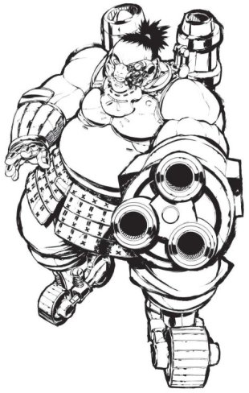
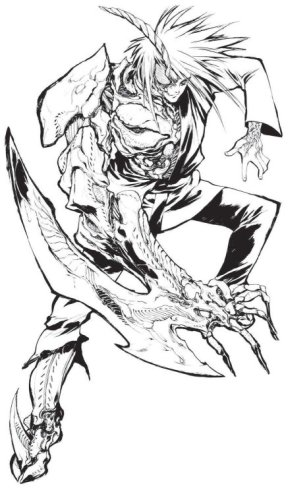
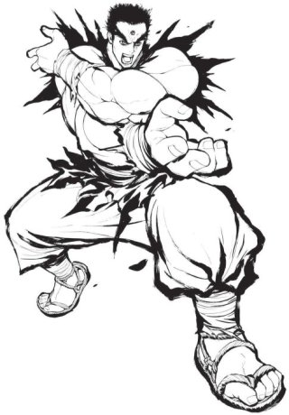
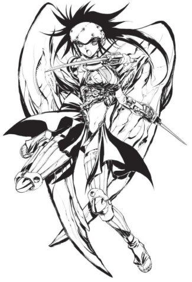
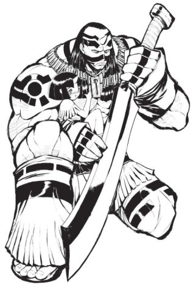
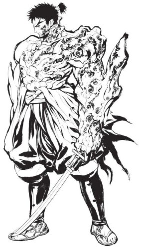

### PeteRPG - Szerepjátékos ismertetők

# Tenra Bansho Zero RPG

#### a "Hyper-Asian" technomágikus fantasy szerepjáték

***Írta: Petrus; eredetileg megjelent: 2013. november 21., [LFG](http://lfg.hu/62953/)***

Ha Japánra gondolunk, elsőként olyasmik jutnak az eszünkbe, hogy manga, anime, moe, tsundere, karate, szamurájok, ninják, szusi, csápos hentai, "kamehame!", óriás mecha robotok, idióta show műsorok. A japán kultúrából általában véve is csak ezeket ismeri az átlag közönség, pedig ez a Magyarországnál alig négyszer nagyobb, de közel 130 milliós ország rendkívül termékeny kultúrális szempontból. Ha csak az irodalmat nézzük, sok tízezer aktív író próbálja eljuttatni a munkáit közönségéhez, amelynek az általunk ismert könyv, vagy képregény formája csak egy része a különféle módoknak (vannak például előfizethető, telefonra mondatonként érkező novellák és regények, vagy szórólapokon, reklám prospektusokon részenként megjelenő írások, amelyek arra ösztönöznek, hogy a többit is szerezd meg).

Ha csak a minket érintő szűkebb, szerepjátékos közösséget nézzük, a helyi, japán nyelvű és fejlesztésű szerepjátékok általában véve népszerűbbek, mint a "nyugati" társaik, de maga az asztali játék nem igazán elterjedt, a digitális, többjátékos online játékok - ott is - sokkal sokkal több játékost vonzanak magukhoz. Ennek ellenére igen sok saját fejlesztésű szerepjáték jelenik meg, nem csak elektronikus formában, amelyek népszerű helyi történetekre, mangákra, esetleg animékre építenek, és a szubkultúrán belül ezek igen népszerűek is lehetnek. Mégis, ezek a játékok igen-igen ritkán jutnak ki az országból, elsősorban persze a nyelvi és kultúrális akadályok miatt, pedig saját tapasztalatom szerint lenne rá igény. A nyugati világban megjelent játékok többnyire átiratok voltak: például a *Bubblegum Crisis* speciálisan az *Interlock*-hoz (a *Cyperpunk 2020* rendszere) készült, a *Hellsing*, vagy a *Slayers* könyvek a *TriStat*-hoz (a *Big Eyes, Small Mouth* univerzális anime-szerepjáték rendszere). Ezek szinte mindegyike valamilyen már létező, "nyugati" rendszerre épülő, inkább kiegészítő jellegű írások voltak, többnyire nagyon felületes, csak a kommersz hangulati elemeket átemelő, vagy az adott animét, mangát lekoppintó jellegzetességekkel. Az egyéb, "távolkeletiesfantasy" mesterséges világokat (*Pilgrims of the Flying Temple*, *Exalted*, *Legends of the Wulin*, *Codex*, ...) szándékosan nem is említem (ez itt most nem negatív, hanem csak általánosító hangnem volt). Olyan "igazzy", valódi japán szerepjáték nem nagyon jelent meg emberi (angol) nyelven, hivatalosan. Hobbi fordítások voltak, de ezek sem nyelvezetükben, sem külsőségeikben nem törekedtek az eredetivel való egyezésre. A közösségi támogatású, ún. "crowdfunding" oldalak megjelenése viszont mintha új lökést adott volna az ilyen kezdeményezéseknek is, ugyanis rövid időn belül több valódi, eredeti, hamisítatlanul japán szerepjáték is igen sikeres kampányt futott be a Kickstarter oldalán. Az egyik a *[Golden Sky Stories](gss.md)*, ami egy igazán formabontó, vidékies környezetben játszódó, érzelemgazdag szerepjáték, amelyben a játékosok állatszellemeket formálnak meg és képességeikkel, de legfőképpen szavaikkal és tetteikkel segítenek problémákkal küszködő embereknek (erről is lesz leírás majd egyszer, mert mindenképpen muszáj írnom róla). A másik jelen ismertetőnk főszereplője, az ízig-vérig "hyper-asian" technomágikus Sengoku-fantasy, a *Tenra Bansho Zero*.

 

A *Tenra Bansho Zero* (továbbiakban TBZ) röviden szólva annyit jelent, hogy: *"Minden létező dolog a Mennyben és a Földön"*, ami nem csak egy Hamlet-*hommage*, hanem szójáték a szanszkrit-buddhista *"sin-ra-ban-sou"* kifejezésre is, ami jelentésében körülbelül az egész univerzumot, minden létező dolgot magában foglal. Kínai átiratban került a természetet, erdőt jelölő *"sin"* helyére a mennyet, égboltot szimbolizáló *"ten"*, és nem mellesleg a *"ten-ra"* szanszkritul azt jelenti: "örökkévaló". A Tenra pedig az a feudális-jellegű, háborúk sújtotta világ is, ahol a TBZ játszódik...

A TBZ szabályai kimondottan (és leírtan) nem is törekednek a realitás modellezésére, hanem egyfajta fikcionalizált valóságot próbálnak ábrázolni. Sokkal közelebb áll a videojátékok és képregények, animék világához, mint a valódi világhoz, tehát ha valaki realista szerepjátékot keres, a TBZ-t nyugodtan mellőzheti. Szemléletes példa: a karakter lezuhan egy orbitális platformról, a levegőben felgyorsulva lángcsóvaként szeli át az eget, majd földet érve egy jókora krátert üt a felszínbe. A karakter halott? Ha a válaszod határozott igen, akkor ne is olvass tovább, ez a játék nem neked való. :)

Következzen hát egy újabb mega-ismertető, gyengébb idegzetűek pedig kattintsanak máshová...

 

 A Tenra Bansho (még a "Zero" megjelölés nélkül) 1997-ben jelent meg Japánban, majd alapos átdolgozás és bővítés után, három évvel később kijött a TBZ. A Zero egyaránt utalt az újrakezdésre, valamint a 2000-es évre, illetve a TBZ alaprendszerének is ez volt a neve (*Zero System*; talán nem véletlen az összecsengés a *Hero System* nevével). A játék igen sikeres volt őshazájában, atyja az az *Inoue Junicsi* nevű (most éppen) mangaka, aki volt énekes-idol és színész is, valamint több anime szereplőjének adta hangját. A TBZ után, korábbi "tettestársaival" a F.E.A.R. (*FarEast Amusement Research*) stúdiónál előbb megírta a *Terra the Gunslinger* című steampunk westernt, majd az *Angel Gear* poszt-apokaliptikus mecha szerepjátékot, végül öt éve, 2007-ben ezt a hármat összegyúrta a *Tenra War* szerepjátékba, tehát nem mondhatni, hogy megült a babérjain.

A TBZ angolra fordítása valamikor az évtized elején bukkant fel, ötletszerűen, amiből aztán elég hamar egy komoly projekt szerveződött és a Kickstarter-en megfuttatva kirobbanó sikert ért el. A projekt fő vezetője Andy Kitkowski volt, aki nagy anime- és gamer fan, ami nem meglepő, mivel több évet élt Japánban és fordítóként is tevékenykedik, amikor nem storage mérnökként keresi a további japán cuccokra elszórható betevőt... A projektben résztvevők között felbukkant még Ewen Cluney neve, mint fordító (aki a másik említett játékot, a *Golden Sky Stories*-t vitte sikerre), és Luke Crane (*Burning Wheel*, *Mouse Guard*, *Torchbearer*) is, mint layout designer.

 

Ennyi bevezető után lássuk, mit is rejt ez az igen masszív, 450+ oldalas remekmű. Azt azért mindjárt szögezzük le az elején, hogy a TBZ nem gyerekjáték, komolyságában inkább az Exalted-re hajaz és nem kerüli a "felnőtt" témákat sem...

 

A könyv egy rövid magyarázatokkal tűzdelt, általános **szójegyzék**kel indít, tegyük mi is ezt, mert a kifejezések később gyakran fel fognak bukkanni. Nem árt valami "japános" előélet, -ismeret sem, mert rengeteg japán szó és kifejezés angolra lefordítatlan (és lefordíthatatlan) formában szerepel a könyvben.

A szavak egy része (GM, PC, NPC, stb.) nem igényel magyarázatot azoknak, akik játszottak már valamilyen szerepjátékot, így ezekre nem is térek ki.

A TBZ egy játékalkalmat 3-5 felvonásra (*Act*) és azon belül több jelenetre (*Scene*) oszt, de van szerepük a jelenetek közötti átmeneteknek (*Intermission*) is. Az első felvonásnak is kitüntetett szerepe van, ez a *Zero Act*, ahol megismerkedünk a karakterekkel, sőt, itt minden PC külön jelenetet kap.

A TBZ többféle, dinamikusan változó pontot kezel, tehát akik TBZ-t akarnak játszani, készüljenek fel legalább háromféle színű tokenből, bogyóból, mert kelleni fog (célszerű kétoldalas, különböző színnel, vagy írásjelekkel megjelölt lapokat használni, lásd mindjárt a pontok átmeneteit egymásba).

Az első ilyen az *Aiki* (kb. harmónia), amit a játékosok, vagy a mesélő adhat egy másik játékosnak jó szerepjátékért. Az Aiki pontokból *Kiai* (küzdőszellem; és vegyük észre: *ai-ki* vs *ki-ai*...) pontok generálhatók többféle módon, amellyel természetfeletti dolgokra lesznek képesek a karakterek (játéktechnikailag plusz kockákat, vagy extra sikereket lehet nyerni velük). A felhasznált Kiai viszont *Karma* pontokká alakul, amelyek a buddhista filozófiában létező 108 bűnhöz kötődnek, vagyis azt mutatják, mennyire szennyeződik a karakter lelke. Elég nehéz eltörölni ezeket.

A sors (*Fate*) mutatja a karakter kapcsolatát a világgal és általánosságban olyan dolgokat jelentenek, mint a múltbeli cselekvések, jelen motivációk, vagy hiedelmek, de jelenthet valamilyen traumatikus eseményt, vagy elkövetett bűnt is. A cél (*Destiny*) olyan speciális sors, amit a mesélő oszt ki minden karakternek külön-külön a Zero Act során és a játékalkalom alatt ezt a célt kell elérniük. Gyakorlatilag nevezhető küldetésnek is. De ha a karakter elérhetetlen dolgokért küzd, akkor is, ha fájdalmas beismernie magának, hogy soha nem érheti el; vagy olyan veszteség éri, ami megváltozhatatlan; vagy a tettei miatt elveszíti lényének azt a részét, ami emberré teszi, akkor *Asurá*vá, elveszett lélekké, emberi alakban mutatkozó démonná válik és megszűnik játékos karakternek lenni.

Nem minden jelenetben vesz részt minden karakter, de az éppen kimaradók sem fognak unatkozni, ők ugyanis a hallgatóság (*Audience*) részei és Aiki pontokat javasolhatnak a játékban éppen résztvevőknek. Különleges és opcionális szabály az ún. *Scene Judge* szerepének kiosztása, aki közvetlenül, a GM nélkül is oszthat Aiki pontot más játékosnak, és szerepe jelenetről-jelenetre más játékosra száll. A TBZ nem használja aktívan ezt a szabályt, de bevezethető.

Fontos megjegyezni, hogy a TBZ explicit módon, pontról-pontra rögzíti a GM lehetőségeit, tehát vitás kérdésekben mindig a GM szavának ad igazat és ezt nem csak általánosságban említi meg, hanem rögzíti is. A GM-nek hatalma van például megtiltani egy karakter cselekvését, ha az rombolja a játék hangulatát.

Elég újszerű és egyedi az a megközelítés is, hogy 6-6, pontokba szedett kérdéssorral a GM és a játékosok is külön-külön megállapíthatják, hogy vajon elértek-e győzelmet (*Victory*), vagy vereséget (*Defeat*) szenvedtek. Ennek szerepjátékosi hatása van csak: ha sorozatban vereséget szenvedsz, valamit nem jól csinálsz (a szerepjáték keretei között)... Egyébként ez a két kérdéssor bármely más játékban is használható, érdekes színfolt lehet, mivel teljesen rendszerfüggetlenek.

A rendszer alapjairól szólva: csak hatoldalú dobókockák kellenek a játékhoz, vannak tulajdonságok és képzettségek, a kerekítés pedig mindig felfelé történik, de ezekről mindjárt lesz részletesebben is szó.

 

Térjünk át a **karakteralkotás**ra.

A TBZ-ben alapból számos kidolgozott kezdő karakter áll rendelkezésre az azonnali játékhoz, de természetesen vannak részletes szabályok a játékosok saját ízlése szerinti karakterek megalkotásához is. Sok szót nem vesztegetnék a "milyen karaktert hozhatok?" koncepcionális kérdéskörre sem, ez ugyanolyan, mint a többi játékban is.

A karaktergenerálás alapvetően *archetípus*okon alapul. A játékos kiválaszt 2-4, egymást nem kizáró archetípust (olyanok közül, mint a szamuráj, *shinobi*, orvos, fegyvermester, mágus, stb.), ezek alap-jellemzőit összefésüli, összeállítja a felszerelését és tulajdonképpen a karakter már játékra is kész. Az embertől eltérő fajok (*oni*, *kugutsu*, stb.) szintén archetípusokat alkotnak. Hogy a játékosok ne tudjanak mindent összeválogatni csak úgy, kedvük szerint, a TBZ-ben minden archetípusnak Karma költsége van. Vagyis minél többet variál össze valaki, annál szennyezettebb lélekkel indul és annál hamarabb billenhet át Asura állapotba, ahol szépen el is veszíti a karakterstátuszát. A limit is pontosan 108 Karma, ami gyakorlatilag egy aprócska lépésre van az *Asura* állapottól... És miért nem jó magas Karmájú karakterrel játszani? Mert a Kiai és a Karma egymással fordított arányban van: minél magasabb a Karmád, annál kevesebb Kiai-t tudsz költeni. Az ajánlott kezdő érték egyébként 50-60 Karma.

A tulajdonságok (*Attributes*) között alapesetben 40 pont osztható el, de vannak bizonyos archetípusok, amelyek csökkentik ezt a mennyiséget, tehát itt is érdemes vigyázni. Amúgy a következő tulajdonságok vannak: *Body* (fizikai erő, kitartás), *Agility* (sebesség, reflexek), *Senses* (érzékszervek), *Knowledge* (műveltség, logika), *Spirit* (bátorság, akaraterő, hatodik érzék), *Empathy* (empátia, érzékenység, manipuláció), és *Station* (státusz, befolyás, bizonyos felszerelések elérhetősége, és néhány archetípusnál is követelmény bizonyos érték elérése). Ezek 1-10 értékűek, az átlagembereké 1-3, az átlagos karaktereké 4-6 körüli. Egyes archetípusok javaslatokat is tesznek azokra a tulajdonságokra, amelyekre célszerű a játékosnak fókuszálnia, mivel az archetípus jellemzői azokra épülnek, de ez nem kötelező érvényű. Néhány faj esetén bizonyos tulajdonságokra más szabályok is vonatkoznak, pl. fix értéke van, vagy könnyebb/nehezebb fejleszteni.

Három számított al-tulajdonság (*Sub-Attribute*) van még: a *Vitality* (ami gyakorlatilag az életerőnek felel meg, de ha elfogy, a karakter még nem halott), a *Soul* (ez a mágiapontok száma) és a *Wounds*. Ez utóbbi négy szintre tagolódik (*Wound Track*), a Body kezdő értékétől függenek a szintjei, a legalsó a halál (*Death*) állapot. Ezekről majd még később lesz szó.

Képzettség (*Skills*) pontok nincsenek külön, ezeket vagy automatikusan adják az archetípusok, vagy tulajdonságpontból is lehet átváltani. A képzettségek adott tulajdonságokhoz kapcsolódnak és kb. 20-25 van belőlük. Ha több archetípus is ad ugyanolyan képzettséget (eltérő, vagy azonos értéken), ezek nem adódnak össze, hanem a játékos választása, melyiket tartja meg, a többit pedig felhasználhatja más képzettségek vásárlására (de csak újra és az eldobott értéken, nem használhatja meglévő képzettség növelésére).

Az archetípusok többsége megszab valamilyen sorsot (*Fate*) is, ezek elég eltérőek is lehetnek. Kezdő karakternek kettőt kell kiválasztania és van egy meghatározott számértékük is, ami később jut szerephez.

Minden mást, ami a kezdő felszerelésbe tartozik, vagy az archetípus adja, vagy megvásárolható bizonyos szabályok szerint. Tenra világán az alap pénzegység a *mon*, de szinte minden tárgy elérhetősége (és viselhetősége!) a *Station* tulajdonságon alapul, így a pénznek önmagában kevés szerepe van. Általánosságban a pénz csak színesítő elem és ha a játékos elképzelése, a karakter koncepciója és *Station* értéke megfelelő, elvileg bármi lehet a karakternél, amit a GM nem ellenez. Ez a későbbi játékra is igaz, ha menet közben akar beszerezni valamit. A pénz játéktechnikai elemét később több példa is illusztrálja szemléletesen. (Aki ismeri pl. a *D20 Modern* rendszerét, a *Wealth* hasonló, mint a *Station*, bár ott pusztán csak a karakter anyagi helyzetét jellemzi, egyéb státuszt nem.)

Ha a karakter spéci lélekkő (*soulgem*) fegyverrel (l. később) akar indulni, megteheti, de annak is komoly Karma költsége van.

 Vannak speciális képességeket adó archetípusok, ezek gyakran különleges felszereléseket is adnak, amelyek használata, vagy megléte szükséges a képesség aktiválásához. Lássuk, miféle típusok is ezek:

- Tenra világán az "információs" hálózat az ún. *Reflection* tér, amelynek használatához *meikyo* (kb. avatárnak, ikonnak felel meg) lélektükör (*soul mirror*; ez szorosan kötődik a karakterhez, nem megvásárolható és nem beszerezhető), lélekkábel (*Soulcord*) és interfész sisak (*Interface Helm*) szükséges. Ez a Reflection amúgy elég különleges állatfajta, messze nem olyan, mint a szokványos kiberpunk játékvilágok Mátrixa, hanem egyfajta futurisztikus-mágikus szellemvilág-Internet, amit a Shinto Papság (*Shinto Priesthood*) tart fent és például mecha-páncélok belső virtuális terét is leképezik a pilóta (pl. a *yoroi* páncéllovasok, vagy a *meikyo*-jukkal egybefonódott *kongohki*-k) számára, valamint teljesen testreszabható...

- Az annelidisták (*Annelidists*) különféle lényekkel lettek átoltva, keresztezve, és ezeket a lény-képességeket egy ún. féregbáj (*Wormcharm*) képzettségen keresztül irányítják. Amúgy elvileg például nincs akadálya, hogy valaki játék közben implantáljon magába egy *annelid*-et...

- Az *oni* és fél-*oni* fajok a szarvuk és a szívük közötti rezonanciából (*Resonance*) nyerik a mágikus energiájukat, amiket különleges képességekre tudnak használni.

- A szamuráj (*samurai*) képesség karakterről-karakterre változhat, de olyasmiket lehet vele megtenni, mint például a testtömeg megnövelése, méretek megváltoztatása, izmok felfejlesztése, vagy kitin-szerű páncélzat növesztése az egész testen. Ezeken kívül a testüket megszálló *shiki* szellem különféle extra képességeket is adhat nekik egy időre. A könyv számos jellegzetes *shiki* szellemet ismertet, de vannak általános szabályok egyedi szellemek megalkotására is.

- A *shinobi*k olyan ninják, akik különféle sötét mesterségekkel (*Dark Arts*) felruházott és feltöltött lélekköveket implantálnak a testükbe, hogy ezekkel könnyítsék meg különleges ninja képességeik alkalmazását.

- Tenra kiborgjai, robotjai a *kijin*-ek, akik(?) kibernetikus-robotikus implantokkal (*mechanica*) turbózhatják a képességeiket.

- A *kugutsu* faj különleges képessége a futó álom (*Butterfly Dream*), amellyel akár ébren lévő lényeket is kiránthat az idő folyamából egy álomszerű világba, ahol általában csak ők ketten vannak. A japán irodalomban gyakran használt elem.

- Végül pedig az emberidegen *ayakashi* és a fél-*ayakashi* fajok különleges képessége a *yohjutsu*, amellyel teljesen egyedi hatások hozhatók létre.

Más játékokban gyakran problémát jelent a "lehajolunk érte?" kérdésköre, különösen például értékes varázstárgyak esetén, amiket jó áron el lehet sütni a legközelebbi poros kis falu "varázsboltjában". A TBZ-ben ezek a különleges tárgyak (*special equipment*), amelyeket játék közben szintúgy lehet találni, de nem minden esetben lehet megtartani. Alapesetben, ha egy felvonás alatt előkerült egy ilyen tárgy és egy karakter megtalálta, felvette, esetleg használta is, nem vihető át a következő felvonásra, hacsak a karakter ki nem fizeti a tárgy megfelelő Kiai költségét. Ha nincs ennyije, vagy nem akarja kifizetni, a tárgy az új felvonásban már nem szerepel, mert elveszett, a karakter elajándékozta, vagy elköltötte az árát szakéra és színes kimonós lányokra...

Különleges felszerelések idővel kerülhetnek elromlott (*broken*) állapotba, ami nem jelenti a megsemmisülésüket, sem a használhatatlanságukat, egyszerűen csak az általuk adott bónuszok megszűnnek. Javításukra nincs külön képzettség, egyszerűen megtörténnek például két jelenet közötti átmenet alatt, vagy a játék végén. A GM döntése, hogy ehhez kell-e valamilyen mesterember, vagy a karakter is végrehajthatja, de a tárgy akár önmagát is kijavíthatja (elvégre mégiscsak különleges, spéci felszerelésekről van szó). Persze van lehetőség arra is, hogy ha a karakter úgy dönt, drámaibb és/vagy menőbb lenne, ha egy tárgya végképp összetörik, akkor ez így történik (ha a GM-nek nincsenek más céljai vele).

Ezek a tárgyak egyébként kis tapasztalat után módosíthatók, átalakíthatók, a GM engedélyével.

A fejezetet egy példakarakter részletes, lépésről-lépésre végigvezetett megalkotása zárja.

 

Most akkor lássuk, hogy mindezen furcsaságok hogyan állnak össze, vagyis hogyan működik a **rendszer**. Amúgy a könyv sok példát bemutat a széljegyzetekben, valamint mókás kis képregények is vannak, hasonló célzattal.

Az alapvető tesztdobás nagyon egyszerű: annyi d6-ot kell dobni, amekkora a tulajdonság értéke és annyi siker született, ahány dobott érték egyenlő, vagy kisebb, mint a képzettség értéke (és ebből következik, hogy a maximális képzettség-szint az 5, de már ez is magasan természetfelettinek, "egy-a-millióból"-nak számít). Például, ha az *Agility* 5 és a *Melee Weapons* 3, akkor 5d6-ot kell dobni és minden kocka siker, amelyik 1, 2, vagy 3 értéket mutat. A teszt nehézsége (*Difficulty*) egyszerűen azt mondja meg, hány sikert kell elérni. A legtöbb esetben elég 1 siker (*"valószínűleg álmodban is megcsinálnád"*), de a nehezebb próbákhoz több is szükséges lehet (egészen 6-ig, de extrém ritka esetekben magasabb is lehet). A dobást egyébként nyíltan kell tenni.

Nem mindegy viszont, hogy *mikor* kell tesztet dobni, és ez némileg eltér a szokványos rendszerekétől. A TBZ alap álláspontja az, hogy csak akkor dobassunk, ha a kérdéses kihívás végkimenetele (sikere, vagy bukása) izgalmas lehet. Gyakorlatilag *ez* a teszt folyamatának legelső lépése és nem a kockák összeválogatása. Ha egy teszt elrontásának végkimenetele egyszerű, vagy nem szórakoztató, vagy megakadályozza, hogy a kaland tovább haladjon, akkor ne dobassunk, a kihívás szimplán sikerült és lépjünk túl a dolgon. Mit is jelent ez a gyakorlatban? A karakter egy párkányon áll, alatta több ezer lábnyi mélység, de ha nem ugrik, biztosan meghal (mondjuk mert egy egész hadsereg tart felé, akiket nem tudna legyőzni). Ha kiugorna, túlélné a dolgot valami tesztdobással? Szinte minden más rendszerben az lenne a válasz, hogy: akkor sem. No, a TBZ-ben ez nem így történik. :) A kihívás először is unalmas és halállal járna, bármit is választ, másrészt megakadályozza a kaland folytatását (hiszen a karakternek annyi). Tehát a rendszer azt mondja, hogy nem kell dobni és *"oké, leugrottál, sikerült, kaptál valami brutális mínuszos Vitality sebzést és beájulsz, de túlélted és úgy 40-50 óra múlva magadhoz térsz odalent, mit csinálsz?"*... Magyarán szólva: csak akkor kell dobni, ha a bukás és a siker egyaránt magában hordoz valamilyen potenciális folytatási lehetőséget és egyik sem insta-kill, és nem is állítja meg a játékot (pl. az *"amíg nem találod meg a szükséges bizonyítékot, nem megy tovább a játék"* megakasztja a játékot, tehát ne dobassunk, csak mondjuk azt, hogy *"X idő elteltével előkerült"*).

Érdekes koncepció, az biztos, de ha a japán mangákra, animékre gondolunk, ahol csak úgy repkednek a tápos erejű kardforgatók, mechák és varázslók, akik erőfeszítés nélkül tesznek meg kissé lehetetlen dolgokat és mindig valahogy összeszedik magukat és túlélnek szinte mindent, hogy gyakran a legdrámaibb módon haljanak meg végül, máris értelmet nyer mindez.

Azt, hogy milyen képzettségre kell dobni, általában egyértelmű és a GM közli, de a tulajdonság nincs kőbe vésve. Minden képzettségnek van egy javasolt tulajdonsága, ami alá csatlakozik, de előfordulhatnak olyan teszt-helyzetek, amikor egy másik tulajdonság jobban illik hozzá. Például egy faluba érve felmérve a házakat felismerni, hogy hol lakhat a helyi vezető, egy *Information* képzettség, amire a *Knowledge* tulajdonsággal kell dobni. De egy nyilakkal telelődözött holttest felett állva kideríteni, hogy a nyilak kidolgozása és mintázata alapján kik lehettek a támadók, az már egy *Marksman* képzettség, amire *Knowledge* tulajdonsággal kell dobni (és nem a *Marksman*-hoz alapesetben tartozó *Senses*-el). A könyv minden képzettségre ír tulajdonság-páros példákat, hogy mire használható.

Összemért tesztnél értelemszerűen az nyer, aki több sikert ért el. Egyenlőségnél addig kell dobni, amíg el nem dől a kérdés, de utólag kockákat hozzáadni, vagy elvenni már nem lehet (pl. Kiai felhasználásával).

A képzettlenség kérdését úgy kerüli el elegánsan a rendszer, hogy néhány alapvető (*general*) képzettség minden karakternek megvan 1-es szinten, a többi meg archetípusokon keresztül tanulható (*specialist*), normál körülmények között nem is lehet dobni rá. Van néhány különlegesen speciális képzettség (*elite*), ami nem is tanulható, csak egyedi archetípusok választásával és a GM engedélyével. Ilyen pl. a *Ninjutsu*, vagy a *Resonance* képzettség. Megjegyzendő, hogy a *Pillow Arts* is teljesen átlagos, hétköznapi képzettség...

Van még egy furcsa "szabály", vagy inkább lehetőség: ha egy játékos annyira királyul leírja a karaktere egy cselekvését, vagy a történés annyira szórakoztató, vagy izgalmas irányba tolja el a történéseket, hogy a GM szerint vétek lenne nem kihagyni, akkor az megtörténik. Teszt dobása nélkül. :) (Csak opcionális szabály és csak mértékkel javasolt használni, de mindenképpen érdekes.)

Ha szükséges, a GM egy egyszerű képlettel azt is megbecsülheti, milyen esélye lehet a karakternek a teszt végrehajtására az adott nehézség ellen, Kiai felhasználása nélkül.

A képzettségek fejlesztése egyébként többnyire bármikor megtörténhet a megfelelő mennyiségű Kiai elköltésével. Ezek alól kivételek az elit képzettségek, amiket csak átmenet (*Intermission*) során lehet növelni.

 

 A korábbiakban volt már említés róla, de a könyv is külön fejezetben foglalkozik a **Karma** működésével és kihatásaival, tegyük mi is ezt még "pár" bekezdés erejéig.

A Karma szorosan összefonódik a karakterek létezésével, sőt, magának az egész TBZ rendszernek is az egyik legfontosabb oszlopa, annak ellenére is, hogy nem teljesen egzakt módon leírható, konkrét szabályokkal működik és erősen támaszkodik a játékosok és a mesélő gondolkodására, szerepjátékára is. Ezek nem igazán mérhető képességek, kinek-kinek a saját tehetsége, tudása alapján működnek és a Karma megpróbálja ezt lefordítani a számok és szabályok nyelvére, de igyekszik megtartani a meghatározhatatlanságát is. Zavaros, igaz? Mint a nagy, általános, köldöknézős, távol-keleti bölcsességek. De mindjárt tisztulni fog a kép. :)

Általánosságban "közismert", hogy ha jó dolgokat cselekszel, az "jó karma", ha meg rosszakat, az "rossz karma", és ezek kihatással lesznek a következő életeidre. Nos, ez a közismert "tény" valójában nem is távol-keleti, hanem indiai, pontosabban a hinduizmushoz tartozik. A buddhizmusban *minden karma rossz*. A *karma* (vagy japánul *goh*) azt jelenti: cselekvés, és minden tevékenységet felölel, amit az ember a világban tesz. Egy buddhista ember igyekszik harmóniában élni a világgal, mert a karma olyan, mint egy zsák a hátadon: minél többet cselekszel a világ ellen, annál nehezebb lesz és ez befolyásolja a sorsod az élet és az újjászületés ciklusában (mivel lehúz, mindig visszapottyansz a világba). És minél nehezebb lesz ez a zsák, annál inkább érzed a súlyát és annál jobban kihatással lesz a cselekvéseidre és az érzelmeidre. Valamit annyira szeretsz, hogy elpusztítod a szereteteddel. Vagy: valamit annyira szeretsz, hogy mindent elpusztítasz körülötte, hogy megóvd...

A Karma rendszerét négy, egymással többféle kapcsolatban álló jellemző alkotja: a Kiai, az Aiki, a Karma és a Fate.

- A *Kiai* a karakter potenciális hatalma, az a képessége, hogy az akaratát rá tudja erőltetni a környező világra és megváltoztatja azt. Minél több Kiai-val rendelkezik, annál nagyobb potenciál lakozik benne. Gyakorlatilag ez a rendszerben a máshol meglévő "hős pont", vagy "sors pont", de ezen felül tapasztalati, fejlődési pontként is szolgál és fejlesztésekre is költhető. Minden elköltött Kiai pont átváltozik Karma ponttá is.

- Az *Aiki* a szerepjátékos jutalom. A játékosok, vagy a mesélő oszthatja ki, a fentebb más ismertetett módokon, fizikai formája egy kétoldalas jelölő, token, korong, akármi. Az Aiki átalakulhat Kiai ponttá, de szerepe van a sors dobásokban (l. alább), új sors felvételében, sőt, akár Kiai-ként is költhető. Fontos különbség, hogy ez utóbbi esetben nem generál Karmát.

- A *Karma* pontok száma mutatja a karakter lelkének állapotát. Minél magasabb ez a szám, a lelke annál több érzelmet hordoz és 108 felett már annyira túlcsordul, hogy a karakter megszűnik létezni, a lelke szétszakad.

- A *Fate* (sors) mutatja a karakter multját, hitét, életútjának fontos eseményeit, célját, és még sok hasonló dolgot. Minden sors a karakter életének egy fontos momentumát jelzi, szintje (ami 1-5 lehet) pedig az esemény jelentőségét. Egyben azt is jelzi, hogy a karakter mit tart fontosnak és mennyire.

- A *Destiny* (cél) egy olyan különleges sors, amit a mesélő oszt ki a játékalkalom elején és az adott történet során a karakter fő célját jelenti, de ugyanakkor egyfajta szerepet is kiró rá. Ezt nem kötelező követni, de ajánlott, főleg kezdő játékosok esetén.

Ha feltételezzük, hogy a világ egy színház, és a szerepjáték annak egyfajta utánzása, akkor fontos különbséget tennünk a különféle kultúrák színjátszása, történetesen az általunk ismert "nyugati" és a távol-keleti, különösképpen a japán *kabuki* színház között ahhoz, hogy a TBZ-ben megértsük az Aiki működését. A kellékeket, díszleteket, elrendezést leszámítva egy fontos különbség van: a nyugati színházban a közönség csendben figyeli a színdarabot, míg egy kabuki előadáson a nézőtér (*Audience*) együtt él a darabbal. Bekiabálással, hangos tetszésnyílvánítással követik a történéseket és díjazzák a nekik tetsző momentumokat, jellegzetes dialógusokat, pózokat, még akkor is, ha már ezredjére látják az adott jelenetet. A közönség a színész képességeit figyeli, dicsőíti, az ő előadásmódját éli át és ez a színészre is kölcsönösen kihatással van.

A TBZ-ben ugyanígy működik az ***Aiki*** osztása: a játékos a karaktere bőrébe bújva (a "színész") szórakoztatja a többi résztvevőt (a "közönséget"), és ha ezt jól teszi, Aiki-t kaphat érte. Ha ezt valamilyen sorssal, vagy a céljával kapcsolatban teszi, akkor az még jobb. Jelenetenként 2-3, vagy több pont is szerezhető így. Nagyon részletes szabályok nincsenek rá, csak iránymutatások. A kiosztott pontok egyben jelzik a történet "szívverését", előrehaladását, tempóját is: ha gyengén csordogál, akkor a sztori szürke, színtelen, ha pedig sok érkezik, akkor minden bizonnyal egy fantasztikusan színes szerepjáték ülésen vagyunk, ahol mindenki sziporkázik. :)

Figyelem: a mesélő is kaphat Aiki-t! Ezt ő az NPC-kre használhatja el a szabályok szerint.

Az Aiki többféle érdekes dolgokra használható, ezeket a könyv szépen részletezi. Csak egy példa: a játékos, vagy a mesélő Aiki elköltésével behívhat egy másik, éppen nem ott lévő karaktert az adott jelenetbe, akár a karaktere, akár egy NPC "bőrében"...

Korábban már volt szó róla, hogy az Aiki 1:1-ben beváltható és Kiai-ként használható pl. tesztdobások erősítésére, de ez elég konzervatív módja az alkalmazásának és nem is túl hasznos (l. még alább a Sorsnál írtakat). Akkor hogyan lehet sok Kiai-pontot szerezni? A *sors dobás*okkal. Ez úgy működik, mint egy képzettségpróba, ahol az alap tulajdonság az *Empathy*, a képzettség pedig az a sors (*Fate*), amire dob. A játékos elkölt egy Aiki-pontot és minden siker 1 pont Kiai-t generál. A játékos szabadon eldöntheti, hogy melyik sorsot választja és ez a döntés egyben mutatja is, hogy a karaktere milyen téren mutat nagyobb potenciált, hiszen jellemzően olyan sors lesz kiválasztva, amelyik elég magas szintű. Fontos különbség van abban viszont, mikor teheti ezt meg: ha egy jelenetben, például harci cselekvésként teszi, akkor csak olyan sorsot használhat, ami az adott helyzetre, szituációra alkalmazható (a mesélő engedélyével).

A tenrai legendák tele vannak olyan hősökkel (és antihősökkel), akik a legváratlanabb dolgokra voltak képesek: mint a szamuráj, aki egy 5000 fős sereggel nézett szembe és túlélte; vagy az *onmjodzsi*, aki a megidézett *shiki* szellemével egy egész várost a föld színévé tett egyenlővé. A játékban a ***Kiai*** szolgál az ilyesfajta hihetetlen, legendás tettek megvalósítására.

A Kiai sokféle módon is felhasználható, a két legjellemzőbb a *dice boost* és a *skill boost*. Előbbi esetben minden elköltött pontért plusz egy kockát kapunk, felső limit nélkül. Akár 50-et is lehet vásárolni, ha úgy akarjuk. A másikkal ideiglenesen, a teszt idejére, bármely meglévő karakter képzettség felnövelhető max. 4-es szintre (akár egyszerre több lépést is). Ezeken kívül vásárolhatunk plusz sikereket, harcban megszakító cselekvéseket hajthatunk végre, többszörös harci akciót vehetünk, megvédelmezhetünk valakit (egy ugrással mellette terem a karakter és helyette dobhatunk védekezést, vagy átvállalhatjuk a sérülést), változtathatunk az érzelmi mátrix állapotán (l. később), vásárolhatunk új felszereléseket is (és a különleges tárgyak megtartásáért is Kiai-val fizetünk), megnövelhetjük valamelyik tulajdonságunkat, vehetünk új képzettségeket, és megnövelhetjük a meglévőket. Mint látható, a Kiai a leguniverzálisabb karakterfejlesztési eszköz, sokban hasonlít más játékok elkölthető legenda, vagy tapasztati pontjaihoz.

De mindennek ára van. Ahogy már szó volt róla, a Kiai befolyással van a karakter karmájára, minden elköltött pont egyre közelebb sodorja őt az ***Asura*** állapothoz: ha a Karma egy átmenet végén 108 felett maradt, a karakter azonnal NJK státuszba kerül és már nem lehet visszaszerezni. Az Asurák azok az elveszett lelkek, akik annyira küzdöttek, hogy közben megsemmisítették önmagukat és már képtelenek megváltoztatni a sorsukat. Soha többé nem változnak és bármit is látnak célként, sorsként maguk előtt, abból az irányból már eltántoríthatatlanok. Nem hajlandók elfogadni a vereséget, sem a változást, csakis a céljuk felé törekednek, de ez nem jelenti azt, hogy dühöngő berserkerként rohannak le mindent és mindenkit - csak azt, ami a céljukhoz vezető útjukban áll... Egy külső megfigyelő számára egy Asura tevékenysége egyszerre tűnhet elborzasztónak és őrültnek, mert normál emberi ésszel képtelenség felfogni a megszállottságuk fokát. A közvélekedés szerint a tiszta gonoszság megtestesült és emberbőrbe bújt démonai, akikkel nem lehet egyezkedni, vagy együttérezni.

"*Akkor ne is használjak Kiai-t, hogy ne váljon a karakterem Asurává?"*, kérdezhetnénk és tulajdonképpen a válasz: igen. :) Mármint a buddhista szemlélet szerint, de a karakterek mégiscsak hősök szeretnének lenni (megint az a rossz karma...) és bár elkerülhetetlennek látszik ez a végzet, van mód a késleltetésére: a sors megváltoztatása.

Mint korábban írtam, a ***Sors*** minden, amivel a karakter törődik, foglalkozik: a kapcsolataik, az életmódjuk, az elérni kívánt céljaik, a kötelezettségeik, a történelmük - minden, ami róluk szól és nyomot hagy a világ életében. A sors lehet cél, érzelem, titok, szerelem, ellenség, balszerencse, tabu, háttér, vagy más típusú is. A karakter különféle sorsának megválasztása és kijátszása a TBZ egy fő támpillére, oszlopa. Vannak sorsok, amiket a karakter választásai rónak ki (pl. bizonyos archetípusok), vagy a végzet formájában a mesélő szabja ki rájuk, de előfordulhat olyan is, hogy más karakter/játékos miatt keletkeznek. Ha kiválasztod a karaktered sorsait, olyanokat válassz, amelyek érdekesek és izgalmasak lesznek vele kapcsolatban és ki is tudod azokat játszani!

Fontos, hogy a sors nem titkolt a többi játékos előtt, nem csak a te karakterlapodon szerepel. Akár a jegyzetekre, akár előtted lévő kártyákra, lapokra van felírva, a többi játékos elkérheti és átolvashatja azokat, ha valamiért elfelejtkezett egy részletről, vagy fel akarja frissíteni az emlékezetét (tudod: hallgatóság és Aiki-pontok!). Ha titkolódzol előttük, a többiek hihetik, hogy csak színészkedsz és nem a karakteredet alakítod...

A sorsok a jelenetek közötti átmenetekben meghatározott módon változtathatók, akár le is cserélhetők és újak is választhatók, sőt, más karakternek is adhatunk sorsokat (ezek egyébként mind Aiki-pontokba kerülnek és ezek a pontok igazából erre hasznosak). Ez biztosítja azt, hogy a karakter kellően változékony, sokszínű legyen, hiszen a való életben is változnak a nézőpontjaink, véleményünk. A rendszerben ez az ún. *Anatman* fázis (szanszkritul *Anatman*, japánul *Shogyo-Mujoh*, ami kb. annyit tesz, hogy "a világi dolgok múlandósága"; lásd: "nem léphetsz kétszer ugyanabba a folyóba" (ami egyébként a görög filozófustól, Heraklitosztól származik)). Fontos megjegyezni, hogy a sors szintekből egy táblázat alapján számított összérték nem lehet nagyobb a Karma értékénél, hiszen a Karma eleve azt reprezentálja, hogy a karakter milyen világi dolgokkal törődik igazán. Szintén fontos megemlíteni, hogy ha eltörlünk egy sorsot, az csökkenti a Karmát, akár igen jelentős mértékben is (minél nagyobb erejű, szintű sorsot húzunk ki, annál többel). A kihúzott sorsok nem törlődnek véglegesen a karakterlapról, később, bizonyos körülmények között visszatérhetnek. A másik módszer a Karma csökkentésére egy adott sors megváltoztatása (pl. volt egy "tabu: nem ölök" és mondjuk helyette lesz egy "tabu: csak önvédelemből ölök"; vagy "érzelem: utálom a sznob hercegnőt" helyett "érzelem: kedvelem a sznob hercegnőt", de akár "érzelem: meggyűlöltem a sznob hercegnőt" is lehet).

A Karma és a Kiai-pontok elköltése kicsit eltérően működik a *Reflection* térben. Gyakorlatilag arról van szó, hogy a *meikyo* lélektükör külön Karma szinttel rendelkezik és minden, a becsatlakozás alatt elköltött Kiai ehhez adódik hozzá, nem a karakteréhez. Egyedüli kivételek a *kongohki*-k, akik gyakorlatilag a lélektükörhöz vannak kötve, ennélfogva az ő Karmájuk is közös. Minél magasabb a *meikyo* Karma, annál nagyobb bónuszokat ad az üzemeltetett gépezethez (pl. a páncélokhoz), de ha 108 fölé nő, nem válik Asurává, hanem egyszerűen csak visszautasít minden csatlakozási kísérletet. Különleges eset, ha becsatlakozás közben mindkettejük Karmája túlnő a 108-on, mert ilyenkor a karakter meghal, Asurává válik és a lelke örökre fogságba esik a *meikyo* belsejében. (Amúgy létezik egy *kimen* nevű technológia, amivel a *meikyo* sem gyűjt Karmát, de ez jóval gyengébb az elterjedtebb változatnál.)

A *meikyo* Karmát megtisztító rituáléval el lehet törölni (és ez a csapdába esett lelkeket is visszaengedi a örök körforgásba). A másik módszer az *Anatman* fázis során egy karakter sors növelése, ugyanis ilyenkor a *meikyo*-ja Karmáját (illetve annak egy meghatározott részét) átveheti a sajátjába.

 
 
 Na, akkor most térjünk át arra a pontra, amit már úgyis mindenki vár: **harcrendszer**!

A harc alapvetően hasonlóan működik, mint a többi rendszerben: a cselekvések körökre (*round*) vannak bontva, kezdeményezés nincs, majd a karakter a körén belül végrehajtja a cselekvéseit. Hogy mik a fontosabb eltérések, arra máris rátérünk.

A harci kör ***alapideje*** nincs meghatározva, néhány másodperctől akár több percig is terjedhet. A leírt alapidő ugyan 1 perc, de ez megváltoztatható, ha a mesélő mondjuk pörgősebb, feszültebb harcot akar.

A ***kezdeményezés***t az Agility dönti el, egyenlőség esetén további tulajdonságok összevetése jön sorban.

A ***kör*** legelső lépésében olyan cselekvéseket kell bejelenteni, amelyek nem a szokványosak közé tartoznak. Ez a pihenés (*Rest*), ami a kör további részében már csak védekezést tesz lehetővé, viszont visszaad valamennyi *Vitality*-t; a várakozás (*Wait*), amivel önként feladható a kör, hogy majd valamikor később cselekedhessen (mint pl. más rendszerekben a *Delay*, vagy a *Hold*); valamint a teljes mozgás (*Movement*), amivel max. *Agility* x 10 métert lehet haladni. Mozogni nem csak ekkor lehet, hanem az egyéb cselekvések között is, de már kevesebbet (l. ott).

A ***fő harci cselekvések*** (vagy *full* akciók) közé tartozik a támadás (*Attack*), a különleges képesség használata (*Special Ability*; ide értve a szamuráj forma felvételét is), a sorsdobás (*Fate Roll*), és a bátorítás (*Cheer On*). Ez utóbbi arról szól, hogy az egyik karakter egy, vagy több Aiki-t adhat a másiknak, ha van közöttük valamilyen meghatározott sors-kapcsolat (Aiki helyett bizonyos szabályokkal Kiai is átváltható). Ezt érdemes kijátszani.

A ***védekező cselekvések*** (*parry* és *evade*) nem kerülnek akcióba, de egy támadás ellen csak egyszer lehet védekezni. Nincs viszont korlátja annak, hogy egy kör alatt hányszor lehet védekezni összesen. Ez igaz az olyasmi esetekre is, mint pl. az "ezer nyílvesszőt lőttek ki rád". Persze értelmetlen mind az ezer kitérést kidobni, a mesélő az ilyeneket összevonhatja egybe, vagy mondjuk úgy kezeli, hogy "ötször 200 nyílvesszőt lőttek ki rád", ez öt kitérés. Néhány speciális támadási forma ellen *Willpower*-t kell dobni védekezésként.

A ***támadás akció*** oda-vissza működik: a támadó dob valamilyen támadó képzettséget és a védő is dob egy támadást (!), vagy ha nem tud (esetleg nem akar), akkor kitérést (*Evasion*). Ha a támadó ér el több sikert, sebezhet. Egyenlőségnél nincs újradobás és sebzés sem, a helyzet döntetlen abban a körben, nem áll le a csata. Viszont, ha a védő ért el több sikert, akkor ellentámadás történt (*Counter-Attack*) és sebezhet is (ha akar, de erről lemondhat; ezek azok a bizonyos jelenetek, amikor pl. hozzáérinted a kardot a rád támadó ellenfeled torkához és mosolyogsz...). Persze ez csak olyan helyzetre igaz, ami közelharcban lett kivédve, távolsági támadás ellen védekezve nem lehet ellentámadást okozni. Figyelem: viszont távharc ellen is lehet mondjuk *Unarmed*, vagy valamilyen közelharci tesztet dobni! Védekező siker esetén ugyanis ez azt jelenti, hogy a védő leütötte, elkapta, félrelökre a támadófegyvert (nyílvessző, shuriken, akármi). És ez igaz a tűzfegyverekre is (pl. a szamuráj félreüti a kardjával a pisztolygolyót)! A speciális, vagy energia-alapú támadások és a területre ható effektek ellen persze ez sem véd (de az *Evasion* többnyire igen).

Van olyan támadásforma, ami valójában védekezés: az *aiuchi*-t ("szimultán támadás") csak a védekező fél választhatja. Ilyenkor önként lemond a védekező dobásáról, de mindketten úgy dobnak, mintha az ellenfelük nulla sikert ért volna el. Először a támadó dob és ha a védő még áll, kibírta a sebzést, szintén dob és sebez. A lényege ennek a védekező támadásformának az, hogy az eredeti támadó már nem védheti ezt a visszacsapást, mindenképpen betalál és sebez. Ritkán használt.

A meglepetésszerű támadás (*Sneak Attack*) értelemszerűen csak meglepetésből hajtható végre (lopakodás, láthatatlanság, stb.), de ugyanúgy kettős dobást kell tenni, mint normál esetben. Ha a védő nyert, már nem támadhat vissza, de nem is érte sérülés. Ha viszont a támadó nyert, a védő sikereit nullának kell tekinteni.

*Távolsági harc*ban a támadó legfeljebb annyi akciót tehet, amennyi a fegyver tűzgyorsasága. Feltétel csak, hogy minden célpont látható és a hatótávon belül legyen. A támadó egyetlen támadást dob, a célpontok pedig külön-külön védekeznek ellene. Ha többszörös támadás megy egy célpontra, az siker esetén a sebzést is egyenes arányban növeli (egy bizonyos szintig). Fontos megjegyezni, hogy a legtöbb játékkkal ellentétben a TBZ-ben a tűzgyorsaság (*Rate of Fire*) nem csak az automata fegyverek sajátja: a shurikenek, dobótűk és -kések is rendelkeznek vele. Pl. shurikenből körönként ötöt is el lehet hajítani, akár öt célpontra is.

A harci művészetek (*Arts of War*) speciális képességek, amelyek különféle extra opciókat, technikákat, stílusokat adhatnak a karakterek támadására és védekezésére. A tesztdobás továbbra is a szokásos alapképzettségekkel zajlik, de több technikát és stílust is bele lehet zsúfolni. Ezekről majd később még lesz szó.

Szintén különlegességnek számítanak a stratéga karakterek, akik rendelkeznek a *Strategy* képzettséggel. Egy jelenet alatt egyszer dobhatnak rá és minden siker után egy tartalék bónusz kockát kapnak. Ezeket a kockákat az adott jelenet során bármely szövetségesüknek odaadhatják, mint egyszeri bónusz. Nincs limit arra, hogy hányat adnak át, akár az összeset is lehet, de a felhasznált kockák nem térnek vissza, csak egyszer használatosak.

Végezetül persze ott vannak a *Kiai/Aiki-trükkök* is, amelyekkel ideiglenesen képzettségeket lehet növelni, plusz kockákat és/vagy plusz akciókat vásárolni, átvállalni egy támadást egy másik karaktertől, meg ilyesmik.

Az ***egyéb cselekvések*** (vagy *half* akciók) gyors, rövid ideig tartó tevékenységek, amiket a fő cselekvés előtt, vagy után is végre lehet hajtani (de körönként csak egyet ebből is). Ilyen például egy tárgy ledobása, felvétele a földről, fegyverváltás, átszólni valakinek valamit, vagy mozogni egy keveset (max. 10 métert). Ezek egyike sem lehet támadó, sebző jellegű cselekvés.

A kör végén, pontosabban két kör között zajlik az ***interakciós fázis*** (*Interaction Phase*). Ez gyakorlatilag különféle időzített cselekvések és események ellenőrzésére és menedzselésére szolgál. Ilyen például a környezeti hatások kezelése (pl. tűzsebzés), az ájulás, vagy halál a túl sok seb miatt, *shiki* szellemek felbukkanása (megidézés), vagy eltűnése (elküldés), vagy az öngyógyító folyamatok.

Felmerülhet a kérdés: ha már ennyire hősi játékról van szó, hogyan lehet itt egyáltalán többször támadni körönként? Kétféleképpen:

- Az egyszerű módszer azt használja ki, hogy Kiai-pontokért plusz akciókat lehet venni. Akármennyi... De ez elég unalmas.

- Az ennél sokkal látványosabb módszert már az előbb elárultam: ellentámadás! Ronts az ellenfeleid közé, támadj meg csak egyet és utána hagyd, hogy mindannyian rád üssenek és az ellentámadásaiddal lekaszálod őket, akár aratáskor a búzát! Mivel akárhány védekezést dobhatsz egy körben, bármennyien is támadnak rád, mindig lesz lehetőséged visszaütni (egy támadás ellen persze csak egyszer). Elég lenyűgöző tud lenni gyenge ellenfelek sűrűjébe ugorva, de ha megjelennek a nehézfiúk, gondold meg, mit cselekszel. Ez amúgy fordítva is igaz: ne üss meg valakit, aki sokkal erősebb nálad, mert az ellentámadása fájni fog...

A ***sebzés*** a sikerek különbségétől, a fegyver alapsebzésétől és esetleges speciális módosítóktól függ (a fegyver sebzése jellemzően kevesebbet nyom a latban, mint a sikerek száma, ergo egy képzett harcos egy teáscsészével is ugyanúgy kinyír bárkit, mint egy katanával). A megsebzett fél eldöntheti, hogy ezt a *Vitality*-ből vonja le, vagy a sebeiből (*Wounds*), vagy akár a kettő között elosztva tetszőlegesen. Hogy ez utóbbi kettő miért jó? A karakter közelebb kerül ugyan a halálhoz, de egyre több bónusz kockát kaphat a tesztjeire! Ezt mindjárt részletesebben is megnézzük.

A lélekkő (*soulgem*) fegyverek is ilyenkor aktiválhatók, legfeljebb annyi, amennyi a fegyver tűzgyorsasága: minden aktivált kő plusz egy pontnyi sebzést okoz.

A környezeti hatások sebzése más és más módon számítható és csökkenthető megfelelő jellemzőre dobott teszt sikereinek számával. Pl. az esés a magasságtól függ és a *Movement* használható a gyengítésére, méreg/tűz/sav ellen *Willpower*-t lehet dobni, a robbanóanyagok ellen *Evasion*-t, stb.. A folyamatos, körről-körre tartó hatások ellen minden körben dobni kell, egyetlen sikeres teszt nem szűnteti meg a hatást (pl. a mérgek több körön át hatnak és minden körben dobni kell sebzéscsökkentést ellenük).

A ***Vitality*** egyfajta életerő, vagy inkább energia, ami dinamikusan növekszik és csökken a játék során. A belőle levonódó sebek a kis karcolások, zúzódások, de ezek mutatják a fáradtságot, a kimerültséget, dekoncentráltságot is. Ha elfogy, a karakter korántsem halott, csak időlegesen kiesett a játékból. Legyőzték, elájult, veszített. Lehet, hogy a legyőzője elvesz tőle valami fontosat, vagy egyszerűen ott hagyja az útszéli rablóknak zsákmányul, vagy nyilvánosan megalázza az ájult hőst. Az is lehet, hogy elhurcolták és majd a folytatásban fogolyként kínozzák. De még akkor is él. Ha vége a harcnak és van egy kis szusszanásnyi szünet (pl. egy jelenet végén), akkor a *Vitality* gyorsan visszatöltődik, egyébként percenként is lassan frissül.

A ***Wounds*** már a sokkal komolyabb sebeket, vágásokat, ütéseket, csonttöréseket, és hasonló eseményeket számlálja. Nem pontokat használ, hanem egy, a Shadowrun-éhoz hasonló, rublikákból álló tracker-t, ami négyféle, nem egyforma hosszú szakaszra bomlik: ezek a könnyű, a súlyos, a kritikus és a halálos sebek jelzői. Értelemszerűen a könnyű a leghosszabb, a halálos pedig csak egyetlen rublikát tartalmaz. Különlegesség a kritikus sebek esetén, hogy bizonyos rublikákhoz bizonyos extra effektek is tartoznak. Fontos eltérés még, hogy a sebpontok sosem a könnyű felől kezdenek megtelni. Onnan kezdődnek, ahonnan te akarod! Mint említve volt, a bekapott sebek tetszőlegesen eloszhatók a *Vitality* és a *Wounds* között, ez utóbbin belül pedig bármely rublikát bejelölhetjük a tracker-en. Ha pl. 3 pontnyi sebzést ide raksz, ebből lehet kettő könnyű, meg egy súlyos. Vagy három könnyű. Vagy két közepes és egy könnyű. Amennyi helyed van még a tracker-en.

Bárhány súlyos seb egy kockát ad a tesztekhez (bármihez!), a kritikusok rögtön kettőt, a halálosak hármat, de a kritikus sebek (ha nincs bejelölve a *Dead Box*; l. alább) még körönkénti *Vitality* vesztést is okoznak (érdekesség, hogy viszont 1 alá nem vihetik). A bónusz kockák száma nem adódik össze, a nagyobb számít.

Az egyetlen halálos seb rublika (*Dead Box*) bejelölése nem csak szimplán három extra kockát ad, hanem jelzés a mesélő felé is: a karakter kész a halálig folytatni a küzdelmet, legyen bármi is a végkimenetel. Ennek a bevállalása egyetlen bejelöléssel ignorál akárhány, egyetlen támadásból érkező sebzést, legyen az egy, vagy ezer pontnyi. Nem számít, a karakter túlélte a csapást, de nincs több lehetősége: ha elfogy a *Vitality*, miközben a *Dead Box* be van jelölve, az a karakter halálát jelenti. Nem feltétlenül azonnal: a szabályok lehetőséget adnak arra, hogy a csata végéig fennmaradjon ez az állapot, majd pár búcsúszót mondjon a barátainak, vagy megátkozza az ellenségeit...

Opcionálisan lehetőség van arra, hogy bizonyos körülmények között egy karakter rövid időre "feltámadjon" és segítse a társait, de egy játékalkalmanként csak egyszer, egyetlen karakterrel történhet meg.

A *Wounds* és a *Dead Box* használata az a tipikus jelenet, amikor a hőst már ronggyá verik, de feláll és szinte sugárzik róla a koncentráltság és az elszánás (néha szó szerint, mert pl. lángok jelennek meg körülötte, vagy fény kezd sugározni a testéből; lásd rengeteg manga és anime).

Létezik egy kivégzés (*Finishing Blow*) nevű fő cselekvés, amellyel a nulla *Vitality*-n lévő karaktereket is meg lehet ölni, *kivéve* a játékos karaktereket. Hogy őket miért nem? Mert nem *érdekes*, nem generál semmi izgalmas eseményt. Emlékezzünk csak vissza a leírás elejére, a tesztdobásokra... A játékos dönti el, hogy hol és mikor fog meghalni a karaktere, legfőképpen ezt a célt szolgálja a *Dead Box*.

A mecha páncélok külön saját *Vitality* és *Wounds* értékekkel rendelkeznek, ezeket külön is kell kezelni, bár a pilóta dönthet úgy, hogy átvállalja a páncélját ért sebesüléseket (viszont ezt csak a saját *Wound*-jai kárára teheti meg). A páncél *Vitality* nullázása csak lekapcsolja a páncélt, de a *Dead Box*-szal együtt meg is semmisíti azt. Fontos különbség még, hogy a karakterek idővel visszagyógyíthatják a *Dead Box* sebeiket, de a páncéloké megmarad.

***Gyógyítani*** harc közben is lehet (bár nehezebb), erre többféle módszer is rendelkezésre áll:

- Az elsősegély (*First Aid*) alapból csak *Vitality*-t tud visszaállítani, elég korlátozottan, de valaki gyors lábra állításához elég lehet. A *Wound* sebek gyógyítására több időt kell szánnia, de az is lehetséges (bizonyos korlátokkal), akár a *Dead Box*-ot is vissza tudja gyógyítani, sőt, a karakter magán is használhatja. Általában naponta csak egyszer lehet megpróbálni.

- A buddhista mágiában létezik egy gyógyvarázslat (ima), ami *Wound*-okat is képes helyreállítani, a sikerek  számától és a sebek súlyosságától függően. Legalább 1 pontnyi sikeres mágikus gyógyítás a *Vitality*-t is azonnal maximumra állítja.

- Bizonyos férgek (l. fentebb az annelideket) automatikusan regenerálják a testet, csakúgy, mint egyes *shiki*/*ayakashi* szellemerők.

 

Tulajdonképpen az összes fő szabály ennyi, ami az előző bekezdésekben szerepelt. Az alap karakteralkotás, a tesztdobások, a harc és a Karma rendszer lényegében minden fontos ismeretet tartalmaz, ami kell (és az alapkönyv első száz oldalát foglalják el), a továbbiak már csak ezeket bővítik különféle irányokba.

 

 A **Zeroshiki** maga a Zero rendszer általános ismertetője és egyaránt szól a játékosoknak és a mesélőnek. Mi az a játékalkalom (*session*), hogyan kell elképzelni, miből áll a szerepjáték, mitől fontosak az előkészületek, hogyan zajlik egy 4-6 órás session és milyen kiegészítők legyenek nálunk (kockák, karakterlap, Kiai/Aiki-*chit*-ek, stb.)? Mi az a kaland (*scenario*) és általában hogyan épül fel? Hogyan meséljünk és kezeljük a szabályokat, mikor szerepjátsszunk és mikor ne? Hogyan kezeljük a felvonásokat és jeleneteket, a köztük lévő átmeneteket, illetve hogyan meséljük és játsszuk a harci köröket? Hogyan készítsünk játékos és nem játékos karaktereket, és mi az az érzelmi mátrix? Na, itt álljunk is meg egy kicsit a lapozgatásban, mert érdekes dologról van szó (a szabálykönyvben egy elég hosszú rész is van róla, de annak részletes ismertetésétől eltekintenék).

Az érzelmi mátrix (*Emotional Matrix*) egy furcsa, sorokra és oszlopokra tagolt reakciódobás-táblázat. Hat sora és hat oszlopa van és "D66"-tal kell dobni rajta (az első kocka a sor, a második az oszlop) és olyan eredmények jöhetnek ki rajta, mint pl. "Szerelem első látásra", vagy "Rivális", de Kiai-pontok feláldozásával lehet "mászkálni" a táblán jobbra-balra és fel-le. Csak a játékosok (vagy kiemeltebb NJK) között használatos és a kezdeti viszonyrendszer kialakítására szolgál. Minden játékos ezen a táblázaton dob meghatározott szabályok szerint és a kidobott eredményeket felírja valahová. Ezek tkp. az adott karakterrel kapcsolatos sorsok, vagy inkább potenciális sorsok, kezdeti reakciók, mivel nem kötelező felvenni őket. A játékos döntése, hogy mit tart meg és mit nem.

Ez a fejezet elég hasznos tud lenni, főként a mesélőknek, de a játékosoknak is érdemes végigolvasni, hogy tisztábban lássák a TBZ játékalkalmak működését, az események és szabályok sorrendjét.

A **következő fejezet** részletesebben ismerteti a Zero Act szabályokat, az érzelmi mátrix sokkal részletesebb működését és használatát, a célokat, és az ún. Igazság pillanatát.

A ***Zero Act***-ról már volt szó az ismertető elején: ez egy olyan speciális jelenet, ami minden egyes karakternek külön-külön jár. Gyakorlatilag az adott karakter bemutatása egy rövid, egyszemélyes mini-szerepjáték keretén belül. Ha szerepelnek is más játékos karakterek benne, csakis kisebb fontosságuk lehet az adott karakter mellett és inkább a kiemelt NJK-kal történő interakciók a fontosabbak. Célszerű, hogy harc se legyen benne, de nagyszerű Zero Act pl. egy harc utáni csatatér a túlélő karakterrel és mondjuk az eljövendő fő ellenséggel. Ennek során (de legkésőbb az első jelenetben) kerül kijelölésre a cél (***Destiny***) is, ami a játékalkalmak során különleges sorsként funkcionál és mindig a mesélő adja, valamint legalább egy dobás történik az érzelmi táblán is, valamelyik fontosabb NJK-val kapcsolatban.

A *Destiny* egy olyan cél, olyan sors, ami valahogy mindenképpen fel fog bukkanni a történetben és a karakternek fontos szerepe lesz a beteljesülésében - vagy az elbukásában. Ha a karakter bizonytalan, hogy mit is tegyen, a cél követése mindenképpen jó ötlet ahhoz, hogy a scenario végén inkább sikeresnek értékelje a játékát, mint sikertelennek. Cél lehet például lojálisnak maradni valakihez, felkutatni és megszerezni, vagy elpusztítani valamit, legyőzni egy tábornokot, megvédeni a hercegnőt, vagy bizonyítani, hogy a karakter jobb valamiben, mint egy másik karakter. A cél szolgálhatja azt is, hogy kezdő karakterek megismerjék a rendszer működését és a TBZ szerepjáték lényegét azzal, hogy pl. egy tapasztalt játékos karakterének követésére ösztökéli őket.

Ha minden karakter külön-külön szereplése véget ért, a *Zero Act* is befejeződik és következik az első átmenet: az intró (*Preview*). Az elnevezés nem véletlen, az intró pontosan ugyanaz, mint játékokban, filmekben a bevezető képsorok, vagy a könyvek prológusa: néhány ecsetvonással felvázolja a világot és az eseményeket, és felkelti a játékosok érdeklődését a folytatás iránt.

Az Igazság pillanata (***Moment of Truth***) akkor következik be egy karakter életében, ha olyan választás elé kerül, ami jelentősen befolyásolhatja a további sorsát - akár élet és halál között is. Egy játékban (nem játékalkalmanként!) egy játékos folyamodhat ehhez, ha a többiek is beleegyeznek (ezt is célszerű szerepjátékban előadni és megindokolni), majd annyi Aiki-t adnak át neki, amennyit csak akarnak. Ebben a pillanatban a (játék)idő megáll, felfüggesztődik, a játékos fogja a saját és kapott Aiki-jeit, annyi Kiai-t generál, amennyit csak tud egyetlen sorsdobáson keresztül, majd a kapott pontokat beleönti abba az egyetlen bizonyos tesztbe, amire mindent kockára tett. A MoT inkább olyan helyzetekre való, amikor egyetlen karakter cselekvése jelentős sorsfordító eseménnyé válik és a többi karakter aktív csak támogatja ebben őt, nem tudnak (vagy akarnak) közbeavatkozni. Nem az a helyzet, amikor a csapat valami nehéz kihívás elé kerül, hanem például az, amikor az egyik karakter ott áll a világot leigázni kívánó démoni hadvezérrel szemben, aki húsz évvel ezelőtt megölte a szüleit és a karakter azóta készül a bosszúra, miközben már az egész világ jövője is a tét az összecsapásban.

A következő nagyobb fejezet a kalandírásról, felépítéséről technikáiról szól, összekötve bizonyos elemeit a fent írtakkal. Hosszú és bőséges anyag, de egyáltalán nem száraz, sok érdekességre kitér, több példával is illusztrálja a leírtakat, persze elsősorban a TBZ-szerű hangulattal kapcsolatban.

 

Eddig tartott a könyv kb. első harmada. A következő nagyobb gombóc a karaktereknek szól.

Az első rész a ***yoroi*** **páncélok**ról (mecha-szerű struktúrák), a pilótáikról és a gépi-mágikus kettős lényekről (*kongohki*) szól igen bőségesen (pl. hogyan lehet új páncélokat tervezni és építeni, meg milyen felszereléseket lehet választani). Természetesen jópár minta páncélzatot is kapunk.

A következő fejezet részletezi a taoista mágiát, az ***onmyojutsu***-t. Az általános, "nyugati" hiedelemvilág és szerepjátékok mágiája helyett a taoista varázslók (az *onmyoji*-k) nem tűzlabdákat és villámokat hajigálnak, hanem különféle szellemeket, ún. *shiki*-ket idéznek meg. Az *onmyojutsu* a *sha* nevű univerzális, mindent átható erő (hmm, hmm...) manipulálásának művészete, a *shiki* (vagy *shikigami*) pedig egyszerre három dolgot is jelent: ennek az erőnek valamilyen formába kényszerítése egy mágus által; mindazon eszközök, amelyek a *sha* erejével működnek és emberi, vagy gépi eszközöket működtetnek; valamint azok a proto-létformák, amelyeket imatekercsekre és -szalagokra írt pecsétekből idéznek meg. Az általános tenrai közvélekedés szerint a *shiki*-k gonosz szellemek, démonok, amiket varázslók idéznek meg és bírnak engedelmességre.

A *sha* túl nagy, túl kiterjedt és ismeretlen ahhoz, hogy a megidézők csak úgy szabadon kószálhassanak benne és kihasználják az energiáit, ezért a varázslók az évezredek alatt kitapasztalt módokat és rítusokat alkalmazzák, de még így is előfordul, hogy ugyanaz az eljárás más és más eredményt hoz, ezért tartják inkább művészetnek és nem tudománynak a mágiát. Igaz ez a varázslók által előhívott *shiki* szellemekre is, akik megalkotására igen részletes szabályok állnak rendelkezésre, kezdve a pecsét megrajzolásától (olyan részletekre is kitérve pl. hogy az ujjaiddal, vagy valami finom pecséttel teszed ezt...) a különféle képességek összeállításáig és a szellem manifesztálódásáig. A varázsló karakterek minderre különféle képzettségeket és a lélek (*Soul*) nevű statisztikájukat használják, ami nagyon hasonló a *Vitality* működéséhez, gyakorlatilag egyfajta varázspontnak fogható fel. A szellem képességei véletlenszerűen is kidobhatók, de a karakter képzettségéhez is köthetők, illetve *Soul* pontokkal változtathatók, de lehetőség van a pontos, előre leírt megtervezésre is, sőt, akár talizmánhoz is köthetők (ami lehet tárgy, vagy egy szamuráj teste). A talizmánokat utána bárki használhatja (azaz megidézheti a szellemet) mágikus képzettség nélkül is.

A shiki-k a megidézés során el is szabadulhatnak, vagy kimérává (*chimera*) alakulhatnak. Ilyenkor kikerülnek a megidéző uralma alól és saját akaratuk szerint cselekedhetnek. Az egyszerű szökevények általában semlegesek, de a kimérák eltorzult félig élőlény - félig szellem kreatúrák, kifacsart lélekkel és pusztításra vágyó hajlammal. Többnyire első dolguk rögtön a megidézőjük ellen fordulni...

 A következő fejezet a **szamuráj**oké. Ahogy az előbb már említve volt, a szamurájok olyan különleges harcosok, akiknek a testébe egy (vagy több) permanens *shiki* van leidézve. Ezeket a szellemeket ő képes utána megidézni és ezáltal hosszabb-rövidebb időre hihetetlen képességekre szert tenni. Az eljárás, amivel megszerzi ezeket a szellemeket, viszont igen fájdalmas és szükség van rá lélekkövekre, amelyeket a testébe műtenek hozzáértő *onmyoji*-k. A több lélekkő viszont több Karmát is jelent... A testéhez kötött szellemek később egyébként fejleszthetők is.

A taoista szellem-mágiától eltérően a buddhista varázslás, a ***hou-jutsu*** a belső lelken alapul és egyszerűen csak *Soul*-t használ. A különféle imáknak eltérő költsége van és általában másféle képzettségeket kell használni rájuk. Ebben a fejezetben vannak bizonyos taoista harci művészetek (*war arts*) leírásai is, de később egy egész külön fejezet is foglalkozik ezekkel.

Ezután következnek a TBZ kiborgjai, a ***kijin***-ek leírásai. A transzformáció általában karakteralkotáskor történik, de később is van lehetőség a végrehajtására. A különféle *mechanica* elemek gyakorlatilag egyfajta kiberverek, amelyek beépítésének Kiai költsége van.

A ***kongohki***-k akár kiborgok is lehetnének elsőre, de teljesen eltérnek egymástól. Míg a *kijin*-ek emberből válnak azzá, amivél, a *kongohki*-k kvázi-élő, pilóta nélküli páncélok (mechák), akiknek a lelke folyamatosan be van zárva a lélektükörbe, ennélfogva egyszerre létezik a fizikai valóságban és a *Reflection*-térben. A Shinto Papság technológiai újításai közé tartoznak. Eredetileg egy önjáró páncélt akartak megalkotni, de valami egészen újszerű dolgot sikerült. Ez azzal is jár, hogy a karakter és a páncélja mindig egyként kezelendő, például Karma szempontjából is. Egyébként egyaránt készühetnek *meikyo* és *kimen* technológiával, ezek minden előnyével és hátrányával együtt. Minden *kongohki* különleges képessége az *Overdrive*, amellyel bizonyos fizikai képességeiket tudják egy rövid időre alaposan felturbózni: minden, sikert elérő kockáikat újradobhatják újabb sikerek érdekében.

Ahogy a szamurájok, úgy nem hiányozhatnak a nindzsák sem: a ***ninjutsu*** fejezet csak róluk szól. Mint ahogy az várható, sokféle iskola létezik Tenra világának árnyékaiban és ezek másféle képességekre oktatják a tanítványaikat. A képességek aktiválása a megfelelő *Ninjutsu* képzettségen keresztül történik és *Soul*-ba kerül, ami iskolához kötődik; igen ritka, hogy egy karakter egynél több iskolában is kiképzést kapjon. A képességek minimum szükséges sikerfokot írnak elő, de több esetben az extra sikerek sem vesznek el: felhasználhatók a képesség bizonyos jellemzőinek erősítésére, bónusz kockaként. Például, ha több sikert dob a *Ninja Duplication* technika megidézésére, akkor a kreált duplikátumok támadásait is tudja erősíteni velük, de akár szövetségesnek is átadhatja (bizonyos feltételek mellett).

A *ninjutsu*hoz tartoznak a *shinobi*k sötét művészetei (*Dark Arts*) is: ezek a nindzsa testébe implantált lélekkövekbe foglalt mágiákon alapulnak és a *Soul* költségük is kevesebb, viszont plusz Karmába kerül.

Ha egy nindzsa eléri a legfelső, 5-ös szintet a képzettségében, hozzáférhetővé válnak a legerősebb, leghatalmasabb *ninpou* képességek is. Ezek egy részét csak meghatározott iskolákban lehet elsajátítani.

A távol-keleti irodalomban gyakran előforduló elem az az egyfajta éber álomvilág, amelybe átkerül egy, vagy több hős és ott valami fontos személlyel találkoznak, vagy tanácsot kérnek tőle. A TBZ világában a *kugutsu* faj képes megidézni ezt a futó álomnak (***Butterfly Dream***) nevezett helyszínt, ez az ő különleges képességük. Ha a célpont álmodik, különösebb nehézség nélkül megtehetik ezt, de ha ébren van, különféle praktikákkal kell egyfajta transz-szerű állapotba hozni őt. Az álomvilág az emberi világ terén és idején teljesen kívül helyezkedik el, külső megfigyelő számára az álomvilágban történtek villámgyorsan lezajlanak. A *kugutsu* tetszés szerint alakíthatja az álomvilágát, de jellemzően a saját személyiségének megfelelő módon építi fel. Az is előfordulhat, hogy nem csak a célpont karakter, hanem mások is megjelennek benne.

Az álomvilágban történtek általában a célpont karakter valamelyik sorsával kapcsolatosak, vagy utalnak arra, és teljesen szerepjáték-szerűen zajlanak, akár egy külön jelenet. A *kugutsu* nem irányítja a célpontot, nem nyer uralmat felette, még csak meg sem tudja ölni, viszont ráveheti, hogy válaszoljon a kérdéseire és olyan irányba folytassa az álombeli beszélgetést, amivel több információhoz juthat. Ha véget ér az álom, a célpont jellemzően nem is emlékszik az egészre, de előfordulhat, hogy a *kugutsu* olyan rámai hatást gyakorolt a karakterre, hogy homályos álomképek felbukkannak az elméjében.

Az **annelid**ek (*mushi*) Tenra őshonos férgei és parazitái. Megfelelő elővigyázatossággal és körülmények között az emberek (vagy más hús-vér lények, de még a *kijin*ek élő részeibe is) a saját testükbe implantálhatják őket és különleges képességekhez juthatnak általuk. Beillesztésükhöz a féregbáj (*Wormcharm*) képzettségre van szükség és Kiai-pontokba kerülnek, de utána kvázi folyamatosan működnek, semmi tesztdobás, vagy akció nem kell az aktiválásukhoz (illetve ha mégis, az azonnal megtörténik). Az annelideket időnként táplálni is kell, a képességtől függ, hogy mire van szükség (általában hétköznapi gyümölcsök és zöldségek, vagy húsfélék, ízeltlábúak).

A **Resonance** (*tae rayi*) az *oni* faj különleges képessége. Az *oni*-k emberszerű lények kis szarvval a homlokukon, de fontos még, hogy a szívükben egy szívkő (*heart gem*) is lakozik. A rezonancia a szarvuk és a szívük között kapcsolatból keletkezik, ennélfogva csak *oni* és fél-*oni* lények képesek használni a *Resonance* képzettségen keresztül (és *Soul* elköltésével). A képességeik alapvetően kétfélék:

- Az Égbolt (*alu*) az empátiára épül és egy szívbeszéd (*heart-speech*) képességet jelent, ami egyfajta telepátia, de magasabb szinten gondolatolvasásra, vagy elmetámadásra is használható.

- A Föld (*dii*) a testi jellemzőkre épül és a telekinézishez hasonló erőt képes megidézni.

Ezeken kívül is vannak még változatos *oni* képességek, de többségük ritka, legendaszámba megy és külön Karmáért kell megvásárolni őket.

A **Shinto Papság** Tenra egyik legerősebb és legjelentősebb szervezete. A felépítése hierarchikus, olyannyira, hogy maga a *Shinto* képzettség is a papságon belül elfoglalt rangot is jelenti. A szinttől függ, hogy milyen rituálékhoz férnek hozzá, de lehetőség van rá, hogy ideiglenesen (Kiai elköltésével) magasabb rangúakat is elérjenek. A rituálék megidézéséhez szükséges, hogy a pap eggyéváljon a lélektükrével, ami egyben elővetíti, hogy milyen furán is működik itt a "mátrix".

A ***Reflection***-tér nem valamiféle digitális lenyomat és puszta szilícium, hanem valódi átmenet a fizikai valóság és a lelkek birodalma között, ami csak távolról hasonlít valamiféle technológiai kreált valósághoz. Úgy is hívják: lélektér (*Soul Cyberspace*). Ebben a térben ugyanúgy járnak a szellemek (*kami*), mint a papok lelkei és a térből kinyúlva a fizikai világra is hatást lehet gyakorolni. Például a pap lélekkábellel kapcsolódik a helyi templom, vagy szentély oltárához, a lelkét áttölti a *meikyo*-jába, majd társaloghat a szellemekkel, tanácsot kérhet tőlük és ezek a "tanácsok" később bónusz kockák képében jelentkeznek, amiket másnak is átadhat. Akár a legbölcsebb *omoikane* szellemeket is megszólíthatja. Ugyanakkor beszélgethet a feljebbvalóival is, akik éppen be vannak "jelentkezve" a lélektérbe, vagy üzenetet hagyhat nekik (ez meg már olyan "mátrixos" tulajdonság).

Az ***ayakashi***k nagyon furcsa lények. Játszhatók ugyan, de ritkák, legfőképpen azért, mert igen nehéz lehet kijátszani egy inhumán gondolkodású, szörny-szerű lényt. A játszható *ayakashi*k nem a kivételek valami vérengő faj egyedei között; a faj nem random szörnyekből áll, hanem teljesen normális lényekből, akik egyszerűen *mások*. Még önálló fajnak sem igen lehet nevezni őket, mert a természetestől igen eltérő módon alakulnak ki:

- Az állatszellemek (*henge*) olyan lények, amelyek valamilyen állat-szerű formát öltenek, de messze nem arról van szó, hogy egyszerűen nagyobb nyulak lettek belőlük. Okosak, értelmesek és számos egyedi képességük lehet. (Előzetes: a *Golden Sky Stories* szerepjátékban majd ilyesfajta lények sokkal kisebb és aranyosabb változataival fogunk [megismerkedni](gss.md). :) )

- A tárgyszellemek (*tsukumo-gami*), ahogy a nevük is mutatja, valamilyen tárgyból alakultak ki. Az ős-D&amp;D-s *mimic*, vagy *animated item* csak igen-igen távoli árnyékuk csupán...

- A szörnyszellemek (*yokai*) általában az emberi tiszta gyűlölet, vagy elveszettség szellemeiből alakulnak ki. A többségük megveti és élelemként fogyasztja az embereket, és ha egy átlagos tenrai meghallja az *ayakashi* szót, csak őket érti alatta.

- Végül pedig az istenszellemek (*ara-mitama*) olyan hatalmas lények, akiket többnyire a földszellem akarata teremtett, de vannak köztük átkok, bűn, vagy a gonoszság testet öltött szellemei is. Hatalmuk okán már inkább az istenekhez állnak közelebb.

A négyféle eredet eltérő kezdő karakterpontokat ad, amiket aztán az ezt követő szabályok szerint lehet elkölteni az *ayakashi* kinézetének, tulajdonságainak, képzettségeinek és képességeinek meghatározására.

A *yohjutsu* az *ayakashi*k különleges képességeinek művészete. Neve abból alakult ki, hogy a tenraiak a *yoh* (különös, furcsa, szörnyszerű, *fey*) jellel írják le az *ayakashi* szót. Ezek veleszületett képességek és számos eltérő fajtájuk van (pl. elme uralom, félelemkeltés, hosszan tartó sebző hatások (pl. méreg, vagy sav), láthatatlanság, stb.).

A **harcművészet**ekről (*Arts of War*) volt már szó korábban, itt külön fejezetet is kaptak. Ide tartozik minden szokványos küzdősport (kenpo, kung-fu, stb.), meg jópár tenrai specialitás. Viszont a TBZ nem próbálja a nyugaton divatos módon misztifikálni a harcművészetek jelentőségét és nem papol harmóniáról, belső békéről, meg ilyesmikről. Bár módszereik eltérőek, mindegyik tenrai stílus alapvetően ugyanazt a célt szolgálja: a harcos minél hatékonyabban legyőzhesse, vagy megölhesse az ellenfelét. Lehet szép szavakat mondani a békeidőben ezerszer csiszolt technikák szépségéről, de a szinte állandó háborús állapotokban ezek jóformán használhatatlanok: nincs idő trükközni, csak a brutálisan hatékony stílusok alkalmazói maradnak életben. A tenrai stílusok valódi háborúkban lettek csiszolva és tökéletesítve. *Toki wa sengoku de aru* - A háborúzó államok korát éljük. *Power is everything*...

A tenrai harcművészek számára a harc az életük. Ők azok, akiknek a gyilkos képességeik gyakorlása - és próbára tevése - egyenértékű az élettel, a szó szoros értelmében. Általában egy mestert szolgálnak a háborúkban, hiszen a hadurak, vazallusok vadásznak a jó képességű harcosokra, hogy a saját soraik között tudják őket és így növeljék hatalmukat, seregeik erősségét. Még a legutolsó katonák is kapnak valamiféle szintű kiképzést, és azok a kivételes képességű harcművészek, akik oktatják őket és uruk egyik legfőbb támaszát jelentik, a harcmesterek (*war masters*). Azok pedig, akik nem állnak szolgálatban, a vándorló *ronin*-ok sorait gyarapítják.

Viszont ott van az a probléma is, hogy egy halott harcmester már nem hoz semmi hasznot, sőt, a szolgálatainak elvesztése komoly hátrányba hozhatja az adott urat a többiekkel szemben, ezért, hogy ne kockáztassák az elvesztésüket, létrehozták a Császári Bajnokságot (*Royal Tournament*). Ezekből több is van, más és más időpontokban szerte Tenrán. A bajnokságokon mérik össze tudásukat a híres harcosok és az ismeretlenből érkező új nevek, hogy dicsőséget és hírnevet szerezzenek uruknak (és komoly jutalmat maguknak) - vagy éppen új urat találjanak.

Az *Arts of War* képzettség olyan különleges állatfajta, amire valójában sosem kell dobni, de képzettségként lehet fejleszteni. Az adott stíluson belül új és új technikákat ad egyre magasabb szintre érve, amiket a hagyományos harci képzettségpróbák során lehet bevetni. A tecnikákat kombinálni is lehet, akár az összeset is egyszerre, de egy tesztdobáshoz csak egy stílust lehet bevetni, különböző stílusú technikákat nem lehet keverni.

A stílusok között olyan nevek vannak, mint pl. Déltengeri Egypengés Stílus (ami arról híres, hogy egyetlen védekező technikát sem tartalmaz, cserébe brutális támadási technikái vannak), vagy az Égbolt Tisztasága Stílus (ami úgy győzi le az ellenfeleket, hogy megfosztja őket a támadási lehetőségeiktől).

 

Fuhh, most járunk a könyv kétharmadánál és most érkeztünk el a **világleírás**hoz.

 

Hazudtam. Nincs világleírás a könyvben. Pontosabban: Tenra egy olyan *lehetséges* világ általános leírása, amelynek ezernyi más arca is lehet, a mesélő és a játékosok fantáziájának függvényében. Tenra kifejezetten abból a célból készült, hogy például szolgáljon azoknak, akik nem a japán történelemmel és kultúrával kelnek és fekszenek minden nap (azaz a világ nagyobbik része). Fontos, hogy a játékosok azok, akik meghatározzák az eseményeket és a mesélő dolga, hogy ezek köré felépítse a helyszíneket és egyéb szereplőket. Tenra még csak nem is hivatalos setting, semmiféle kánont nem tartalmaz, a csapat tetszése szerint változtathatja a jellemzőit, vagy kidobhatja és újat alkothat helyette. Ennek érdekében ez a fejezet sorba veszi a világalkotás lépéseit és jellemzőit, majd tenrai példákat és leírásokat hoz bemutatóul, hogy hogyan is kell ezt elképzelni, megvalósítani, kezdve a koncepció felvázolásától a jellemző helyszínek ismertetésén át az első kezdetleges térképekig és a fontos személyekig.

 

Már csak a **függelékek** vannak hátra, de még ezek is kitesznek vagy száz oldalt:

- szójegyzék

- média ajánlatok: filmek, színdarabok, animék, mangák, konzolos játékok, szerepjátékok; nem csak felsorolva, hanem rövid ismertetőkkel és a TBZ-ben használható elemeikkel, látható analógiáikkal is meg vannak tűzdelve

- szerepjátékosi tanácsok játékosoknak és mesélőknek: igen szerteágazó és hosszú anyag, de érdemes elolvasni

- tanácsok Tenra világának bemutatásával és mesélésével kapcsolatban

- "222 dolog, amit ki kell próbálnod Tenrán": ilyenek, mint "párbajozz a város *shogi* (japán sakk) mesterével", meg "ess szerelembe a fiatal és komoly rizsfarmerrel", szóval ilyen, a karakter életét színesítő dolgok és események, amelyek akár sorsok is lehetnek

- névlisták: nem csak személyeké, hanem városok, helyszínek is, igen szép számban

- archetípusok: a játékban használható összes archetípus részletes leírása

- archetípusok készítése: tíz lépésből álló leírás-sorozat, hogy hogyan készítsünk új archetípusokat

- fegyverek és fegyverek készítése: utóbbi nem a kovácsolást, hanem újféle fegyverek a játékba ültetését takarja; ne feledjük, a legtöbb fegyver viselése minimum *Status* értékhez kötött...

- példakarakterek: *ready-to-play* karakterek kezdőknek, vagy ha nem akarunk sok időt tölteni a pepecseléssel; nem csak puszta stat-ok, hanem *Zero Act* ötletek, szerepjátékos javaslatok is

- karakterlap, érzelmi mátrix táblázat, index, és a végén még a Kickstarter kampányban részt vevők és támogatók névsora, ahogy az megszokott.

 

Ezzel végére is értünk ennek az igen hosszú és kimerítő áttekintésnek. Mivel a játék annyira újszerű és annyira masszív méretű, szükségesnek tartottam kicsit jobban is belemászni, de remélem, nincs harag az újabb giga-ismertető láttán. :)

Térjünk hát rá az összefoglalásra: a játék egy bizonyos szubkultúra kedvelőinek fog igazán bejönni, de nekik aztán nagyon. Futurisztikus középkori hangulat, szamurájok, nindzsák, mechák és robotok, speciális képességek, elképzelhetetlen hőstettek, ugyanakkor érdekes és szokatlan szerepjátékos szabályrendszeri támogatás - most bizonyára vannak olyanok, akik elégedetten csettintenek, hogy "ez kell nekem!", és máris a beszerzésén munkálkodnának. Nos, ez jelenleg nem olyan könnyű. Akik felfigyeltek korábban a Kickstarter kampányra, természetesen egész olcsón hozzájuthattak (erről én lemaradtam). A többieknek jelenleg marad a hivatalos weboldal (http://www.tenra-rpg.com/), ahonnan a webboltból megrendelhető a pdf és a fizikai változat is. A pdf maga elég olcsó (nekem is ez van meg), de a puha borítós már húzós, a kemény borítósról nem is beszélve. Van viszont négypéldányos kiszerelés, ami négy könyvet és egy pdf-et tartalmaz viszonylag korrekt áron, egy csapatnak, ha komolyan gondolkozik a megvételén, inkább érdemes ezt választania.

Azt azért még el kell mondani, hogy a könyv nem az illusztrációiról lesz híres, mivel igen-igen kevés van benne (nem is nagyon volt mit kiszedni a leíráshoz), főként csak fejezetek előtt (plusz a mini-képregények, de azok inkább csak aranyosak). Tehát aki valamiféle távol-keleti művészeti albumot is vár, az csalódni fog. Az egész könyv, a borítótól a hátlapig, tele van szöveggel, közepes, vagy nagyobb betűmérettel megírva (ha hasonlítani kell, akkor a D&amp;D 3.5E alapkönyveknél nagyobb méret, ritkásabb beosztás).

Viszont a játék maga atomkirályság lehet. :) Nem volt érkezésem még élőben kipróbálni (kétlem, hogy lesz valaha is), de jóféle móka lehet komoly, kőarcú harcművészeket és drámai (vagy éppen vicces, hangulatoldó) helyzeteket kijátszani benne, egyensúlyozva az atom-cool-ság és a teljes megőrülés határmezsgyéjén.

Osztályzatot, vagy értékelést nem adnék rá, mert annyira egy bizonyos réteghez szól, hogy nem tudnék objektíven ránézni. Magam sem mondanám ehhez a bizonyos réteghez tartozónak magam, de mégis tetszik.
